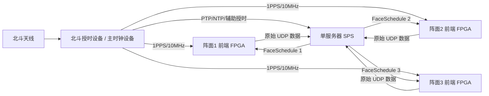

# 多阵面雷达 + 单服务器 + 单北斗授时实现方案（基于三层降级设计）

> 版本：v1.0  
> 适用对象：系统架构设计、前后端联调、时统方案讨论、实现分工说明  
> 文档定位：目标方案文档（面向实现）  
> 说明：本文档基于当前项目上下文、现有协议草案与既定“三层降级”设计进行收敛，重点回答 **多阵面雷达在“单服务器 + 单北斗授时源”条件下，如何实现统一时间基准、统一秒边界换表、表内 CPI/PRT 推进与降级运行**。

---

## 1. 文档目标

本文档用于完整阐述以下问题：

1. 在 **三个阵面 + 一台服务器 + 一个北斗授时源** 的条件下，系统应如何搭建时间同步体系。
2. 当服务器**没有硬中断输入、不能按 CPI 边界实时下发控制**时，如何仍然保证前端按统一时间边界执行。
3. 在当前约定的 **三层降级设计（北斗/GNSS → PTP → 本地晶振）** 下，系统的正常工作逻辑、降级逻辑、恢复逻辑分别如何实现。
4. 服务器、前端 FPGA、北斗授时设备三者之间的职责边界是什么。
5. 控制表、秒边界、CPI、PRT、ACK、遥测、数据时间戳之间应如何形成一套清晰、可实现、可联调、可验收的工程闭环。

本文档尽量只讨论本主题直接相关的内容，不扩展到无关的软件实现细节。

---

## 2. 一句话结论

当前系统应采用如下总体方案：

> **以单个北斗授时设备作为全系统统一时间源；由其向各阵面前端提供硬件时间基准（1PPS/10MHz），并向服务器提供网络授时或辅助授时；服务器按 1 秒全局周期提前生成并下发下一周期控制表，前端 FPGA 在本地统一秒边界锁存新表并在表内以本地计数器推进 CPI/PRT 执行；当北斗失效时，系统按“PTP → 本地晶振”逐级降级，并依据时间质量决定是否允许定时生效、是否续跑旧表、是否进入安全态。**

---

## 3. 设计背景与约束

### 3.1 系统形态

当前系统的宏观形态为：

- 3 个固定阵面
- 1 台服务器
- 前端 ADC 采样后由 FPGA 组包，经各自独立的 10G 链路送入服务器
- 服务器内部同时承担：
  - 数据处理节点
  - 控制调度节点
- 下行控制由服务器统一生成，再按阵面拆分为独立执行表下发
- 三个阵面要求**严格时间同步**

### 3.2 已冻结或已明确的关键约束

当前项目中，以下前提已经较为明确：

1. **全局调度大周期按 1 秒理解**。
2. **秒边界负责换表 / 换周期**。
3. **CPI 边界负责表内推进**。
4. **PRT / 包级负责数据生产、发送、接收与重组**。
5. 三个阵面共享同一个：
   - Global Schedule ID / Global Epoch
   - 全局表版本号
   - 秒边界
6. 物理上为三份独立 FaceSchedule，逻辑上是一套全局计划。
7. 前端应采用 `current / next / queued` 语义缓存控制表。
8. 服务器当前没有“按 CPI 周期硬触发下发控制”的能力，因此**不能依赖服务器实时踩 CPI 边界发命令**。

### 3.3 当前问题的本质

本问题的本质不是“服务器没有硬中断”，而是：

> **谁来定义真正可靠的时间边界，谁在边界时刻真正执行控制切换。**

本方案给出的结论是：

- **时间边界由统一时统定义**
- **控制切换由前端 FPGA 在本地边界执行**
- **服务器只负责提前下发表，不负责实时敲边界**

---

## 4. 方案边界：什么叫“单北斗授时”

### 4.1 本文中的“单北斗授时”定义

本文中的“单北斗授时”不是指：

- 服务器一个北斗模块，前端没有
- 或 FPGA 一个北斗模块，再把时间“转发”给服务器

本文中的“单北斗授时”应理解为：

> **系统中只有一个统一的北斗/GNSS 授时源设备（也可称授时设备、时统设备、主时钟设备），它作为全系统唯一一级时间源，然后把时间基准分发给服务器和各阵面前端。**

也就是说：

- 北斗/GNSS 信号由**一个统一授时设备**接收与解算
- 然后该设备向不同用时端分发不同形态的时间基准

### 4.2 不建议的理解

不建议理解成：

- 前端 FPGA 直接“把当前时间值通过网络报文告诉服务器”
- 服务器收到这个时间值后再把它当成统一时基

原因是：

1. 网络传输存在延迟与抖动
2. “收到一个时间值”不等于“完成时间同步”
3. 这种方式无法作为严格同步系统的可靠基准

因此，**授时不应依赖普通业务报文转发**。

---

## 5. 总体架构

### 5.1 系统级架构图（推荐理解）

### 5.2 该架构的核心思想

这张图代表的是：

1. **北斗授时设备**是全系统统一时间源。
2. **前端 FPGA**优先直接获得硬件时间基准（1PPS/10MHz）。
3. **服务器**获得同一时间体系下的授时（优先跟随统一时统设备）。
4. 服务器不把自己当成“时间源”，而是当成：
   - 调度器
   - 表生成器
   - 表下发者
   - 状态汇聚者
5. 前端 FPGA 不把服务器当成“授时源”，而是当成：
   - 计划发布者
   - 参数提供者
6. 前端 FPGA 本地才是“真正的执行边界控制者”。

---

## 6. 硬件连接方式建议

## 6.1 北斗授时设备的角色

单北斗授时设备建议承担以下角色：

1. 接收北斗/GNSS 卫星时间信号
2. 形成本地统一标准时间
3. 向前端分发：
   - 1PPS
   - 10MHz
4. 向服务器分发：
   - PTP（优先）
   - NTP（仅作低精度辅助/兜底）
   - 或专用时统接口（如果服务器具备对应板卡）

### 6.2 前端 FPGA 接口建议

前端 FPGA 建议直接接入以下时间基准：

- **1PPS**：用于定义整秒边界
- **10MHz**：用于本地稳定频率基准

前端 FPGA 不建议把普通业务网口授时作为一级方案，原因是：

- FPGA 最需要的是确定的秒边界
- FPGA 对硬件脉冲和稳定频率更友好
- 表内 CPI/PRT 推进本质上是本地硬件计数问题

### 6.3 服务器接口建议

服务器建议通过以下方式接入同一时间体系：

- **首选：PTP（硬件时间戳能力优先）**
- 次选：外部授时板卡/脉冲输入（若硬件具备）
- 再次选：NTP（只可作为较低等级时间来源，不应作为严格同步主方案）

### 6.4 单北斗源下的分发原则

当只有一个北斗授时设备时，不是让每个节点各装一个独立北斗模块，而是：

> **通过同一个授时设备，把“统一时间”分发给多个节点。**

这就是“单北斗源、全系统统一时基”的工程含义。

---

## 7. 时间同步总体逻辑

### 7.1 系统真正同步的不是“报文时刻”，而是“共同时间基准”

整个系统真正需要同步的是：

1. **整秒边界一致**
2. **本地频率基准一致或足够接近**
3. **各节点对当前绝对时间的理解足够一致**

### 7.2 同步的三个层面

建议从三个层面理解时间同步：

#### 第 1 层：整秒边界同步
也就是：

- 阵面 1 看到“第 N 秒到来”的时刻
- 阵面 2 看到“第 N 秒到来”的时刻
- 阵面 3 看到“第 N 秒到来”的时刻
- 服务器认定“第 N 秒到来”的时刻

这些时刻需要尽量一致。

#### 第 2 层：频率一致/守时能力
也就是：

- 本地时钟不要越跑越偏
- 短时失去外部授时时，仍能维持一段时间的可接受精度

#### 第 3 层：时间质量可观测
也就是系统要能回答：

- 现在是北斗锁定吗？
- 还是退化为 PTP？
- 还是已经退化为本地晶振？
- 当前偏差是多少？
- 当前允不允许做定时生效？

---

## 8. 三层降级设计（主方案核心）

## 8.1 三层来源定义

本方案沿用当前既定三层设计：

### Level-1：北斗/GNSS
- 一级时间源
- 精度最高
- 优先级最高
- 正常工作时应以此为准

### Level-2：PTP
- 当北斗不可用时的网络授时降级来源
- 本质上仍属于“外部统一时间体系”
- 精度与稳定性取决于网络时统条件

### Level-3：本地晶振
- 当 GNSS 与 PTP 都不可用时的最终降级档位
- 本地继续跑表、继续计时
- 但不再保证与全局绝对时间严格一致

## 8.2 时间质量定义

来源与质量不是一个概念。建议明确区分：

### Q0：Locked
- 已锁定到有效外部时间源
- 时间质量满足定时生效要求
- 允许按秒边界切表

### Q1：Holdover
- 外部源刚失去，但本地还处在短时保持状态
- 仍可继续运行
- 但已进入退化态
- **默认不允许新的定时生效控制进入**

### Q2：Freerun / Unknown
- 本地自由运行
- 与全局绝对时间可能明显偏离
- 不允许新的定时生效控制
- 只能保守运行或进入安全策略

## 8.3 核心原则

> **是否允许“定时生效”，最终看的是时间质量，而不是单纯看时间来源名称。**

即便来源名义上是 PTP，如果当前质量判定不稳定，也不应盲目允许按秒边界精确执行。

---

## 9. 为什么服务器不需要按 CPI 边界实时发命令

### 9.1 这是一个常见误区

容易误以为：

- 既然每个 CPI 都要执行不同内容
- 那服务器就应该每到 CPI 边界发一次命令

这种理解不适合当前系统。

### 9.2 正确的做法

正确做法是：

1. 服务器提前生成未来 1 秒的控制表
2. 控制表中已经包含该秒内所有 Beam / CPI 的执行安排
3. 前端 FPGA 提前接收并缓存该表
4. 到整秒边界时，FPGA 将该表切为 `current`
5. 表内的 CPI / PRT 推进由 FPGA 本地计数器完成

### 9.3 这样做的好处

1. 避免服务器受 Linux 调度抖动影响
2. 避免网络实时抖动直接影响边界执行
3. 执行边界收敛到前端本地硬件
4. 有利于多阵面同步
5. 有利于后续扩展为更复杂的 Beam / CPI 编排

---

## 10. 秒边界换表机制

## 10.1 为什么选择秒边界

当前系统更适合以秒边界作为大周期边界，原因如下：

1. 北斗/GNSS 最自然的统一边界就是秒脉冲
2. 三阵面跨链路统一换表，秒边界更容易观测与验证
3. 服务器提前量也更容易设定
4. 当前协议已经自然收敛到“1 秒一张周期表”的思路

## 10.2 基本机制

每个阵面前端维护至少三层缓冲：

- `current`：当前正在执行的表
- `next`：下一秒将生效的表
- `queued`：再下一份预备表（可选）

### 10.3 生效流程

在正常情况下：

1. 服务器在第 `T` 秒内生成第 `T+1` 秒的 FaceSchedule
2. FaceSchedule 下发到对应阵面 FPGA
3. FPGA 校验通过后写入 `next`
4. 当本地统一秒边界到达 `T+1` 时：
   - `next -> current`
   - 原 `current` 退出活动状态
5. `current` 表在整个秒周期内驱动表内执行

### 10.4 最关键原则

> **表什么时候真正生效，不由“包到达时刻”决定，而由“本地秒边界到达”决定。**

这是全方案最重要的工程原则之一。

---

## 11. 表内 CPI / PRT 推进机制

## 11.1 大周期和小周期的关系

建议统一理解为：

- **1 秒**：全局换表周期
- **CPI**：表内执行推进粒度
- **PRT**：采样/发射/数据组织微观粒度

## 11.2 推进权归属

### 服务器负责：
- 生成“这一秒应该怎么跑”的表
- 指明各 Beam / CPI 的逻辑顺序
- 指明目标秒边界

### FPGA 负责：
- 到秒边界切表
- 在表内推进 CPI
- 在 CPI 内推进 PRT
- 产生数据
- 给数据打时间与上下文标识

### 11.3 为什么必须由 FPGA 推进

原因是：

1. FPGA 天然更适合做确定性计数与时序驱动
2. CPI/PRT 推进本质是硬件时序问题
3. 若由服务器每个 CPI 远程控制，链路与 OS 抖动将直接破坏确定性

---

## 12. 服务器、前端 FPGA、授时设备三者职责边界

## 12.1 北斗授时设备职责

北斗授时设备只做一件事：

> **提供统一时间源与统一时间分发。**

它不负责：

- 生成波位表
- 解释业务语义
- 下发控制指令
- 解析回波数据

## 12.2 服务器职责

服务器承担以下职责：

1. 维护全局计划 / 全局周期
2. 生成下一秒全局控制表
3. 按阵面拆分为三份 FaceSchedule
4. 提前下发至各阵面
5. 汇总心跳、ACK、授时状态与数据结果
6. 做模式状态机与任务调度
7. 判断当前系统是否允许进入新的定时执行周期

服务器不负责：

- 在每个秒边界亲自“敲执行”
- 在每个 CPI 边界亲自下命令
- 替前端做硬件时序推进

## 12.3 前端 FPGA 职责

前端 FPGA 负责：

1. 接收并缓存控制表
2. 基于本地时间基准在秒边界锁存新表
3. 在表内推进 CPI / PRT
4. 驱动本地发射 / 接收 / 采样相关动作
5. 组装数据包并回传服务器
6. 回传 ACK / 心跳 / 状态 / 误码 / 时间质量等信息

前端 FPGA 不负责：

- 生成全局任务计划
- 解释上层作战意图
- 协调其它阵面

---

## 13. 建链后“握手”真正要做什么

## 13.1 握手不是“授时”

建链后的握手不应理解为：

- 服务器给前端发一个时间值
- 或前端给服务器回一个时间值
- 双方算一下 RTT 就认为同步完成

这种做法不可靠。

## 13.2 握手真正的目标

建链后的握手应完成以下确认：

1. 设备身份确认
2. 当前时间来源确认
3. 当前时间质量确认
4. 当前时间偏差确认
5. 当前 ControlEpoch / GlobalEpoch 对齐
6. 当前表缓冲状态确认
7. 当前是否允许装表 / 切表确认

## 13.3 建议握手语义

可以把建链后的语义定义成：

> **不是“我来给你授时”，而是“我确认你已经锁定到统一时间体系，并且我确认从哪个绝对秒开始给你下发表”。**

---

## 14. 正常工作时序（推荐标准流程）

下面给出正常工作流程。

### 14.1 上电阶段

1. 北斗授时设备启动，开始接收卫星时间
2. 北斗授时设备向前端输出 1PPS / 10MHz
3. 北斗授时设备向服务器提供 PTP / 辅助授时
4. 前端 FPGA 进入时统状态机：
   - 未锁定
   - 搜索
   - 锁定
5. 服务器完成自身时间同步初始化

### 14.2 系统就绪判定

服务器收到各阵面心跳后，判断：

- 三个阵面是否都处于 `Q0`
- `TimeCoordSource` 是否满足预期
- `TimeOffset` 是否在门限内
- 是否连续多个心跳周期稳定

满足后，服务器将系统状态推进到：

- `TIME_READY`
- 或等价状态

### 14.3 控制表下发

在第 `T` 秒期间：

1. 服务器生成第 `T+1` 秒全局表
2. 拆分为 Face1 / Face2 / Face3 三份 FaceSchedule
3. 带目标生效秒边界时间戳下发
4. 前端 FPGA 收到后做：
   - 基础头校验
   - 参数校验
   - 缓冲写入 `next`
   - 回 `RxAck`

### 14.4 秒边界生效

当本地秒边界到达 `T+1`：

1. FPGA 将 `next -> current`
2. 新表开始生效
3. 表内按 CPI / PRT 推进
4. 当前秒结束后回 `ApplyAck`

### 14.5 数据与状态回传

在执行过程中：

- 数据平面按既定格式上送原始数据
- 心跳周期性上报
- ApplyAck 回报告知上一周期是否按时生效

---

## 15. 三层降级详细逻辑

## 15.1 正常档：北斗/GNSS + Q0

### 条件
- 北斗/GNSS 正常锁定
- 前端时间质量为 `Q0`
- 服务器与统一时统一致

### 行为
- 允许新的定时生效控制
- 允许秒边界切表
- 允许数据时间戳作为全局时间解释
- 系统处于完全工作态

## 15.2 一级降级：PTP + Q0 或 Q1

当北斗丢失但网络授时仍可用时，进入 PTP 档。

### 情况 A：PTP 质量足够，仍判为 Q0
- 可继续定时生效
- 但系统应标记“已从 GNSS 降级到 PTP”
- 应打日志并告警摘要

### 情况 B：PTP 仅能维持 Q1
- 默认不允许新的定时生效表进入
- 已有 `current` 表可继续运行
- 可允许短时续跑旧表
- 服务器应停止向该阵面发布新的定时切换目标

## 15.3 二级降级：本地晶振 Holdover / Freerun

当北斗与 PTP 都失效时，系统退到本地晶振。

### Q1（短时保持）
- 允许继续保持当前运行
- 默认禁止新定时表切换
- 允许旧表短时续跑
- 系统进入明显退化态

### Q2（自由运行）
- 不能再宣称与全局时间一致
- 禁止新的定时生效表
- 仅可：
  - 停留在保守运行模式
  - 或进入安全态

---

## 16. 续跑旧表策略

## 16.1 为什么需要旧表续跑

如果某一秒新表没有按时到达，而系统立刻停摆，工程上会很脆弱。

因此建议：

> **当新的定时切表不可用时，优先维持当前表短时续跑，而不是立刻全停。**

## 16.2 建议分级策略

### 情况 1：只是新表晚到/暂不可切换
- `current` 继续跑
- 上报告警
- 等待后续恢复

### 情况 2：连续多个周期都无法进入新表
- 进入降级运行态
- 限制某些高风险功能
- 强提示人工干预

### 情况 3：时间质量进一步恶化或阵面间同步性失去保障
- 进入安全态
- 停止发射相关高风险动作

## 16.3 原则

顺序建议固定为：

> **先保连续运行 → 再告警 → 再降级 → 最后安全态**

---

## 17. ACK、心跳与时间可观测性

## 17.1 为什么必须有两级 ACK

建议明确区分：

### RxAck
表示：
- 报文已收到
- 基础校验通过
- 已进入 `next`

### ApplyAck
表示：
- 表已在目标秒边界真正生效
- 并回报：
  - 是否按时
  - 是否偏晚
  - 是否拒绝
  - 错误原因

## 17.2 心跳必须上报什么

心跳建议至少上报：

1. 当前时间来源
2. 当前时间质量
3. 当前时间偏差
4. PTP/GNSS 锁定状态
5. 当前设备模式
6. 当前错误计数器
7. 当前缓冲状态摘要（建议后续扩展）

## 17.3 服务器基于这些信息做什么

服务器应据此判断：

- 该阵面是否允许进入新周期定时生效
- 该阵面是否已经退化
- 是否需要暂停下发表
- 是否需要整体告警或进入安全逻辑

---

## 18. 服务器侧建议状态机

建议服务器控制面至少维护以下状态：

### 18.1 时统相关状态
- `BOOTING`
- `LINK_READY`
- `TIME_CHECKING`
- `TIME_READY`
- `DEGRADED`
- `SAFE_MODE`

### 18.2 调度相关状态
- `IDLE`
- `PLAN_BUILDING`
- `PLAN_DISTRIBUTING`
- `WAIT_RX_ACK`
- `WAIT_APPLY_ACK`
- `RUNNING`
- `RUNNING_WITH_OLD_PLAN`

### 18.3 进入 `TIME_READY` 的建议条件

只有当：

- 所有必需阵面均在线
- 所有必需阵面时间质量满足准入
- 连续若干心跳稳定
- 当前 GlobalEpoch 一致

才能进入 `TIME_READY`。

---

## 19. 前端 FPGA 侧建议状态机

前端建议至少有以下状态：

### 19.1 时统状态
- `TIME_UNLOCKED`
- `TIME_GNSS_LOCKING`
- `TIME_GNSS_LOCKED`
- `TIME_PTP_LOCKED`
- `TIME_HOLDOVER`
- `TIME_FREERUN`

### 19.2 控制表状态
- `NO_PLAN`
- `HAS_CURRENT`
- `HAS_NEXT`
- `HAS_QUEUED`
- `WAIT_SECOND_BOUNDARY`
- `APPLIED`
- `APPLY_REJECTED`

### 19.3 核心动作

前端在每次秒边界到来时，需要做一组原子动作：

1. 判断当前时间质量是否允许切表
2. 判断 `next` 是否存在且有效
3. 判断目标时间是否匹配当前边界
4. 执行 `next -> current`
5. 记录 `AppliedTimestamp`
6. 发布本周期执行上下文

---

## 20. 多阵面同步的真正保障机制

## 20.1 不靠“服务器同时发到三路”保障同步

不能把多阵面同步寄托在：

- 服务器三路报文几乎同时发出
- 三路链路延迟刚好接近
- 三个前端正好几乎同时收到

这不可靠。

## 20.2 真正保障多阵面同步的机制

多阵面同步真正依赖的是：

1. **同一个统一时间源**
2. **同一个目标秒边界**
3. **同一个 GlobalEpoch / Global Schedule ID**
4. **每个阵面本地到点自行执行**

这才是多阵面系统应有的同步逻辑。

---

## 21. 与当前服务器基线的关系

## 21.1 当前服务器基线现状

根据当前环境基线，服务器现状中存在以下事实：

1. `chronyd` 已启动
2. 当前为 Orphan Mode / stratum 10
3. 当前没有可靠外部 NTP 源
4. `System clock synchronized: no`

这意味着：

> **当前服务器的运行时钟不能直接视为严格同步系统中的最终权威 UTC 基准。**

## 21.2 因此本文档的定位

本文档描述的是：

- **目标实现方案**
- 而不是“当前服务器现状已经完整满足”的事实说明

也就是说，若要真正落地本方案，服务器侧的时统接入还需要补足：

1. 接入统一时统设备
2. 建立可靠 PTP / 辅助授时链路
3. 将服务器时钟纳入统一时间体系

---

## 22. 推荐工程实施方案（可直接落地的版本）

## 22.1 推荐版本：单北斗授时设备 + 前端硬件授时 + 服务器网络授时

这是当前最推荐的版本。

### 接线/接入建议

- 北斗授时设备：1 台
- 向各前端输出：
  - 1PPS
  - 10MHz
- 向服务器输出：
  - PTP（优先）
  - NTP 仅作辅助/低等级备用

### 执行机制

- 服务器：提前 1 秒或 2 秒下发表
- 前端：按本地秒边界锁存
- 表内：本地 CPI/PRT 推进

### 降级机制

- GNSS 正常：正常工作
- GNSS 失效但 PTP 正常：降级继续工作
- GNSS 与 PTP 都失效：进入 Holdover / Freerun，禁止新定时表

## 22.2 为什么这是当前最佳平衡方案

因为它同时满足：

1. 工程逻辑清晰
2. 与现有协议方向一致
3. 不要求服务器具备精确硬中断控制下发能力
4. 前端 FPGA 可以保持确定性执行
5. 易于联调、观测、验收

---

## 23. 联调与验收建议

## 23.1 正常联调项

1. 三阵面均显示 `TimeCoordSource = 北斗/GNSS`
2. 三阵面均为 `Q0`
3. 三阵面 `TimeOffset` 在门限内
4. 下发 `T+1` 秒控制表
5. 三阵面均在目标秒边界成功 `Apply`
6. `AppliedTimestamp` 与目标秒边界偏差在允许窗口内

## 23.2 降级联调项

### 场景 A：屏蔽北斗
- 验证是否切到 PTP
- 验证是否记录 `TIME_SRC_SWITCH`
- 验证是否仍允许工作或进入受控降级

### 场景 B：再断 PTP
- 验证是否进入 Holdover / Freerun
- 验证是否禁止新定时表
- 验证是否续跑旧表

### 场景 C：恢复外部时间源
- 验证恢复滞回
- 验证是否避免抖动切换
- 验证何时重新允许定时生效

## 23.3 多阵面一致性验收项

1. 相同 GlobalEpoch 下三阵面是否一致进入新表
2. 某一阵面失败时其余阵面的处理策略是否符合设计
3. 是否能清楚区分：
   - 收到表
   - 装入表
   - 生效表
   - 偏晚表
   - 拒绝表

---

## 24. 推荐冻结的关键设计结论

建议将以下内容作为当前阶段可直接冻结的结论：

1. **系统采用单北斗授时设备作为唯一一级时间源。**
2. **前端 FPGA 优先直接接 1PPS / 10MHz。**
3. **服务器通过 PTP 接入同一时间体系。**
4. **服务器不按 CPI 实时发命令，只提前下发表。**
5. **秒边界换表，CPI/PRT 在前端本地推进。**
6. **控制生效时刻由前端本地秒边界决定，不由报文到达时刻决定。**
7. **三层降级固定为：北斗/GNSS → PTP → 本地晶振。**
8. **时间质量固定为：Q0 / Q1 / Q2，并以质量而非名称决定是否允许定时生效。**
9. **默认规则：Q0 允许新定时表；Q1 默认禁止；Q2 必须禁止。**
10. **前端缓存语义采用 `current / next / queued`。**
11. **ACK 至少区分为 RxAck 与 ApplyAck 两级。**
12. **当新表不可用时，优先旧表续跑，再告警、再降级、最后安全态。**

---

## 25. 不应采用的实现方式（明确排除）

以下方式不建议作为正式方案：

### 25.1 服务器实时按 CPI 下发控制
原因：
- 依赖 OS 调度精度
- 依赖网络时延稳定性
- 难以保证多阵面严格同步

### 25.2 FPGA 通过普通业务报文把“当前时间值”转发给服务器完成授时
原因：
- 不能形成可靠时间同步
- 只能算业务层消息交换
- 不能替代统一时统

### 25.3 仅用服务器本地软件时钟做三阵面统一同步基准
原因：
- 缺少硬件时间锚点
- 当前服务器基线也不支持把它当作最终统一 UTC 权威

---

## 26. 结语

对于“多阵面雷达 + 单服务器 + 单北斗授时”这个问题，最容易走偏的地方，是把“服务器什么时候发包”误认为“系统什么时候同步执行”。

正确的工程思路应当是：

> **统一时间源定义边界，服务器提前发布计划，前端本地到点执行，状态与结果再回传形成闭环。**

只要这条主线不混乱，哪怕服务器没有硬中断输入、哪怕控制不能按 CPI 实时逐次下发，系统仍然可以通过“秒边界换表 + 表内本地推进 + 三层降级”的方式，形成一套清晰、稳定、可联调、可验收的实现方案。

---

## 附录 A：适合继续细化的实现问题

在本文档基础上，后续最值得继续冻结的细节包括：

1. `TimeQuality`、`TimeOffset`、`TimeCoordSource` 与心跳字段的最终编码。
2. `current / next / queued` 的精确缓存深度与覆盖规则。
3. 旧表续跑最多允许多少秒。
4. 某一阵面 `Apply` 失败时，整机是分阵面降级还是全局降级。
5. 服务器 `TIME_READY` 的精确准入门限。
6. PTP 档位下多大偏差仍可判作 `Q0`。
7. 服务器与前端各自日志点和显控摘要字段的最终映射。

