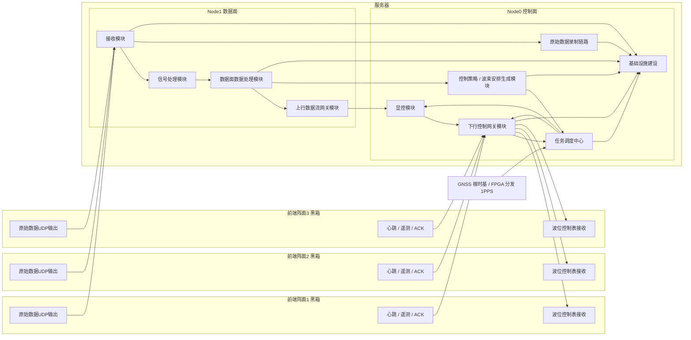

# 雷达服务器与前端阵面协同架构设计参考（当前版）

## 0. 文档定位

本文档用于固化当前阶段对“前端阵面—服务器—显控”协同系统的总体认识，作为架构讨论、模块划分、接口设计、联调准备和后续详细设计的参考底稿。

本文档面向当前宏观设计阶段，重点回答以下两个问题：

1. 系统的总体设计思路和设计原则是什么。
2. 服务器内部各模块分别负责什么、不负责什么、如何交互，以及这些交互会在哪里产生耦合。

本文档**不追求字段级协议冻结**，但会明确当前阶段对架构设计有约束力的外部前提、节拍前提和接口前提，供后续细化设计统一使用。

---

## 0.1 当前已知外部约束

### 前端数据接口约束（用于接收端业务逻辑设计，非正式字段冻结）

本节信息仅用于支撑当前阶段接收端重组、边界判定、异常处理和数据单元设计。当前内部字段仍存在大量待冻结项，本文仅抽取对接收端业务逻辑有约束力的“结构性信息”，不代表正式通信协议已定稿。

当前阶段已明确的通信约束如下：

- 波位控制表当前固定长度为 **2048 字节**。
- 原始数据 UDP 包长度固定为 **5120 字节**。
- 一个 PRT 固定发送 **16 个 UDP 包**。
- 4 个通道按固定顺序发送，每个通道对应 **4 个 UDP 包**。
- 包头、包尾、CPI、PRT、通道计数、包计数、IQ 点数等基础字段位置已约定。
- 数据区有效长度为 **5104 字节**。

当前仍未正式冻结、但后续必须继续收敛的内容至少包括：

- 字节序。
- CPI / PRT 递增规则。
- 包计数精确定义。
- IQ 数据类型与量化格式。
- 填 0 区与无效点区的区分。
- 波位切换与最后包尾的判定边界。

### 服务器硬件与部署约束

当前服务器环境基线如下：

- 架构：ARM64。
- CPU：32 核，双 NUMA。
- `Node 0 = CPU 0-15`，`Node 1 = CPU 16-31`。
- 数据面实时计算固定在 **Node1**。
- 控制面、基础设施、异步转存固定在 **Node0**。
- Intel X710 四口 10GbE 光口命名为 `receiver0 ~ receiver3`，其中 `receiver0/1/2` 为三阵面真实接入口。
- GPU 与 10G 网卡同属 **Node1**。
- 原始数据录制建议采用 **NVMe 一级缓冲 + 后台异步转 `/data`** 的两级结构。

### 节拍与同步约束

当前建议采用如下时间与生效约束：

- 一个调度周期默认定义为 **1 秒**。
- 三阵面共享同一个**全局周期号**和**全局表版本号**。
- 控制表切换采用**秒边界 / 1PPS 边界**。
- 表内推进采用 **CPI** 作为主要执行边界。
- 服务器控制面以 **FPGA 分发的 1PPS / 边界指示**作为直接节拍输入。
- 时间戳主要用于记录、对时和追踪，不再作为前后端同步动作的直接触发依据。

---

# 第一部分：总体设计思路和想法

## 1. 设计目标

本系统面向三阵面雷达的实时接收、处理、控制与发布，设计目标可概括为以下几条：

### 1.1 实时性优先

系统的主业务价值来自对前端原始数据的连续稳定接收，以及对数据的实时处理和结果输出。因此，设计上必须优先保证以下链路的实时性：

- 前端阵面到服务器的原始数据上行链路。
- 服务器内部从接收模块到信号处理模块、再到数据面数据处理模块的主算法链路。
- 服务器控制面向前端下发波位控制表的周期性控制链路。

### 1.2 数据流与控制流分治

本系统天然存在两条本质不同的主链路：

- **上行数据流**：原始采样数据、处理中间结果、航迹发布结果。
- **下行控制流**：显控任务输入、控制策略生成、任务调度定版、控制表下发、前端 ACK / 遥测回收。

两条链路在时序上有关联，但在职责、节拍、容错策略和部署位置上不应混为一谈。设计上应坚持“数据流归数据面、控制流归控制面”的总原则。

### 1.3 服务器作为系统中枢，而不是单纯转发器

服务器在本架构中不是一个“单纯接数据、再把数据转发出去”的中继站，也不是一个“收到显控命令后原样转发给前端”的透传盒子。服务器应被定义为整个系统的**中心调度与处理节点**，同时承担：

- 数据接收与重组。
- GPU 信号处理。
- 目标级逻辑处理与阵面融合。
- 控制策略生成。
- 任务状态机与边界管理。
- 控制表定版与版本管理。
- 前后端状态汇总。
- 对外结果发布。

也就是说，服务器既是**数据处理中心**，也是**控制决策中心**。

### 1.4 前后端松耦合，但运行时保持可追溯的上下文绑定

系统需要做到前端阵面与后端服务器在实现上松耦合，即：

- 前端阵面内部实现细节对服务器不可见。
- 服务器不依赖前端内部模块级结构。
- 双方通过明确的协议边界通信。

但松耦合不等于“失去上下文”。为了保证结果可解释、问题可定位、调度可闭环，必须保留跨链路的上下文绑定，例如：

- 当前回波数据属于哪个 CPI / 哪个波束 / 哪份控制表版本。
- 当前点迹和航迹结果对应哪组执行参数。
- 当前前端执行的是哪张表、是否已成功应用。

因此，设计上必须引入“**参数快照**”“**控制建议输入**”“**控制表版本号**”“**全局周期号**”等概念，用于贯穿数据流和控制流。

### 1.5 可用性优先于理想化强一致

雷达系统是工程系统，而不是实验室里的完美同步模型。控制链路、网络链路和个别阵面都可能出现短时异常。因此设计上不宜采用“任何局部异常都立即整机停摆”的极端策略，而应采用分层降级思路：

- 新表未到时允许旧表有限周期续跑。
- 局部阵面异常时允许进入降级运行态。
- 长期异常时再进入安全态。

这种思路更符合工程上“先保持可用、再逐步收紧”的原则。

---

## 2. 总体架构思想

## 2.1 系统的基本角色划分

从系统职责看，整体可划分为四类角色：

### （1）前端阵面执行侧

前端阵面作为黑箱存在，对服务器只暴露三个方向的接口：

- 向服务器上送稳定的原始数据 UDP 包。
- 接收服务器下发的波位控制表。
- 与服务器双向交换心跳、遥测、ACK、状态。

前端内部如何完成 ADC 采样、FPGA 组包、TR 控制、时序执行，属于前端内部实现，不在本文展开。

### （2）服务器数据面

服务器数据面部署在 **Node1**，承担原始数据接入、实时重组、GPU 信号处理、点迹/航迹处理和结果发布等实时工作，是主计算路径所在的“实时岛”。

### （3）服务器控制面

服务器控制面部署在 **Node0**，承担显控接入、控制策略生成、任务调度定版、1PPS 软同步与生效边界管理、控制表下发、ACK 汇总和降级裁决等工作，是主控制路径所在的“管理岛”。

### （4）节拍基准与显控

- 外部 GNSS 可作为系统根时基来源，但服务器控制动作以 **FPGA 分发的 1PPS / 边界指示**为直接同步依据。
- 显控模块作为独立软件存在，是任务输入、结果展示、人工干预与告警观察的主要界面。

---

## 2.2 数据面与控制面的分离原则

### 数据面原则

数据面的核心特征是：

- 高频率。
- 大吞吐。
- 严格实时。
- 以“一个完整 CPI 数据单元”为后续处理基准。

因此，数据面应尽量保持链路短、职责单一、线程和内存布局清晰，避免混入复杂控制逻辑、阻塞式等待和与外部系统强耦合的交互。

### 控制面原则

控制面的核心特征是：

- 节拍性。
- 状态性。
- 决策性。
- 可诊断性。

因此，控制面需要具备：

- 状态机。
- 候选波束安排生成。
- 表版本管理。
- ACK / 遥测汇总。
- 降级与告警逻辑。
- 对显控友好的状态视图。

控制面可以较复杂，但它不应侵入数据面主链路，避免把实时链路变成“控制驱动型阻塞系统”。

---

## 2.3 全局调度与三阵面独立执行的关系

三阵面在系统意义上属于同一部雷达，不应被视为三个完全独立的雷达实例。因此，在控制模型上应采用：

- **服务器内部统一调度。**
- **对外按阵面分别下发表。**

也就是说，服务器内部先形成一份“全局调度计划”，回答整个系统在下一调度周期内该如何工作；随后再将这份全局计划拆分成：

- 阵面 1 执行表。
- 阵面 2 执行表。
- 阵面 3 执行表。

这样做的好处是：

- 三阵面的管理具有统一视角。
- 便于共享全局周期号和全局表版本号。
- 便于显控展示系统级状态。
- 便于在后续实现跨阵面资源协调和目标跟踪闭环。

---

## 2.4 1PPS 节拍与执行边界

当前建议采用双层边界：

### 大边界：1PPS / 秒边界

- 作为控制表版本切换边界。
- 作为调度周期起点。
- 作为三阵面统一对齐的主基准。
- 由服务器通过 **FPGA 分发的 1PPS / 边界指示**感知。

### 小边界：CPI 边界

- 作为数据处理和控制执行的内部推进边界。
- 用于表内波束推进和处理结果对齐。

因此可将总体时序理解为：

- **1PPS / 秒边界负责换表与生效。**
- **CPI 边界负责按表推进。**

时间戳在该模型中主要承担：

- 记录与追踪。
- 日志对时。
- 问题回放。

而不再直接承担前后端同步动作的触发职责。

---

## 2.5 控制失效与降级运行思路

为了提升系统可用性，推荐采用以下策略：

1. 新表未及时到达时，允许旧表续跑 **有限个调度周期**。
2. 若个别阵面在搜索模式下 Apply 失败，可允许局部降级运行。
3. 若处于跟踪模式或异常持续时间过长，则收紧一致性要求，必要时回退到旧表或进入安全态。
4. 安全态下建议优先保证：
   - 停发射或进入受控发射状态。
   - 保留接收与状态回传能力。
   - 保留日志与诊断能力。

该策略体现的是“先保证系统可持续运行，再逐级收紧风险”的工程思路。

---

## 2.6 总体架构图

---

# 第二部分：各模块职责、边界与耦合关系

## 3. 模块清单总览

当前架构中建议显式定义以下模块：

1. 前端阵面（黑箱）
2. 接收模块
3. 信号处理模块
4. 数据面数据处理模块
5. 控制策略 / 波束安排生成模块
6. 上行数据流网关模块
7. 下行控制网关模块
8. 任务调度中心
9. 显控模块
10. 原始数据录制链路
11. 基础设施建设

其中：

- `10` 和 `11` 虽然不属于实时主链计算模块，但必须作为显式架构对象写入设计文档，否则联调、运维、追责和回放都会缺少落点。
- 外部 1PPS / 节拍分发链路虽不是服务器内部模块，但属于控制边界设计的基础依赖，需要在调度与时序设计中显式考虑。

---

## 4. 前端阵面（黑箱）

## 4.1 职责

前端阵面是服务器的外部执行端，对服务器只暴露统一接口，不暴露内部实现。其职责包括：

- 根据当前有效波位控制表驱动前端硬件执行。
- 将 ADC 采样结果按约定协议组织为原始数据 UDP 包。
- 接收服务器提前下发的波位控制表并写入待生效缓冲。
- 在 1PPS / 秒边界按约定切换控制表生效。
- 回传 ACK、心跳、遥测和状态。

## 4.2 不负责的内容

- 不负责服务器侧任务调度。
- 不负责显控语义解释。
- 不负责航迹计算或阵面融合。
- 不负责系统级状态汇总。

## 4.3 对外接口

### 上行接口

- `原始数据 UDP 流`
- `心跳 / 遥测 / 执行状态`
- `接收确认 / 应用确认`

### 下行接口

- `定版后的波位控制表`
- `控制命令`

## 4.4 与服务器的耦合点

前端阵面与服务器的耦合集中在以下几个方面：

1. **协议耦合**：头字段、长度、包计数、控制表版本、ACK 语义必须一致。
2. **节拍耦合**：双方必须认同 1PPS / 秒边界和表生效边界。
3. **控制语义耦合**：控制表的含义、状态码含义、Apply 成功/失败语义必须一致。
4. **错误处理耦合**：控制失败时前端是续跑旧表、降级还是进入安全态，必须与服务器设计协同。

---

## 5. 接收模块

## 5.1 所在位置

- 部署位置：**Node1 数据面**。
- 角色定位：上行数据流进入服务器后的**第一个业务模块**。

## 5.2 主要职责

接收模块负责：

1. 从网卡接收原始数据 UDP 包。
2. 完成基础解析与合法性检查。
3. 按约定关系对数据进行业务重组。
4. 形成后续处理所需的完整 CPI 数据单元。
5. 为该 CPI 数据单元挂载**参数快照**与接收异常标记。
6. 将原始包镜像旁路给录制链路。
7. 输出接收健康状态，用于监控、日志和控制面诊断。

## 5.3 建议输出

接收模块建议至少输出三类对象：

### （1）完整 CPI 数据单元

这是信号处理模块的主输入，应包含：

- 当前 CPI 的完整数据内容。
- 必要的包级重组结果。
- 缺包 / 补齐 / 乱序 / 截断等异常标记。
- 针对此 CPI 单元的**参数快照**。

其中，参数快照建议先冻结为“语义槽位”，而不是立即冻结到字段级。最小建议包括：

- 阵面标识。
- 全局周期号 / 秒序号。
- CPI 序号。
- 控制表版本号。
- 波束序号 / 波位序号。
- 工作模式。
- 降级标记。
- 生效边界标识。
- 当前采用的是哪份控制上下文来源。

这份参数快照应被视为后续链路中的**权威挂载点**。

### （2）原始包镜像流

用于：

- 原始数据录制。
- 联调回放。
- 问题排查。

### （3）接收健康状态

用于：

- 统计丢包、乱序、截断等异常。
- 向基础设施建设和控制面输出接收状态。

## 5.4 不负责的内容

接收模块不应负责：

- 目标识别。
- 阵面融合。
- 显控协议交互。
- 任务调度决策。
- 控制表生成。

## 5.5 与其他模块的耦合关系

### 与前端阵面的耦合

- 强协议耦合。
- 强节拍耦合。
- 异常判定边界耦合。

### 与信号处理模块的耦合

- 通过“完整 CPI 数据单元”形成紧密数据接口耦合。
- 接收模块的输出完整性和时序稳定性直接决定信号处理输入质量。
- 参数快照应由接收模块前移挂载，后续模块消费并沿用，不重新发明权威副本。

### 与录制链路的耦合

- 为旁路录制提供原始包镜像。
- 若录制设计不当，可能反向影响接收主链，因此建议采用异步旁路而非同步阻塞写盘。

---

## 6. 信号处理模块

## 6.1 所在位置

- 部署位置：**Node1 数据面**。
- 运算资源：使用 **GPU** 进行算法流水线处理。

## 6.2 主要职责

信号处理模块负责：

1. 接收完整 CPI 数据单元。
2. 消费并沿用接收模块挂载的参数快照。
3. 调用 GPU 算法流水线进行信号级处理。
4. 从原始回波中加工出点迹数据。
5. 将输出结果提供给数据面数据处理模块。

## 6.3 建议输出对象

建议该模块输出以下组合对象：

- `点迹数据`
- `参数快照透传`
- `必要的处理质量标记`

其中需要特别强调：

- 参数快照的**权威来源在接收模块**。
- 信号处理模块可以补充处理质量相关标记，但不应重新定义另一份同语义的执行快照。

## 6.4 不负责的内容

信号处理模块不应负责：

- 控制表生成。
- 显控交互。
- 任务级状态机。
- 阵面融合后的目标级决策。
- 对外结果发布。

## 6.5 与其他模块的耦合关系

### 与接收模块的耦合

- 输入格式强耦合。
- 依赖接收模块保证 CPI 数据单元完整、可解释、可处理。
- 依赖接收模块先完成参数快照挂载。

### 与数据面数据处理模块的耦合

- 点迹语义耦合。
- 参数快照透传语义耦合。

如果信号处理链路不继续携带接收模块挂载的参数快照，后续数据处理将难以建立“当前点迹为何在该参数下产生”的判断链路。

---

## 7. 数据面数据处理模块

## 7.1 所在位置

- 部署位置：**Node1 数据面**。
- 资源特征：逻辑密集型，不占用 GPU。

## 7.2 主要职责

数据面数据处理模块负责：

1. 接收点迹数据与参数快照透传。
2. 进行目标识别、逻辑处理、质量筛选。
3. 进行多阵面信息融合。
4. 形成高可信度的航迹数据。
5. 输出对上行发布网关可直接使用的发布对象。
6. 输出供控制策略模块使用的**控制建议输入对象**。

## 7.3 建议输出对象

建议显式输出两条主接口：

### （1）航迹发布对象

供上行数据流网关模块使用，包含：

- 航迹数据。
- 发布所需状态摘要。
- 必要的来源标识。

### （2）控制建议输入对象

供控制策略 / 波束安排生成模块使用，包含：

- 当前目标和航迹状态。
- 融合质量指标。
- 资源占用摘要。
- 下一周期控制建议所需的参考输入。

需要强调的是：

- 该对象是**控制建议输入**，不是控制表。
- 数据面数据处理模块只出目标、航迹和建议，不直接出表。

## 7.4 不负责的内容

数据面数据处理模块不应负责：

- 直接向前端下发控制表。
- 直接与显控建立控制协议交互。
- 管理 1PPS 节拍或生效边界。
- 承担控制状态机。
- 直接生成最终定版控制表。

## 7.5 与其他模块的耦合关系

### 与信号处理模块的耦合

- 点迹格式与语义耦合。
- 参数快照透传语义耦合。

### 与控制策略 / 波束安排生成模块的耦合

这是系统中一个很重要的跨面耦合点。

推荐做法是：

- 数据面数据处理模块输出“控制建议输入对象”。
- 控制策略模块据此形成候选波束安排。
- 不允许数据面数据处理模块直接改控制表或绕开调度中心。

这种设计可以减少跨面逻辑缠绕。

---

## 8. 控制策略 / 波束安排生成模块

## 8.1 所在位置

- 部署位置：**Node0 控制面**。
- 角色定位：控制面的**候选安排生成模块**。

## 8.2 核心定位

该模块负责根据数据面结果、任务意图和当前资源约束，形成**下一周期候选波束安排**。  
它可以生成候选安排，但**不拥有最终定版权**。

## 8.3 主要职责

1. 接收数据面数据处理模块输出的控制建议输入对象。
2. 结合当前模式、任务意图、资源约束和前端状态上下文。
3. 形成下一周期候选全局安排。
4. 将候选安排拆解为可供定版的阵面候选执行对象。
5. 输出给任务调度中心进行批准、定版和编号。

## 8.4 不负责的内容

控制策略 / 波束安排生成模块不应负责：

- 最终控制表版本号分配。
- 生效秒序号或生效边界裁定。
- 直接向前端下发表。
- ACK / 遥测回收。
- 运行状态机与降级裁决。

## 8.5 与其他模块的耦合关系

### 与数据面数据处理模块的耦合

- 目标、航迹和控制建议输入语义耦合。
- 依赖数据面结果，但不应被数据面结果“绑架”为纯被动模块。

### 与任务调度中心的耦合

- 该模块输出的是**候选安排**。
- 任务调度中心输出的是**定版安排**。
- 这条边界必须保持清晰，否则会在状态机、节拍、生效时刻和降级逻辑上发生职责穿透。

---

## 9. 上行数据流网关模块

## 9.1 所在位置

- 部署位置：**Node1 数据面**。

## 9.2 角色定位

该模块本质上不是算法模块，而是**对外发布边界模块**。它的作用是将数据面数据处理模块产生的内部结果对象，转换为面向外部消费者的发布格式，并通过 UDP/IP 单向发布出去。

## 9.3 主要职责

1. 接收航迹数据和系统状态摘要。
2. 进行必要的发布格式适配。
3. 对外以 UDP/IP 方式单向发布。
4. 与被转发设备解耦。

## 9.4 不负责的内容

该模块不应负责：

- 接收外部控制指令。
- 解析显控命令。
- 参与任务调度决策。
- 直接作用于前端控制。

## 9.5 与其他模块的耦合关系

### 与数据面数据处理模块的耦合

- 主要是发布对象格式耦合。
- 建议由数据面数据处理模块输出标准发布对象，减少网关层二次解释复杂度。

### 与显控模块的耦合

- 应保持网络发布层面的弱耦合。
- 网关只负责“发”，显控只负责“收与展示”。
- 显控不应通过该模块反向注入控制命令。

---

## 10. 下行控制网关模块

## 10.1 所在位置

- 部署位置：**Node0 控制面**。

## 10.2 角色定位

该模块不应被理解为“纯转发器”，更准确的定义应为：

> **控制请求接入标准化 + 控制表封装发送 + 前端 ACK / 遥测 / 状态回收 + 统一控制链路视图输出的抽象边界模块。**

其内部应采用**可替换的南向传输适配层**，不将业务职责绑定到特定协议栈。

## 10.3 主要职责

1. 接收来自显控的控制请求，并进行标准化处理。
2. 将标准化控制请求投递给任务调度中心。
3. 接收任务调度中心定版后的三阵面控制表。
4. 在生效边界前提前完成控制表封装与发送。
5. 回收前端阵面的 ACK、遥测和状态。
6. 对重发、超时和发送链路健康进行观测。
7. 向任务调度中心和显控输出统一控制链路视图。

## 10.4 不负责的内容

- 不负责决定下一周期调度策略。
- 不负责生成候选波束安排。
- 不负责最终控制表定版。
- 不负责数据面算法处理。
- 不负责维护 1PPS 节拍逻辑。

## 10.5 与其他模块的耦合关系

### 与显控模块的耦合

- 命令入口耦合。
- 需要统一显控命令的接入模型。

### 与任务调度中心的耦合

- 属于控制流的主接口耦合。
- 需统一控制请求模型、定版表模型、ACK 反馈模型。

### 与前端阵面的耦合

- 协议语义强耦合。
- ACK 语义强耦合。
- 遥测状态码语义强耦合。

---

## 11. 任务调度中心

## 11.1 所在位置

- 部署位置：**Node0 控制面**。
- 角色定位：**控制流主脑与最终定版权持有者**。

## 11.2 任务调度中心的核心定位

当前系统中最容易边界模糊的就是任务调度中心。建议将其定义为：

> 面向整部雷达的统一控制决策模块，负责状态机、1PPS 软同步与生效边界管理、候选安排审批、控制表定版、ACK 汇总以及降级与告警裁决。

建议将以下表述作为文档中的冻结结论：

> **下一周期波束安排可由控制策略模块基于数据处理结果生成，但最终由任务调度中心定版，并通过下行控制网关提前下发到前端待生效缓冲，在 1PPS / 秒边界统一生效。**

## 11.3 主要职责

建议将任务调度中心内部职责分为以下子职责：

### （1）运行状态机

负责：

- 待机、搜索、跟踪、测试、降级、安全态等运行状态管理。
- 模式切换规则。
- 状态进入与退出条件。

### （2）1PPS 软同步与生效边界管理

负责：

- 读取 FPGA 分发的 1PPS / 边界指示。
- 维护本地调度秒序号 / 周期序号。
- 维护表生效边界。
- 监测失步、丢边界和边界漂移。
- 决定进入守时、降级、冻结表或安全态。

这里需要明确：

- 时间戳仍然保留，但主要用于记录、追踪和回放。
- 时间戳不再直接承担同步触发职责。

### （3）候选安排审批与全局计划生成

负责：

- 根据当前模式、任务意图、前端状态和控制策略模块输出的候选安排，形成下一调度周期的全局计划。
- 决定三阵面在下一周期内各自承担的波位安排。

### （4）控制表定版与编号

负责：

- 将全局调度计划定版为三份阵面执行表。
- 赋予生效秒序号、表版本号、阵面目标实例和必要的降级 / 替代表标记。
- 管理控制表版本号、周期号和生效边界。

### （5）控制状态汇总

负责：

- 汇总各阵面的 RxAck / ApplyAck / 心跳 / 遥测。
- 形成统一控制状态视图。

### （6）降级与告警决策

负责：

- 判断单面失败、局部失步、1PPS 失效、控制超时等场景。
- 决定是续跑旧表、局部降级、全局回退还是进入安全态。

## 11.4 不负责的内容

任务调度中心不应负责：

- 直接进行原始数据收包。
- 直接进行 GPU 算法计算。
- 直接承担显控界面展示。
- 直接写长期存储。
- 绕过下行控制网关直接向前端发包。

## 11.5 建议的输入输出

### 输入

- 显控控制请求。
- 1PPS / 边界状态。
- 前端 ACK / 遥测 / 心跳。
- 控制策略模块输出的候选安排。

### 输出

- 三阵面定版控制表。
- 当前运行状态。
- 告警和降级结论。
- 提供给显控的状态视图。

## 11.6 与其他模块的耦合关系

### 与显控的耦合

- 语义耦合：模式、任务、人工干预语义必须一致。
- 状态耦合：显控展示内容依赖任务调度中心给出的统一视图。

### 与下行控制网关的耦合

- 控制通路强耦合。
- 定版表下发、ACK 回收都经过该接口。

### 与控制策略 / 波束安排生成模块的耦合

- 形成“候选安排生成”到“定版裁决”的主控制接口。
- 必须保持“生成逻辑可下沉，定版权不可下放”的边界。

---

## 12. 显控模块

## 12.1 所在位置

- 部署位置：**Node0 控制面**。
- 作为独立软件开发。

## 12.2 主要职责

显控模块负责：

1. 输入任务意图。
2. 进行模式切换。
3. 发起人工干预。
4. 展示航迹结果、系统状态和告警。
5. 提供运维和联调所需的摘要状态视图。

## 12.3 可扩展职责

在后续阶段，显控还可以扩展承担：

- 本机调试查看。
- 外接显示终端支持。
- 接入上级数据中心的展示或转发接口。

## 12.4 不负责的内容

- 不负责持续生成波位执行表。
- 不负责直接参与前端执行节拍。
- 不负责直接进行数据面算法处理。

## 12.5 建议展示内容

显控建议重点展示摘要状态，而不是承载所有过程细节。例如：

- 当前全局周期号。
- 当前控制表版本号。
- 三阵面当前 Apply 状态。
- 当前 1PPS / 边界同步状态。
- 当前运行模式。
- 当前是否处于旧表续跑。
- 当前是否处于降级态。
- 当前航迹结果和系统级告警摘要。

过程性日志、详细错误细节应转入基础设施建设提供的查询能力中查看。

---

## 13. 原始数据录制链路

## 13.1 角色定位

原始数据录制链路是接收模块旁路出来的一条辅助链路，用于：

- 联调取证。
- 原始数据回放。
- 算法分析。
- 现场问题排查。

## 13.2 设计原则

建议采用：

- **接收模块旁路输出原始包镜像。**
- **优先写入 NVMe 一级缓冲。**
- **后台异步转存到 `/data` 长期留存区。**

这是当前硬件基线下更合适的写盘策略。

## 13.3 不应出现的问题

录制链路不应反向阻塞接收主链，否则会把“辅助功能”变成“主链风险源”。

---

## 14. 基础设施建设

## 14.1 角色定位

基础设施建设为数据面与控制面提供统一的日志、指标、告警、状态沉淀、运行诊断与配置支撑能力，不参与主业务决策，但为联调、运维、追责和回放提供底座。

## 14.2 建议覆盖范围

建议至少包含以下共性能力：

- 日志。
- 指标监控。
- 告警。
- 健康检查。
- 运行态 / 状态快照。
- 配置管理。
- 证据留存。
- 可观测性封装。

## 14.3 为什么必须显式设计

如果没有独立的基础设施建设设计，系统容易出现以下问题：

- 显控只能看结果，无法追根溯源。
- 数据面与控制面之间的问题无法建立统一证据链。
- 局部失败时难以判断是前端问题、控制问题还是数据问题。
- 现场回放、问题追责和长期运维缺少稳定底座。

---

## 15. 模块交互总表

| 源模块 | 目标模块 | 交互内容 | 交互性质 | 主要耦合点 |
|---|---|---|---|---|
| 前端阵面 | 接收模块 | 原始数据 UDP 流 | 数据面主链 | 协议、时序、异常边界 |
| 接收模块 | 信号处理模块 | 完整 CPI 数据单元 + 参数快照 + 接收异常标记 | 数据面主链 | CPI 单元定义、快照语义、一致性 |
| 接收模块 | 原始数据录制链路 | 原始包镜像流 | 数据旁路 | 吞吐、异步解耦 |
| 信号处理模块 | 数据面数据处理模块 | 点迹 + 参数快照透传 + 处理质量标记 | 算法主链 | 点迹语义、快照透传语义 |
| 数据面数据处理模块 | 上行数据流网关 | 航迹 + 状态摘要 | 发布链 | 发布对象格式 |
| 数据面数据处理模块 | 控制策略 / 波束安排生成模块 | 目标 / 航迹 + 控制建议输入 | 跨面反馈 | 建议模型、节拍 |
| 控制策略 / 波束安排生成模块 | 任务调度中心 | 下一周期候选波束安排 | 控制主链 | 候选安排模型、资源约束 |
| 显控模块 | 下行控制网关 | 模式 / 任务 / 人工干预 | 控制入口 | 命令语义 |
| 下行控制网关 | 任务调度中心 | 标准化控制请求 | 控制主链 | 请求模型 |
| 任务调度中心 | 下行控制网关 | 三阵面定版控制表 + 生效边界信息 | 控制主链 | 表版本、周期号、生效边界 |
| 下行控制网关 | 前端阵面 | 波位控制表 / 控制命令 | 控制下行 | 协议、ACK 语义 |
| 前端阵面 | 下行控制网关 | ACK / 遥测 / 心跳 | 控制上行 | 状态码语义 |
| FPGA 分发 1PPS / 边界指示 | 任务调度中心 | 1PPS / 边界状态 | 时基输入 | 节拍一致性、失步检测 |
| 上行数据流网关 | 显控模块 | 航迹 / 发布结果 | 结果发布 | 发布格式、显示语义 |
| 任务调度中心 | 显控模块 | 运行态 / 告警 / 边界状态 | 状态视图 | 状态语义、一致性 |
| 各模块 | 基础设施建设 | 日志 / 指标 / 告警 / 状态沉淀 | 证据沉淀 | 命名一致性、时间对齐 |

---

## 16. 当前设计中的主要耦合风险

## 16.1 候选安排绕开调度中心的职责穿透风险

如果控制策略模块直接把候选表交给网关发送，会导致：

- 状态机被绕开。
- 生效边界裁定被绕开。
- 旧表续跑和降级裁决缺少统一入口。

因此必须坚持：

- 控制策略模块只生成候选安排。
- 任务调度中心负责最终定版。

## 16.2 参数快照挂载点漂移风险

如果接收模块、信号处理模块和数据处理模块各自维护一套“执行参数快照”，容易出现：

- 同一批数据对应不同解释。
- 问题回放时无法确认权威上下文。
- 调度闭环难以建立统一证据链。

因此必须坚持：

- 参数快照的权威挂载点前移到接收模块。
- 后续模块消费并沿用，不重新发明同语义副本。

## 16.3 1PPS / 边界异常扩散风险

1PPS 或边界指示异常会同时影响：

- 控制周期。
- 多阵面对齐。
- 控制表生效时序。
- 问题追踪与回放。

因此边界状态不应被当作普通状态，而应进入一级状态视图和降级判断链路。

## 16.4 录制链路反压主链风险

若原始数据录制未充分异步化，容易对接收模块产生反压，破坏主链实时性。

因此必须坚持：

- 旁路输出。
- 一级缓冲。
- 异步转存。

## 16.5 下行控制网关与具体协议栈绑定风险

如果下行控制网关的职责与某个固定技术栈绑定，后续一旦替换 TCP / UDP / 自定义承载方式，就会导致模块职责整体漂移。

因此建议坚持：

- 上层保持统一控制对象模型。
- 下层采用可替换南向传输适配层。

---

## 17. 当前建议冻结的架构决策

1. 一个调度周期默认定义为 **1 秒**。
2. 三阵面共享**全局周期号**和**全局表版本号**。
3. 显控下发**任务意图**，不直接下发逐波束执行表。
4. 服务器内部统一调度，对外按阵面分别下发表。
5. 参数快照的权威挂载点前移到接收模块，并随完整 CPI 数据单元进入后续链路。
6. 信号处理模块消费并透传参数快照，不重新定义另一份同语义执行快照。
7. 数据面数据处理模块只输出目标、航迹与控制建议输入，不直接生成控制表。
8. 控制策略 / 波束安排生成模块负责形成下一周期候选安排，但不拥有最终定版权。
9. 任务调度中心负责状态机、1PPS 软同步与生效边界管理、控制表定版、版本管理和降级裁决。
10. 下行控制网关负责标准化接入、提前发送、ACK / 遥测回收和统一控制链路视图，不绑定特定南向协议栈。
11. 下一周期波束安排可由控制策略模块基于数据处理结果生成，但最终由任务调度中心定版，并通过下行控制网关提前下发到前端待生效缓冲，在 1PPS / 秒边界统一生效。
12. 原始数据录制走旁路链路，并采用 NVMe 一级缓冲 + `/data` 异步转存。

---

## 18. 结语

当前这版架构设计的重点，不在于把所有字段、每条线程和每个报文一次性定死，而在于先把系统的**角色、主链路、控制分层、模块边界和关键耦合点**理顺。

只要上述分层和边界保持清晰，后续无论是：

- 展开接收模块内部流程，
- 细化任务调度中心状态机，
- 冻结 ACK 协议，
- 完善显控状态视图，
- 还是补全异常与降级处理，

都会顺着同一套架构思路自然展开，而不至于在实现阶段反复推翻。
