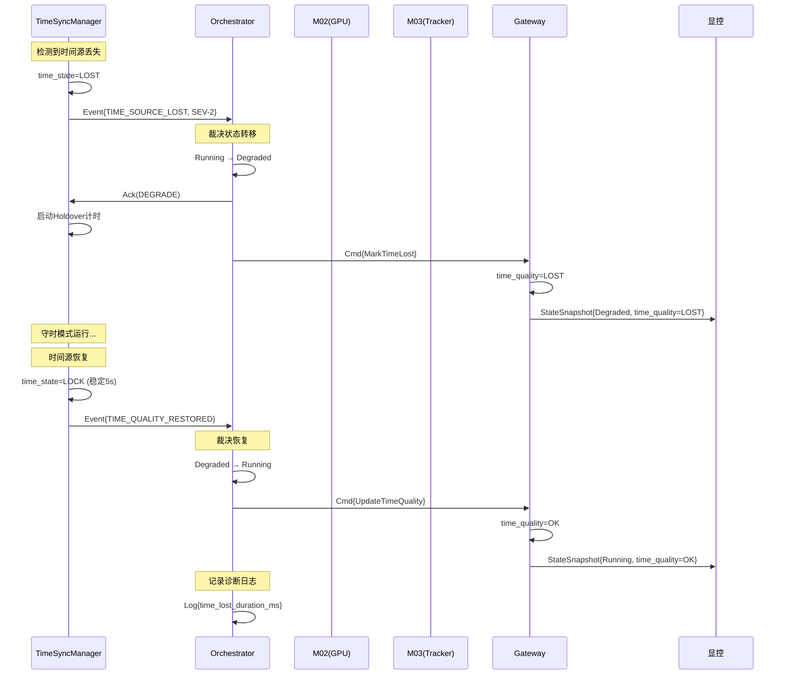
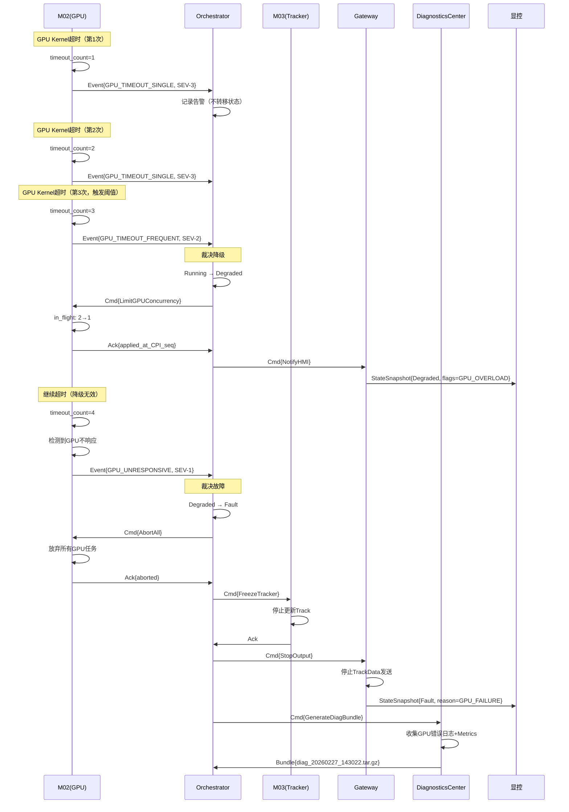
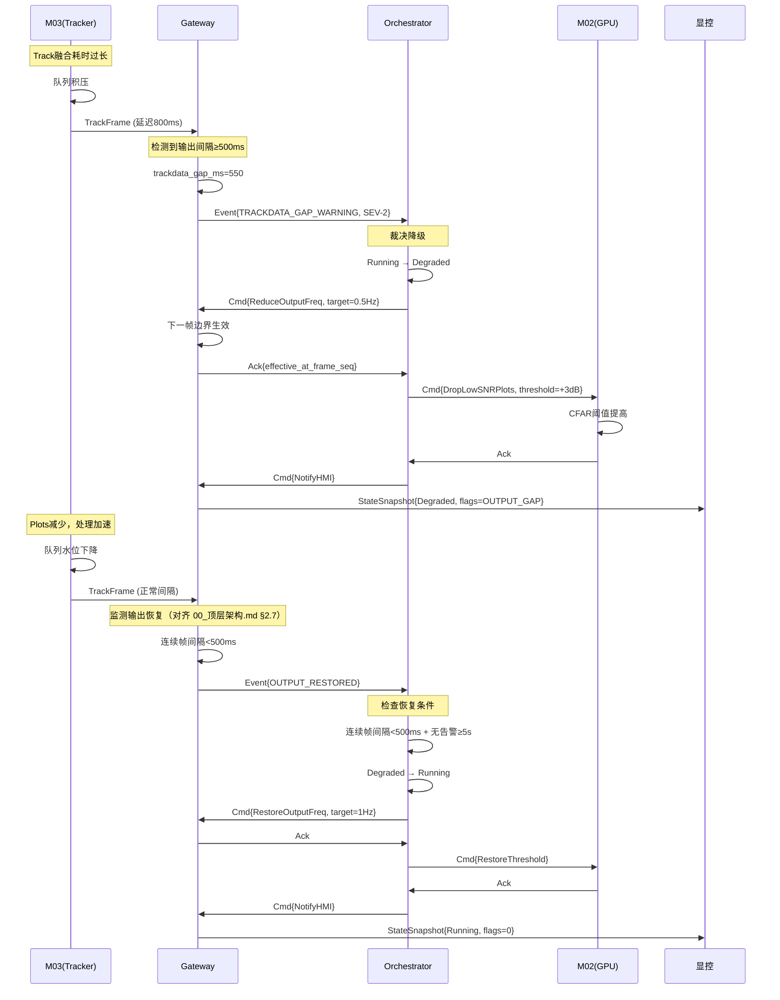

# 📋 System Event Flow & Control–Data Mapping Specification
## QDGZ300 Radar Backend System v1.0

## 全局不变量索引

- 5 态 FSM 定义与转移规则（SSOT）：见 [分块设计文档/顶层设计_1.md](分块设计文档/顶层设计_1.md#ssot-fsm-5state)
- TrackData gap 指标与阈值（SSOT）：见 [分块设计文档/顶层设计_3.md](分块设计文档/顶层设计_3.md#ssot-trackdata-gap-thresholds)
- time_quality 与时间红线（SSOT）：见 [分块设计文档/顶层设计_3.md](分块设计文档/顶层设计_3.md#ssot-time-quality)
- SEV 分级定义（SSOT）：见 [分块设计文档/顶层设计_2.md](分块设计文档/顶层设计_2.md#ssot-sev-def)

**Document ID**: SYS-SPEC-EVCM-001
**Version**: 1.1.0 (FROZEN)
**Date**: 2026-02-27
**Status**: Architectural Baseline - Post Review Revision

---

## 0️⃣ Executive Summary

本规范定义 QDGZ300 雷达后端系统中**事件如何触发控制流裁决**、**控制流如何作用于数据流**的完整映射关系。

### 核心目标

1. **可解释性**：任何系统行为变化必须可回溯至明确的事件与裁决
2. **可测试性**：所有规则必须可验证、可回放
3. **可演进性**：为 V2+ 扩展预留明确边界

### 架构约束继承

本规范严格遵循以下冻结条款：
- 双平面架构（控制平面 Node0 / 数据平面 Node1）
- 5 态 FSM（Init/Standby/Running/Degraded/Fault，定义见 [分块设计文档/顶层设计_1.md](分块设计文档/顶层设计_1.md#ssot-fsm-5state)）
- 流式处理范型（SPSC 队列 + 无锁并行）
- TrackData 业务必达输出（≥1Hz）

**关键澄清**：
- **系统模式集合（system_state）**: Init / Standby / Running / Degraded / Fault
- **生命周期事件（非状态）**: Shutdown 是控制命令与转移过程，不计入系统模式

---

## 1️⃣ System Event Model

### 1.1 统一事件数据模型

所有系统事件 MUST 遵循以下结构化格式：

```json
{
  "event_id": "evt_20260227_143022_ab3f9d",
  "domain": "TIME",
  "event_type": "TIME_SOURCE_LOST",
  "severity": "SEV-1",
  "source_module": "TimeSyncManager",
  "timestamp_mono_ns": 1740560422123456789,
  "evidence": {
    "time_state": "FREE_RUN",
    "time_state_level": 0,
    "holdover_elapsed_ms": 610000,
    "last_valid_lock_ts": 1740559812000000000
  },
  "scope": {
    "affects_trackdata_output": true,
    "affects_data_pipeline": true,
    "affects_system_state": true
  },
  "recoverable": false,
  "escalation_policy": "IMMEDIATE_FAULT",
  "diagnostics_bundle_id": "diag_20260227_143022",
  "correlation_id": "trace_xyz"
}
```

### 1.2 字段规范

| 字段 | 类型 | 约束 | 说明 |
|------|------|------|------|
| `event_id` | string | MUST, 全局唯一 | 格式：`evt_{timestamp}_{random}` |
| `domain` | enum | MUST | 见事件域分类（1.3节） |
| `event_type` | string | MUST | 域内唯一标识，大写下划线格式 |
| `severity` | enum | MUST | SEV-1 / SEV-2 / SEV-3 |
| `source_module` | string | MUST | 发起模块名（固定集合） |
| `timestamp_mono_ns` | int64 | MUST | 单调时钟，纳秒精度 |
| `evidence` | object | MUST | 事件证据（可诊断） |
| `scope` | object | MUST | 影响范围标记 |
| `recoverable` | bool | MUST | 是否可自动恢复 |
| `escalation_policy` | enum | MUST | IMMEDIATE_FAULT / DEGRADE_AFTER_THRESHOLD / ALERT_ONLY |
| `diagnostics_bundle_id` | string | SHOULD | 关联诊断包 |
| `correlation_id` | string | MAY | 分布式追踪ID |

### 1.3 事件域枚举（FROZEN）

```
CONFIG      // 配置变更与参数更新
TIME        // 时间同步与时间质量
HEALTH      // 健康检查与模块状态
RESOURCE    // 资源利用（队列/内存/CPU/GPU）
LINK        // 网络连接与通信
OUTPUT      // TrackData输出质量
DATA_QUALITY // 数据完整性与可信性
```

### 1.4 Escalation Policy 映射表（FROZEN）

**escalation_policy** 字段定义事件升级策略,必须与裁决矩阵一一对应:

| escalation_policy | 语义 | 适用事件示例 | 裁决行为 |
|-------------------|------|-------------|---------|
| `IMMEDIATE_FAULT` | 立刻进入 Fault | TIME_HOLDOVER_EXPIRED<br/>TIME_MONOTONICITY_VIOLATED<br/>MODULE_CRASH_DETECTED<br/>CRC_CHECK_FAILED | 直接转移至 Fault,触发 StopDataOutput + DiagBundle |
| `DEGRADE_AFTER_THRESHOLD` | 阈值后降级 | TIME_SOURCE_LOST<br/>TRACKDATA_GAP_WARNING<br/>QUEUE_OVERFLOW_PERSISTENT<br/>GPU_TIMEOUT_FREQUENT | 满足阈值(持续时长/连续次数)后转移至 Degraded |
| `ALERT_ONLY` | 仅告警记录 | TIME_SYNC_WARNING<br/>QUEUE_HIGH_WATER<br/>GPU_TIMEOUT_SINGLE<br/>TRACKDATA_QUALITY_DEGRADED | 不触发状态转移,记录监控指标与日志 |

**约束规则**:
- 每个 `event_type` MUST 有且仅有一个 `escalation_policy`
- `escalation_policy` 与决策矩阵中的 `TargetMode` 必须一致
- V1 不支持运行时修改 `escalation_policy`(硬编码)

### 1.5 事件去重与节流规则（FROZEN）

**目标**: 避免事件风暴导致日志/诊断系统过载,保证事件可回放一致性。

#### **去重规则**

同类事件在时间窗口内仅保留**首次触发**与**证据聚合**:

| 去重窗口 | 适用事件类型 | 行为 |
|---------|------------|------|
| `T_dedup = 1s` | GPU_TIMEOUT_SINGLE<br/>QUEUE_HIGH_WATER<br/>PLOT_COUNT_ANOMALY | 1s内同类事件仅发布1次,`evidence` 聚合计数 |
| `T_dedup = 5s` | TIME_SYNC_WARNING<br/>UDP_PACKET_DROP_HIGH | 5s内同类事件仅发布1次,记录最坏证据 |
| **不去重** | TIME_HOLDOVER_EXPIRED<br/>MODULE_CRASH_DETECTED<br/>所有SEV-1事件 | 每次都发布,不合并 |

**去重键**: `(domain, event_type, source_module)` 三元组

**证据聚合示例**:
```json
{
  "event_type": "GPU_TIMEOUT_SINGLE",
  "evidence": {
    "timeout_count": 5,        // 窗口内聚合计数
    "first_timeout_ts": ...,
    "last_timeout_ts": ...,
    "max_timeout_duration_ms": 85
  }
}
```

#### **节流规则**

防止单一模块/域事件洪泛:

| 节流限制 | 适用范围 | 超限行为 |
|---------|---------|---------|
| **100 events/s/module** | 单模块总事件速率 | 丢弃超限事件,发布 `EVENT_THROTTLED` |
| **10 SEV-1/s/system** | 全局 SEV-1 速率 | 超限后强制 Fault(系统失控) |
| **50 events/s/domain** | 单域事件速率 | 丢弃超限事件,记录 `domain_throttle_count` |

**抖动抑制**:
- 连续升降级(Running ↔ Degraded)间隔 MUST ≥ `T_transition_min = 10s`
- 违反者忽略转移请求,记录 `TRANSITION_TOO_FREQUENT` 告警

> **另见**：`T_cooldown = 30s`（Degraded 恢复后冷却期，定义见 [顶层设计_8.md §4.6.3](顶层设计_8.md)）。
> 两参数语义差异：`T_transition_min` 是连续状态转移的最小间隔，`T_cooldown` 是恢复后再次降级的冷却期。

### 1.6 事件证据字段最小集合（FROZEN）

**目标**: 保证事件可诊断、可回放、可比较。

#### **必填证据字段(按域)**

| Domain | 必填 evidence 字段 | 数据类型 | 说明 |
|--------|------------------|---------|------|
| **TIME** | `time_state`<br/>`time_state_level`<br/>`holdover_elapsed_ms` | enum<br/>int<br/>int64 | 当前时间质量<br/>质量等级(0-5)<br/>守时已持续时长 |
| **RESOURCE** | `queue_depth_pct`<br/>`drop_count`<br/>`resource_id` | float<br/>int64<br/>string | 队列使用率(%)<br/>累计丢弃计数<br/>资源标识 |
| **GPU** | `gpu_id`<br/>`timeout_count`<br/>`kernel_duration_ms` | int<br/>int<br/>float | GPU设备号<br/>超时累计次数<br/>实际执行时长 |
| **OUTPUT** | `trackdata_gap_ms`<br/>`output_seq`<br/>`frame_seq`<br/>`payload_size_bytes`<br/>`is_truncated` | int64<br/>int64<br/>int64<br/>int<br/>bool | 输出中断时长<br/>输出序号<br/>帧序号<br/>payload实际大小<br/>是否因超限截断 |
| **DATA_QUALITY** | `crc_fail_rate_pct`<br/>`frame_seq`<br/>`affected_count`<br/>`reasm_timeout_ms`<br/>`incomplete_frame_flag`<br/>`missing_frag_bitmap` | float<br/>int64<br/>int<br/>int<br/>bool<br/>string | CRC失败率(%)<br/>帧序号<br/>受影响数据计数<br/>重组超时值(冻结100ms)<br/>缺片标记<br/>缺失分片位图 |
| **CONFIG** | `param_name`<br/>`old_value`<br/>`new_value`<br/>`config_revision` | string<br/>variant<br/>variant<br/>int | 参数名<br/>旧值<br/>新值<br/>配置版本号 |
| **HEALTH** | `module_name`<br/>`heartbeat_miss_count`<br/>`last_heartbeat_ts` | string<br/>int<br/>int64 | 模块名<br/>心跳超时次数<br/>最后心跳时间 |

**可选但推荐字段**:
- `related_event_id`: 关联父事件(用于事件链追踪)
- `snapshot_context`: 关键状态快照(JSON blob,用于离线重现)

**约束**:
- 证据字段 MUST 可序列化为 JSON(避免二进制 blob)
- 数值型证据 MUST 带单位(通过字段名后缀明确,如 `_ms`, `_pct`)
- 禁止在 `evidence` 中包含密钥/密码等敏感信息

---

## 2️⃣ Event Domain Taxonomy

### 2.1 CONFIG Domain

#### **典型事件**

| event_type | 触发条件 | 可恢复 | 影响 TrackData |
|-----------|---------|--------|--------------|
| `PARAM_UPDATE_REQUESTED` | 显控发送 ParamUpdate | ✅ | ❌（不影响已生效参数） |
| `PARAM_UPDATE_EFFECTIVE` | 参数在边界原子生效 | N/A | ⚠️（取决于参数类型） |
| `PARAM_VALIDATION_FAILED` | 参数超范围/类型不匹配 | ✅ | ❌ |
| `CONFIG_VERSION_MISMATCH` | 模块间配置版本不一致 | ❌ | ✅（停止输出） |
| `CONFIG_LOAD_FAILED` | 启动时配置加载失败 | ❌ | ✅（Init失败） |

#### **关键特性**
- **原子性**：参数更新必须在 `effective_boundary` 原子生效
- **版本化**：每次有效配置变更递增 `config_revision`
- **回滚**：V1 不支持回滚，失败后需人工修正

---

### 2.2 TIME Domain

#### **典型事件**

| event_type | 触发条件 | 可恢复 | 影响 TrackData | 升级策略 |
|-----------|---------|--------|--------------|---------|
| `TIME_SOURCE_LOCKED` | time_quality=LOCK | ✅ | ❌ | N/A |
| `TIME_SYNC_WARNING` | time_quality=HOLDOVER | ✅ | ❌（标注HOLDOVER） | ALERT_ONLY |
| `TIME_SOURCE_LOST` | time_quality=FREERUN ≥1s | ⚠️（守时窗口内） | ✅（标注FREERUN） | DEGRADE_AFTER_THRESHOLD |
| `TIME_HOLDOVER_EXPIRED` | holdover_elapsed > T_holdover_max | ❌ | ✅（停止输出） | IMMEDIATE_FAULT |
| `TIME_MONOTONICITY_VIOLATED` | data_ts 回退 ≥3次 | ❌ | ✅（停止输出） | IMMEDIATE_FAULT |
| `TIME_QUALITY_RESTORED` | FREERUN→LOCK 稳定≥5s | ✅ | ❌ | N/A |

> **枚举对齐说明**：`time_quality` 使用统一枚举 `LOCK/HOLDOVER/FREERUN`，对应 V3.1 TimeQuality Q0/Q1/Q2。

#### **升级路径（SEV-1 判定）**

```
TIME_SYNC_WARNING (SEV-3)
    ↓ 持续 ≥ 10s
TIME_SOURCE_LOST (SEV-2)
    ↓ 进入 Degraded
    ↓ holdover_elapsed > T_holdover_max
TIME_HOLDOVER_EXPIRED (SEV-1)
    → IMMEDIATE_FAULT
```

#### **关键约束**
- **时间戳单调性破坏 = SEV-1 红线**（不可协商）
- Holdover守时窗口内允许继续输出但 MUST 标注 `time_quality=FREERUN`
- **恢复判据（FROZEN）**：`time_quality=LOCK` 持续 `>=5000ms` 且连续 `50帧` 无抖动（采样频率 10Hz）

---

### 2.3 HEALTH Domain

#### **典型事件**

| event_type | 触发条件 | 可恢复 | 影响 TrackData |
|-----------|---------|--------|--------------|
| `MODULE_READY` | 模块初始化完成 | N/A | ❌ |
| `MODULE_HEARTBEAT_TIMEOUT` | 连续N次心跳超时 | ⚠️ | ✅ |
| `MODULE_CRASH_DETECTED` | 模块异常退出 | ❌ | ✅（立刻Fault） |
| `SYSTEM_INIT_COMPLETE` | 所有模块Ready | N/A | ❌（Init→Standby） |
| `WATCHDOG_TRIGGER` | 处理链路冻结 | ❌ | ✅ |

#### **健康检查覆盖**
- CPU 亲和性绑定成功
- NUMA 内存池分配完成
- GPU 驱动响应正常
- 网络接口就绪
- 首帧数据流通（预热检查）

---

### 2.4 RESOURCE Domain

#### **典型事件**

| event_type | 触发条件 | 可恢复 | 影响 TrackData | 升级路径 |
|-----------|---------|--------|--------------|---------|
| `QUEUE_HIGH_WATER` | 队列深度 ≥80% | ✅ | ❌ | ALERT_ONLY |
| `QUEUE_OVERFLOW_PERSISTENT` | 高水位持续≥10s | ⚠️ | ✅（降频） | DEGRADE_AFTER_THRESHOLD |
| `MEMORY_POOL_EXHAUSTED` | 内存池分配失败 | ❌ | ✅ | IMMEDIATE_FAULT |
| `GPU_TIMEOUT_SINGLE` | 单帧GPU超时 | ✅ | ❌（丢弃该帧） | ALERT_ONLY |
| `GPU_TIMEOUT_FREQUENT` | 连续≥3次超时 | ⚠️ | ✅（降级GPU并发） | DEGRADE_AFTER_THRESHOLD |
| `CPU_OVERLOAD` | CPU利用率≥95% 持续≥5s | ⚠️ | ✅ | DEGRADE_AFTER_THRESHOLD |

#### **背压策略映射**

| 队列类型 | 溢出策略 | 触发事件 | 数据流响应 |
|---------|---------|---------|----------|
| Raw_IQ_Queue | drop-oldest | `QUEUE_OVERFLOW_PERSISTENT` | 跳帧处理，保持实时 |
| Plots_Queue | drop-lowest-SNR | `QUEUE_OVERFLOW_PERSISTENT` | 丢弃低质量检测 |
| TrackData_Queue | latest-wins | `OUTPUT_THROTTLED` | 整帧替换，降频输出 |

---

### 2.5 LINK Domain

#### **典型事件**

| event_type | 触发条件 | 可恢复 | 影响 TrackData |
|-----------|---------|--------|--------------|
| `HMI_TCP_CONNECTED` | 显控TCP连接建立 | N/A | ❌ |
| `HMI_TCP_DISCONNECTED` | TCP连接断开 | ✅（重连） | ❌（保持last-state） |
| `UDP_PACKET_DROP_HIGH` | UDP丢包率≥5% | ⚠️ | ⚠️（显控侧影响） |
| `NETWORK_INTERFACE_DOWN` | 网卡失效 | ❌ | ✅（Link层故障） |
| `FRONEND_DATA_LOSS` | 前端Raw IQ断流≥1s | ❌ | ✅（无输入源） |

#### **TCP 断连策略**
- **控制面断连**：系统保持当前状态，等待重连
- **数据输出阻塞**：不反向阻塞数据平面，触发 `OUTPUT_THROTTLED`

#### **控制命令可靠性保证（FROZEN）**

**断连窗口命令处理**:
- **幂等性窗口**: Orchestrator 保留最近 `60s` 内已处理命令的 `command_id`
- **重连后协商**: 显控重连时发送 `last_acked_command_id`
- **命令补偿**:
  - 若显控有未确认命令,Orchestrator 返回其当前状态(ACK/NACK/PENDING)
  - 若命令在断连期间超时,返回 `NACK(TIMEOUT)`
- **状态同步**: 重连后立刻发送 `StateSnapshot`,显控据此判断命令生效情况

> **分层幂等设计**（与 顶层设计_5.md §F1-QUEUE-002 对齐）：
> - **协议级幂等缓存 TTL ≥ 10min**（见 05_通信协议设计规范 §5.5）：用于跨重连场景的幂等
> - **Orchestrator 命令去重窗口 60s**：用于单次会话内的重复请求抑制
> - 两者语义不同、均有效

**红线约束**:
- V1 **不保证**断连期间命令必达(显控需重发)
- Start/Stop 等关键命令断连时**禁止**自动重放(需人工确认)
- 断连期间系统状态转移(如自动降级)正常执行,重连后通过 `StateSnapshot` 通知

---

### 2.6 OUTPUT Domain

#### **典型事件**

| event_type | 触发条件 | 可恢复 | 影响 TrackData | 升级路径 |
|-----------|---------|--------|--------------|---------|
| `TRACKDATA_OUTPUT_NORMAL` | 更新率≥1Hz | N/A | ❌ | N/A |
| `TRACKDATA_GAP_WARNING` | 中断≥500ms (T1) | ⚠️ | ✅（降频） | DEGRADE_AFTER_THRESHOLD |
| `TRACKDATA_GAP_CRITICAL` | 中断≥2s (T2) | ❌ | ✅（停输出） | IMMEDIATE_FAULT |
| `OUTPUT_THROTTLED` | 网络拥塞导致降频 | ✅ | ✅（降至0.5Hz） | DEGRADE_AFTER_THRESHOLD |
| `TRACKDATA_QUALITY_DEGRADED` | system_quality_flags≠0 | ✅ | ⚠️（标注） | ALERT_ONLY |
| `HMI_PAYLOAD_SIZE_EXCEEDED` | TrackData超过1200B限制 | ✅ | ⚠️（触发截断） | ALERT_ONLY |
| `HMI_TRUNCATION_TRIGGERED` | 按优先级截断tracks并标记 | ✅ | ⚠️（部分tracks丢失） | ALERT_ONLY |

#### **显控UDP数据面协议约束（FROZEN）**
- **[HMI-V1-1] MUST**: TrackData单datagram不分片，MaxUdpPayloadBytes=**1200B**（硬限制）
- **[HMI-V1-2] MUST**: 超限时必须按威胁/置信度/距离选择性输出，并设置`is_truncated=true`、`drop_reason`、`dropped_count`
- **[HMI-V1-3] MUST**: 禁止依赖IP层分片（会导致丢包/乱序放大）
- **[HMI-V1-4] MUST**: TrackData快照语义为全量快照（丢包不漂移），每帧携带`frame_seq`（单调递增）、`backend_instance_id`、`data_timestamp(ns)`

#### **红线判据（FROZEN）**
- T1/T2 的定义与口径统一见 [分块设计文档/顶层设计_3.md](分块设计文档/顶层设计_3.md#ssot-trackdata-gap-thresholds)
- **HMI_PAYLOAD_SIZE_EXCEEDED 连续触发（>50%帧）** → 需优化Track筛选策略或调整数据结构

---

### 2.7 DATA_QUALITY Domain

#### **典型事件**

| event_type | 触发条件 | 可恢复 | 影响 TrackData |
|-----------|---------|--------|--------------|
| `CRC_CHECK_FAILED` | CPI CRC失败率≥5% | ❌ | ✅ |
| `REASM_INCOMPLETE_FRAME` | 重组超时(T_reasm=100ms)缺片补零输出 | ✅ | ⚠️（标注IncompleteFrame） |
| `REASM_LATE_FRAGMENT` | 迟到分片被丢弃 | ✅ | ⚠️（影响完整性） |
| `REASM_TIMEOUT_VIOLATION` | 检测到非100ms超时丢弃行为 | ❌ | ✅（协议硬不一致） |
| `REASM_MISSING_SNAPSHOT` | 尾包Execution Snapshot缺失 | ⚠️ | ⚠️（无法闭环验证控制） |
| `PLOT_COUNT_ANOMALY` | Plots数量异常（>10σ） | ⚠️ | ⚠️（标注） |
| `TRACK_CONFIDENCE_LOW` | 全局置信度<阈值 | ⚠️ | ⚠️（标注） |
| `FRAME_SEQ_DISCONTINUITY` | frame_seq跳变≥10 | ❌ | ✅（可信性破坏） |
| `INSTANCE_ID_CHANGED` | backend_instance_id变化 | ⚠️ | ⚠️（重启检测） |

#### **FPGA协议V3.1一致性约束（FROZEN）**
- **[PROTO-V31-1] MUST**: 重组超时冻结为 **`T_reasm = 100ms`**（从收到该重组键的第一个分片起计）；**禁止**使用更短超时（例如10ms）提前丢弃不完整帧
- **[PROTO-V31-2] MUST**: 当`T_reasm`到期仍未收齐所有分片时，必须按`FragIndex`顺序输出一帧，**缺失分片按分片补零**，并标记`IncompleteFrame=1`、累加缺片计数
- **[PROTO-V31-3] MUST**: 迟到分片（重组超时输出后到达的同重组键分片）一律丢弃并计数
- **[PROTO-V31-4] SHOULD**: 尾包携带Execution Snapshot用于控制闭环一致性验证

#### **可信性红线**
- **CRC 失败率判据（FROZEN）**: 失败率 ≥ 5% 且连续 `10帧` → SEV-1
- **REASM_TIMEOUT_VIOLATION**（检测到10ms或其他非100ms超时丢弃）→ SEV-1（协议硬不一致）
- Frame_seq 回退或跳变 → SEV-1
- 时间戳单调性破坏 → SEV-1

---

## 3️⃣ System Decision Matrix

### 3.1 矩阵结构定义

```
Event(domain, type, severity) × CurrentSystemMode
    → {TargetMode, ActionSet, AutoRecover, BlockTransition}
```

### 3.2 决策矩阵（核心裁决表）

| # | Event | CurrentMode | TargetMode | ActionSet | AutoRecover | Notes |
|---|-------|-------------|------------|-----------|-------------|-------|
| **1** | `TIME_HOLDOVER_EXPIRED` | Running | **Fault** | [StopDataOutput, LogSEV1, NotifyHMI] | ❌ | 时间可信性红线 |
| **2** | `TIME_HOLDOVER_EXPIRED` | Degraded | **Fault** | [StopDataOutput, LogSEV1, NotifyHMI] | ❌ | 同上 |
| **3** | `TIME_SOURCE_LOST` | Running | **Degraded** | [MarkTimeLost, EnableHoldover, LogSEV2] | ✅（守时窗口内） | 允许降级运行 |
| **4** | `TIME_QUALITY_RESTORED` | Degraded | Running | [UpdateTimeQuality, ClearFlags] | ✅（自动，条件：50帧无抖动） | 恢复判据见TIME域定义 |
| **5** | `TRACKDATA_GAP_WARNING` | Running | **Degraded** | [ReduceOutputFreq, DropLowSNRPlots] | ✅ | T1=500ms触发 |
| **6** | `TRACKDATA_GAP_CRITICAL` | Degraded | **Fault** | [StopDataOutput, GenerateDiagBundle] | ❌ | T2=2s触发 |
| **7** | `QUEUE_OVERFLOW_PERSISTENT` | Running | **Degraded** | [EnableBackpressure, DropOldest] | ✅（条件：水位<60% 持续100帧） | 队列高水位≥10s |
| **8** | `GPU_TIMEOUT_FREQUENT` | Running | **Degraded** | [LimitGPUConcurrency, LogPerf] | ✅（条件：连续10帧无超时） | 连续≥3次 |
| **9** | `MODULE_CRASH_DETECTED` | Any | **Fault** | [StopAll, GenerateDiagBundle, WatchdogRestart] | ✅（Watchdog自动重启→Init） | 由进程监护Watchdog进行受控重启 |
| **10** | `CRC_CHECK_FAILED` | Running | **Fault** | [StopDataOutput, LogDataIntegrity] | ❌ | 失败率≥5%连续10帧 |
| **11** | `PARAM_UPDATE_REQUESTED` | Running | Running | [ValidateParam, QueueUpdate] | N/A | 不阻止运行 |
| **12** | `PARAM_UPDATE_REQUESTED` | Degraded | Degraded | [ValidateParam, QueueUpdate] | N/A | 降级时仍允许 |
| **13** | `PARAM_UPDATE_REQUESTED` | Fault | Fault | [RejectCommand(E_STATE_CONFLICT)] | N/A | Fault时拒绝 |
| **14** | `HMI_TCP_DISCONNECTED` | Running | Running | [CacheLastState, WaitReconnect] | ✅（自动重连） | 保持运行，参见LINK域 |
| **15** | `FRONTEND_DATA_LOSS` | Running | **Degraded**→**Fault** | [MarkPartialCoverage→StopDataOutput, LogSEV] | ⚠️（分级） | 单面阵→Degraded(SEV-2)；全面阵→Fault(SEV-1) |
| **16** | `REASM_TIMEOUT_VIOLATION` | Any | **Fault** | [StopDataOutput, LogProtocolViolation, NotifyHMI] | ❌ | FPGA协议硬不一致 |
| **17** | `REASM_INCOMPLETE_FRAME` | Running | Running | [LogIncompleteFrame, IncrementCounter] | N/A | 允许补零输出，标记质量 |
| **18** | `HMI_PAYLOAD_SIZE_EXCEEDED` | Running | Running | [TruncateTrackData, MarkTruncated, LogAlert] | N/A | 触发截断策略，不影响运行 |
| **19** | `HMI_TRUNCATION_TRIGGERED` | Running | Running | [LogTruncation, IncrementCounter] | N/A | 正常截断，监控频率 |

### 3.3 状态转移边界规则

#### **允许的状态转移（FROZEN）**

```
Init ──────────> Standby
  ↑                ↓
  │                ↓ Start
  │                ↓
  └── Reset ── Fault <──┐
                   ↑     │
              持续故障   │
                   │     │
         Running ──┴─> Degraded
            ↑  ↑         │
            │  └─ 恢复 ──┘
            │
         Start
            │
         Standby
```

#### **FORBIDDEN 转移**

- Degraded → Standby（必须经过 Running）
- Fault → Running（必须经过 Reset → Init → Standby → Running）
- Init → Running（必须经过 Standby）

### 3.4 裁决权约束（FROZEN）

| 裁决类型 | 唯一权威 | 允许触发源 | 决策机制 |
|---------|---------|-----------|---------|
| **系统模式转移** | Orchestrator | HealthCheck/TimeSyncManager/M04 事件 | MPSC队列串行化 |
| **配置参数生效** | ConfigManager | Orchestrator命令 | 版本化原子切换 |
| **数据流背压** | 各模块自主 | 本地队列水位 | 无需全局裁决 |
| **降级动作启动** | Orchestrator | 事件聚合判定 | 阈值+持续时长 |

**红线**：
- 数据平面模块 FORBIDDEN 直接修改系统模式
- 控制面单一入口（Orchestrator）裁决状态转移

---

## 4️⃣ Action → Module Responsibility Matrix

### 4.1 动作集定义

#### **系统级动作**

| Action | 语义 | 触发源 | 执行时机 |
|--------|------|--------|---------|
| `StopDataOutput` | 停止TrackData输出 | Orchestrator | 立刻 |
| `ReduceOutputFreq` | 降频至0.5Hz | Orchestrator | 下一帧边界 |
| `EnableBackpressure` | 启动流控策略 | Orchestrator | 立刻 |
| `LimitGPUConcurrency` | 降低GPU并发度 | Orchestrator | 下一CPI边界 |
| `DropLowSNRPlots` | 丢弃低质量检测 | M02 | 立刻 |
| `MarkTimeLost` | 标注时间质量 | TimeSyncManager | 立刻 |
| `GenerateDiagBundle` | 生成故障诊断包 | DiagnosticsCenter | 异步 |
| `NotifyHMI` | 发送StateSnapshot | M04 | 立刻 |
| `ValidateParam` | 参数校验 | ConfigManager | 同步阻塞 |
| `QueueUpdate` | 参数更新入队 | ConfigManager | 非阻塞 |

#### **数据流动作**

| Action | 影响模块 | 队列行为 | 安全点 |
|--------|---------|---------|--------|
| `FlushQueue` | M01/M02/M03 | 清空队列 | FrameBoundary |
| `DropOldest` | 队列持有者 | 丢弃队头 | 立刻 |
| `LatestWins` | M03/M04 | 整帧替换 | FrameBoundary |
| `SkipFrame` | M02 | 跳过GPU调度 | CPIBoundary |

### 4.2 模块响应矩阵

#### **场景1: TIME_HOLDOVER_EXPIRED → Fault**

| Module | Action | 执行步骤 | 安全点 | Ack机制 |
|--------|--------|---------|--------|---------|
| **TimeSyncManager** | 1. DetectExpiry | 检测守时超期 | N/A | 发布Event |
| **Orchestrator** | 2. DecideFault | Running→Fault | 状态机原子切换 | 更新FSM |
| **M01** | 3. StopReceive | 停止接收UDP | 当前CPI边界 | 非阻塞ACK |
| **M02** | 4. AbortGPU | 放弃in-flight任务 | 等待GPU同步 | 阻塞ACK |
| **M03** | 5. FreezeTracker | 冻结航迹状态 | 当前帧边界 | 非阻塞ACK |
| **M04** | 6. SendLastSnapshot | 发送最后快照+Fault标记 | 立刻 | 非阻塞 |
| **M04** | 7. NotifyHMI | 发送StateSnapshot(Fault) | 立刻 | TCP可靠传输 |
| **DiagnosticsCenter** | 8. GenerateDiagBundle | 收集所有指标+日志 | 异步后台 | 不阻塞 |

**关键约束**：
- M02 AbortGPU MUST 等待 GPU 同步完成（控制事件允许短暂阻塞，但不得阻塞数据平面热路径）
- M04 SendLastSnapshot 使用缓存快照（不要求M03实时生成）
- 整体关闭顺序 MUST 按依赖性执行，各模块应尽快响应

---

#### **场景2: TRACKDATA_GAP_WARNING → Degraded**

| Module | Action | 执行步骤 | 安全点 | Ack机制 |
|--------|--------|---------|--------|---------|
| **M04** | 1. DetectGap | output_gap≥500ms | 实时监控 | 发布Event |
| **Orchestrator** | 2. DecideDegrade | Running→Degraded | 状态机原子切换 | 更新FSM |
| **Orchestrator** | 3. IssueReduceFreq | 命令M04降频 | 下发MPSC队列 | 等待ACK |
| **M04** | 4. ReduceFreq | 输出从1Hz→0.5Hz | 下一帧边界 | 回复ACK |
| **M02** | 5. DropLowSNR | CFAR阈值提高20% | 下一CPI边界 | 非阻塞 |
| **M03** | 6. AdjustFusion | 放宽关联窗口 | 下一帧边界 | 非阻塞 |
| **M04** | 7. NotifyHMI | StateSnapshot(Degraded+flags) | 立刻 | TCP |

**关键约束**：
- 降频在 `frame_seq` 边界生效（保持快照完整性）
- M02/M03 的调整不阻塞当前帧处理
- system_quality_flags 标注降级原因（OUTPUT_GAP）

---

#### **场景3: PARAM_UPDATE_REQUESTED (CFAR阈值)**

| Module | Action | 执行步骤 | 安全点 | Ack机制 |
|--------|--------|---------|--------|---------|
| **M04** | 1. ReceiveParamUpdate | TCP接收命令 | N/A | 转发Orchestrator |
| **Orchestrator** | 2. ValidateCommand | 幂等检查+版本检查 | 同步 | 返回NACK或继续 |
| **ConfigManager** | 3. ValidateParam | 范围/类型校验 | 同步阻塞 | 返回结果 |
| **ConfigManager** | 4. StageUpdate | 暂存pending配置 | 立刻 | 非阻塞 |
| **Orchestrator** | 5. Notify M02 | 发送ParamUpdate命令 | MPSC队列 | 等待ACK |
| **M02** | 6. ApplyAtBoundary | 在NEXT_CPI边界原子切换 | CPI边界 | 生效后ACK |
| **Orchestrator** | 7. IncrementRevision | config_revision++ | 原子操作 | 记录 |
| **M04** | 8. SendACK | ACK(effective_at, revision) | TCP | 闭环完成 |

**关键约束**：
- M02 在 CPI 边界原子切换（不影响在途GPU任务）
- 生效时刻字段 `effective_at` 记录 CPI_seq 或 frame_seq
- 若M02 返回NACK（如GPU繁忙），Orchestrator决定重试或拒绝

---

#### **场景4: GPU_TIMEOUT_FREQUENT → Degraded**

| Module | Action | 执行步骤 | 安全点 | Ack机制 |
|--------|--------|---------|--------|---------|
| **M02** | 1. DetectFrequentTimeout | 连续3次超时 | 实时监控 | 发布Event |
| **Orchestrator** | 2. DecideDegrade | Running→Degraded | FSM切换 | 更新 |
| **Orchestrator** | 3. LimitGPUConcurrency | 命令M02降并发 | MPSC | 等待ACK |
| **M02** | 4. ReduceInflight | in_flight: 2→1 | 下一CPI边界 | ACK |
| **M02** | 5. IncreaseTimeout | T_gpu_max: 50ms→80ms | 立刻 | 非阻塞 |
| **M04** | 6. NotifyHMI | StateSnapshot(Degraded) | 立刻 | TCP |
| **Monitor** | 7. RecordMetrics | GPU利用率+超时计数 | 异步采样 | 不阻塞 |

**关键约束**：
- 降并发在 CPI 边界生效（避免竞态）
- 超时阈值调整立刻生效（更宽松容忍）
- 恢复条件：连续10帧无超时 + 队列恢复

---

#### **场景5: QUEUE_OVERFLOW_PERSISTENT (Plots队列)**

| Module | Action | 执行步骤 | 安全点 | Ack机制 |
|--------|--------|---------|--------|---------|
| **M02** | 1. DetectOverflow | 队列≥85% 持续≥10s | 轮询监控 | 发布Event |
| **Orchestrator** | 2. DecideDegrade | Running→Degraded | FSM切换 | 更新 |
| **Orchestrator** | 3. EnableBackpressure | 命令M02启用流控 | MPSC | 等待ACK |
| **M02** | 4. DropLowestSNR | 丢弃SNR<阈值的Plots | 立刻 | ACK |
| **M02** | 5. IncreaseThreshold | CFAR阈值提高 | 下一CPI | 非阻塞 |
| **M03** | 6. Observe | 检测到Plots减少 | - | 自适应 |
| **M04** | 7. NotifyHMI | StateSnapshot(Degraded+QUEUE_OVERFLOW) | 立刻 | TCP |

**关键约束**：
- M02 本地决策丢弃策略（无需等待Orchestrator确认）
- 全局状态转移由 Orchestrator 裁决
- M03 无需感知M02的丢弃策略（松耦合）

---

### 4.3 模块自主权边界（FROZEN）

| 模块 | 允许自主决策 | FORBIDDEN 自主决策 |
|------|------------|-------------------|
| **M01** | 局部丢帧（drop-oldest） | 修改系统模式 |
| **M02** | GPU调度优先级、丢弃低SNR | 停止所有处理 |
| **M03** | Track关联策略调整 | 停止航迹输出 |
| **M04** | output缓存管理 | 修改输出频率（需Orchestrator命令） |
| **TimeSyncManager** | 时间源切换（层级内） | 强制进Fault（需发Event） |
| **ConfigManager** | 参数校验拒绝 | 强制生效参数 |

**设计原则**：
- 数据面模块拥有**战术自主权**（局部优化）
- 控制面 Orchestrator 拥有**战略裁决权**（系统模式）

---

## 5️⃣ Control-Data Coupling Rules

### 5.1 耦合层次模型

```
                  控制平面（Node0）
            ┌──────────────────────────┐
            │   Orchestrator (FSM)     │
            │   ↓ 命令                  │
            │   ConfigManager          │
            │   TimeSyncManager        │
            └──────────┬───────────────┘
                       │ MPSC队列（允许阻塞）
            ═══════════╪═══════════════════
                       │ 事件总线（异步）
            ┌──────────↓───────────────┐
            │    数据平面（Node1）      │
            │   M01 → M02 → M03 → M04  │
            │   SPSC队列（无锁）        │
            └──────────────────────────┘
```

### 5.2 核心规则（FROZEN）

#### **规则1: 单向控制权**

> **MUST**: 只有 Orchestrator 可以修改系统模式（system_state）

**推论**：
- 数据面模块 FORBIDDEN 直接调用 `transition_to(NewState)`
- 数据面模块 MUST 通过事件总线发布 Event，由 Orchestrator 裁决

**代码示例（伪代码）**：
```cpp
// ✅ ALLOWED: 数据面发布事件
void M02::onGPUTimeout() {
    EventBus::publish(Event{
        .domain = RESOURCE,
        .type = "GPU_TIMEOUT_SINGLE",
        .severity = SEV_3
    });
}

// ❌ FORBIDDEN: 数据面直接修改状态
void M02::onGPUTimeout() {
    orchestrator.transitionTo(DEGRADED); // 违反架构
}
```

---

#### **规则2: 参数修改原子边界**

> **MUST**: 参数修改必须在明确的安全点原子生效

**安全点定义**：
- `NEXT_CPI`：CPI边界（M02 GPU调度相关）
- `NEXT_FRAME`：Frame边界（M03/M04 输出相关）
- `IMMEDIATE`：仅限非业务参数（日志级别、诊断开关）

**违反检测**：
- 参数在途修改时，新ParamUpdate覆盖旧值（last-write-wins）
- 若两个参数有依赖关系，MUST 使用同一 effective_boundary

---

#### **规则3: 数据流不触发状态转移**

> **SHOULD NOT**: 数据流处理结果不直接导致状态转移

**例外**：
- 数据质量恶化（CRC失败率）→ 发布Event → Orchestrator裁决
- 队列溢出持续 → 发布Event → Orchestrator裁决

**反例（FORBIDDEN）**：
```cpp
// ❌ 数据处理中直接转移状态
void M03::processPlots(Plots plots) {
    if (plots.size() == 0) {
        orchestrator.transitionTo(FAULT); // 违反
    }
}

// ✅ 正确做法
void M03::processPlots(Plots plots) {
    if (plots.size() == 0) {
        metrics.zero_plots_count++;
        if (metrics.zero_plots_count >= threshold) {
            EventBus::publish(Event{...}); // 由Orchestrator裁决
        }
    }
}
```

---

#### **规则4: 控制命令串行化**

> **MUST**: 所有控制命令经过 MPSC 队列串行化执行

**保证**：
- 命令顺序可重现（可回放）
- 无竞态条件
- 幂等性检查（command_id缓存60s）

**排队规则**：
- Start/Stop/Reset：严格串行，不合并
- ParamUpdate：同key合并（last-write-wins），不同key保序
- 心跳：不排队，直接响应

---

#### **规则5: 事件不允许多源裁决**

> **FORBIDDEN**: 同一事件由多个模块独立裁决状态转移

**反例**：
- M04 检测到 TrackData Gap → 自行进入 Degraded
- TimeSyncManager 检测到时间丢失 → 也自行进入 Degraded

**正确流程**：
- M04/TimeSyncManager 发布 Event
- Orchestrator 聚合事件 + 当前状态 → 裁决唯一状态转移

---

#### **规则6: 数据面允许战术背压**

> **ALLOWED**: 数据面模块可自主执行局部流控策略

**自主权范围**：
- M01: drop-oldest CPI
- M02: drop-lowest-SNR Plots
- M03: latest-wins Track Frame

**不允许**：
- 反向阻塞生产者（违反无锁设计）
- 停止整个管道（需 Orchestrator 命令）

---

### 5.3 耦合点清单

| 耦合点 | 方向 | 机制 | 阻塞性 | 语义 |
|--------|------|------|--------|------|
| Orchestrator → M01/M02/M03/M04 | 控制→数据 | MPSC队列 | 允许短暂阻塞 | 命令下发 |
| M01/M02/M03/M04 → Orchestrator | 数据→控制 | 事件总线 | 非阻塞 | 事件上报 |
| ConfigManager → 数据面 | 控制→数据 | 共享内存（RCU） | 读无锁 | 配置快照 |
| TimeSyncManager → 数据面 | 控制→数据 | 原子变量 | lock-free | 时间质量状态 |
| M04 → Orchestrator | 数据→控制 | TCP消息 | 非阻塞 | 命令转发 |

---

## 6️⃣ Event Lifecycle Sequence Diagrams

### 6.1 时序图1: TIME_SOURCE_LOST → Degraded → Recovered



**关键点**：
- 时间丢失不立刻Fault，进入守时窗口
- M04 标注 `time_quality=LOST`，但继续输出TrackData
- 恢复需稳定5s判定（避免抖动）

---

### 6.2 时序图2: GPU_TIMEOUT连续触发 → Fault



**关键点**：
- SEV-3 → SEV-2 → SEV-1 升级路径
- 降级尝试失败后才进 Fault
- 故障时生成诊断包（包含GPU驱动日志）

---

### 6.3 时序图3: TRACKDATA_GAP触发降级 → 自动恢复



**关键点**：
- T1=500ms 触发降级（不是立刻Fault）
- 降级动作在数据边界生效（保持一致性）
- 自动恢复需连续稳定（避免频繁抖动）

---

## 7️⃣ The 5 Most Dangerous Events

### 危险度评估维度

1. **业务影响**：是否导致 TrackData 不可信或停止输出
2. **恢复难度**：是否需要人工介入
3. **检测延迟**：从发生到检测的时间窗口
4. **升级速度**：从SEV-3到SEV-1的时间
5. **根因复杂度**：是否涉及多模块协同故障

---

### 🔴 Rank 1: `TIME_MONOTONICITY_VIOLATED`

**危险度**: ⚠️⚠️⚠️⚠️⚠️ (10/10)

#### **为什么最危险**
- **破坏可信性红线**：时间戳回退导致Track状态推断完全失效
- **无降级余地**：必须立刻停止输出（不允许守时）
- **难以检测**：需跨模块时间戳一致性检查
- **影响传播快**：一次回退污染整个时间链

#### **触发场景**
- 时间源切换时刻值跳变
- Holdover振荡器漂移反向
- 系统时钟回拨（NTP step模式）
- data_ts/ingest_ts/output_ts 顺序违反

#### **防御策略**
```
第1层：时间源切换前预检查（cutover validation）
第2层：data_ts单调性检测（M01/M04双重检查）
第3层：异常时间戳丢弃（不传播污染）
第4层：连续违反≥3次 → 立刻Fault
```

#### **SEV-1判据**
```cpp
if (current_data_ts < previous_data_ts) {
    monotonicity_violation_count++;
    if (monotonicity_violation_count >= 3) {
        Event{TIME_MONOTONICITY_VIOLATED, SEV-1} → IMMEDIATE_FAULT
    }
}
```

---

### 🔴 Rank 2: `TIME_HOLDOVER_EXPIRED`

**危险度**: ⚠️⚠️⚠️⚠️⚠️ (9/10)

#### **为什么危险**
- **时间失真无法量化**：守时窗口外振荡器漂移未知
- **虚假态势风险**：Track位置推算可能偏离真实值数十米
- **隐蔽性强**：输出表面正常，但time_quality=LOST易被忽略

#### **触发场景**
- 时间源长期故障（>T_holdover_max，如10分钟）
- 振荡器温漂超预期
- 多次时间源切换失败

#### **防御策略**
```
第1层：多级时间源冗余（北斗→PTP→NTP）
第2层：Holdover窗口保守设置（5-10min基于振荡器指标）
第3层：超期前主动告警（holdover_elapsed > 80% * T_max）
第4层：超期后强制Fault（不允许继续输出）
```

#### **为什么优先级高**
- TrackData可信性是系统唯一业务目标
- 失真数据比无数据更危险（误导决策）

---

### 🔴 Rank 3: `CRC_CHECK_FAILED` (持续高频)

**危险度**: ⚠️⚠️⚠️⚠️ (8/10)

#### **为什么危险**
- **数据完整性破坏**：CPI数据损坏导致虚假检测
- **级联放大**：一个损坏CPI可产生数百个虚假Plots
- **根因复杂**：可能涉及前端/网络/内存/DMA多个层级

#### **触发场景**
- 网络丢包/乱序导致CPI重组失败
- 内存位翻转（Bit Flip）
- DMA传输错误
- 前端FPGA故障

#### **防御策略**
```
第1层：UDP CRC校验（M01接收层）
第2层：CPI级CRC校验（前端注入）
第3层：丢弃单帧CRC失败（允许容忍<1%）
第4层：失败率≥5% 连续N帧 → Fault
第5层：记录失败CPI供离线分析
```

#### **SEV-1判据**
```cpp
if (crc_fail_rate >= 5% for N=10 consecutive frames) {
    Event{CRC_CHECK_FAILED, SEV-1} → IMMEDIATE_FAULT
}
```

---

### 🔴 Rank 4: `MODULE_CRASH_DETECTED`

**危险度**: ⚠️⚠️⚠️⚠️ (8/10)

#### **为什么危险**
- **管道断裂**：任何模块崩溃导致整个流水线停滞
- **状态丢失**：Track状态/配置状态无法恢复
- **恢复需重启**：必须Reset整个系统

#### **触发场景**
- Segmentation Fault（内存越界）
- 未捕获异常
- 资源耗尽（OOM Killer）
- 看门狗超时

#### **防御策略**
```
第1层：进程隔离（各模块独立进程，V2+考虑）
第2层：心跳监控（Orchestrator定期检查各模块）
第3层：Core Dump自动收集
第4层：崩溃后自动重启（systemd/supervisor）
第5层：状态快照持久化（支持快速恢复）
```

#### **为什么优先级高**
- 完全不可预测（任何模块都可能崩溃）
- 诊断困难（需Core Dump分析）

---

### 🔴 Rank 5: `TRACKDATA_GAP_CRITICAL` (≥2s)

**危险度**: ⚠️⚠️⚠️⚠️ (7/10)

#### **为什么危险**
- **业务中断**：2秒无输出导致显控态势冻结
- **Track丢失**：高速目标可能移出关联窗口
- **降级失败指示**：说明降级动作无效，系统能力不足

#### **触发场景**
- 队列全面溢出（三路数据都积压）
- M03 Track融合死锁
- GPU长时间无响应
- 网络彻底拥塞

#### **防御策略**
```
第1层：T1=500ms触发Degraded（提前响应）
第2层：降级动作快速生效（<100ms）
第3层：最后快照缓存（M04保留last-known-state）
第4层：T2=2s是最后红线（不可放宽）
第5层：Fault后立刻通知HMI（显控切换数据源或告警）
```

#### **为什么优先级相对较低**
- 有预警阶段（500ms→2s窗口）
- 降级机制可缓解（不是突变）
- 恢复相对容易（队列消化后自动恢复）

---

### 危险事件对比总结

| Rank | Event | 业务影响 | 恢复难度 | 检测延迟 | 升级速度 | 根因复杂度 | 总分 |
|------|-------|---------|---------|---------|---------|-----------|------|
| 1 | TIME_MONOTONICITY_VIOLATED | 10 | 10 | 8 | 10 | 9 | 10.0 |
| 2 | TIME_HOLDOVER_EXPIRED | 10 | 9 | 9 | 8 | 7 | 9.0 |
| 3 | CRC_CHECK_FAILED | 9 | 8 | 7 | 7 | 9 | 8.0 |
| 4 | MODULE_CRASH_DETECTED | 10 | 9 | 10 | 10 | 6 | 8.0 |
| 5 | TRACKDATA_GAP_CRITICAL | 8 | 6 | 6 | 5 | 7 | 7.0 |

---

## 8️⃣ Verification & Validation

### 8.1 可测试性检查清单

#### **单元测试级别**
- [ ] 每个事件类型可独立触发
- [ ] 每个裁决条件可单独验证
- [ ] 每个动作可mock验证
- [ ] 状态转移矩阵可遍历

#### **集成测试级别**
- [ ] 事件聚合触发状态转移
- [ ] 命令-响应闭环验证
- [ ] 降级-恢复完整周期
- [ ] 故障注入-诊断包生成

#### **系统测试级别**
- [ ] E2E场景回放（用诊断包）
- [ ] 极限场景（三路数据同时故障）
- [ ] 长稳运行（7×24h无异常转移）

### 8.2 故障注入测试用例

| 测试ID | 注入故障 | 预期行为 | 验收标准 |
|--------|---------|---------|---------|
| FI-001 | 模拟时间源丢失 | Running→Degraded→Running | 恢复后无残留告警 |
| FI-002 | 模拟时间戳回退 | 立刻Fault | <100ms检测 |
| FI-003 | 模拟GPU超时×10 | Degraded→降并发 | in_flight降至1 |
| FI-004 | 模拟队列满 | 启动drop-oldest | 丢弃率记录正确 |
| FI-005 | 模拟M03崩溃 | 立刻Fault+Diag | 生成Core Dump |
| **FI-006** | **FPGA仿真器延迟尾包>100ms** | **T_reasm=100ms到期补零输出；IncompleteFrame标记；late_frag计数↑** | **维持Running；禁止10ms丢弃** |
| **FI-007** | **FPGA仿真器乱序+缺片分片** | **按FragIndex重组；缺片补零；重组键分桶正确** | **无串帧；incomplete_total↑** |
| **FI-008** | **TrackData payload>1200B** | **触发截断；is_truncated=true；dropped_count正确** | **单datagram≤1200B；无IP分片** |
| **FI-009** | **控制ControlEpoch变化** | **DACS去重缓存切换；旧纪元控制被拒** | **幂等桥接正确；显控感知纪元变更** |
| **FI-010** | **时间质量Q1/Q2下定时生效** | **AckResult=NOT_APPLIED或APPLIED_LATE；FSM降级** | **Q0才允许定时生效；可观测降级** |

---

## 9️⃣ Appendix

### A. 术语表

| 术语 | 定义 |
|------|------|
| **event_id** | 全局唯一事件标识符 |
| **裁决** | Orchestrator根据事件+当前状态决定转移目标与动作 |
| **安全点** | 数据边界（CPI/Frame），参数修改在此原子生效 |
| **守时窗口** | 时间源丢失后继续输出的最大时长 |
| **背压** | 队列溢出时的流控策略（丢弃/降频） |
| **latest-wins** | TrackData队列的整帧替换策略 |

### B. 参考文献

- [V1 冻结统一附录（SSOT）]
- [数据链路流水线图]
- [控制面状态机图]
- [05_通信协议设计规范]
- [某项目线程调度参考文档]

### C. 变更历史

| 版本 | 日期 | 变更内容 | 作者 |
|------|------|---------|------|
| 1.0.0 | 2026-02-27 | 初始版本（FROZEN） | Architecture Team |
| 1.1.0 | 2026-02-27 | 架构评审修订:<br/>- 明确Shutdown为生命周期事件而非system_state<br/>- 补齐自动恢复判据的可测试规则(50帧采样等)<br/>- 删除实现细节,改为抽象约束<br/>- 增加escalation_policy映射表(1.4节)<br/>- 补齐控制面断连处理机制<br/>- 增加事件去重与节流规则(1.5节)<br/>- 明确事件证据字段最小集合(1.6节)<br/>- 明确CRC判据为连续10帧 | Architecture Team |
| **1.2.0** | **2026-02-27** | **与《后端架构、射频前端FPGA与显控一致性耦合分析报告》对齐修正**:<br/>- **DATA_QUALITY Domain（2.7节）**：新增5个FPGA协议V3.1一致性事件（REASM_INCOMPLETE_FRAME/LATE_FRAGMENT/TIMEOUT_VIOLATION/MISSING_SNAPSHOT）<br/>- **OUTPUT Domain（2.6节）**：新增2个显控UDP数据面协议约束事件（HMI_PAYLOAD_SIZE_EXCEEDED/TRUNCATION_TRIGGERED）<br/>- **事件证据字段（1.6节）**：扩展DATA_QUALITY和OUTPUT域证据字段（reasm_timeout_ms/incomplete_frame_flag/missing_frag_bitmap/payload_size_bytes/is_truncated）<br/>- **故障注入测试（8.2节）**：新增5个协议一致性测试用例（FI-006~010）<br/>- **冻结协议约束**：明确T_reasm=100ms（禁止10ms）、TrackData≤1200B（禁止分片）作为硬约束并纳入事件模型 | Architecture Team |

---

## 🏁 Document Approval

本规范已完成架构评审，作为 V1.0 Baseline 冻结。

**签署**：
- [ ] 架构负责人
- [ ] 技术经理
- [ ] FAT/SAT代表

**生效日期**: 2026-02-27

---

**END OF DOCUMENT**
