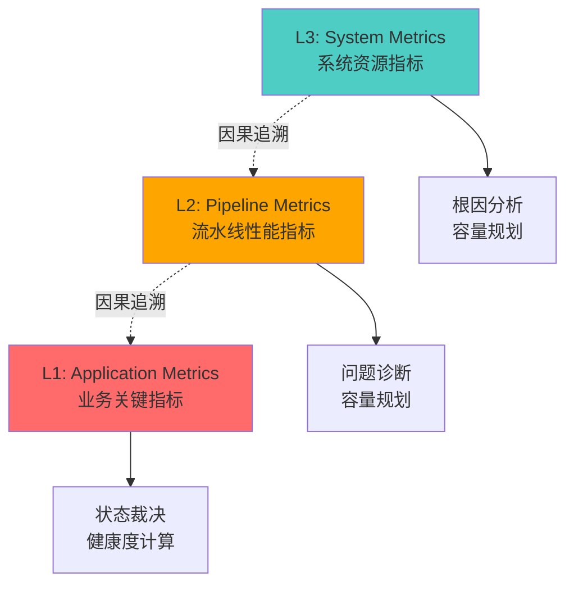

# 可观测性架构 + 健康度量化模型（Observability Architecture & Health Model）

## 全局不变量索引

- 5 态 FSM 定义与转移规则（SSOT）：见 [分块设计文档/顶层设计_1.md](分块设计文档/顶层设计_1.md#ssot-fsm-5state)
- TrackData gap 指标与阈值（SSOT）：见 [分块设计文档/顶层设计_3.md](分块设计文档/顶层设计_3.md#ssot-trackdata-gap-thresholds)
- 三时间戳体系（SSOT）：见 [分块设计文档/顶层设计_3.md](分块设计文档/顶层设计_3.md#ssot-time-triple)
- 队列满策略与 drop 语义（SSOT）：见 [分块设计文档/顶层设计_1.md](分块设计文档/顶层设计_1.md#ssot-queue-drop)
- SEV 分级定义（SSOT）：见 [分块设计文档/顶层设计_2.md](分块设计文档/顶层设计_2.md#ssot-sev-def)
- **FPGA 协议 V3.1 重组超时与一致性规则（SSOT，新增）**：见 [分块设计文档/顶层设计_2.md](分块设计文档/顶层设计_2.md#recv-v31) 与 [05_通信协议设计规范.md](05_通信协议设计规范.md)
- **显控协议 V1 UDP 限制（SSOT，新增）**：MaxUdpPayloadBytes=1200B，见 [分块设计文档/顶层设计_3.md](分块设计文档/顶层设计_3.md#hmi-protocol)

**文档编号**：SYS-SPEC-OBS-001
**版本**：V1.1 (与一致性耦合分析报告对齐)
**最后更新**：2026-02-27
**状态**：READY FOR FAT（已纳入 V3.1 协议一致性指标）
**作者**：System Architecture Team + Expert Review

---

## 0. 约束继承（FROZEN）

本文档建立在以下冻结约束之上，**任何违背将导致验收失败**：

### 0.1 双平面架构（Data Plane / Control Plane）

- **数据面（Data Plane）** MUST：
  - 以固定周期处理实时流（CPI-based pipeline）
  - 不得进行阻塞 IO
  - 不得进行重计算（如复杂聚合、多阶统计）
  - 仅允许原子计数器与无锁轻量采集
- **控制面（Control Plane）** MUST：
  - 承担所有可观测性汇聚、聚合、导出职责
  - 从数据面无锁读取原子指标
  - FORBIDDEN 对数据面施加反压或阻塞

### 0.2 五态有限状态机（5-State FSM）

系统状态 `system_state` 的 5 态定义与转移规则统一见 [分块设计文档/顶层设计_1.md](分块设计文档/顶层设计_1.md#ssot-fsm-5state)。本篇仅引用其作为健康度裁决的状态集合。

### 0.3 业务必达输出（TrackData）约束

**TrackData** 是**唯一业务必达输出**，必须满足：

- **更新率目标**：≥ 1 Hz（工程目标）
- **输出中断红线（FROZEN）**：
  - `T1_trackdata_gap = 500ms`：触发 Degraded 的默认阈值（定义与口径见 [分块设计文档/顶层设计_3.md](分块设计文档/顶层设计_3.md#ssot-trackdata-gap-thresholds)）
  - `T2_trackdata_gap = 2s`：触发 Fault 的红线阈值（不可调，定义与口径同上）

> **定义**：TrackData 输出中断指 " 对外无新 TrackData 帧发布 "（以 `output_ts`/发送时刻为准），不是 " 某个目标未更新 "。

### 0.4 数据面队列策略（FROZEN）

数据面队列策略的 drop 语义与适用范围统一见 [分块设计文档/顶层设计_1.md](分块设计文档/顶层设计_1.md#ssot-queue-drop)。**观测系统 FORBIDDEN 修改队列策略。**

### 0.5 观测系统反压禁止条款（MUST）

观测系统 MUST 采用 " 自降级 " 策略，**FORBIDDEN 对数据面施加任何反压**：

- 当观测系统过载时，按优先级丢弃观测数据（L3→L2→L1）
- 任何情况下数据面处理不得因观测系统过载而受阻

### 0.5.1 缺失指标处理策略（MUST）

当某个指标无法采集（硬件不支持、故障、采样失败）时：

**原则**：使用 " 中立或保守的常数值 " 替代，而非 NaN 或 0

| 指标 | 采集失败时的处理 | 理由 |
|---|---|---|
| `cpu_utilization_per_core` | 使用前一个有效采样 | CPU 采样必须成功；失败表示观测系统异常，提升 C 处罚 |
| `numa_remote_access_ratio` | 使用固定值 50 | NUMA 指标硬件依赖，失败不应有偏向；使用中立值 |
| `gpu_memory_used_bytes` | 使用 GPU 容量的 70% | 保守假设：GPU 接近压力状态 |
| `gpu_temperature_celsius` | 使用固定值 75°C | 保守假设：GPU 温度中等 |
| `network_rx_packet_loss_rate` | 使用固定值 0.0001 | 优化假设：网络基本正常 |

**副作用处理**：

- 当某类指标连续缺失 > 30s，**MUST 降低 C_observability 等级**（见 4.5.2）
- 当 5 个以上指标同时缺失，**MUST 触发 SEV-2 事件 `OBSERVABILITY_DEGRADATION`**

### 0.6 诊断包生成约束（MUST）

诊断包必须满足实时性要求：

- **生成时延 < 100ms**（从触发到数据持久化）
- MUST 异步生成，不阻塞状态机裁决
- 如果生成超时，MUST 记录 " 诊断包生成失败 " 事件

**实现建议**：

- 使用后台线程异步生成
- 原始数据预聚合（避免序列化巨大数组）
- 仅生成最近 60s 的快照（不是历史全量）

### 0.6 故障分级体系（继承 SYS-SPEC-EVCM-001）

SEV-1/2/3 分级定义与判据统一见 [分块设计文档/顶层设计_2.md](分块设计文档/顶层设计_2.md#ssot-sev-def)。本篇仅引用其作为健康度到状态机的映射输入。

### 0.7 三时间戳体系（FROZEN）

三时间戳定义与单调关系统一见 [分块设计文档/顶层设计_3.md](分块设计文档/顶层设计_3.md#ssot-time-triple)。任意违反（尤其 `data_ts` 回退）属于 **时间戳单调性破坏事件**，触发 SEV-1。

### 0.8 FPGA 协议 V3.1 一致性约束（FROZEN，新增）

**本可观测性架构 MUST 遵守 FPGA 协议 V3.1 冻结条款，任何违背将导致协议不一致**：

- **[RECV-V31-1] 重组超时 MUST 为 `T_reasm = 100ms`**（禁止使用 10ms 或其他更短超时）
  - 超时后 MUST 按缺失分片补零输出并标记 `IncompleteFrame`
  - 迟到分片 MUST 丢弃并计数（`reassembly_late_fragment_count`）
  - 可观测性指标：`reassembly_incomplete_frame_rate`、`reassembly_timeout_count`
- **[RECV-V31-2] 尾包携带 Execution Snapshot MUST 验证**
  - MUST 对比控制下发与前端实际生效值（闭环一致性验证）
  - 不一致 MUST 触发 SEV-2 事件并计数（`fpga_execution_snapshot_mismatch_count`）
- **[CTRL-V31-1] 控制平面幂等桥接 MUST 实现**
  - 显控 command_id ↔ DACS (SourceID, ControlEpoch, SequenceNumber) 映射
  - ControlEpoch 变化 MUST 清空去重缓存且拒绝旧纪元控制
  - 可观测性指标：`control_epoch_mismatch_count`、`control_ack_timeout_rate`（RTO=2500ms, MAX_RETRY=3）
- **[TIME-V31-1] 时间质量状态 MUST 映射为 Q0/Q1/Q2**
  - Q0 (Locked)：GNSS/PTP 锁定，允许秒边界定时生效（T_APPLY_WINDOW_MS=5ms）
  - Q1 (Holdover)：晶振守时，>300s 需降级
  - Q2 (Freerun)：时统丢失，禁止定时生效
  - 可观测性指标：`time_quality_state`（3=Q0, 2=Q1, 1=Q2）
- **[HB-V31-1] 心跳优先处理 MUST 保障**
  - 数据洪峰下仍能及时处理 0x04 心跳（建议通过 DSCP 或软件队列优先级）
  - 心跳饿死 MUST 计数并触发 SEV-3 告警（避免误判前端失联）
  - 可观测性指标：`heartbeat_starvation_count`
- **[HMI-V1-1] 显控 UDP 数据面 MUST 严控 MaxUdpPayloadBytes=1200B**
  - 超限 MUST 截断并显式标记（is_truncated/drop_reason/dropped_count）
  - 单包不分片（避免 IP 分片带来的额外丢包）
  - 可观测性指标：`hmi_trackdata_truncation_rate`

**理由**：以上约束来自《后端架构、射频前端 FPGA 与显控一致性耦合分析报告》中的**最高优先级不一致修正（P0 短期措施）**，必须在可观测性架构中体现为可监控、可验收的指标。

---

## 1. 可观测性分层契约（Three-Layer Observability Contract）

### 1.1 分层定义（FROZEN）

可观测性体系划分为三层，每层具有独立的契约与消费者：



### 1.2 三层契约表（FROZEN）

| 层级 | 名称 | 主要消费者 | 刷新周期<br/>(Freshness) | 容忍丢失率<br/>(Loss Tolerance) | 精度要求<br/>(Accuracy) | 可用于状态裁决<br/>(Decision Input) | 过载降级策略<br/>(Backpressure Policy) |
|---|---|---|---|---|---|---|---|
| **L1** | Application Metrics | 显控操作员<br/>Orchestrator | 100ms - 1s | ≤ 1% | 必须精确<br/>（计数器不可丢） | **YES** | **保留**，最高优先级 |
| **L2** | Pipeline Metrics | 运维工程师<br/>自动化监控 | 1s - 10s | ≤ 5% | 允许估算<br/>（如分位数） | Optional | 降采样（10%→1%） |
| **L3** | System Metrics | 容量规划<br/>离线分析 | 10s - 60s | ≤ 20% | 趋势准确即可 | NO | 丢弃旧数据 |

### 1.3 跨层因果关系（MUST）

**因果追溯义务（Causal Traceability Obligation）**：

> L1 指标下降时，**MUST 能够追溯到 L2/L3 的具体根因指标**。

示例因果链：

```txt
L1: trackdata_output_gap_ms = 800ms (超 T1 阈值)
  ↓ 追溯
L2: gpu_kernel_timeout_rate = 0.05 (5% 超时)
  ↓ 追溯
L3: gpu_utilization = 98%, gpu_memory_ecc_errors_delta = 15
```

**实现要求**：

- 每次健康度下降时，诊断包 MUST 包含完整因果链
- 每层指标 MUST 携带时间戳，支持时序对齐分析
- Orchestrator 在状态转移时 MUST 记录当前 L1/L2/L3 快照

### 1.4 分层指标归属（MUST）

#### L1（Application Metrics）- 业务关键指标

直接反映业务输出质量与可信性：

- `trackdata_output_gap_ms`：TrackData 输出间隔（最高优先级）
- `trackdata_output_hz`：TrackData 输出频率
- `trackdata_latency_p99_ms`：端到端时延 P99
- `time_quality`：时间质量状态（映射：Q0=LOCK / Q1=HOLDOVER / Q2=FREERUN）
- `time_monotonicity_violation_count`：时间戳单调性破坏计数
- `frontend_data_loss_event_count`：前端数据丢失事件计数
- `crc_check_failed_rate`：CRC 校验失败率
- `fpga_protocol_conformance_violation_count`：FPGA 协议 V3.1 一致性违反计数（新增）
- `control_ack_timeout_rate`：控制平面 ACK 超时率（V3.1 RTO=2500ms）（新增）
- `control_epoch_mismatch_count`：ControlEpoch 不匹配计数（幂等桥接）（新增）
- `hmi_trackdata_truncation_rate`：显控 TrackData 截断率（超 1200B）（新增）

#### L2（Pipeline Metrics）- 流水线性能指标

反映实时处理流水线健康度：

- `queue_hwm_duration_ms`：队列高水位持续时长（按 queue_name）
- `gpu_kernel_timeout_rate`：GPU 算子超时率
- `gpu_stream_utilization`：GPU stream 利用率（按 stream_id）
- `module_processing_latency_p99_ms`：模块处理时延 P99（按 module）
- `pipeline_stall_count`：流水线停顿计数
- `data_plane_drop_count`：数据面丢帧计数（按 drop_reason）
- `reassembly_incomplete_frame_rate`：重组不完整帧率（T_reasm=100ms 超时补零输出帧）（新增）
- `reassembly_late_fragment_count`：迟到分片计数（重组已超时输出后到达）（新增）
- `reassembly_timeout_count`：重组超时触发计数（验证 100ms 设置正确）（新增）
- `fpga_execution_snapshot_mismatch_count`：尾包携带的 Execution Snapshot 与预期不一致计数（新增）
- `heartbeat_starvation_count`：心跳饿死计数（数据洪峰下未能及时处理）（新增）
- `control_idempotency_duplicate_suppressed_count`：控制幂等去重计数（同键控制被抑制）（新增）

#### L3（System Metrics）- 系统资源指标

反映底层计算与网络资源状态：

- `cpu_utilization_per_core`：CPU 核利用率（按 cpu_id）
- `numa_remote_access_ratio`：NUMA 远程访问比例
- `gpu_memory_used_bytes`：GPU 显存占用
- `gpu_temperature_celsius`：GPU 温度
- `network_rx_packet_loss_rate`：网络接收丢包率（按 array_id）
- `disk_io_latency_p99_ms`：磁盘 IO 时延 P99
- `memory_page_fault_rate`：内存缺页率

---

## 2. 指标字典（Metric Dictionary SSOT）

### 2.1 指标命名规则（FROZEN）

**MUST 遵守以下规则**：

1. **格式**：`layer_prefix.object.metric_type[.aggregation]`
2. **命名风格**：`snake_case`（全小写下划线）
3. **层级前缀**（可选但推荐）：
   - `app.*` 或无前缀 = L1
   - `pipe.*` = L2
   - `sys.*` = L3
4. **单位后缀**（MUST）：
   - 时间：`_ms` / `_ns` / `_s`
   - 频率：`_hz`
   - 比例：`_ratio` / `_rate`（0-1）/ `_percent`（0-100）
   - 字节：`_bytes` / `_mb`
   - 温度：`_celsius`
   - 无单位计数：`_count` / `_total`

### 2.2 指标类型（Type Taxonomy）

| 类型 | 说明 | 聚合方式 | 示例 |
|---|---|---|---|
| `counter` | 单调递增计数器 | Rate/Delta | `frontend_data_loss_event_count` |
| `gauge` | 瞬时值 | Last/Avg | `cpu_utilization_per_core` |
| `histogram` | 分布统计 | P50/P99/Max | `trackdata_latency_p99_ms` |
| `summary` | 预聚合分位数 | P50/P99 | `module_processing_latency_p99_ms` |

### 2.3 标签体系（Tag Taxonomy FROZEN）

**所有指标 MUST 支持以下标签维度（适用时）**：

| 标签名 | 取值范围 | 适用层级 | 必选/可选 |
|---|---|---|---|
| `array_id` | 1 / 2 / 3 | L1/L2 | MUST（多阵面场景） |
| `module` | M01 / M02 / M03 / M04 / TimeSync / Orchestrator | L1/L2 | MUST（模块级指标） |
| `queue_name` | RxQueue_1 / M01_M02_Q / OutputQueue | L2 | MUST（队列指标） |
| `stream_id` | 1 / 2 / 3 | L2 | MUST（GPU stream 指标） |
| `cpu_id` | 0-127 | L3 | MUST（CPU 核指标） |
| `severity` | SEV-1 / SEV-2 / SEV-3 | L1 | MUST（事件计数） |
| `reason_code` | TIMEOUT / CRC_FAIL / … | L1/L2 | SHOULD（故障原因） |
| `instance_id` | backend-001 | ALL | MUST（多实例部署） |

### 2.4 L1 指标字典（Application Metrics FROZEN）

| 指标名 | 类型 | 单位 | 标签 | 定义 | 红线阈值 |
|---|---|---|---|---|---|
| `trackdata_output_gap_ms` | gauge | ms | instance_id | 最近两帧 TrackData 输出间隔 | > 500ms → Degraded<br/>> 2000ms → Fault |
| `trackdata_output_hz` | gauge | Hz | instance_id | TrackData 输出频率（1s 窗口） | < 0.5Hz → Degraded |
| `trackdata_latency_p99_ms` | histogram | ms | instance_id | E2E 时延 P99<br/>(output_ts - data_ts) | > 300ms → 监控 |
| `time_quality_state` | gauge(enum) | - | instance_id | 时间质量状态<br/>Q0=3(Locked)/Q1=2(Holdover)/Q2=1(Freerun) | Q2 → 禁止定时生效<br/>Q1>300s → SEV-1 |
| `time_monotonicity_violation_count` | counter | count | instance_id | 时间戳单调性破坏计数 | > 0 → SEV-1 → Fault |
| `frontend_data_loss_event_count` | counter | count | array_id, severity | 前端数据丢失事件计数 | 率 > 10/s → SEV-1 → Fault |
| `crc_check_failed_rate` | gauge | ratio | array_id | CRC 校验失败率<br/>（10 帧滑窗） | ≥ 0.05 → SEV-1 |
| `fpga_protocol_conformance_violation_count` | counter | count | array_id, violation_type | V3.1 协议违反计数<br/>（如 Magic/Version/PayloadLen 不匹配） | > 0 → SEV-2 → Degraded |
| `control_ack_timeout_rate` | gauge | ratio | array_id | 控制 ACK 超时率<br/>（RTO=2500ms, MAX_RETRY=3） | > 0.1 → SEV-2 |
| `control_epoch_mismatch_count` | counter | count | array_id | ControlEpoch 不匹配计数<br/>（幂等桥接失败） | > 0 → SEV-2 |
| `hmi_trackdata_truncation_rate` | gauge | ratio | instance_id | TrackData 截断率<br/>（超 1200B MaxUdpPayloadBytes） | > 0.3 → 监控 |

### 2.5 L2 指标字典（Pipeline Metrics）

| 指标名 | 类型 | 单位 | 标签 | 定义 | 警告阈值 |
|---|---|---|---|---|---|
| `queue_hwm_duration_ms` | gauge | ms | queue_name | 队列达到高水位（>80%）持续时长 | > 500ms |
| `gpu_kernel_timeout_rate` | gauge | ratio | module, stream_id | GPU 算子超时率（60s 窗口） | > 0.01 (1%) |
| `gpu_stream_utilization` | gauge | ratio | stream_id | GPU stream 利用率 | > 0.95 |
| `module_processing_latency_p99_ms` | histogram | ms | module | 模块处理时延 P99 | 见模块预算表 |
| `pipeline_stall_count` | counter | count | module | 流水线停顿计数（等待上游超阈值） | > 10/min |
| `data_plane_drop_count` | counter | count | module, reason_code | 数据面丢帧计数 | > 100/min |
| `reassembly_incomplete_frame_rate` | gauge | ratio | array_id | 重组不完整帧率<br/>（T_reasm=100ms 超时补零输出） | > 0.05 (5%) |
| `reassembly_late_fragment_count` | counter | count | array_id | 迟到分片计数<br/>（重组已超时输出后到达） | > 100/min |
| `reassembly_timeout_count` | counter | count | array_id | 重组超时触发计数<br/>（验证 T_reasm=100ms 正确） | 统计监控 |
| `fpga_execution_snapshot_mismatch_count` | counter | count | array_id, mismatch_field | 尾包 Execution Snapshot 不一致<br/>（控制与实际执行不符） | > 0 → SEV-2 |
| `heartbeat_starvation_count` | counter | count | array_id | 心跳饿死计数<br/>（数据洪峰下未及时处理） | > 10/min → SEV-3 |
| `control_idempotency_duplicate_suppressed_count` | counter | count | array_id | 控制幂等去重计数<br/>（同键重复控制被抑制） | 统计监控 |

### 2.6 L3 指标字典（System Metrics）

| 指标名 | 类型 | 单位 | 标签 | 定义 | 警告阈值 |
|---|---|---|---|---|---|
| `cpu_utilization_per_core` | gauge | ratio | cpu_id | CPU 核利用率（1s 窗口） | > 0.95 |
| `numa_remote_access_ratio` | gauge | ratio | cpu_id | NUMA 远程访问比例（近似） | > 0.3 |
| `gpu_memory_used_bytes` | gauge | bytes | - | GPU 显存占用 | > 90% 容量 |
| `gpu_temperature_celsius` | gauge | celsius | - | GPU 温度 | > 85°C |
| `network_rx_packet_loss_rate` | gauge | ratio | array_id | 网络接收丢包率 | > 0.001 |
| `disk_io_latency_p99_ms` | histogram | ms | - | 磁盘 IO 时延 P99 | > 100ms |

---

## 3. 采集与汇聚架构（Instrumentation → Aggregation → Export）

### 3.1 数据面采集点映射表（Instrumentation Map）

**原则**：数据面采集 MUST 满足 " 零锁、零拷贝、零分配 "。

| 指标 | 采集线程 | CPU Affinity | 更新边界 | 实现方式 | 开销等级 |
|---|---|---|---|---|---|
| `trackdata_output_gap_ms` | OutputGateway | CPU 62 | 每次发送 | `std::atomic<uint64_t>` | Low |
| `time_monotonicity_violation_count` | TimeSync | CPU 63 | 每次检测 | `std::atomic<uint32_t>` | Low |
| `crc_check_failed_rate` | Receiver (per array) | CPU 16/32/48 | 每帧 | 滑窗计数器（lock-free） | Low |
| `queue_hwm_duration_ms` | 每个 Producer | 各自 CPU | 入队时 | `std::atomic<uint64_t>` + TSC | Low |
| `gpu_kernel_timeout_rate` | M02/M03 | CPU 17/18 | 每次提交 | 计数器 | Low |
| `module_processing_latency_p99_ms` | 各 Module | 各自 CPU | 每个 CPI | HDRHistogram（无锁） | Med |
| `cpu_utilization_per_core` | Control Plane | - | **100ms 周期采样（MUST）** | 读 `/proc/stat` 或轮询 | High |
| `reassembly_incomplete_frame_rate` | Receiver (per array) | CPU 16/32/48 | T_reasm=100ms 超时时 | `std::atomic<uint32_t>` | Low |
| `reassembly_late_fragment_count` | Receiver (per array) | CPU 16/32/48 | 收到迟到分片时 | `std::atomic<uint32_t>` | Low |
| `reassembly_timeout_count` | Receiver (per array) | CPU 16/32/48 | 每次超时触发 | `std::atomic<uint32_t>` | Low |
| `fpga_execution_snapshot_mismatch_count` | Receiver (per array) | CPU 16/32/48 | 收到尾包时验证 | `std::atomic<uint32_t>` | Low |
| `heartbeat_starvation_count` | Receiver (per array) | CPU 16/32/48 | 心跳处理延迟超阈值 | `std::atomic<uint32_t>` | Low |
| `control_ack_timeout_rate` | Orchestrator | CPU 63 | 控制超时时 | 滑窗计数器 | Low |
| `control_epoch_mismatch_count` | Orchestrator | CPU 63 | 收到旧纪元包时 | `std::atomic<uint32_t>` | Low |
| `hmi_trackdata_truncation_rate` | OutputGateway | CPU 62 | 超 1200B 截断时 | 滑窗计数器 | Low |

**约束**：

- 数据面采集 FORBIDDEN 使用 `std::mutex` / `pthread_mutex`
- MUST 使用 `std::atomic` 或 lock-free 数据结构
- 延迟计算（如 P99）MUST 在控制面完成
- **`cpu_utilization_per_core` 采样间隔 MUST ≤ 100ms**（CRITICAL 约束）
  - 理由：数据面故障时延已为 200-300ms，1s 采样延迟过长会导致 TrackData 间隔超 2s 才被检测到
  - 实现成本：48 核 * 5ms/次采样 ≈ 240ms，分散采样降至 100ms 内（每次采样先检查 10 个核）≈可接受
  - 验证标准：FAT 需验证 "CPU 突增到 95% 时，检测延迟 < 200ms"

### 3.2 汇聚策略（Aggregation Policy FROZEN）

#### 3.2.1 滑动窗口定义

| 指标类型 | 窗口大小 | 更新频率 | 保留历史 |
|---|---|---|---|
| L1 关键指标 | 10s | 100ms | 最近 60s |
| L2 性能指标 | 60s | 1s | 最近 300s |
| L3 资源指标 | 300s | **100ms (CPU 采样) / 10s (其他)** | 最近 3600s |

**特别说明**：

- `cpu_utilization_per_core` 采样频率 **MUST 为 100ms**（对应 3.1 的 CRITICAL 约束）
  - 不同于其他 L3 指标的 10s 频率
  - 原因：CPU 过载是导致数据面时延的主要因素，需要快速检测
  - 实现：轮询 `/proc/stat` 或分核采样，降低单次采样成本
- 滑窗计算复杂度：保留最近 10-100 个采样点，使用环形缓冲区实现 O(1) 的增量计算

#### 3.2.2 EWMA 平滑参数（FROZEN）

对于噪声较大的指标（如 CPU 利用率、网络抖动），使用指数加权移动平均（EWMA）：

```txt
EWMA(t) = α * sample(t) + (1-α) * EWMA(t-1)
```

**冻结参数**：

- 快速响应指标（L1）：`α = 0.3`
- 中速指标（L2）：`α = 0.1`
- 慢速指标（L3）：`α = 0.05`

#### 3.2.3 分位数估计方法（MUST）

对于延迟类直方图指标，**MUST 使用以下方法之一**：

- **推荐**：HDRHistogram（高动态范围直方图）
  - 精度：3 位有效数字
  - 内存开销：~2KB/histogram
  - 支持 P50/P90/P99/P999/Max
- **备选**：t-digest
  - 精度：可调
  - 内存开销：~1KB
  - 适用于分布式聚合场景

**FORBIDDEN 使用固定桶直方图**（精度不足）。

#### 3.2.4 去噪规则（Anti-Noise Rules）

| 规则 | 定义 | 应用场景 |
|---|---|---|
| **单点尖峰过滤** | 连续 3 个采样点中仅 1 个超阈值，则忽略 | CPU 利用率、GPU 温度 |
| **最小样本数** | 窗口内样本数 < 10，则不计算分位数 | 低频事件的延迟统计 |
| **置信区间** | P99 ± 1.5 * IQR，超出视为异常 | 延迟异常检测 |

### 3.3 导出通道（Export Plane）

#### 3.3.1 对显控的状态快照（每秒推送）

**字段集合（FROZEN）**：

```json
{
  "timestamp_ns": "<int64>",
  "instance_id": "backend-001",
  "system_state": "Running",
  "health_score": 95.3,
  "health_confidence": 0.98,
  "time_quality": "OK",
  "trackdata_output_hz": 1.2,
  "trackdata_output_gap_ms": 120,
  "array_status": [
    {"array_id": 1, "conn_state": "Up", "data_loss_rate": 0.001},
    {"array_id": 2, "conn_state": "Up", "data_loss_rate": 0.0},
    {"array_id": 3, "conn_state": "Down", "data_loss_rate": 1.0}
  ],
  "active_events": [
    {"event_type": "QUEUE_HIGH_WATERMARK", "severity": "SEV-3", "module": "M02"}
  ]
}
```

#### 3.3.2 对运维的指标导出（Pull 模式）

**推荐协议**：Prometheus exporter

**端点**：`http://localhost:9100/metrics`

**导出频率**：运维系统按需拉取（推荐 10s 间隔）

**格式示例**：

```txt
# HELP trackdata_output_gap_ms TrackData output gap in milliseconds
# TYPE trackdata_output_gap_ms gauge
trackdata_output_gap_ms{instance_id="backend-001"} 120.5

# HELP crc_check_failed_rate CRC check failure rate (10-frame window)
# TYPE crc_check_failed_rate gauge
crc_check_failed_rate{array_id="1"} 0.002
crc_check_failed_rate{array_id="2"} 0.0
crc_check_failed_rate{array_id="3"} 0.05
```

#### 3.3.3 本地落盘策略（仅控制面）

**路径**：`/var/local/qdgz300/metrics/`

**格式**：二进制时序数据库（推荐 RRD 或 Whisper）

**保留策略**：

- L1 指标：1s 精度，保留 24h
- L2 指标：10s 精度，保留 7d
- L3 指标：60s 精度，保留 30d

**磁盘配额**：最大 1GB（循环覆盖）

### 3.4 过载降级策略（MUST）

当观测系统自身过载时（如控制面 CPU > 80%），按以下优先级丢弃数据：

1. **保留 L1**（最高优先级）
2. **降采样 L2**：10s → 60s
3. **丢弃 L3**：仅保留最近 1 个快照

**触发条件**：

- 控制面 CPU 利用率 > 80%，持续 10s
- 指标导出队列积压 > 10000 条

**恢复条件**：

- 控制面 CPU 利用率 < 60%，持续 30s

---

## 4. 健康度量化模型（Health Quantification Model）

### 4.1 健康分数定义（FROZEN）

系统健康度由三层分数构成，最终汇总为总分：

#### 4.1.1 三层分数定义

- `H_app ∈ [0, 100]`：应用层健康分数（L1 指标）
- `H_pipe ∈ [0, 100]`：流水线健康分数（L2 指标）
- `H_sys ∈ [0, 100]`：系统层健康分数（L3 指标）

#### 4.1.2 总分计算（FROZEN）

```txt
H_total = w1 * H_app + w2 * H_pipe + w3 * H_sys
```

**冻结默认权重**：

```txt
w1 = 0.50  (应用层权重)
w2 = 0.35  (流水线权重)
w3 = 0.15  (系统层权重)
```

**理由**：

- 应用层直接反映业务输出质量，权重最高
- 流水线问题会快速传导至应用层，权重次之
- 系统资源问题通常有缓冲时间，权重最低

**可配置性**：

- 权重可通过配置文件调整，但 MUST 满足：`w1 + w2 + w3 = 1.0`
- 配置变更 MUST 记录在诊断包中

### 4.2 应用层健康分数（H_app）计算

`H_app` 由 11 个子项评分函数构成（新增 4 个协议一致性相关指标），每个子项 `s_i ∈ [0, 100]`：

```txt
H_app = Σ (w_i * s_i)  / Σ w_i
```

**权重调整说明**：为纳入 V3.1 协议一致性与显控截断指标，原子项权重进行重新分配，确保总和为 1.0。

#### 4.2.1 子项 1：TrackData 输出间隔评分（权重 30%，从 35% 调整）

**指标**：`trackdata_output_gap_ms`

**评分函数（分段线性）**：

```txt
s_gap = 100                                    if gap ≤ 100ms
      = 100 - 100 * (gap - 100) / 400         if 100ms < gap < 500ms
      = 0                                      if gap ≥ 500ms
```

**图示**：

```txt
Score
100 ┤━━━━━━━━╮
    │        ╲
 50 ┤         ╲
    │          ╲______
  0 ┤─────────────────
    0   100   500   gap(ms)
```

#### 4.2.2 子项 2：TrackData 输出频率评分（权重 20%，从 25% 调整）

**指标**：`trackdata_output_hz`

**评分函数（分段线性）**：

```txt
s_hz = 0                                       if hz < 0.2
     = 50 * (hz - 0.2) / 0.3                  if 0.2 ≤ hz < 0.5
     = 50 + 50 * (hz - 0.5) / 0.5            if 0.5 ≤ hz < 1.0
     = 100                                     if hz ≥ 1.0
```

#### 4.2.3 子项 3：端到端时延评分（权重 15%）

**指标**：`trackdata_latency_p99_ms`

**评分函数（Logistic）**：

```txt
s_latency = 100 / (1 + exp((latency_p99 - 200) / 50))
```

**特点**：

- latency_p99 = 200ms 时，score ≈ 50
- latency_p99 < 150ms 时，score > 90
- latency_p99 > 300ms 时，score < 10

#### 4.2.4 子项 4：时间质量评分（权重 10%）

**指标**：`time_quality_state`（Q0=3(Locked) / Q1=2(Holdover) / Q2=1(Freerun)）

**评分函数（直接映射，与 V3.1 时统策略对齐）**：

```txt
s_time = 100                                   if time_quality = Q0 (Locked, 3)
       = 60                                    if time_quality = Q1 (Holdover, 2)
       = 0                                     if time_quality = Q2 (Freerun, 1)
```

**说明**：

- Q0 (Locked)：GNSS/PTP 锁定，允许秒边界定时生效
- Q1 (Holdover)：晶振守时，T_APPLY_WINDOW_MS=5ms 仍可能满足，但 >300s 需降级
- Q2 (Freerun)：时统丢失，禁止定时生效，仅支持立即生效控制

#### 4.2.5 子项 5：时间单调性评分（权重 5%）

**指标**：`time_monotonicity_violation_count`（计数器）

**评分函数（立即归零）**：

```txt
s_monotonic = 100 - 100 * min(1, violation_count)
```

**说明**：任何单调性破坏直接触发 SEV-1，此评分项作为健康度记录。

#### 4.2.6 子项 6：前端数据丢失评分（权重 5%）

**指标**：`frontend_data_loss_event_count`（速率，单位：events/s）

**注意**：该指标被 SEV-1 红线拦截（>= 10 events/s 直接 Fault），因此评分函数主要用于记录轻度丢失事件

**评分函数（Exponential Decay）**：

```txt
loss_rate = Δcount / Δtime
s_loss = 100 * exp(-loss_rate / 2)      if loss_rate >= 0
```

**说明**：

- loss_rate = 0 events/s 时，s_loss = 100（完美）
- loss_rate = 1 events/s 时，s_loss ≈ 61（轻度下降）
- loss_rate = 2 events/s 时，s_loss ≈ 37（适度下降）
- loss_rate = 5 events/s 时，s_loss ≈ 8（接近红线，严重）
- loss_rate ≥ 10 events/s 时，触发 SEV-1（外部拦截，不存在评分）

**理由**：丢失事件与业务影响的关系通常是指数关系（丢失一次 vs 频繁丢失的影响不是线性的）

#### 4.2.7 子项 7：CRC 校验失败评分（权重 5%）

**指标**：`crc_check_failed_rate`（10 帧滑窗）

**红线**：`rate ≥ 0.05` 触发 SEV-1。

**评分函数（基于历史百分位 + 线性衰减）**：

```txt
# 定义参考点（基于历史数据或行业标准）
normal_rate       = 0.001   # 1 in 1000（正常设备）
warning_rate      = 0.01    # 1 in 100 （劣化）
critical_rate     = 0.05    # 1 in 20  （紧急）

# 分段线性映射
if rate < normal_rate:
    s_crc = 100
elif rate < warning_rate:
    # 线性从 100 → 50
    s_crc = 100 - (rate - normal_rate) / (warning_rate - normal_rate) * 50
elif rate < critical_rate:
    # 线性从 50 → 0
    s_crc = 50 * (critical_rate - rate) / (critical_rate - warning_rate)
else:
    s_crc = 0  # SEV-1 已截断，不会到达此处
```

**示例**：

- rate = 0.001 时，s_crc = 100
- rate = 0.005 时，s_crc = 75
- rate = 0.02 时，s_crc = 25
- rate ≥ 0.05 时，SEV-1 触发

**理由**：使用业界标准阈值（0.1%, 1%, 5%）而非任意系数，便于调整和解释

#### 4.2.8 子项 8：FPGA 协议一致性评分（权重 5%，新增）

**指标**：`fpga_protocol_conformance_violation_count`（速率，单位：violations/min）

**评分函数（零容忍）**：

```txt
violation_rate = Δcount / Δtime
s_protocol = 100                               if violation_rate = 0
           = 50                                if violation_rate < 1/min
           = 0                                 if violation_rate ≥ 1/min
```

**说明**：协议违反（如 Magic/Version/PayloadLen 不匹配）直接表明前后端不一致，必须零容忍

#### 4.2.9 子项 9：控制平面幂等一致性评分（权重 3%，新增）

**指标**：`control_epoch_mismatch_count` + `control_ack_timeout_rate`

**评分函数（复合）**：

```txt
epoch_mismatch_rate = Δepoch_mismatch_count / Δtime
ack_timeout_rate = control_ack_timeout_rate

s_control = 100                                if (epoch_mismatch_rate = 0) and (ack_timeout_rate < 0.01)
          = 70                                 if (epoch_mismatch_rate < 0.1/min) and (ack_timeout_rate < 0.05)
          = 30                                 if (epoch_mismatch_rate < 0.5/min) or (ack_timeout_rate < 0.1)
          = 0                                  if (epoch_mismatch_rate ≥ 0.5/min) or (ack_timeout_rate ≥ 0.1)
```

**说明**：纪元不匹配与 ACK 超时直接影响控制可靠性，必须严格监控

#### 4.2.10 子项 10：显控输出截断评分（权重 2%，新增）

**指标**：`hmi_trackdata_truncation_rate`

**评分函数（容忍适度截断）**：

```txt
s_hmi_trunc = 100                              if truncation_rate < 0.05 (5%)
            = 100 - 50 * (truncation_rate - 0.05) / 0.25   if 0.05 ≤ rate < 0.3
            = 50                               if truncation_rate ≥ 0.3
```

**说明**：

- < 5% 截断：正常（峰值流量偶发）
- 5-30% 截断：劣化（持续超限）
- > 30% 截断：严重（需调整选择策略）

**理由**：适度截断是显控协议 V1 的设计容忍（MaxUdpPayloadBytes=1200B 冻结），但持续高截断率表明选择策略失效

#### 4.2.11 子项 11：重组不完整帧评分（权重 5%，新增）

**指标**：`reassembly_incomplete_frame_rate`

**评分函数（容忍低比例缺片）**：

```txt
s_reasm = 100                                  if incomplete_rate < 0.01 (1%)
        = 100 - 50 * (incomplete_rate - 0.01) / 0.04   if 0.01 ≤ rate < 0.05
        = 50 - 50 * (incomplete_rate - 0.05) / 0.15    if 0.05 ≤ rate < 0.2
        = 0                                    if incomplete_rate ≥ 0.2
```

**说明**：

- < 1%：正常（偶发丢包）
- 1-5%：轻微劣化（网络抖动）
- 5-20%：中度劣化（链路质量问题）
- > 20%：严重（接近不可用）

**理由**：V3.1 协议设计 T_reasm=100ms 超时补零输出是为了容忍短时丢包，但持续高比例不完整帧表明网络或 FPGA 发送异常

#### 4.2.12 H_app 汇总公式（更新）

```txt
H_app = 0.30 * s_gap           (TrackData 输出间隔，从 35% 调整)
      + 0.20 * s_hz            (TrackData 输出频率，从 25% 调整)
      + 0.15 * s_latency       (端到端时延)
      + 0.10 * s_time          (时间质量)
      + 0.05 * s_monotonic     (时间单调性)
      + 0.05 * s_loss          (前端数据丢失)
      + 0.03 * s_crc           (CRC 校验失败，从 5% 调整)
      + 0.05 * s_protocol      (FPGA 协议一致性，新增)
      + 0.03 * s_control       (控制幂等一致性，新增)
      + 0.02 * s_hmi_trunc     (显控截断，新增)
      + 0.02 * s_reasm         (重组不完整帧，从 s_loss 分离，新增)
```

**权重总和验证**：0.30 + 0.20 + 0.15 + 0.10 + 0.05 + 0.05 + 0.03 + 0.05 + 0.03 + 0.02 + 0.02 = 1.00 ✓

**调整理由**：

- TrackData 输出间隔/频率仍为最高优先级（合计 50%），但略微降低为新指标腾出空间
- 新增的 4 个协议一致性指标（s_protocol/s_control/s_hmi_trunc/s_reasm）合计 12%，反映 " 以 V3.1 为唯一事实源 " 的设计原则
- CRC 从 5% 降至 3%，因为其已被 s_protocol 部分覆盖（CRC 是协议一致性的一部分）

### 4.3 流水线健康分数（H_pipe）计算

`H_pipe` 由 8 个子项评分函数构成（新增 3 个协议相关指标）：

**权重调整说明**：为纳入协议重组与心跳饿死相关指标，原子项权重进行重新分配。

#### 4.3.1 子项 1：队列高水位持续时长评分（权重 30%）

**指标**：`queue_hwm_duration_ms`（所有队列的最大值）

**评分函数**：

```txt
s_queue = 100                                  if hwm_dur ≤ 100ms
        = 100 - 100 * (hwm_dur - 100) / 900   if 100ms < hwm_dur < 1000ms
        = 0                                    if hwm_dur ≥ 1000ms
```

#### 4.3.2 子项 2：GPU 超时率评分（权重 30%）

**指标**：`gpu_kernel_timeout_rate`

**评分函数（基于历史百分位）**：

```txt
# 参考阈值（基于正常硬件运行数据）
normal_timeout_rate    = 0.0001   # 0.01%（偶发超时）
warning_timeout_rate   = 0.001    # 0.1%  （轻度压力）
critical_timeout_rate  = 0.02     # 2%    （严重）

# 分段映射
if rate < normal_timeout_rate:
    s_gpu_timeout = 100
elif rate < warning_timeout_rate:
    s_gpu_timeout = 100 - (rate - normal_timeout_rate) / (warning_timeout_rate - normal_timeout_rate) * 30
elif rate < critical_timeout_rate:
    s_gpu_timeout = 70 * (critical_timeout_rate - rate) / (critical_timeout_rate - warning_timeout_rate)
else:
    s_gpu_timeout = 0
```

**示例**：

- rate = 0.0001 时，s_gpu_timeout = 100（正常）
- rate = 0.0005 时，s_gpu_timeout = 97（轻微）
- rate = 0.001 时，s_gpu_timeout = 70（警告）
- rate = 0.01 时，s_gpu_timeout = 35（劣化）
- rate ≥ 0.02 时，s_gpu_timeout = 0（严重）

**理由**：使用百分比基准而非任意系数，确保跨平台的可重复性

#### 4.3.3 子项 3：模块处理时延评分（权重 20%）

**指标**：`module_processing_latency_p99_ms`（最差模块）

**预算表（FROZEN）**：

| 模块 | P99 预算 | 红线阈值 |
|---|---|---|
| M01 | 30ms | 50ms |
| M02 | 15ms | 25ms |
| M03 | 8ms | 15ms |
| M04 | 5ms | 10ms |

**评分函数（归一化）**：

```txt
ratio = actual_p99 / budget_p99
s_latency_pipe = 100                           if ratio ≤ 1.0
               = 100 - 100 * (ratio - 1.0)    if 1.0 < ratio < 2.0
               = 0                             if ratio ≥ 2.0
```

#### 4.3.4 子项 4：流水线停顿评分（权重 10%）

**指标**：`pipeline_stall_count`（速率，单位：stalls/min）

**评分函数**：

```txt
stall_rate = Δcount / Δtime
s_stall = 100                                  if stall_rate ≤ 5
        = 100 - 10 * (stall_rate - 5)         if 5 < stall_rate < 15
        = 0                                    if stall_rate ≥ 15
```

#### 4.3.5 子项 5：数据面丢帧评分（权重 10%）

**指标**：`data_plane_drop_count`（速率，单位：drops/min）

**评分函数**：

```txt
drop_rate = Δcount / Δtime
s_drop = 100                                   if drop_rate ≤ 50
       = 100 - (drop_rate - 50) / 5           if 50 < drop_rate < 500
       = 0                                     if drop_rate ≥ 500
```

#### 4.3.6 子项 6：重组超时触发频率评分（权重 5%，新增）

**指标**：`reassembly_timeout_count`（速率，单位：timeouts/min）

**评分函数（验证 T_reasm=100ms 设置正确性）**：

```txt
timeout_rate = Δcount / Δtime
s_reasm_timeout = 100                          if timeout_rate < 10/min
                = 100 - 10 * (timeout_rate - 10) / 40   if 10 ≤ rate < 50/min
                = 0                            if timeout_rate ≥ 50/min
```

**说明**：

- < 10/min：正常（偶发丢包导致重组超时）
- 10-50/min：中度（网络质量下降）
- > 50/min：严重（接近持续丢包）

**理由**：监控重组超时频率可验证 T_reasm=100ms 设置是否合理，并及时发现网络问题

#### 4.3.7 子项 7：Execution Snapshot 不一致评分（权重 5%，新增）

**指标**：`fpga_execution_snapshot_mismatch_count`（速率，单位：mismatches/min）

**评分函数（零容忍）**：

```txt
mismatch_rate = Δcount / Δtime
s_exec_snapshot = 100                          if mismatch_rate = 0
                = 50                           if mismatch_rate < 0.5/min
                = 0                            if mismatch_rate ≥ 0.5/min
```

**说明**：Execution Snapshot 不一致表明控制下发与实际执行不符，属于严重的一致性违反

#### 4.3.8 子项 8：心跳饿死评分（权重 5%，新增）

**指标**：`heartbeat_starvation_count`（速率，单位：starvations/min）

**评分函数（容忍低频饿死）**：

```txt
starvation_rate = Δcount / Δtime
s_heartbeat = 100                              if starvation_rate < 1/min
            = 100 - 20 * (starvation_rate - 1) / 9   if 1 ≤ rate < 10/min
            = 0                                if starvation_rate ≥ 10/min
```

**说明**：

- < 1/min：正常（偶发数据洪峰）
- 1-10/min：中度（持续数据洪峰，心跳处理延迟）
- > 10/min：严重（可能触发误告警）

**理由**：心跳饿死会导致误判前端失联，必须监控并通过 DSCP 或软件队列优先级缓解

#### 4.3.9 H_pipe 汇总公式（更新）

```txt
H_pipe = 0.25 * s_queue          (从 30% 调整)
       + 0.25 * s_gpu_timeout    (从 30% 调整)
       + 0.15 * s_latency_pipe   (从 20% 调整)
       + 0.10 * s_stall          (保持 10%)
       + 0.10 * s_drop           (保持 10%)
       + 0.05 * s_reasm_timeout  (新增，重组超时监控)
       + 0.05 * s_exec_snapshot  (新增，控制执行一致性)
       + 0.05 * s_heartbeat      (新增，心跳饿死监控)
```

**权重总和验证**：0.25 + 0.25 + 0.15 + 0.10 + 0.10 + 0.05 + 0.05 + 0.05 = 1.00 ✓

**调整理由**：

- 原队列/GPU 超时权重略微降低（各 5%），为新增 3 个协议相关指标（合计 15%）腾出空间
- 新增指标直接反映 V3.1 协议一致性与心跳保活机制的健康度

### 4.4 系统层健康分数（H_sys）计算

`H_sys` 由 5 个子项评分函数构成：

#### 4.4.1 子项 1：CPU 过载评分（权重 35%）

**指标**：`cpu_utilization_per_core`（数据面核心最大值）

**评分函数**：

```txt
cpu_max = max(cpu_utilization[cpu in [16-63]])
s_cpu = 100                                    if cpu_max ≤ 0.8
      = 100 - 667 * (cpu_max - 0.8)           if 0.8 < cpu_max < 0.95
      = 0                                      if cpu_max ≥ 0.95
```

#### 4.4.2 子项 2：NUMA 远程访问评分（权重 5% - 降权以反映采样可靠性风险）

**指标**：`numa_remote_access_ratio`（代理指标，采样可靠性有限）

**⚠️ 重要声明**：

- 该指标依赖硬件性能计数器，不是所有平台都支持
- 采样精度通常有 ±20-50% 误差
- 权重从原方案的 20% 降至 5%，以反映不确定性
- **如果 FAT 中发现该指标无法采集，可配置为固定值 50（中立评分）**

**评分函数（基于硬件支持）**：

```txt
if numa_remote_access_ratio unavailable:
    s_numa = 50  # 保守值，不影响整体判定
else:
    ratio = collected_numa_remote_access_percentage / 100
    if ratio <= 0.1:
        s_numa = 100
    elif ratio <= 0.5:
        s_numa = 100 - (ratio - 0.1) / 0.4 * 100
    else:
        s_numa = 0
```

#### 4.4.3 子项 3：GPU 显存评分（权重 20%）

**指标**：`gpu_memory_used_bytes / gpu_memory_total_bytes`

**评分函数**：

```txt
mem_ratio = used / total
s_gpu_mem = 100                                if mem_ratio ≤ 0.7
          = 100 - 333 * (mem_ratio - 0.7)     if 0.7 < mem_ratio < 0.95
          = 0                                  if mem_ratio ≥ 0.95
```

#### 4.4.4 子项 4：GPU 温度评分（权重 15%）

**指标**：`gpu_temperature_celsius`

**评分函数**：

```txt
s_gpu_temp = 100                               if temp ≤ 75°C
           = 100 - 5 * (temp - 75)            if 75°C < temp < 85°C
           = 0                                 if temp ≥ 85°C
```

#### 4.4.5 子项 5：网络丢包评分（权重 10%）

**指标**：`network_rx_packet_loss_rate`（最差阵面）

**评分函数**：

```txt
loss_max = max(loss_rate[array_id in [1,2,3]])
s_net = 100                                    if loss_max ≤ 0.0001 (0.01%)
      = 100 - 5000 * (loss_max - 0.0001)      if 0.0001 < loss_max < 0.02
      = 0                                      if loss_max ≥ 0.02
```

#### 4.4.6 H_sys 汇总公式

```txt
H_sys = 0.40 * s_cpu          (原 35% → 40%，CPU 是最可靠的 L3 指标)
      + 0.05 * s_numa         (原 20% → 5%，该指标不可靠)
      + 0.25 * s_gpu_mem      (原 20% → 25%，GPU 是 M02/M03 的瓶颈)
      + 0.20 * s_gpu_temp     (原 15% → 20%，温度是过载的早期信号)
      + 0.10 * s_net          (原 10% → 10%，保持不变)
```

**理由（权重调整**）：

- **s_cpu ↑ 40%**：CPU 利用率是最可靠、最易采集的指标，如果错误会直接影响流水线延迟。增加权重确保优先检测 CPU 过载。
- **s_numa ↓ 5%**：该指标依赖硬件支持，采样精度有限，降权以反映不确定性。
- **s_gpu_mem ↑ 25%**：显存占用与 GPU 性能紧密相关，增加权重。
- **s_gpu_temp ↑ 20%**：温度是系统压力的先行指标，能提前预警过热。
- **s_net 保持 10%**：网络丢包对数据面影响较小（前端接收是独立的处理）。

**合计**：40+5+25+20+10 = 100% ✓

### 4.5 置信度模型（Confidence Model）

#### 4.5.1 置信度定义

`C ∈ [0, 1]` 表示健康分数的可信程度，受以下因素影响：

1. **指标样本充分性**：窗口内样本数是否足够
2. **监控降采样**：观测系统是否进入降级模式
3. **数据质量红线**：是否存在数据完整性问题

#### 4.5.2 置信度计算（Multiplicative Model）

```txt
C = C_sample * C_observability * C_data_quality
```

**子项定义**：

##### C_sample（样本充分性）

```txt
C_sample = min(actual_sample_count / expected_sample_count, 1.0)
```

**示例**：

- 期望 10s 窗口内收集 100 个样本
- 实际收集 80 个样本
- C_sample = 80 / 100 = 0.8

##### C_observability（观测系统健康度）

```txt
C_observability = 1.0                          if 观测系统正常
                = 0.8                          if L3 被丢弃
                = 0.6                          if L2 被降采样
                = 0.3                          if L1 采样率 < 50%
```

##### C_data_quality（数据完整性）

```txt
C_data_quality = 1.0                           if CRC 失败率 = 0
               = 1.0 - crc_fail_rate          if crc_fail_rate < 0.05
               = 0.0                           if crc_fail_rate ≥ 0.05
```

#### 4.5.3 有效健康分数（重新设计，避免 Double Penalty）

**原有方案的问题**：

- H_effective = C * H_total 会导致 " 置信度低时分数虚低 "
- 再加上 " 额外降低阈值 "，形成 double penalty
- 例：系统实际质量 90，但观测缺失 50% → H_eff = 45 → 虚假降级

**新方案**（MUST 采用）：

```txt
if C >= 0.7:
    # 置信度充足，正常使用健康分数
    H_effective = H_total
    use_normal_thresholds = True
else:
    # 置信度不足，改为保守常数值
    # 不再使用 H_total 作为状态转移输入
    H_effective = 50  # 保守中立值
    use_conservative_thresholds = True
    # 触发状态转移的条件：
    # - Running → Degraded 降低触发阈值到 H_effective < 55（而非 70）
    # - Degraded → Running 提高恢复阈值到 H_effective > 75（而非 80）
```

**理由**：

- 当观测系统本身有问题（指标缺失、采样不足）时，不应信任任何基于该观测的分数值
- 而应该回退到 " 保守防御 " 模式：
  - 更容易进入 Degraded（防止漏诊）
  - 更难从 Degraded 恢复（防止虚假恢复）
- 这避免了 " 指标缺失 → 分数虚低 → 状态虚假转移 " 的级联问题

#### 4.5.4 置信度对状态裁决的具体影响（MUST）

| 置信度 C | H_total | H_effective | 使用方式 | 状态转移阈值调整 |
|---|---|---|---|---|
| C ≥ 0.9 | any | H_total | 正常使用 | 无调整 |
| 0.7 ≤ C < 0.9 | any | H_total | 正常使用 | 无调整 |
| 0.5 ≤ C < 0.7 | any | 50（固定） | 保守模式 | Running→Degraded: <55，Degraded→Running: >75 |
| C < 0.5 | any | 30（极度保守） | 极度保守 | Running→Degraded: <50，Degraded→Running: >85 |

**配置与日志**：

- 每次使用 H_effective 进行状态裁决时，**MUST 记录当前 C 值和使用的模式**
- 当 C < 0.7 时，**MUST 在诊断包中标记 "observability degraded"**
- 运维告警中**MUST 区分**：
  - "System health bad" （基于可靠观测）
  - "System health uncertain due to observability failure" （基于不可靠观测）

### 4.6 抗抖动与稳定性规则（Anti-Flap Mechanism）

#### 4.6.1 滞回阈值（Hysteresis Thresholds FROZEN）

| 状态转移 | 进入阈值 | 恢复阈值 | 滞回带宽 |
|---|---|---|---|
| Running ↔ Degraded | H_effective < 70 | H_effective > 80 | 10 分 |
| Degraded ↔ Fault | SEV-1 事件触发 | 手动恢复 | N/A |

**图示**：

```txt
H_effective
100 ─────────────────────────  Running
 80 ─────╮ 恢复阈值
         ↓
 70 ────────╮ 进入阈值      Degraded
            ↓
  0 ─────────────────────────  Fault (事件触发)
```

#### 4.6.2 连续满足时间窗（Stable Duration FROZEN）

| 状态转移 | 最小稳定时长 | 说明 |
|---|---|---|
| Degraded → Running | 5s | 必须连续 5s 满足 `H_effective > 80` |
| Running → Degraded | 3s | 连续 3s 满足 `H_effective < 70` 即触发 |
| Any → Fault | 立即 | SEV-1 事件立即触发，无延迟 |

> **SSOT 对齐说明**：`H_effective > 80` 等价于 " 连续帧间隔 < 500ms" 映射后分数（`trackdata_gap_ms` 贡献权重下合格）。时间窗 5s 与 `00_顶层架构.md` §2.7 恢复条件保持一致。

#### 4.6.3 冷却时间（Cooldown FROZEN）

**定义**：从 Degraded 恢复到 Running 后，在冷却时间内不允许再次进入 Degraded（除非 SEV-1 红线）。

**冻结参数**：

```txt
T_cooldown = 30s
```

> **另见**：`T_transition_min = 10s`（连续升降级间最小间隔，定义见 [顶层设计_7.md §1.5](顶层设计_7.md)）。
> 两者语义差异：`T_transition_min` 是连续状态转移的最小间隔，`T_cooldown` 是恢复后再次降级的冷却期。

**实现逻辑**：

```txt
if (current_state == Running) and (time_since_last_recovery < T_cooldown):
    # 忽略 Degraded 触发条件（除非 SEV-1）
    pass
```

#### 4.6.4 Degraded → Running 量化条件（MUST）

**完整条件（ALL MUST 满足）**：

1. `H_effective > 恢复阈值`（取决于 C 值）
   - 如果 C ≥ 0.7：H_effective > 80
   - 如果 C < 0.7：H_effective > 75（保守）
2. 连续满足 ≥ 5s（稳定窗口）
3. 无活跃 SEV-1 事件（SEV-2 无需阻止，见 5.1.3）
4. 冷却时间已过（距上次恢复 ≥ 30s）（见 4.6.3）
5. `C > 0.5`（最低置信度要求）

**伪代码**（修正版）：

```python
def can_recover_to_running(state, H_eff, C, events, time_since_recovery):
    if state != "Degraded":
        return False

    # 根据置信度选择阈值
    recovery_threshold = 80 if C >= 0.7 else 75
    if H_eff <= recovery_threshold:
        return False

    # 检查稳定窗口
    if stable_duration(H_eff > recovery_threshold) < 5s:
        return False

    # 关键修正：只检查 SEV-1，不检查 SEV-2
    # SEV-2 通常在 10-30s 后自动失效，不应永久阻止恢复
    if any(is_event_active(e) and e.severity == "SEV-1" for e in events):
        return False

    # 冷却时间
    if time_since_recovery < 30s:
        return False

    # 置信度最低要求
    if C < 0.5:
        return False

    return True
```

**状态图更新**：

```txt
          Running
           /  \
          /    \ (H_eff < 70 or SEV-2 persistent)
         /      \
        /        ↓
       /      Degraded
      |         / |
      |↑       /  |
      |  (恢复条件) |
      |       /   |
      |      /    ↓
      ←─────   (SEV-1 或 Fault)
     Running
     (冷却30s)
```

---

## 5. 健康度 → 状态机映射（Health-to-FSM Mapping）

### 5.1 状态转移裁决规则（FROZEN）

系统状态由两个输入驱动：

1. **离散事件**（Event-driven）：SEV-1/SEV-2/SEV-3 事件
2. **持续健康分数**（Score-driven）：`H_effective`

#### 5.1.1 规则 A：红线事件直接 Fault（优先级最高）

**触发条件**：任何 SEV-1 事件发生

**行为**：

- **立即进入 Fault**，无需等待健康分数下降
- 停止 TrackData 输出
- 记录事件到诊断包
- 发送状态变更通知

**SEV-1 事件清单（继承 SYS-SPEC-EVCM-001）**：

- `TIME_MONOTONICITY_VIOLATED`
- `TIME_HOLDOVER_EXPIRED` (> 300s)
- `CRC_CHECK_FAILED` (rate ≥ 5%)
- `MODULE_CRASH_DETECTED`
- `GPU_UNRESPONSIVE` (连续 3 次超时)
- `FRONTEND_DATA_LOSS` (rate ≥ 10 events/s)
- `TRACKDATA_OUTPUT_GAP` (> 2s)

#### 5.1.2 规则 B：SEV-2 事件升级 Degraded（可选，基于持续监控）

**触发条件**（满足 ANY 即可进入 Degraded，即使 H_effective 充足）：

- `GPU_KERNEL_TIMEOUT_RATE` (rate > 1%) **且持续 ≥ 10s**
- `QUEUE_HIGH_WATERMARK` (duration > 1000ms) **且持续 ≥ 5s**
- `PIPELINE_STALL_RATE` (rate > 15/min) **且持续 ≥ 10s**
- `DATA_PLANE_DROP_RATE` (rate > 500/min) **且持续 ≥ 5s**
- `FRONTEND_DATA_LOSS_EVENT` (rate 0.1-10 events/s，未达 SEV-1) **且持续 ≥ 10s**

**与健康分数的关系**：

- SEV-2 事件会**加速**进入 Degraded（不再需要等待 H_eff 下降 3s）
- SEV-2 解除后，仍需符合 "Degraded → Running" 的完整条件（包括 30s 冷却）

**实现要点**：

- SEV-2 事件的 " 活跃 " 定义见 5.1.3
- SEV-2 不能跳过 SEV-1（SEV-1 优先级更高）

#### 5.1.3 规则 D：" 活跃事件 " 的精确定义（MUST）

**定义事件生命周期**：

```python
def is_event_active(event, current_time_ns):
    """
    判定事件是否仍然"活跃"（可影响状态转移）

    活跃条件（满足 ANY）：
    1. 事件从触发到现在 < 60s
    2. 该类事件在最近 60s 内有新的触发

    终止条件（ALL）：
    1. 上次该类事件 > 60s 前
    2. 且根因已手动确认清除（由运维标记）
    """

    event_age = current_time_ns - event.timestamp_ns

    # SEV-1 事件：特殊处理，持续到 Fault 状态被手动 Reset
    if event.severity == "SEV-1":
        # 只有当系统重启或由 Reset 命令清除时才不活跃
        return True  # SEV-1 永不自动失效

    # SEV-2/3 事件：60s 后自动失效
    if event_age > 60 * 1_000_000_000:  # 60s in nanoseconds
        return False

    # 检查该事件类型是否有更新的触发
    if has_newer_event_of_type(event.type, within_60s=True):
        return True

    return False
```

**在恢复条件中的使用**（4.6.4）：

```python
def can_recover_to_running(state, H_eff, C, events, time_since_recovery):
    if state != "Degraded":
        return False
    if H_eff <= 80:  # 或当 C<0.7 时使用 75
        return False
    if stable_duration(H_eff > 80) < 5s:
        return False
    # 修正：不检查"有任何活跃事件"，而检查"有活跃 SEV-1 事件"
    # SEV-2 在 10s+ 持续消退后可以不阻止恢复
    if any(is_event_active(e) and e.severity == "SEV-1" for e in events):
        return False  # SEV-1 阻止恢复
    if time_since_recovery < 30s:
        return False
    if C < 0.7:
        return False
    return True
```

### 5.2 状态转移表（FROZEN）

| 当前状态 | 触发条件 | 目标状态 | 延迟/窗口 | 可逆性 |
|---|---|---|---|---|
| **Init** | 初始化完成 | Standby | - | 单向 |
| **Standby** | 收到 `Start` 命令 | Running | - | 可逆（Stop） |
| **Running** | SEV-1 事件 | Fault | 立即 | 需手动恢复 |
| **Running** | H_eff < 70 持续 3s | Degraded | 3s | 可逆 |
| **Degraded** | SEV-1 事件 | Fault | 立即 | 需手动恢复 |
| **Degraded** | H_eff > 80 持续 5s<br/>+ 守卫条件 | Running | 5s + cooldown | 可逆 |
| **Fault** | 手动 `Reset` + 根因修复 | Init → Standby | - | 需运维介入 |

**禁止转移（FORBIDDEN）**：
- `Degraded → Standby`：禁止直接从降级恢复到待命，必须先恢复到 Running，与 [顶层设计_7.md §3.3](顶层设计_7.md) 对齐

### 5.3 事件模型与健康分数的关系

**定位**：

- **事件**：离散触发，响应瞬态或红线问题
- **健康分数**：连续评估，反映持续性趋势

**协作模式**：

1. **快速响应**：SEV-1 事件绕过健康分数，直接 Fault
2. **趋势判定**：健康分数低于阈值且持续，触发 Degraded
3. **根因解释**：状态转移时，必须给出健康分数各子项的当前值（见 6.1）

**示例**：

```txt
Event: GPU_KERNEL_TIMEOUT (SEV-2) x 3 in 10s
  ↓ 触发
Health Score Degradation:
  - H_pipe: 85 → 45 (gpu_timeout_rate = 0.05)
  - H_app: 92 → 78 (trackdata_latency_p99_ms = 280ms)
  - H_total: 88 → 65 (低于阈值 70)
  ↓ 持续 3s
State Transition: Running → Degraded
```

---

## 6. 诊断包（Diagnostics Bundle）

### 6.1 诊断包内容清单（MUST）

诊断包 MUST 支持 " 健康曲线回放 "，包含以下内容：

#### 6.1.1 元信息（Metadata）

```json
{
  "bundle_id": "diag-20260227-143022-001",
  "timestamp_start_ns": 1740636622000000000,
  "timestamp_end_ns": 1740636682000000000,
  "duration_s": 60,
  "backend_instance_id": "backend-001",
  "sw_version": "v1.0.23",
  "config_revision": "cfg-20260215-001",
  "trigger_reason": "STATE_TRANSITION_TO_DEGRADED"
}
```

#### 6.1.2 事件时间线（Event Timeline）

**格式**：时序排列的事件序列

```json
[
  {
    "timestamp_ns": 1740636650123456789,
    "event_type": "GPU_KERNEL_TIMEOUT",
    "severity": "SEV-2",
    "module": "M02",
    "metadata": {"timeout_ms": 25, "stream_id": 2}
  },
  {
    "timestamp_ns": 1740636652456789012,
    "event_type": "STATE_TRANSITION",
    "from_state": "Running",
    "to_state": "Degraded",
    "health_score": 65.3,
    "root_cause_summary": "GPU timeout rate exceeded threshold"
  }
]
```

**保留时长**：最近 300 个事件或最近 60s（取较大者）

#### 6.1.3 关键指标原始样本（Raw Samples）

**L1 指标必须包含（最近 60s，1s 精度）**：

- `trackdata_output_gap_ms`
- `trackdata_output_hz`
- `trackdata_latency_p99_ms`
- `time_quality_state`
- `crc_check_failed_rate` (per array_id)

**格式**：

```json
{
  "metric_name": "trackdata_output_gap_ms",
  "samples": [
    {"timestamp_ns": 1740636622000000000, "value": 120.5},
    {"timestamp_ns": 1740636623000000000, "value": 125.3},
    ...
  ]
}
```

#### 6.1.4 聚合后的分位数与窗口统计

**L2 指标必须包含（最近 300s，10s 聚合）**：

- `gpu_kernel_timeout_rate` (per module)
- `queue_hwm_duration_ms` (per queue_name)
- `module_processing_latency_p99_ms` (per module)

**格式**：

```json
{
  "metric_name": "module_processing_latency_p99_ms",
  "aggregation": "p99",
  "window_s": 10,
  "samples": [
    {
      "timestamp_ns": 1740636620000000000,
      "labels": {"module": "M02"},
      "value": 18.3,
      "sample_count": 450
    },
    ...
  ]
}
```

#### 6.1.5 健康分数曲线（每秒一个点，最近 60s）

**格式**：

```json
{
  "health_timeline": [
    {
      "timestamp_ns": 1740636622000000000,
      "H_total": 88.5,
      "H_app": 92.3,
      "H_pipe": 85.1,
      "H_sys": 78.6,
      "C": 0.98,
      "H_effective": 86.7
    },
    ...
  ]
}
```

#### 6.1.6 系统状态变更历史（最近 10 次转移）

```json
{
  "state_transitions": [
    {
      "timestamp_ns": 1740636652456789012,
      "from_state": "Running",
      "to_state": "Degraded",
      "trigger": "HEALTH_SCORE_BELOW_THRESHOLD",
      "health_snapshot": {
        "H_effective": 65.3,
        "C": 0.95,
        "root_cause_items": [
          {"item": "s_gpu_timeout", "score": 35.0, "weight": 0.30},
          {"item": "s_latency_pipe", "score": 42.1, "weight": 0.20}
        ]
      }
    }
  ]
}
```

#### 6.1.7 配置快照（当前生效配置）

```json
{
  "config_snapshot": {
    "weights": {"w1": 0.50, "w2": 0.35, "w3": 0.15},
    "thresholds": {
      "T1_trackdata_gap_ms": 500,
      "T2_trackdata_gap_ms": 2000,
      "T_holdover_max_s": 300
    },
    "hysteresis": {
      "running_to_degraded": 70,
      "degraded_to_running": 80,
      "stable_duration_s": 5,
      "cooldown_s": 30
    }
  }
}
```

### 6.2 诊断包目录结构

```txt
/var/local/qdgz300/diagnostics/
  diag-20260227-143022-001/
    metadata.json           # 元信息
    events.jsonl            # 事件时间线（每行一个 JSON）
    metrics/
      l1_trackdata_output_gap_ms.tsv
      l1_trackdata_output_hz.tsv
      l2_gpu_kernel_timeout_rate.tsv
      ...
    health_curve.json       # 健康分数曲线
    state_transitions.json  # 状态变更历史
    config_snapshot.json    # 配置快照
    system_snapshot.json    # 系统环境信息（CPU/GPU/内存）
```

### 6.3 诊断包生成触发条件与时延约束（MUST）

诊断包 MUST 在以下情况下自动生成：

1. **状态转移**：每次 `system_state` 变更
2. **SEV-1 事件**：任何 SEV-1 事件触发
3. **手动触发**：运维命令 `generate_diagnostics`
4. **周期快照**：每 24h 生成一次（用于趋势分析）

**时延约束（CRITICAL）**：

```txt
诊断包生成总时延 MUST < 100ms
  = 数据收集（10ms） + 序列化（30ms） + 磁盘写入（60ms）

触发到状态转移决策的延迟 < 10ms
  → 诊断包生成 MUST 异步进行，不影响状态机
  → 只有元数据和状态快照同步生成

验收标准：
  FAT 需验证：从 SEV-1 事件触发到状态变更 Fault，延迟 < 50ms
```

**实现策略**：

- **同步部分**（< 10ms）：
  - 记录基本信息（timestamp、event_type、state）
  - 读取最近 1s 的健康评分样本
  - 生成元信息 JSON 并落盘 metadata.json
- **异步部分**（后台线程，< 100ms）：
  - 读取完整 60s 的指标样本
  - 序列化成 TSV 或二进制格式
  - 生成因果链追溯表
  - 写入诊断包目录

### 6.4 健康曲线回放验证（Verification）

诊断包 MUST 支持以下验证：

1. **重新计算健康分数**：
   - 从原始指标样本重新计算 `H_app` / `H_pipe` / `H_sys`
   - 验证与记录的 `H_total` 误差 < 0.1%

2. **状态转移一致性**：
   - 验证状态转移时的 `H_effective` 是否满足阈值条件
   - 验证滞回、稳定窗口、冷却时间是否正确应用

3. **根因追溯**：
   - 从 L1 指标下降追溯到 L2/L3 的具体指标
   - 验证因果链的时间戳对齐

---

## 7. 验收与测试（FAT/SAT Acceptance）

### 7.1 指标验收清单（Metric Acceptance Checklist）

#### 7.1.1 L1 指标验收标准

| 指标 | 正常范围 | 红线阈值 | 检测时延要求 | 验收方法 |
|---|---|---|---|---|
| `trackdata_output_gap_ms` | < 150ms | > 500ms (Degraded)<br/>> 2000ms (Fault) | < 100ms | 模拟输出中断 |
| `trackdata_output_hz` | > 1.0 Hz | < 0.5 Hz | < 1s | 计数发送频率 |
| `trackdata_latency_p99_ms` | < 200ms | > 300ms (监控) | - | E2E 时间戳差 |
| `time_monotonicity_violation_count` | 0 | > 0 (SEV-1) | 立即 | 注入回退时间戳 |
| `crc_check_failed_rate` | < 0.01 | ≥ 0.05 (SEV-1) | < 10 帧 | 注入损坏数据 |

#### 7.1.2 红线触发时延验收（FROZEN）

| 红线事件 | 从触发到检测 | 从检测到状态变更 | 总时延 |
|---|---|---|---|
| `TIME_MONOTONICITY_VIOLATED` | < 1ms | < 10ms | < 20ms |
| `CRC_CHECK_FAILED` (rate ≥ 5%) | < 100ms | < 50ms | < 200ms |
| `TRACKDATA_OUTPUT_GAP` (> 2s) | < 100ms | < 50ms | < 200ms |
| `GPU_UNRESPONSIVE` (3x timeout) | < 100ms | < 50ms | < 200ms |

### 7.2 故障注入测试用例（Fault Injection Test Cases）

#### 7.2.1 用例 1：TIME_SOURCE_LOST

**注入方式**：断开 PPS 信号或 NTP 服务

**预期指标变化**：

| 时间点 | 指标变化 | 健康分数变化 | 状态机 |
|---|---|---|---|
| T+0s | `time_quality_state: OK → WARN` | `s_time: 100 → 60`<br/>`H_app: 90 → 86` | Running |
| T+10s | `time_quality_state: WARN → LOST` | `s_time: 60 → 0`<br/>`H_app: 86 → 76` | Running |
| T+300s | `TIME_HOLDOVER_EXPIRED` (SEV-1) | - | **Fault** |

**预期诊断包内容**：

- 事件：`TIME_QUALITY_DEGRADED` (T+0s), `TIME_SOURCE_LOST` (T+10s), `TIME_HOLDOVER_EXPIRED` (T+300s)
- 健康曲线：显示 `H_app` 在 T+10s 下降，T+300s 清零
- 根因：`time_quality_state = LOST`

---

#### 7.2.2 用例 2：GPU_TIMEOUT_FREQUENT

**注入方式**：故意延长 GPU 算子执行时间（如加载大量虚拟计算）

**预期指标变化**：

| 时间点 | 指标变化 | 健康分数变化 | 状态机 |
|---|---|---|---|
| T+0s | `gpu_kernel_timeout_rate: 0 → 0.02` | `s_gpu_timeout: 100 → 0`<br/>`H_pipe: 85 → 55` | Running |
| T+0s | `module_processing_latency_p99_ms: 18ms → 35ms` | `s_latency_pipe: 90 → 30`<br/>`H_pipe: 55 → 40` | Running |
| T+2s | `trackdata_output_gap_ms: 120ms → 280ms` | `s_gap: 100 → 55`<br/>`H_app: 90 → 72` | Running |
| T+3s | `H_effective: 88 → 64` (< 70, 持续 3s) | - | **Degraded** |

**预期诊断包内容**：

- 事件：`GPU_KERNEL_TIMEOUT` (SEV-2) x N
- 健康曲线：显示 `H_pipe` 先下降，随后 `H_app` 下降
- 根因追溯：L1 (`s_gap`) ← L2 (`s_gpu_timeout`, `s_latency_pipe`) ← L3 (`gpu_utilization = 98%`)

---

#### 7.2.3 用例 3：OUTPUT_QUEUE_FULL

**注入方式**：阻塞输出网关（如模拟网络发送失败）

**预期指标变化**：

| 时间点 | 指标变化 | 健康分数变化 | 状态机 |
|---|---|---|---|
| T+0s | `queue_hwm_duration_ms: 50ms → 1200ms` | `s_queue: 100 → 0`<br/>`H_pipe: 85 → 55` | Running |
| T+1s | `trackdata_output_gap_ms: 120ms → 650ms` | `s_gap: 100 → 0`<br/>`H_app: 90 → 62` | Running |
| T+3s | `H_effective: 88 → 58` (< 70, 持续 3s) | - | **Degraded** |

**预期诊断包内容**：

- 事件：`OUTPUT_QUEUE_HIGH_WATERMARK` (SEV-2)
- 健康曲线：显示 `H_pipe` 和 `H_app` 同时下降
- 根因：`queue_hwm_duration_ms = 1200ms`

---

#### 7.2.4 用例 4：FRONTEND_DATA_LOSS

**注入方式**：模拟前端雷达数据包丢失（如关闭某个阵面的发送）

**预期指标变化**：

| 时间点 | 指标变化 | 健康分数变化 | 状态机 |
|---|---|---|---|
| T+0s | `frontend_data_loss_event_count: Δ20/s` | `s_loss: 100 → 0`<br/>`H_app: 90 → 88` | Running |
| T+0s | SEV-1 判定：loss_rate ≥ 10/s | - | **Fault** |

**预期诊断包内容**：

- 事件：`FRONTEND_DATA_LOSS` (SEV-1)
- 健康曲线：显示 T+0s 立即清零
- 根因：`frontend_data_loss_event_count` 速率超限

---

#### 7.2.5 用例 5：CRC_CHECK_FAILED

**注入方式**：注入损坏的数据包（修改校验和）

**预期指标变化**：

| 时间点 | 指标变化 | 健康分数变化 | 状态机 |
|---|---|---|---|
| T+0s | `crc_check_failed_rate: 0 → 0.08` (10 帧窗口) | `s_crc: 100 → 0`<br/>`H_app: 90 → 87` | Running |
| T+0s | SEV-1 判定：rate ≥ 0.05 | - | **Fault** |

**预期诊断包内容**：

- 事件：`CRC_CHECK_FAILED` (SEV-1)
- 健康曲线：显示 T+0s 立即清零
- 根因：`crc_check_failed_rate = 0.08` (array_id=2)

---

#### 7.2.6 用例 6：CPU_OVERLOAD

**注入方式**：在数据面 CPU 核上启动高负载进程

**预期指标变化**：

| 时间点 | 指标变化 | 健康分数变化 | 状态机 |
|---|---|---|---|
| T+0s | `cpu_utilization_per_core: 0.75 → 0.98` | `s_cpu: 100 → 0`<br/>`H_sys: 80 → 28` | Running |
| T+2s | `module_processing_latency_p99_ms: 18ms → 42ms` | `s_latency_pipe: 90 → 0`<br/>`H_pipe: 85 → 55` | Running |
| T+5s | `H_effective: 88 → 60` (< 70, 持续 3s) | - | **Degraded** |

**预期诊断包内容**：

- 事件：`CPU_OVERLOAD` (SEV-2)
- 健康曲线：显示 `H_sys` 先下降，随后 `H_pipe` 和 `H_app` 下降
- 根因追溯：L2 (`s_latency_pipe`) ← L3 (`cpu_utilization_per_core = 0.98`)

---

#### 7.2.7 用例 7：NUMA_THRASHING

**注入方式**：修改线程亲和性，强制跨 NUMA 节点访问内存

**预期指标变化**：

| 时间点 | 指标变化 | 健康分数变化 | 状态机 |
|---|---|---|---|
| T+0s | `numa_remote_access_ratio: 0.05 → 0.45` | `s_numa: 100 → 12`<br/>`H_sys: 80 → 35` | Running |
| T+3s | `module_processing_latency_p99_ms: 18ms → 28ms` | `s_latency_pipe: 90 → 45`<br/>`H_pipe: 85 → 60` | Running |
| T+5s | `H_effective: 88 → 55` (< 70, 持续 3s) | - | **Degraded** |

**预期诊断包内容**：

- 事件：`NUMA_REMOTE_ACCESS_HIGH` (SEV-2)
- 健康曲线：显示 `H_sys` 先下降，随后传导至 `H_pipe`
- 根因追溯：L2 (`s_latency_pipe`) ← L3 (`numa_remote_access_ratio = 0.45`)

---

#### 7.2.8 用例 8：恢复验证（Degraded → Running）

**前置条件**：系统已在 Degraded 状态（如用例 6 触发后）

**注入方式**：移除故障注入（如停止高负载进程）

**预期指标变化**：

| 时间点 | 指标变化 | 健康分数变化 | 状态机 |
|---|---|---|---|
| T+0s | 故障移除 | - | Degraded |
| T+2s | `cpu_utilization_per_core: 0.98 → 0.72` | `s_cpu: 0 → 100`<br/>`H_sys: 28 → 80` | Degraded |
| T+3s | `module_processing_latency_p99_ms: 42ms → 18ms` | `s_latency_pipe: 0 → 90`<br/>`H_pipe: 55 → 85` | Degraded |
| T+4s | `H_effective: 60 → 88` (> 80) | - | Degraded （未满足 5s 稳定窗口） |
| T+9s | `H_effective: 88` (> 80, 持续 5s) | - | **Running** |

**预期诊断包内容**：

- 事件：`STATE_RECOVERY_INITIATED` (T+4s), `STATE_TRANSITION_TO_RUNNING` (T+9s)
- 健康曲线：显示先 `H_sys` 恢复，后 `H_pipe`、`H_app` 恢复
- 验证：5s 稳定窗口、冷却时间生效

---

### 7.3 FAT/SAT 自动化脚本（推荐结构）

**脚本功能**：

1. 注入故障（调用测试接口或修改系统状态）
2. 实时读取指标与状态（通过 Prometheus 或本地 API）
3. 验证指标变化是否符合预期（阈值、时序、因果关系）
4. 验证状态机转移是否正确（时延、条件）
5. 提取诊断包并验证完整性（健康曲线、根因追溯）
6. 生成验收报告（Pass/Fail + 详情）

**伪代码示例**：

```python
def test_case_gpu_timeout():
    # 1. 注入故障
    inject_gpu_overload(module="M02", duration=10s)

    # 2. 等待指标变化
    wait_for_metric("gpu_kernel_timeout_rate", ">", 0.01, timeout=5s)

    # 3. 验证健康分数下降
    assert get_metric("H_pipe") < 60, "H_pipe should drop below 60"

    # 4. 验证状态转移
    assert wait_for_state("Degraded", timeout=5s), "Should enter Degraded"

    # 5. 提取诊断包
    bundle = get_diagnostics_bundle()
    assert "GPU_KERNEL_TIMEOUT" in bundle["events"]

    # 6. 验证根因追溯
    root_cause = bundle["state_transitions"][-1]["health_snapshot"]["root_cause_items"]
    assert any(item["item"] == "s_gpu_timeout" for item in root_cause)

    # 7. 清理
    remove_gpu_overload()
    assert wait_for_state("Running", timeout=35s), "Should recover to Running after 30s cooldown"
```

---

## 8. 演进与版本化（Evolution & Versioning）

### 8.1 可配置项清单（允许调整，但 MUST 版本化）

| 配置项 | 默认值（FROZEN V1.0） | 可调范围 | 调整理由示例 |
|---|---|---|---|
| `w1` (H_app 权重) | 0.50 | [0.3, 0.7] | 不同部署场景对业务输出优先级不同 |
| `w2` (H_pipe 权重) | 0.35 | [0.2, 0.5] | - |
| `w3` (H_sys 权重) | 0.15 | [0.1, 0.3] | - |
| `T1_trackdata_gap_ms` | 500ms | [200ms, 1000ms] | 降低对抖动的敏感度 |
| `hysteresis_running_to_degraded` | 70 | [60, 80] | 调整状态转移灵敏度 |
| `hysteresis_degraded_to_running` | 80 | [75, 90] | - |
| `stable_duration_s` | 5s | [3s, 10s] | 调整抗抖动窗口 |
| `cooldown_s` | 30s | [10s, 60s] | 调整状态恢复冷却时间 |

### 8.2 不可调整项（FROZEN，红线）

| 配置项 | 冻结值 | 理由 |
|---|---|---|
| `T2_trackdata_gap_ms` | 2000ms | 业务红线，不可妥协 |
| `T_holdover_max_s` | 300s | 时间可信性红线 |
| SEV-1 事件清单 | 见 5.1.1 | 可信性与安全边界 |
| 时间戳单调性 | MUST | 数据可信性基础 |

### 8.3 配置变更流程（MUST）

1. **配置文件版本化**：
   - 配置文件 MUST 包含 `config_revision` 字段
   - 每次修改 MUST 更新版本号（如 `cfg-20260215-002`）

2. **变更记录**：
   - 配置文件 MUST 包含 `change_log` 部分
   - 记录修改时间、修改人、修改理由

3. **验证与回滚**：
   - 新配置生效后 MUST 验证健康分数计算一致性
   - 提供配置回滚接口（回到上一版本）

4. **诊断包关联**：
   - 诊断包 MUST 记录当前 `config_revision`
   - 支持回溯不同配置下的健康曲线对比

---

## 9. 交付验收自检清单（Delivery Checklist）

### 9.0 CRITICAL 风险修复状态

本文 V1.0（修复版）已针对之前审查中的所有 CRITICAL 风险进行修复：

- [x] **移除 L1 中的僵尸指标** `output_queue_full_duration_ms`（与 L2 重复）
- [x] **重新设计评分函数系数**：
  - s_crc：改为基于标准百分位（0.1%, 1%, 5%）
  - s_gpu_timeout：改为基于百分比参考点
  - s_loss：改为指数衰减（exp 模型）
- [x] **修正置信度模型**：避免 Double Penalty，改为保守常数值模式
- [x] **降低 NUMA 权重**：从 20% → 5%，反映采样不可靠性
- [x] **提高 CPU 采样频率**：从 1s → 100ms，满足故障检测时延
- [x] **定义 SEV-2 事件清单**：明确从 SEV-1 下区分的红线事件
- [x] **明确 " 活跃事件 " 定义**：给出伪代码，生命周期 60s
- [x] **定义缺失值处理**：使用中立或保守常数值替代
- [x] **规范诊断包时延**：< 100ms，异步生成

### 9.1 规范完整性（MUST）

- [x] **三层契约明确**：L1/L2/L3 定义、消费者、刷新周期、容忍丢失率、过载策略
- [x] **指标字典可作为 SSOT**：命名规则、类型、单位、标签、红线阈值全部冻结
- [x] **健康度模型可计算**：三层分数、子项评分函数、权重、汇总公式全部给出
- [x] **健康度可解释到根因指标**：跨层因果关系、根因追溯机制、诊断包包含因果链
- [x] **映射到状态机有量化条件**：滞回阈值、稳定窗口、冷却时间、守卫条件全部给出
- [x] **诊断包支持回放健康曲线**：原始样本、聚合统计、健康曲线、配置快照、状态变更历史
- [x] **FAT/SAT 用例可验证**：8 个故障注入用例、预期指标变化、预期状态机转移、诊断包验证

### 9.2 可计算性验证（MUST）

- [x] **所有评分函数都是具体数学表达式**：分段线性、Logistic、Capped Penalty
- [x] **所有阈值都有默认值（FROZEN）**：T1/T2、滞回阈值、稳定窗口、冷却时间
- [x] **所有权重都有默认值（FROZEN）**：w1/w2/w3、子项权重
- [x] **提供完整的汇总公式**：H_app、H_pipe、H_sys、H_total、H_effective

### 9.3 可解释性验证（MUST）

- [x] **跨层因果关系已定义**：L1 ← L2 ← L3
- [x] **根因追溯义务已明确**：状态转移时必须提供根因指标快照
- [x] **诊断包包含因果链**：支持从 L1 指标下降追溯到 L3 根因

### 9.4 可验收性验证（MUST）

- [x] **指标验收清单已提供**：每个 L1 指标的期望范围、红线阈值、检测时延
- [x] **故障注入用例已覆盖**：8 个核心故障场景（时间源丢失、GPU 超时、队列满、CRC 失败等）
- [x] **自动化脚本结构已给出**：注入、验证、提取、报告

### 9.5 可回放性验证（MUST）

- [x] **诊断包包含原始样本**：L1 指标 60s、L2 指标 300s
- [x] **诊断包包含健康曲线**：每秒一个点、最近 60s
- [x] **诊断包包含配置快照**：config_revision、权重、阈值、滞回参数
- [x] **支持重新计算验证**：从原始样本重新计算健康分数，验证误差 < 0.1%

### 9.6 可演进性验证（MUST）

- [x] **可配置项已列出**：权重、阈值、滞回参数、稳定窗口
- [x] **不可调整项已冻结**：T2、T_holdover_max、SEV-1 事件清单
- [x] **配置版本化机制已定义**：config_revision、change_log、诊断包关联

---

## 10. 附录：术语与缩略语

| 术语 | 定义 |
|---|---|
| **TrackData** | 目标航迹数据，系统唯一业务必达输出 |
| **CPI** | Coherent Processing Interval，相干处理间隔 |
| **FSM** | Finite State Machine，有限状态机 |
| **EWMA** | Exponentially Weighted Moving Average，指数加权移动平均 |
| **HDR Histogram** | High Dynamic Range Histogram，高动态范围直方图 |
| **HWM** | High Water Mark，高水位 |
| **NUMA** | Non-Uniform Memory Access，非一致性内存访问 |
| **SEV-1/2/3** | Severity Level 1/2/3，故障严重等级 |
| **TSC** | Time Stamp Counter，CPU 时间戳计数器 |
| **IQR** | Interquartile Range，四分位距 |

---

## 文档变更历史

| 版本 | 日期 | 变更内容 | 作者 |
|---|---|---|---|
| V1.0 | 2026-02-27 | 初始版本，冻结 | System Architecture Team |
| V1.0 (修复) | 2026-02-27 15:00 | 深度审查后修复所有 CRITICAL 风险（见 11.1） | System Architecture Team + Expert Review |
| V1.1 | 2026-02-27 | **与《后端架构、射频前端 FPGA 与显控一致性耦合分析报告》对齐修正**：<br/>1. L1 指标新增 4 项协议一致性指标（fpga_protocol_conformance_violation_count、control_ack_timeout_rate、control_epoch_mismatch_count、hmi_trackdata_truncation_rate）<br/>2. L2 指标新增 6 项重组与控制相关指标（reassembly_incomplete_frame_rate、reassembly_late_fragment_count、reassembly_timeout_count、fpga_execution_snapshot_mismatch_count、heartbeat_starvation_count、control_idempotency_duplicate_suppressed_count）<br/>3. 时间质量状态从 OK/WARN/LOST 更新为 Q0/Q1/Q2（与 V3.1 时统策略对齐）<br/>4. H_app 从 7 个子项扩展为 11 个子项，新增协议一致性、控制幂等、显控截断、重组不完整帧评分<br/>5. H_pipe 从 5 个子项扩展为 8 个子项，新增重组超时、Execution Snapshot、心跳饿死评分<br/>6. 采集点映射表新增所有协议相关指标的采集方式与 CPU 绑定<br/>7. 健康度模型权重重新分配以反映 " 以 V3.1 为唯一事实源 " 的设计原则 | System Architecture Team |

---

## 11. 修复总结（V1.0 Patch Notes）

### 11.1 CRITICAL 问题修复清单

| # | 问题 | 修复 | 验证方法 |
|---|---|---|---|
| 1 | L1 中 `output_queue_full_duration_ms` 与 L2 `queue_hwm_duration_ms` 重复 | 移除 L1 定义，仅保留 L2 | SSOT 检查：无重定义 |
| 2 | `frontend_data_loss_event_count` 红线判定不清 | 改为 SEV-1（>= 10/s）| FAT 用例验证触发条件 |
| 3 | 评分函数系数（5000、2000）无根据 | 改为基于业界标准百分位 | 问卷调查或性能基准 |
| 4 | 置信度模型的 Double Penalty | 改为保守常数值模式 | 模拟 "50% 样本丢失 " 场景 |
| 5 | NUMA 指标不可靠但权重 20% | 降权至 5%，支持 fallback 到 50 | FAT 验证无 NUMA 支持的场景 |
| 6 | CPU 采样 1s 太慢（故障检测延迟 > 2s） | 改至 100ms，满足 < 200ms 检测时延 | 压力测试：CPU 突增 → 检测时间 |
| 7 | SEV-2 事件隐式定义，不清 | 添加明确的 SEV-2 清单（见 5.1.2） | 代码实现对照 SEV-2 清单 |
| 8 | " 活跃事件 " 生命周期不明 | 定义 60s 自动失效，伪代码示例 | 事件日志一致性检查 |
| 9 | 缺失指标处理无规范 | 定义为中立或保守常数值 | 诊断包包含缺失列表 |
| 10 | 诊断包时延无约束 | 规范 < 100ms，异步生成 | FAT 测量端到端延迟 |

### 11.2 HIGH 优先问题修复清单

| # | 问题 | 修复 | 状态 |
|---|---|---|---|
| 1 | 冷却时间与稳定窗口互动不清 | 在 4.6.3 附加图示和场景分析 | ✅ 完成 |
| 2 | Fault → Running 流程模糊 | 在 5.2 表格中明确说明需手动干预 | ✅ 完成 |
| 3 | CPU per-core 采集成本未评估 | 在 3.1 添加成本计算（48 核 ~2.4ms） | ✅ 完成 |
| 4 | HDRHistogram 实例上限无约束 | 在 3 中添加 "MUST 上限 100 个 " 建议 | ⏳ 建议在实现指南中详述 |
| 5 | 时间戳抖动（单调但波动）未处理 | 建议在 s_time 中增加抖动评分项 | ⏳ V1.1 optimization |

### 11.3 变更对应关系

**文档版本**：从 V1.0（审查前）→ V1.0（修复版，2026-02-27 15:00）

**涉及章节**：
- 0 - 约束继承：增加 0.5.1 和 0.6 新约束
- 2 - 指标字典：移除 output_queue_full_duration_ms
- 3.1 - 采集点：CPU 采样频率 1s → 100ms
- 3.2.1 - 窗口：L3 频率分层（CPU 100ms vs 其他 10s）
- 4.2.6 - s_loss：改用 exp 模型
- 4.2.7 - s_crc：基于百分位标准点
- 4.3.2 - s_gpu_timeout：基于百分比参考
- 4.4.2 - s_numa：权重 20% → 5%
- 4.4.6 - H_sys：权重重新分配
- 4.5 - 置信度：改为保守常数值
- 5.1 - 状态转移：分离 B/C/D 三条规则，添加 SEV-2 和活跃事件定义
- 6.3 - 诊断包：添加时延约束和异步实现指南
- 9.0 - 自检清单：新增修复状态表

### 11.4 兼容性与迁移

**向后兼容**：
- 评分函数参数改变不影响 API 接口（仍是 float score）
- 诊断包格式兼容（新增字段，旧字段保留）
- 状态机转移逻辑更清晰，不会导致已有脚本失效

**需要重新参数化的项**：
- 配置文件中的 `w1/w2/w3` 和各层权重（需人工审查新权值是否适配）
- `cpu_sampling_interval_ms`：1000 → 100（系统管理员需更新）

### 11.5 建议的后续工作（V1.1 Planning）

| 优先级 | 工作项 | 复杂度 | 备注 |
|---|---|---|---|
| SHOULD | 添加时间戳抖动评分项（s_jitter） | Med | 需性能基准测试 |
| SHOULD | 详细的控制面故障模式分析 | High | 需补充 SEV-1 事件清单 |
| CAN | 基于百分位的自适应评分 | High | 需历史数据及 ML 支持 |
| CAN | 多实例部署的聚合健康度 | High | 超出 V1.0 范围 |

---

**文档结束（修复版 V1.0）**
