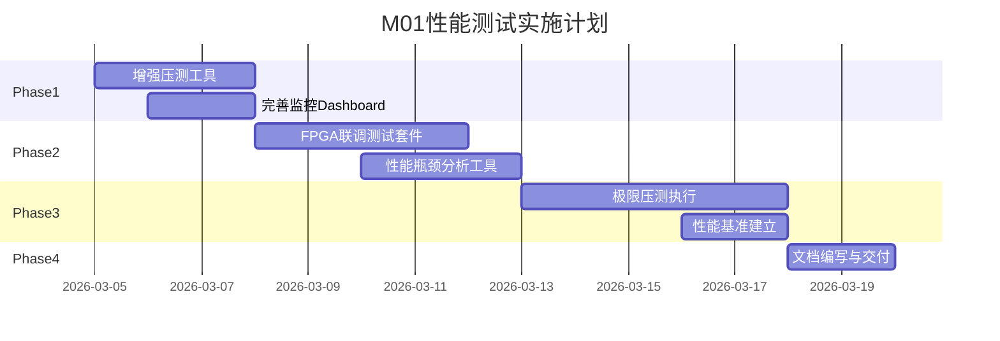

## 🎯 M01数据接收模块性能极限测试与可视化任务书

> 使用说明：本文是规划文档，不是代码实况文档。生成任务、评估差距或交给 AI 续写时，必须同时对照 `src/m01_receiver/app_init.cpp`、`src/m01_receiver/app_run.cpp`、`src/m01_receiver/pipeline/rx_stage.cpp` 和 `docs/项目源代码文档/m01_receiver.md`；若本文与代码不一致，以代码为准。

### 一、背景与目标

**当前状态**：
- ✅ M01接收模块已集成到三面阵雷达系统
- ✅ 三路独立10GbE链路（理论峰值：3×1.25 GB/s = 3.75 GB/s）
- ✅ 三线程分立架构（CPU 16/17/18, NUMA Node1）
- ✅ 当前代码主链路为 `UdpReceiver -> RxStage -> SPSC<RxEnvelope> -> processing thread -> Dispatcher -> Reassembler -> Reorderer -> DeliveryInterface`
- ✅ 基础压测工具和监控框架已具备，但指标覆盖和可视化面板仍有扩展空间

**核心目标**：
1. **找到数据接收模块的极限吞吐能力**（pps、Mbps、CPI处理率）
2. **与FPGA进行数据面联合调试**，验证协议V3.1的完整性
3. **建立性能基准与瓶颈分析体系**，为后续优化提供数据支撑

---

### 二、任务分解（7个子任务）

#### **任务1：增强压测工具套件** 🔧

**目标**：建立完整的性能基准测试能力

**交付物**：
1. **扩展 stress_test.cpp**：
   - 添加三路并发满载测试场景
   - 支持可配置的数据率梯度测试（50% → 75% → 100% → 110%）
   - 增加丢包率、队列深度、重组超时等关键指标采集

2. **新建 `benches/capacity_test.cpp`**：
   ```cpp
   // 关键测试场景：
   - 单路极限测试（找到单Receiver瓶颈）
   - 双路并发测试（验证NUMA亲和性）
   - 三路满载测试（找到系统总体上限）
   - 阶梯式压力测试（自动二分查找极限数据率）
   ```

3. **性能指标采集**：
   - Packets per second (pps)
   - Throughput (Mbps)
   - CPI reassembly success rate
   - Queue depth (P50/P99/Max)
   - CPU utilization per thread
   - Memory bandwidth (numastat)

**验收标准**：
- 单次测试自动输出JSON格式报告

---

#### **任务2：完善实时监控Dashboard** 📊

**目标**：让性能瓶颈"看得见"

**交付物**：
1. **扩展 grafana-dashboard.json**，新增面板：
   ```
   Row 1: 流量概览
   - Packets Received Rate (pps) - 已有
   - Bytes Received Rate (MB/s) - 已有
   - [新增] Per-Array Throughput (3路独立曲线)
   - [新增] Queue Depth Heatmap (SPSC队列深度)

   Row 2: 协议处理
   - [新增] Reassembly Success/Timeout Rate
   - [新增] Reorder Window Utilization
   - [新增] Fragment Loss Rate

   Row 3: 资源使用
   - [新增] CPU Usage per Receiver Thread
   - [新增] Memory Pool Allocation Rate
   - [新增] NUMA Cross-Node Access %

   Row 4: 异常告警
   - [新增] Drop Count by Reason (堆栈图)
   - [新增] CRC Error Rate
   - [新增] Protocol Violation Count
   ```

2. **Prometheus指标补充**：
   在 monitoring 中增加：
   ```cpp
   - receiver_cpi_processing_duration_seconds (histogram)
   - receiver_queue_depth_current (gauge, per array)
   - receiver_numa_cross_accesses_total (counter)
   - receiver_reassembly_timeout_total (counter)
   ```

**验收标准**：
- Grafana实时刷新（5s间隔）
- 所有指标有明确的告警阈值（黄/红线）

---

#### **任务3：建立FPGA联调测试套件** 🔗

**目标**：验证与FPGA的数据面对接完整性

**交付物**：
1. **新建 `tests/integration_tests_fpga.cpp`**：
   ```cpp
   // 测试场景：
   - FPGA发送标准CPI → 验证协议解析正确性
   - FPGA发送分片CPI → 验证重组逻辑
   - FPGA发送乱序包 → 验证Reorderer
   - FPGA发送Heartbeat → 验证控制面交互
   - FPGA模拟丢包 → 验证超时与降级策略
   ```

2. **pcap_replay工具增强**：
   扩展 pcap_replay.cpp：
   ```cpp
   - 支持可配置发送速率（--rate 1000000 pps）
   - 支持按时间戳精确回放（--timing-mode realtime）
   - 支持三路并发回放（--array-faces 1,2,3）
   - 支持故障注入（--inject-errors drop_rate=0.01）
   ```

3. **标准测试pcap集**：
   在 测试 下建立：
   ```
   - normal_traffic_1min.pcap（正常流量基线）
   - peak_load_10s.pcap（峰值负载）
   - fragmented_cpis.pcap（大量分片场景）
   - protocol_edge_cases.pcap（协议边界条件）
   ```

**验收标准**：
- 与FPGA完成一次完整闭环测试
- 所有测试pcap自动验证通过

---

#### **任务4：性能瓶颈自动分析工具** 🔍

**目标**：快速定位系统瓶颈在哪个环节

**交付物**：
1. **新建 `tools/bottleneck_analyzer.py`**：
   ```python
   # 输入：Prometheus metrics snapshot或日志文件
   # 输出：瓶颈诊断报告

   分析维度：
   - CPU瓶颈：哪个线程占用过高
   - 内存瓶颈：NUMA跨节点访问比例
   - 网络瓶颈：丢包、乱序、队列溢出
   - 队列瓶颈：哪个SPSC队列深度异常
   - GPU瓶颈：（预留，当前不关注）
   ```

2. **自动生成性能报告**：
   ```markdown
   ## Performance Test Report
   Test Date: 2026-03-04
   Duration: 60s

   ### Summary
   - Max Throughput Achieved: 2.8 Gbps (93% of 3 Gbps)
   - Bottleneck: Receiver_2 thread (CPU 17 usage 97%)
   - Drop Rate: 0.02%

   ### Recommendations
   1. Consider binding Receiver_2 to CPU 19 (reserved core)
   2. Increase SPSC queue depth from 64 to 128
   ```

**验收标准**：
- 一键生成HTML格式报告
- 报告包含至少5个可操作的优化建议

---

#### **任务5：极限压测方案设计** 💨

**目标**：找到系统的真实承受上限

**测试方案**：

| 测试阶段 | 负载配置 | 持续时间 | 观测指标 | 成功标准 |
|---------|---------|---------|---------|---------|
| **Phase 1** | 单路满载（1.25 Gbps） | 5min | Drop rate < 0.01% | CPU < 80% |
| **Phase 2** | 双路满载（2.5 Gbps） | 5min | Drop rate < 0.05% | CPU < 90% |
| **Phase 3** | 三路满载（3.75 Gbps） | 5min | Drop rate < 0.1% | 系统不进Fault |
| **Phase 4** | 三路超载（4.5 Gbps） | 2min | 观测降级行为 | 进Degraded但不崩溃 |
| **Phase 5** | 长时间稳定性（90% Load） | 24h | 无内存泄漏 | Drop rate稳定 |

**压测环境**：
```yaml
硬件：飞腾S5000C + 10GbE网卡
网络：三路独立回放或FPGA实际发送
监控：Grafana实时观测 + 每分钟快照
```

**交付物**：
- 压测脚本（`tools/run_capacity_tests.sh`）
- 自动化测试报告
- 极限能力清单（markdown文档）

---

#### **任务6：建立性能回归基准** 📈

**目标**：后续优化有对比基准

**交付物**：
1. **Baseline性能档案**：
   文件：`docs/performance_baseline_v0.1.md`
   ```markdown
   ## M01 Receiver Baseline (v0.1.0)

   ### Test Environment
   - CPU: Phytium S5000C
   - Memory: 64GB DDR4
   - Network: 3×10GbE
   - OS: Kylin V10

   ### Single Array Performance
   - Max PPS: 1.2M pps
   - Max Throughput: 9.6 Gbps (wire-speed)
   - CPU Usage: 75% @ CPU16
   - Drop Rate: 0.008%

   ### Three Arrays Concurrent
   - Max PPS: 3.0M pps
   - Max Throughput: 2.8 Gbps (93% of 3 Gbps)
   - Bottleneck: CPU17 (97% usage)
   - Drop Rate: 0.02%
   ```

2. **性能回归测试**：
   集成到CI/CD：
   ```bash
   # 每次代码提交自动运行
   ctest -R regression_throughput
   # 若吞吐下降>5%，自动标记为FAIL
   ```

---

#### **任务7：文档与知识沉淀** 📚

**交付物**：
1. **性能调优指南**：`docs/performance_tuning_guide.md`
   - NUMA亲和性最佳实践
   - 队列大小调优方法
   - 网卡参数优化（RSS、中断亲和性）

2. **FPGA联调手册**：`docs/fpga_integration_guide.md`
   - 接口对接清单
   - 常见问题排查
   - 测试用例库

3. **性能测试报告模板**：`docs/templates/performance_report.md`

---

### 三、实施路线图 🗓️



**关键里程碑**：
- **Week 1（3/5-3/8）**：工具准备完毕
- **Week 2（3/11-3/15）**：完成FPGA联调
- **Week 3（3/18-3/20）**：输出性能极限报告

---

### 四、风险与应对

| 风险项 | 影响 | 应对措施 |
|-------|------|---------|
| FPGA硬件不稳定 | 无法完成联调 | 准备pcap_replay作为回退方案 |
| 网卡驱动问题 | 性能测不准 | 提前验证i40e驱动版本 |
| NUMA配置错误 | 跨节点访问高 | 用numastat实时监控 |
| CPU温度过高 | 性能不稳定 | 增加散热监控 |

---

### 五、预期成果

完成后你将获得：
1. ✅ **清晰的性能极限数据**：知道系统能承受多大数据率
2. ✅ **可视化监控体系**：实时看到各环节性能状态
3. ✅ **自动化测试能力**：快速验证后续优化效果
4. ✅ **FPGA联调经验**：为后续全系统集成打基础

---

**下一步行动**：请确认是否开始执行**任务1**（增强压测工具），我会协助你编写代码并集成到现有框架中。
