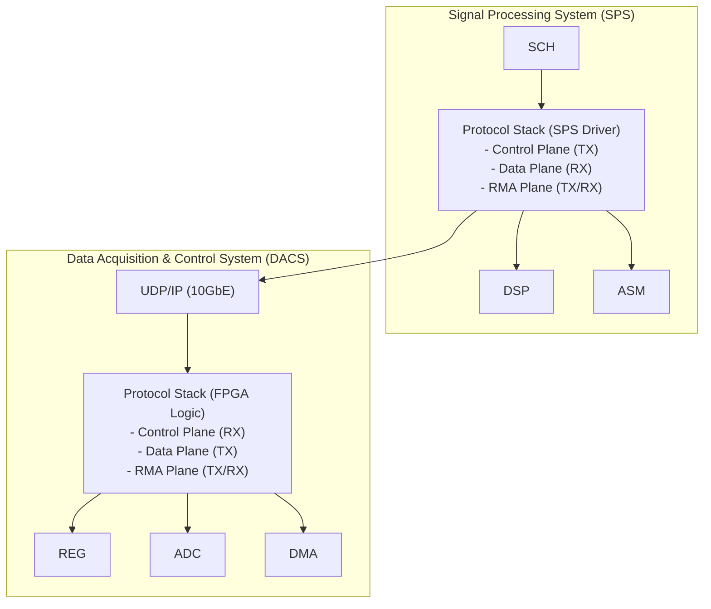
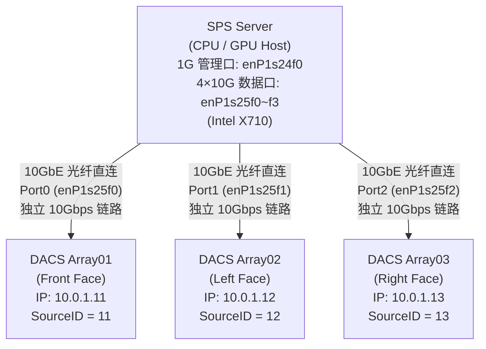
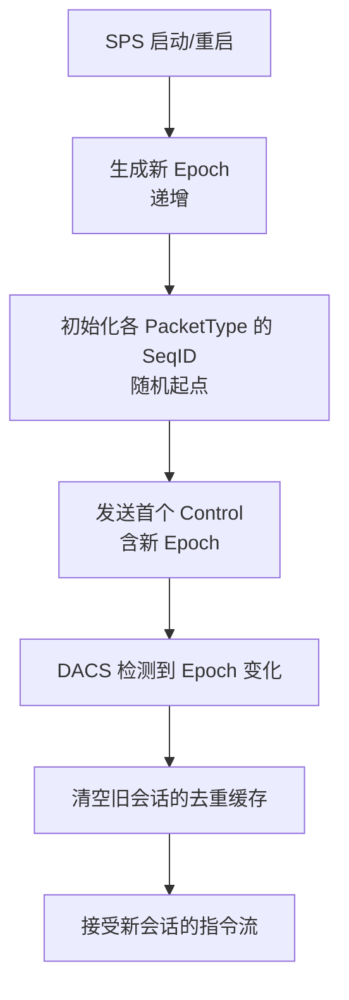
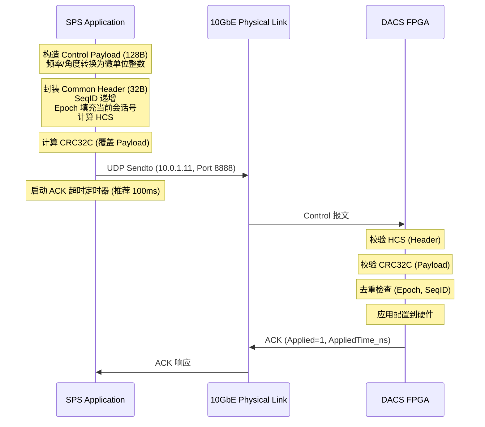
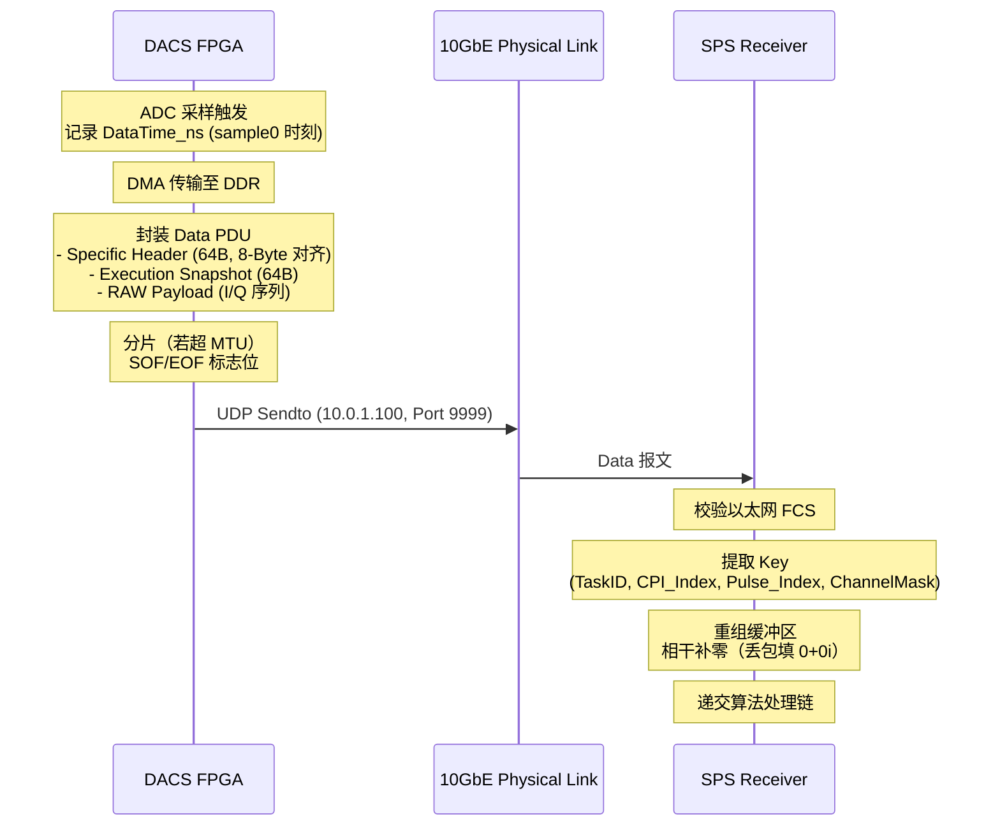

# SECTION 2: 系统概述 (System Overview)

## 2.1 系统架构 (System Architecture)

### 2.1.1 逻辑架构

本协议定义的通信系统采用**非对称主从架构**，明确区分控制端与被控端的职责：



**关键设计原则**：

1. **单向控制流**：SPS 是唯一的控制发起方，DACS 仅响应（ACK）或按配置执行
2. **数据单向推送**：DACS 主动推送采集数据，SPS 无需轮询
3. **维护双向对称**：RMA 维护通道支持双向请求/响应，但以 Token 确保事务完整性

---

### 2.1.2 物理拓扑

**标准部署拓扑（三阵面配置，独立端口直连）**：



**拓扑约束与假设（CRITICAL）**：

- **三阵面独立端口接入**：每个 DACS 阵面通过独立的 10GbE 物理端口（Port 0/1/2）直连至服务器
- **无共享链路**：协议数据**不得**多个阵面共享单一物理端口或汇聚到上联链路
- **全双工直连**：网络拓扑采用光纤直连（无交换机），每条链路支持全双工 10 Gbps（发送 + 接收）
- **备选方案**：服务器若仅有 2 个万兆口，可采用"交换机模式"汇聚多阵面，但**必须明确**在拓扑文档中说明，且需确保非阻塞背板与一致 MTU

> 说明：以上 IP 仅为示例。直连部署下建议每个 DACS 使用独立点对点子网（例如 /30），以减少 L2 广播域与 ARP 干扰。

**网络参数约束**：

| **参数** | **值** | **约束级别** |
|---------|--------|-------------|
| 物理接口 | 10GBASE-SR/LR | 必须 |
| 链路速率 | 10 Gbps | 必须 |
| 双工模式 | Full-Duplex | 必须 |
| 流控 | IEEE 802.3x (PAUSE) | 推荐启用 |
| Jumbo Frame | 9000 Bytes | 推荐启用（必须支持 MTU 1500 降级） |
| 服务器万兆网卡 | Intel X710 4×10GbE SFP+（驱动 `i40e`） | 必须匹配 |
| Linux 接口名 | `enP1s25f0` ~ `enP1s25f3` | 推荐对齐 |
| Ring Buffer | RX/TX = 4096（硬件上限） | 推荐（性能基线） |
| NUMA 绑定 | 10G NIC 属于 Node 1（CPU 16-31） | 推荐（确定性） |
| VLAN | （直连场景可省略）如需隔离则使用 VLAN | 可选 |
| 组播/IGMP Snooping | 仅在存在交换机时考虑关闭 | 条件可选 |

> 服务器侧万兆网卡型号、接口命名、NUMA 亲和性与 Ring Buffer 等“可验收”的基线参数，详见：[[202601160034_Baseline_TowerGuard_Infrastructure_服务器环境基线 (V1.0)]]。

---

### 2.1.3 设备标识体系

**逻辑 ID 分配表（SSOT）**：

| **设备角色** | **SourceID** | **DestID（作为目标）** | **IP 示例** | **备注** |
|-------------|-------------|---------------------|-----------|---------|
| SPS 主控 | `0x01` | `0x01` | 10.0.1.100 | 控制发起方 |
| DACS 广播地址 | - | `0x10` | - | 逻辑广播（非 IP 广播） |
| DACS 阵面 01 | `0x11` | `0x11` | 10.0.1.11 | 前向阵面 |
| DACS 阵面 02 | `0x12` | `0x12` | 10.0.1.12 | 左侧阵面 |
| DACS 阵面 03 | `0x13` | `0x13` | 10.0.1.13 | 右侧阵面 |
| 测试设备 | `0xF0-0xFE` | `0xF0-0xFE` | - | 仅用于实验室调试 |
| 保留 | `0xFF` | `0xFF` | - | 禁止使用 |

**设计说明**：

- **IP 地址解耦**：设备识别完全依赖 `SourceID/DestID`，IP 地址仅用于 UDP 路由
- **广播语义**：`DestID=0x10` 表示 " 所有 DACS 设备 "，接收端通过 `DestID` 过滤而非依赖 IP 广播
- **扩展性**：`0x14-0xEF` 保留用于未来扩展（例如增加阵面数量）

<div style="page-break-after: always;"></div>

## 2.2 通信模型 (Communication Model)

### 2.2.1 平面分离架构

协议采用**三平面分离**设计，每个平面具有独立的语义与可靠性策略：

```txt
┌─────────────────────────────────────────────────────────────┐
│  Control Plane (控制平面)                                    │
├─────────────────────────────────────────────────────────────┤
│  方向: SPS → DACS (单向)                                     │
│  报文: Control (0x01) + ACK (0x02)                          │
│  可靠性: CRC32C + ACK 闭环 + 超时重传                        │
│  语义: 配置下发（波形/指向/增益/PRF/采样窗口等）               │
└─────────────────────────────────────────────────────────────┘

┌─────────────────────────────────────────────────────────────┐
│  Data Plane (数据平面)                                       │
├─────────────────────────────────────────────────────────────┤
│  方向: DACS → SPS (单向)                                     │
│  报文: Data (0x03)                                          │
│  可靠性: 以太网 FCS + 应用层补零策略                          │
│  语义: 原始 I/Q 回波 + 元数据 (TaskID/Timestamp/Channel)     │
└─────────────────────────────────────────────────────────────┘

┌─────────────────────────────────────────────────────────────┐
│  Telemetry Plane (遥测平面)                                  │
├─────────────────────────────────────────────────────────────┤
│  方向: DACS → SPS (单向)                                     │
│  报文: Heartbeat (0x04)                                     │
│  可靠性: 尽力传输（允许丢失）                                 │
│  语义: 健康状态/时统锁定/互锁状态/温度等                       │
└─────────────────────────────────────────────────────────────┘

┌─────────────────────────────────────────────────────────────┐
│  Maintenance Plane (维护平面)                                │
├─────────────────────────────────────────────────────────────┤
│  方向: SPS ↔ DACS (双向)                                     │
│  报文: RMA (0xFF)                                           │
│  可靠性: CRC32C + Token 事务闭环                             │
│  语义: 寄存器/DDR/Flash 读写 + 固件升级                       │
└─────────────────────────────────────────────────────────────┘
```

---

### 2.2.2 报文类型枚举（SSOT）

| **PacketType** | **名称** | **方向** | **可靠性机制** | **典型频率** |
|---------------|---------|---------|---------------|-------------|
| `0x01` | Control | SPS → DACS | CRC32C + ScheduleApplyAck 闭环 | 按需（秒级周期） |
| `0x02` | ScheduleApplyAck | DACS → SPS | CRC32C | 响应 Control（秒级） |
| `0x03` | Data | DACS → SPS | 以太网 FCS | 高频（微秒级） |
| `0x04` | Heartbeat | DACS → SPS | CRC32C | 1 Hz（推荐） |
| `0xFF` | RMA | SPS ↔ DACS | CRC32C + Session 闭环 | 低频（秒级） |

**未使用范围**：`0x05-0xFE` 保留用于未来扩展。

**关键语义变更（v3.1）**：

- **Control 改为波束安排表周期下发**：一个 Control 报文包含一秒周期内的所有波束参数集合，而非单个波束指令
- **ScheduleApplyAck 改为周期级应答**：DACS 以秒周期为单位回报整个波束安排表的执行结果，而非逐个波束应答
- **CRC32C 覆盖策略**：各 PacketType 独立的 CRC32C（通用头不含 CRC，而由载荷 CRC32C 负责完整性）

---

### 2.2.3 会话管理

**会话生命周期**：



**Epoch 使用规则（必须）**：

1. **递增时机**：SPS 每次启动/链路重建时递增 `ControlEpoch`（之前称为"Epoch"或"SessionCode"，v3.1 统一为`ControlEpoch`）
2. **去重边界**：DACS 必须按 `(ControlEpoch, SourceID, SequenceNumber)` 三元组去重（Control 幂等键）
3. **纪元变化处理**：收到新 ControlEpoch 后，DACS 必须清空旧纪元的缓存，并拒绝执行属于旧纪元的 Control 指令

**Control 幂等与重传冻结**：

- **重传参数（冻结）**：`RTO_MS = 2500 ms`，`MAX_RETRY = 3`
- **重传一致性（冻结）**：同一 Control 的重传必须保持 Common Header 与 Payload 完全一致（特别是 SequenceNumber 不变）
- **DupCmd 幂等（冻结）**：DACS 对同键重复的 Control 不得重复执行，仅允许复用之前的执行结果

<div style="page-break-after: always;"></div>

## 2.3 设计原则 (Design Principles)

### 2.3.1 物理量量化编码（Micro-Unit Integer Philosophy）

**核心原则**：协议层禁止使用浮点数，所有物理量必须以整数量化单位表示。

**物理量量化表（SSOT）**：

| **物理量** | **量化单位** | **编码类型** | **量化精度** | **有效范围** | **典型应用字段** |
|-----------|----------|---------|---------|---------|-------------|
| **角度（方位/俯仰）** | 0.0025° | `int16` | 千分之二点五度 | -65° ~ +65° | 天线方位指向、天线俯仰指向 |
| **角度（姿态）** | 0.001° | `int32` | 千分之一度 | -90° ~ +90° | 倾角传感器X/Y轴 |
| **角度（航向）** | 0.001° | `uint32` | 千分之一度 | 0° ~ 360° | 航向角 |
| **经纬度** | 0.0000001° | `int32` | 十分之一微度 | 经度±180°/纬度±90° | 北斗经度、北斗纬度 |
| **高度** | 0.001 m | `int32` | 1毫米 | ±2147483 m | 北斗高程 |
| **频率（工作频点）** | 10 MHz | `uint8` | 十兆赫兹 | 15.5~16.5 GHz | 工作频率（频点编号） |
| **增益** | 0.5 dB | `uint8` | 半分贝 | 0~62.5 dB | 手动增益控制（单区） |
| **带宽** | 0.5 MHz | `uint8` | 半兆赫兹 | 0~127.5 MHz | 信号带宽（单码） |
| **脉宽** | 0.5 μs | `uint8` | 半微秒 | 0~127.5 μs | 脉冲宽度（单码） |
| **周期** | 1 μs | `uint8` | 微秒 | 0~255 μs | 脉冲周期（单码） |
| **时延** | 0.01 μs | `uint16` | 百分之一微秒 | 0~655.35 μs | 模拟目标距离 |
| **温度** | 0.1 ℃ | `int16` | 十分之一摄氏度 | -40.0~+125.0 ℃ | 核心温度 |
| **时间偏差** | 1 ns | `int32` | 纳秒 | ±2.147 秒 | 时统偏差 |
| **数据率** | 1 Mbps | `uint8` | 兆比特每秒 | 1~255 Mbps | 数据传输速率 |

**量化关系通用公式**：

```txt
实际物理量 = 编码值 × 量化单位
编码值 = round(实际物理量 / 量化单位)
```

**示例**：
- 天线方位指向 = 10000 × 0.0025° = 25°
- 手动增益控制 = 40 × 0.5 dB = 20 dB
- 核心温度 = 725 × 0.1 ℃ = 72.5 ℃

---

### 2.3.2 混合对齐策略与波束安排周期

**波束安排周期与秒脉冲同步**：

控制平面采用**波束安排周期**（通常为1秒）作为传输单位，而非单个波束指令。在一个周期内，SPS 下发该周期内所有波束参数集合（波束安排表），而 DACS 在秒脉冲边界（UTC/PTP 同步时刻）进行波束切换，确保多阵面的射频参数同步。

**设计权衡**：

| **平面** | **对齐策略** | **理由** |
|---------|-------------|---------|
| **控制平面** | 变长、波束项 4-Byte 对齐 | 单周期多波束紧凑编码；表头固定12B，波束项固定32B |
| **数据平面** | 4-Byte 自然对齐 | 高速 DMA 传输，匹配 Cache Line（64B） |

**实现约束（必须）**：

- Control 载荷采用"表头(12B) + 波束项(N×32B) + CRC32C(4B)"的变长结构
- Data Specific Header 扩展至 40B，以 4-Byte 自然对齐
- Execution Snapshot 仅在尾包中携带，占 40B，确保数据重组性能

---

## 2.4 协议栈映射 (Protocol Stack Mapping)

### 2.4.1 OSI 模型对照

```txt
┌─────────────────────────────────────────────────────────────┐
│  应用层 (Application Layer)                                 │
│  - 雷达算法处理链                                            │
│  - 任务调度逻辑                                              │
└────────────────────┬────────────────────────────────────────┘
                     │
┌────────────────────▼────────────────────────────────────────┐
│  表示层 (Presentation Layer)                                │
│  - 物理量 ↔ 微单位整数转换                                   │
│  - 大小端转换（Little-Endian）                               │
└────────────────────┬────────────────────────────────────────┘
                     │
┌────────────────────▼────────────────────────────────────────┐
│  会话层 (Session Layer)                                     │
│  - Epoch 会话管理                                            │
│  - TaskID 任务绑定                                           │
└────────────────────┬────────────────────────────────────────┘
                     │
┌────────────────────▼────────────────────────────────────────┐
│  传输层 (Transport Layer)                                   │
│  - UDP/IP (RFC 768)                      ◄─ 本协议起点      │
│  - 应用层分片（禁止 IP 分片）                                 │
└────────────────────┬────────────────────────────────────────┘
                     │
┌────────────────────▼────────────────────────────────────────┐
│  网络层 (Network Layer)                                     │
│  - IPv4 (RFC 791)                                           │
└────────────────────┬────────────────────────────────────────┘
                     │
┌────────────────────▼────────────────────────────────────────┐
│  数据链路层 (Data Link Layer)                                │
│  - Ethernet II (IEEE 802.3)                                 │
│  - FCS (Frame Check Sequence)                               │
└────────────────────┬────────────────────────────────────────┘
                     │
┌────────────────────▼────────────────────────────────────────┐
│  物理层 (Physical Layer)                                    │
│  - 10GBASE-SR/LR                                            │
└─────────────────────────────────────────────────────────────┘
```

---

### 2.4.2 端到端数据流

**Control 指令下发流程**：



**Data 回波上传流程**：



<div style="page-break-after: always;"></div>

## 2.5 性能指标与约束

### 2.5.1 带宽预算 (Bandwidth Budget - Revised)

**数据平面带宽定量设计**：

本节基于实际工作参数进行带宽占用评估。计算分为“有效载荷（Payload）”与“协议行速率（Line Rate）”两个维度。

#### 1. 核心参数输入

- **采样频率 ($F_s$)**：$25\text{ MHz}$。
- **通道规模 ($C$)**：$4 \text{ Channels}$（$\Sigma, \Delta_{Az}, \Delta_{El}, Aux$）。
- **样点规格**：复数采样（I/Q），$16 \text{-bit}$（2 字节/分量）。
- **任务占空比 ($\eta_{duty}$)**：$25\%$ \[指在 $100\%$ 脉冲重复周期内，实际产生有效回波的时间比例]。

#### 2. 有效负载速率计算 ($R_{payload}$)

有效载荷是指不含任何网络开销的原始雷达数据流：

$$
R_{payload} = F_s \times C \times 2(I/Q) \times 2(\text{Bytes}) \times \eta_{duty}
$$

$$
R_{payload} = 25\text{MHz} \times 4 \times 2 \times 2 \times 0.25 = \mathbf{100 \text{ MB/s}} = \mathbf{800 \text{ Mbps}}
$$

#### 3. 协议开销与行速率分析 ($R_{line}$)

根据 ICD V3.1 规范（`ProtocolVersion=0x31`），每个 Data 报文包含固定前缀（Common Header 32B + Data Specific Header 40B），尾包额外含 Execution Snapshot 40B。物理链路为 **10 Gbps 以太网**。

|**指标**|**标准帧 (MTU 1500)**|**巨型帧 (MTU 9000)**|**备注**|
|---|---|---|---|
|**单包有效负载**|$1,344 \text{ Bytes}$|约 $8,800 \text{ Bytes}$||
|**传输效率 ($\eta_{link}$)**|**$\sim 87.4\%$**|**$\sim 97.8\%$**|包含 UDP/IP/MAC 头|
|**平均行速率 ($R_{line}$)**|**$915.3 \text{ Mbps}$**|**$818.0 \text{ Mbps}$**|$R_{payload} / \eta_{link}$|
|**10G 链路利用率**|**$9.15\%$**|**$8.18\%$**|平均带宽占用|
|**瞬时峰值压强**|**$3.66 \text{ Gbps}$**|**$3.27 \text{ Gbps}$**|脉冲存续期间的实时速率|

#### 4. 结论与两级预算模型（CRITICAL）

**拓扑前提**（必须明确）：

本带宽预算基于以下拓扑假设成立：
- **三阵面采用独立端口直连**：阵面 1/2/3 分别接入 Port 0/1/2（每条链路 10 Gbps 全双工）
- **无链路汇聚**：协议数据不在上联链路汇聚，每条 DACS→SPS 链路为独立物理连接
- **若采用交换机或多阵面共享单端口，本预算需重新评估**

**第一级：单端口预算（per-port，最关键）**：

单个阵面在独立 10 Gbps 链路上的传输情况：

| 指标 | 值 | 说明 |
|------|-----|------|
| 单阵面平均负载 | 800 Mbps | `100 MB/s × 8` |
| 单阵面瞬时峰值 | 3.66 Gbps (MTU1500) 或 3.27 Gbps (MTU9000) | 脉冲存续期间的实时压强 |
| 单端口线速能力 | 10 Gbps | 物理链路上限 |
| **单端口利用率** | **9.15%** (MTU1500) 或 **8.18%** (MTU9000) | 平均占用 |
| **单端口冗余** | **> 10 倍** | 10 Gbps ÷ 0.915 Gbps |

**结论**：单个阵面的瞬时峰值（~3.6 Gbps）**远低于**单端口线速（10 Gbps），因此单端口**不会被打满**。

**第二级：系统级预算（多端口叠加，参考用）**：

三阵面同时全速运行时的系统级观感（用于网络规划）：

| 指标 | 值 | 说明 |
|------|-----|------|
| 三阵面平均叠加 | 2.4 Gbps | 3 × 800 Mbps |
| 三阵面瞬时峰值 | ~10.98 Gbps (MTU1500) 或 ~9.81 Gbps (MTU9000) | 3 × 单阵面峰值 |
| 服务器接收侧聚合能力 | 40 Gbps | Intel X710 理论上限（4×10G 全双工） |
| **系统级冗余** | **~4 倍** | 40 Gbps ÷ 10 Gbps |

**重要说明**：第二级预算的意义仅在于"在规划多阵面部署时了解系统级流量"，**不代表**需要单条 40 Gbps 或更高的上联链路。因为三个阵面各自使用独立 10 Gbps 端口，**逻辑上**不存在"链路汇聚"的需要。

**工程约束（必须）**：

1. **单端口不拥塞**：单个 DACS 的瞬时峰值（~3.6 Gbps）< 单端口线速（10 Gbps）✓
2. **禁止多阵面共享单端口**：如确需共享，必须明确重新计算后的拓扑预算
3. **禁止在协议文档中隐含"上联汇聚"假设**：若使用交换机，应在网络配置文档中明确说明，本协议文档仅针对直连拓扑有效
4. **链路冗余/备份**：若后续需要链路冗余，建议采用主备切换（非负载均衡），以避免包乱序

---

### 2.5.2 延迟约束

| **指标** | **目标值** | **测量点** |
|---------|-----------|-----------|
| Control 生效延迟 | < 1 ms | SPS 发送 → DACS 应用 |
| ACK 回复延迟 | < 100 μs | DACS 应用 → SPS 接收 |
| Data 上传延迟 | < 10 μs | ADC 采样 → UDP 发送 |
| 端到端延迟 | < 5 ms | 采样 → 算法接收 |

---

### 2.5.3 丢包容忍

| **平面** | **丢包率** | **处理策略** |
|---------|-----------|-------------|
| Control | 0%（通过重传） | 超时重传，最多 3 次 |
| Data | < 0.1% | 相干补零，不重传 |
| Heartbeat | < 10% | 忽略丢失 |
| RMA | 0%（通过重传） | Token 超时重传 |

<div style="page-break-after: always;"></div>
