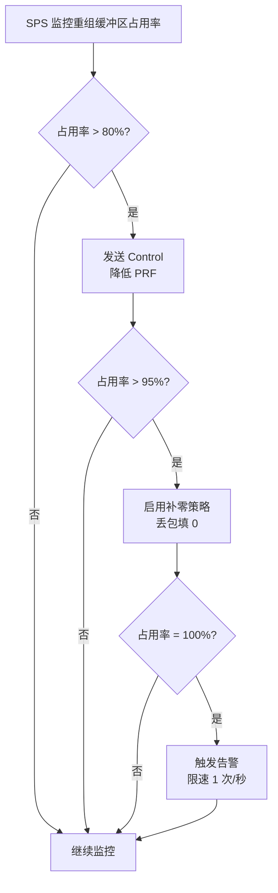
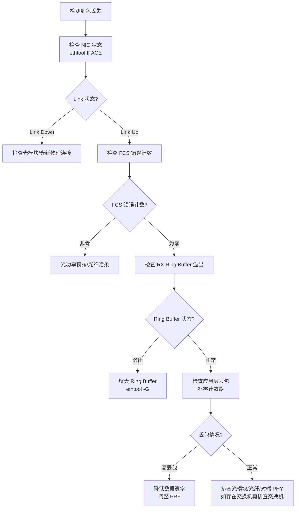

---
tags:
aliases:
  - "SECTION 3: 物理层与数据链路层 (Physical & Data Link Layer)"
date created: 星期三, 一月 28日 2026, 12:03:19 中午
date modified: 星期三, 一月 28日 2026, 12:03:29 中午
---

# SECTION 3: 物理层与数据链路层 (Physical & Data Link Layer)

## 3.1 物理接口规范 (Physical Interface Specification)

### 3.1.1 接口标准

本协议**必须**基于 IEEE 802.3 以太网标准实现，具体技术规格如下：

| **参数** | **规格** | **约束级别** | **备注** |
|---------|---------|-------------|---------|
| **物理标准** | 10GBASE-SR / 10GBASE-LR | 必须 | SR=短距离多模光纤，LR=长距离单模光纤 |
| **链路速率** | 10.3125 Gbps（物理层） | 必须 | 有效吞吐 10 Gbps（扣除 64b/66b 编码开销约 3%） |
| **接口类型** | SFP+ 模块 | 必须 | 支持热插拔 |
| **双工模式** | Full-Duplex | 必须 | 禁止半双工 |
| **传输介质** | OM3/OM4 多模光纤（SR）<br>OS2 单模光纤（LR） | 必须 | SR 最大 300m，LR 最大 10km |
| **波长** | 850 nm（SR）/ 1310 nm（LR） | 必须 | - |

---

### 3.1.2 端口分配与拓扑约束

**标准配置（三阵面系统，直连）**：

```txt
┌──────────────────────────────────────────────────────────────┐
│  SPS Server                                                  │
├──────────────────────────────────────────────────────────────┤
│  enP1s24f0: 1GbE 管理网络（Out-of-Scope，不承载协议数据）      │
│  enP1s25f0: 10GbE ↔ DACS 01（直连光纤）                        │
│  enP1s25f1: 10GbE ↔ DACS 02（直连光纤）                        │
│  enP1s25f2: 10GbE ↔ DACS 03（直连光纤）                        │
│  enP1s25f3: 预留（第4阵面或链路冗余）                          │
└──────────────────────────────────────────────────────────────┘
    │                │                 │
    │10GbE           │10GbE            │10GbE
┌────▼──────┐   ┌────▼──────┐    ┌────▼────────┐
│ DACS 01   │   │ DACS 02   │    │ DACS 03      │
│ (Front)   │   │ (Left)    │    │ (Right)      │
└───────────┘   └───────────┘    └──────────────┘
```

**端口映射表（SSOT）**：

| **报文类型** | **方向** | **源端口** | **目标端口** | **说明** |
|-----------|---------|---------|---------|---------|
| 控制指令 (0x01) | SPS → DACS | 随机(>1024) | 8888 | Control 下发 |
| 周期应答 (0x02) | DACS → SPS | 8888 | 回复至控制指令源端口 | ScheduleApplyAck 回执 |
| 回波数据 (0x03) | DACS → SPS | 9999 | 9999 | Data 上传（复用端口） |
| 心跳状态 (0x04) | DACS → SPS | 9999 | 9999 | Heartbeat（复用端口）|
| 远程维护 (0xFF) | SPS ↔ DACS | 7777 | 7777 | RMA 维护通道 |

**QoS 机制（Data/Heartbeat 同端口复用，冻结）**：

当 `0x03(Data)` 与 `0x04(Heartbeat)` 复用 UDP/9999 时，为保证在拥塞/洪峰下的可用性，QoS 冻结如下：

1. **DSCP 标记（冻结）**
   - Heartbeat：发送端必须设置 `DSCP = CS6`（优先级）
   - Data：发送端必须设置 `DSCP = CS0`（低优先级）
   - 若网络侧清除/重写 DSCP，接收端仍需采用软件侧保底机制

2. **发送端令牌桶/节流（冻结）**
   - 发送端对 Heartbeat 采用令牌桶策略，确保在 Data 洪峰下仍能按配置心跳周期发送
   - 默认心跳频率 = 1 Hz（见 Heartbeat 定义）

3. **接收端优先队列（冻结）**
   - 接收端按 `PacketType` 分类：Heartbeat 进入高优先级队列，Data 进入普通队列
   - Heartbeat 优先处理，确保健康状态检测不被 Data 洪峰阻塞

**约束（必须）**：

1. **专用链路**：协议数据（Control/Data/RMA/Telemetry）**不得**与管理流量（SSH/SNMP/NTP 等）共享物理接口
2. **直连默认**：本项目服务器侧采用 Intel X710 万兆光口通过光纤与 DACS **直连（无交换机）**，以降低延迟、抖动与故障点
3. **交换机为可选方案**：仅当阵面数量超过服务器万兆口数量或实验室多接入需求时才引入；若引入，必须确保非阻塞背板与一致 MTU
4. **冗余设计**：若需链路冗余，必须采用主备切换（非负载均衡），避免包乱序

---

### 3.1.3 光模块兼容性要求

**推荐型号**（兼容 MSA 标准）：

| **类型** | **典型型号** | **适用场景** | **功耗** |
|---------|-------------|-------------|---------|
| 10GBASE-SR | Finisar FTLX8571D3BCL | 机房内短距（< 100m） | < 1.5W |
| 10GBASE-LR | Finisar FTLX1471D3BCL | 跨建筑长距（< 10km） | < 2W |

**验收测试（必须）**：

- **光功率**：发送功率 -7.3 ~ -1 dBm，接收灵敏度 < -14.4 dBm
- **误码率**：BER < $10^{-12}$（在 PRBS31 测试下）
- **DDM（Digital Diagnostics Monitoring）**：必须支持 SFF-8472 标准，实时监控温度/电压/光功率

---

## 3.2 数据链路层要求 (Data Link Layer Requirements)

### 3.2.1 以太网帧格式

**标准 Ethernet II 帧结构**：

```txt
 0                   1                   2                   3
 0 1 2 3 4 5 6 7 8 9 0 1 2 3 4 5 6 7 8 9 0 1 2 3 4 5 6 7 8 9 0 1
+-+-+-+-+-+-+-+-+-+-+-+-+-+-+-+-+-+-+-+-+-+-+-+-+-+-+-+-+-+-+-+-+
|                    Destination MAC Address                    |
|                    (6 Bytes)                                  |
+-+-+-+-+-+-+-+-+-+-+-+-+-+-+-+-+-+-+-+-+-+-+-+-+-+-+-+-+-+-+-+-+
|                       Source MAC Address                      |
|                    (6 Bytes)                                  |
+-+-+-+-+-+-+-+-+-+-+-+-+-+-+-+-+-+-+-+-+-+-+-+-+-+-+-+-+-+-+-+-+
|         EtherType (0x0800 = IPv4)         |                   |
+-+-+-+-+-+-+-+-+-+-+-+-+-+-+-+-+-+-+-+-+-+-+                   +
|                                                               |
|                      IP Header (20 Bytes)                     |
|                                                               |
+-+-+-+-+-+-+-+-+-+-+-+-+-+-+-+-+-+-+-+-+-+-+-+-+-+-+-+-+-+-+-+-+
|                     UDP Header (8 Bytes)                      |
+-+-+-+-+-+-+-+-+-+-+-+-+-+-+-+-+-+-+-+-+-+-+-+-+-+-+-+-+-+-+-+-+
|                                                               |
|                 Application Payload (ICD PDU)                 |
|               (Common Header + Specific Payload)              |
|                                                               |
+-+-+-+-+-+-+-+-+-+-+-+-+-+-+-+-+-+-+-+-+-+-+-+-+-+-+-+-+-+-+-+-+
|                    FCS (4 Bytes, CRC-32)                      |
+-+-+-+-+-+-+-+-+-+-+-+-+-+-+-+-+-+-+-+-+-+-+-+-+-+-+-+-+-+-+-+-+
```

**FCS（Frame Check Sequence）约束（必须）**：

- **算法**：IEEE 802.3 标准 CRC-32（多项式 `0x04C11DB7`）
- **覆盖范围**：从 Destination MAC 到 Payload 结束（不含 FCS 自身）
- **硬件实现**：由 NIC（网卡）自动计算与校验，协议层**不得**依赖应用层重新计算 FCS
- **失败处理**：NIC 检测到 FCS 错误时**必须**静默丢弃该帧，不递交至应用层

---

### 3.2.2 MTU 与分片策略

#### 3.2.2.1 MTU 定义（SSOT）

| **配置** | **MTU（Bytes）** | **以太网帧长（Bytes）** | **UDP Payload 上限** | **约束级别** |
|---------|-----------------|----------------------|-------------------|-------------|
| 标准帧 | 1500 | 1518（含 MAC/IP/UDP 头） | 1472 | 必须支持 |
| 巨型帧 | 9000 | 9018 | 8972 | 推荐启用 |

**计算公式**：

```txt
UDP_Payload_Max = MTU - IP_Header(20) - UDP_Header(8)
              = MTU - 28
```

**工程约束（必须）**：

1. **禁止 IP 分片**：发送端**必须**在应用层按 Path MTU 切包，禁止依赖网络层 IP 分片（避免分片重组开销与丢包放大）
2. **Path MTU Discovery**：系统启动时**应该**通过 ICMP（DF 标志位）探测路径 MTU，但**必须**能在 MTU 1500 下降级工作
3. **Jumbo Frame 协商**：若启用 Jumbo Frame，链路两端网卡**必须**统一配置相同 MTU（如引入交换机，则交换机也必须一致）

---

#### 3.2.2.2 应用层分片规则（v3.1 更新）

**适用报文类型**：仅 `PacketType=0x03 (Data)` 需要分片（Control/ScheduleApplyAck/Heartbeat/RMA 均为小包，无需分片）。

**分片参数（v3.1 冻结）**：

| **字段** | **位置** | **定义** | **说明** |
|---------|---------|---------|---------|
| `FragIndex` | Data Specific Header Offset 34 | 当前分片索引（从 0 开始） | 与 TotalFrags 配合判断收齐情况 |
| `TotalFrags` | Data Specific Header Offset 36 | 总分片数 | 同一重组键内所有分片必须一致 |
| `TailFragPayloadBytes` | Data Specific Header Offset 38 | 尾包 RAW 有效载荷长度 | v3.1 冻结：同一重组键所有分片均填此值（用于尾包丢失时补零） |

**分片结构（v3.1 冻结）**：

- **非尾包**：`[Common Header 32B | Specific Header 40B | RAW Payload]`
  - Snapshot**不携带**在非尾包中
  - PayloadLen = 40 + RAW_FragLen_i

- **尾包**（`FragIndex == TotalFrags - 1`）：`[Common Header 32B | Specific Header 40B | Execution Snapshot 40B | RAW Payload]`
  - **仅尾包携带 Execution Snapshot**（v3.1 冻结）
  - PayloadLen = 40 + 40 + RAW_FragLen_tail

**分片示例（v3.1 格式）**：

假设一个 Data PDU 总长 20,000 Bytes（Common Header 32B + Specific Header 40B + Execution Snapshot 40B + Payload 19,888B），MTU=9000：

```txt
分片 0（非尾包）: [Common Header 32B | Specific Header 40B | Raw Payload 8,928B]
                 Offset 34/36: FragIndex=0, TotalFrags=3
                 Offset 38: TailFragPayloadBytes=144（示例）
                 不含 Snapshot

分片 1（非尾包）: [Common Header 32B | Raw Payload 8,940B]
                 Offset 34/36: FragIndex=1, TotalFrags=3
                 不含 Snapshot

分片 2（尾包）  : [Common Header 32B | Specific Header 40B | Execution Snapshot 40B | Raw Payload 80B]
                 Offset 34/36: FragIndex=2, TotalFrags=3
                 Offset 38: TailFragPayloadBytes=80
                 含有 Snapshot（v3.1 冻结）
```

**重组规则（v3.1 冻结）**：

1. **重组键（冻结）**：`(ControlEpoch, SourceID, FrameCounter, BeamID, CpiCount, PulseIndex, ChannelMask, DataType)`
2. **同键一致性（冻结）**：同一重组键的所有分片必须具有相同的 `TotalFrags` 与 `TailFragPayloadBytes`
3. **乱序容忍（冻结）**：接收端必须支持分片乱序到达（按 `FragIndex` 顺序排列）
4. **按分片补零（冻结，v3.1 新增）**：
   - 非尾包丢失时，补零长度 = Specific Header 中 `SampleCount` × 复数大小 × popcount(ChannelMask)
   - 尾包丢失时，补零长度 = Specific Header 中 `TailFragPayloadBytes`
   - 补零仅针对"RAW 有效载荷"，不补 padding
5. **超时输出（冻结）**：若在 100ms 内未收齐 `0..TotalFrags-1`，立即输出并标记 `IncompleteFrame=1`；迟到分片则丢弃
6. **重组缓存限制（冻结）**：
   - `MAX_REASM_BYTES_PER_KEY` = 16 MiB（单重组键最大缓存）
   - `MAX_TOTALFRAGS` = 256（最大分片数）
   - 超出则丢弃并计数

---

### 3.2.3 MAC 地址管理

**地址分配策略**：

| **设备** | **MAC 地址** | **分配方式** | **备注** |
|---------|-------------|-------------|---------|
| SPS | 硬件预设（OUI 厂商标识） | 出厂固化 | 不可修改 |
| DACS | 硬件预设 或 EEPROM 可编程 | 推荐出厂固化 | 避免冲突 |

**广播处理（必须）**：

- **协议层广播**：通过 `DestID=0x10` 实现逻辑广播，**禁止**使用以太网 MAC 广播（`FF:FF:FF:FF:FF:FF`）
- **ARP 缓存**：DACS 与 SPS 的 ARP 表项**应该**静态配置，避免 ARP 请求/应答开销

---

### 3.2.4 流控机制

#### 3.2.4.1 IEEE 802.3x PAUSE 帧

**启用条件（推荐）**：

- 当 SPS 接收缓冲区即将溢出时，发送 PAUSE 帧请求 DACS 暂停发送
- **PAUSE 时间**：推荐 100 μs（避免长时间阻塞）

**约束（必须）**：

1. **发送端限制**：DACS 收到 PAUSE 帧后**必须**在 512 Bit Time 内停止发送（~50 ns @ 10Gbps）
2. **优先级**：PAUSE 帧优先级高于数据帧，**必须**由硬件（NIC）处理
3. **兼容性**：若引入交换机且其不支持 PAUSE，系统**必须**能通过接收端丢包策略降级工作

---

#### 3.2.4.2 反压策略（应用层）

**Data 平面反压机制**：



**设计说明**：Data 平面**不依赖** TCP 的滑动窗口机制，而是通过 " 丢包补零 " 保证实时性。

---

## 3.3 IP 层配置 (Network Layer Configuration)

### 3.3.1 IPv4 地址规划

**子网划分（SSOT）**：

| **网段** | **用途** | **地址范围** | **网关** | **备注** |
|---------|---------|-------------|---------|---------|
| 10.0.1.0/24 | 数据平面（示例） | 10.0.1.1 - 10.0.1.254 | 无（点对点） | 禁止路由；直连场景也可采用每链路 /30 |
| 192.168.1.0/24 | 管理平面（Out-of-Scope） | 192.168.1.1 - 192.168.1.254 | 192.168.1.1 | - |

**静态路由表（SPS 端，必须）**：

```txt
# 约定：数据平面 10G 网口（Intel X710 / i40e），例如 enP1s25f0
IFACE=enP1s25f0

# 数据平面路由（直连）
10.0.1.0/24 dev $IFACE  # 无需网关

# 禁止默认路由干扰数据平面
# 确保数据流量不经过管理网关
```

---

### 3.3.2 IP 头部参数

**关键字段配置（必须）**：

| **字段** | **值** | **说明** |
|---------|--------|---------|
| Version | 4 | IPv4 |
| IHL | 5（20 Bytes） | 无 IP Options |
| DSCP | 0x2E（EF - Expedited Forwarding） | 高优先级标记 |
| ECN | 0（不支持拥塞通知） | - |
| **DF 标志** | **1（Don't Fragment）** | 禁止 IP 分片 |
| TTL | 64 | 默认跳数 |
| Protocol | 17（UDP） | - |

---

### 3.3.3 UDP 端口分配

**端口映射表（SSOT）**：

| **PacketType** | **方向** | **源端口** | **目标端口** | **备注** |
|---------------|---------|-----------|-------------|---------|
| Control (0x01) | SPS → DACS | 随机（> 1024） | 8888 | - |
| ACK (0x02) | DACS → SPS | 8888 | 随机 | 回复至 Control 源端口 |
| Data (0x03) | DACS → SPS | 9999 | 9999 | 固定端口对 |
| Heartbeat (0x04) | DACS → SPS | 9999 | 9999 | 复用 Data 端口 |
| RMA (0xFF) | SPS ↔ DACS | 7777 | 7777 | 双向对称 |

**约束（必须）**：

1. **端口独占**：8888/9999/7777 端口**必须**由本协议独占，不得被其他应用绑定
2. **防火墙规则**：系统部署时**必须**配置 iptables/firewall 规则，仅允许指定 IP 访问协议端口

---

## 3.4 链路质量监控 (Link Quality Monitoring)

### 3.4.1 关键性能指标（KPI）

**监控维度（推荐）**：

| **指标** | **阈值** | **采集方式** | **告警级别** |
|---------|---------|-------------|-------------|
| 链路利用率 | < 80% | `ethtool -S` 统计计数器 | Warning @ 80%, Critical @ 95% |
| 丢包率 | < 0.01% | `RX_drops / RX_total` | Warning @ 0.01%, Critical @ 0.1% |
| 延迟（RTT） | < 1 ms | ICMP Ping | Warning @ 1ms, Critical @ 5ms |
| 光功率 | -14 ~ -1 dBm | SFP+ DDM（I2C 读取） | Warning @ -12dBm, Critical @ -14dBm |
| CRC 错误 | 0 | NIC 计数器 `rx_crc_errors` | Critical @ 任意非零值 |

---

### 3.4.2 故障诊断流程

**链路故障决策树（SSOT）**：



---

### 3.4.3 网卡调优参数

**推荐配置（Linux 环境）**：

```bash
# 约定：数据平面 10G 网口（Intel X710 / i40e），例如 enP1s25f0
IFACE=enP1s25f0

# 1. 增大 Ring Buffer（减少丢包）
ethtool -G $IFACE rx 4096 tx 4096

# 2. 启用 Jumbo Frame
ip link set $IFACE mtu 9000

# 3. 关闭中断合并（降低延迟）
ethtool -C $IFACE rx-usecs 0 tx-usecs 0

# 4. 绑定中断到专用 CPU 核心
echo 16-31 > /proc/irq/<IRQ_NUM>/smp_affinity_list  # 绑定到 NUMA Node1 (CPU16-31)

# 5. Offload 策略（按需）
# - 若观察到 GRO/LRO 合并导致的延迟抖动，可关闭 GRO/LRO
# - 基线环境已开启部分 offloading，用于降低 CPU 负载；是否关闭以实测为准
ethtool -K $IFACE gro off lro off

# 6. 提升 UDP 接收缓冲区
sysctl -w net.core.rmem_max=134217728        # 128 MB
sysctl -w net.core.rmem_default=67108864     # 64 MB
```

---

## 3.5 安全与隔离 (Security & Isolation)

### 3.5.1 网络隔离要求

**物理隔离（必须）**：

- 数据平面**必须**与管理平面物理隔离（不同网卡/交换机）
- 禁止在数据平面网络上运行非协议流量（如 NTP/DNS/SSH 等）

**VLAN 隔离（推荐）**：

> 说明：本项目标准部署为万兆光纤直连、无交换机。直连点对点链路通常不需要 VLAN。
> 仅当引入交换机/汇聚网络，或需要在同一物理链路承载多逻辑网段时，才使用 VLAN。

```txt
VLAN 100: 数据平面（示例：10.0.1.0/24）
    - SPS enP1s25f0~f3: Tagged VLAN 100（仅在存在交换机时）
    - DACS eth0: Access VLAN 100

VLAN 200: 管理平面（192.168.1.0/24）
    - SPS enP1s24f0: Access VLAN 200
    - DACS 管理口（若存在）: Access VLAN 200
```

---

### 3.5.2 访问控制

**iptables 规则示例（SPS 端）**：

```bashl
# 仅允许 DACS IP 访问协议端口
iptables -A INPUT -p udp --dport 9999 -s 10.0.1.11 -j ACCEPT
iptables -A INPUT -p udp --dport 9999 -s 10.0.1.12 -j ACCEPT
iptables -A INPUT -p udp --dport 9999 -s 10.0.1.13 -j ACCEPT
iptables -A INPUT -p udp --dport 9999 -j DROP  # 拒绝其他 IP

# 禁止数据平面访问外网
iptables -A FORWARD -i enP1s25f0 -j DROP
```

---

### 3.5.3 DDoS 防护

**速率限制（推荐）**：

| **攻击类型** | **防护策略** | **阈值** |
|-------------|-------------|---------|
| UDP 洪水 | iptables limit 模块 | < 10,000 pps/IP |
| MAC 洪水 | 交换机 Port Security | 最多 4 个 MAC/端口 |
| ICMP 洪水 | 禁用 ICMP（生产环境） | - |

---
