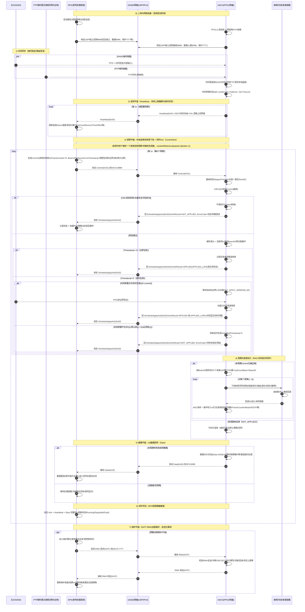

```mermaid
sequenceDiagram
    autonumber
    participant GNSS as 北斗/GNSS
    participant PTP as PTP授时源(交换机/网内主钟)
    participant SPS as SPS(信号处理系统)
    participant NET as 10GbE网络(UDP/IPv4)
    participant DACS as DACS(FPGA阵面)
    participant RF as 射频/天线/收发链路

    Note over SPS,DACS: 0) 上电与网络准备（系统启动阶段）

    SPS->>SPS: 启动服务(调度/网络/处理/监控)
    DACS->>DACS: FPGA上电自检 + 网络栈/PHY就绪
    SPS->>NET: 绑定UDP端口(控制8888回包端口、数据9999、维护7777等)
    DACS->>NET: 绑定UDP端口(控制接收8888、数据/心跳9999、维护7777)

    Note over GNSS,PTP: 1) 时间同步（授时锁定/降级/恢复）

    par GNSS授时链路
        GNSS-->>DACS: PPS + 时间信息(外部输入)
    and PTP授时链路
        PTP-->>DACS: PTP同步(网络侧)
    end

    DACS->>DACS: 时间源选择(GNSS优先,否则PTP,否则本地晶振)
    DACS->>DACS: 时间质量判定(Q0 Locked / Q1 Holdover / Q2 Freerun)

    Note over SPS,DACS: 2) 遥测平面（Heartbeat，持续上报健康与授时状态）
    loop 每 1s（或配置周期）
        DACS-->>NET: Heartbeat(0x04, DSCP高优先级)  %% 逻辑上经网络
        NET-->>SPS: Heartbeat(0x04)
        SPS->>SPS: 更新监控(Alive/温度/错误计数/TimeCoordSource/TimeOffset等)
    end

    Note over SPS,DACS: 3) 控制平面：秒级波束安排表下发 + 闭环Ack（Control/Ack）
    Note over SPS,DACS: 该闭环用于“每秒一个波束安排周期”的确定性调度。:contentReference[oaicite:1]{index=1}

    loop 每 1s（第N个周期）
        SPS->>SPS: 生成Control(波束安排表)\nFrameCounter=N, BeamsPerSecond=n\nTimestamp=期望生效秒边界(或0表示立即)
        SPS-->>NET: 发送 Control(0x01) 到DACS:8888
        NET-->>DACS: 接收 Control(0x01)

        DACS->>DACS: 基础校验(Magic/ProtoVer/长度一致性/DestID)
        DACS->>DACS: CRC32C校验(Control载荷)
        alt CRC校验失败/长度非法/字段非法
            DACS->>DACS: 不得执行(Control拒绝)
            DACS-->>NET: 回 ScheduleApplyAck(0x02)\nAckResult=NOT_APPLIED, ErrorCode=校验/参数错误
            NET-->>SPS: 收到 ScheduleApplyAck(0x02)
            SPS->>SPS: 记录失败 + 依据RTO策略决定是否重传
        else 校验通过
            DACS->>DACS: 解析表头 + 波束项\n排序BeamID/预分配缓冲
            alt Timestamp==0（立即生效）
                DACS->>DACS: 立即应用本周期波束表
                DACS-->>NET: 回 ScheduleApplyAck(0x02)\nAckResult=APPLIED/APPLIED_LATE(若实现判定)
                NET-->>SPS: 收到 ScheduleApplyAck(0x02)
            else Timestamp!=0（定时生效）
                alt 时间质量允许定时生效(Q0 Locked)
                    DACS->>DACS: 等待目标秒边界\n允许窗口±T_APPLY_WINDOW_MS
                    GNSS-->>DACS: PPS(秒边界到达)
                    DACS->>DACS: 在窗口内应用波束表
                    DACS-->>NET: 回 ScheduleApplyAck(0x02)\nAckResult=APPLIED 或 APPLIED_LATE\n并回显生效时间戳
                    NET-->>SPS: 收到 ScheduleApplyAck(0x02)
                else 时间质量不允许(Q1默认禁止 / Q2必须禁止)
                    DACS->>DACS: 拒绝定时生效\nAppliedTimestamp=0
                    DACS-->>NET: 回 ScheduleApplyAck(0x02)\nAckResult=NOT_APPLIED, ErrorCode=时统未锁定/降级
                    NET-->>SPS: 收到 ScheduleApplyAck(0x02)
                end
            end
        end

        Note over DACS,RF: 4) 周期内波束执行（DACS本地实时闭环）
        alt 本周期Control已被应用
            DACS->>DACS: 按BeamID顺序执行n个波束\n计算CPI计数=CpiCountBase+BeamID
            loop 对每个波束(1..n)
                DACS->>RF: 下发射频/阵列控制(角度/频点/增益/波形/采样点数等)
                RF->>RF: 发射脉冲 + 接收回波
                RF-->>DACS: 回波I/Q进入采样链路
                DACS->>DACS: ADC采样 + 缓冲写入\n打点(采样起始时间戳/FrameCounter/BeamID/CPI等)
            end
        else 本周期未应用（NOT_APPLIED）
            DACS->>DACS: 不执行波束（或执行安全默认策略/空转）
        end

        Note over DACS,SPS: 5) 数据平面：I/Q数据回传（Data）
        alt 本周期有有效采样数据
            DACS->>DACS: 数据分片/封包(Data 0x03)\n必要时按策略补零/重组超时处理
            DACS-->>NET: 发送 Data(0x03) 到SPS:9999
            NET-->>SPS: 接收 Data(0x03)
            SPS->>SPS: 数据重组/排序/缺片处理\n进入信号处理流水线
        else 无数据/空周期
            SPS->>SPS: 维持处理链路(可能输出空帧/保持显示)
        end

        Note over SPS,DACS: 6) 闭环评估（SPS侧周期健康度）
        SPS->>SPS: 结合 Ack + Heartbeat + Data 完整性\n更新状态(Running/Degraded/Fault)
    end

    Note over SPS,DACS: 7) 维护平面（0xFF RMA/远程维护，会话化事务）
    opt 需要远程维护/升级
        SPS->>SPS: 进入维护模式(暂停雷达任务/停控制闭环)
        SPS-->>NET: 发送 RMA 请求(0xFF) 到DACS:7777
        NET-->>DACS: 接收 RMA(0xFF)
        DACS->>DACS: 校验RMA会话/令牌/CRC32C\n执行擦写/切换/回读/状态上报等
        DACS-->>NET: RMA 响应(0xFF)
        NET-->>SPS: 接收 RMA 响应(0xFF)
        SPS->>SPS: 更新维护进度/结果\n必要时触发重启/回退策略
    end
```
