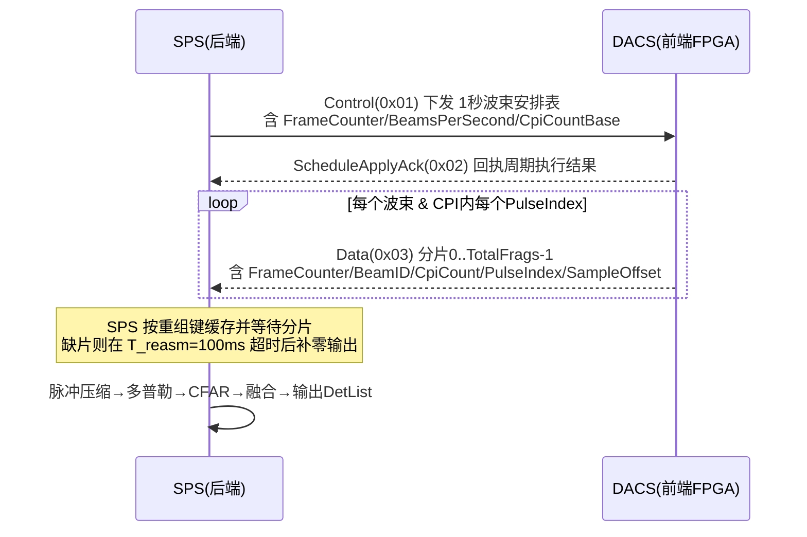
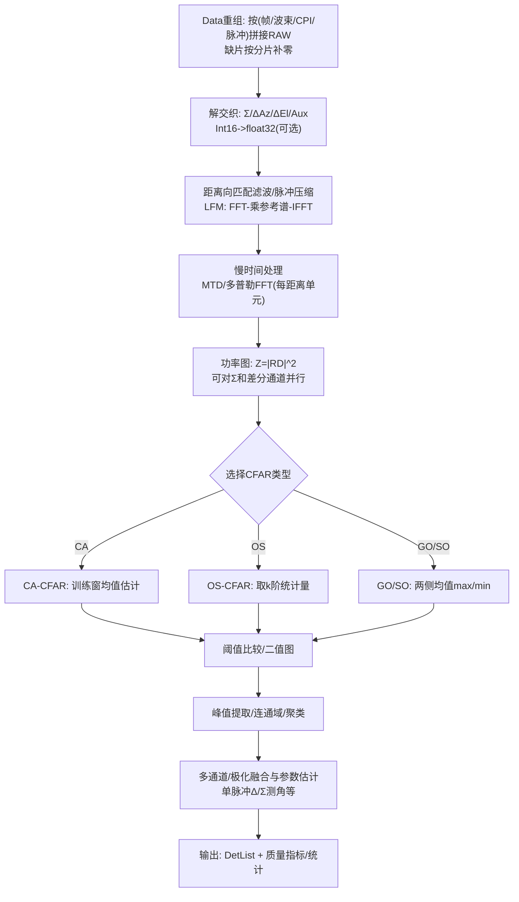
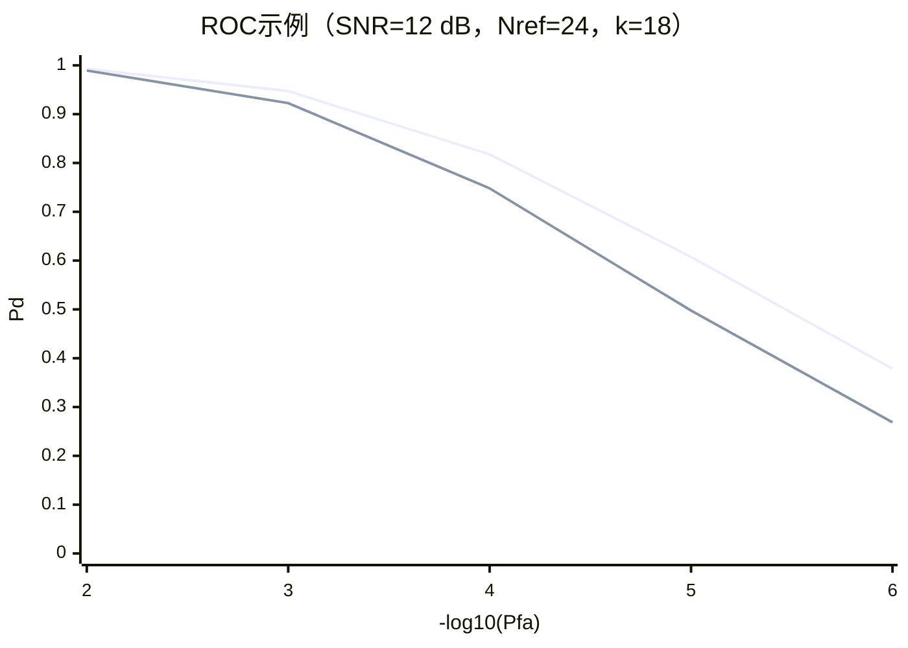
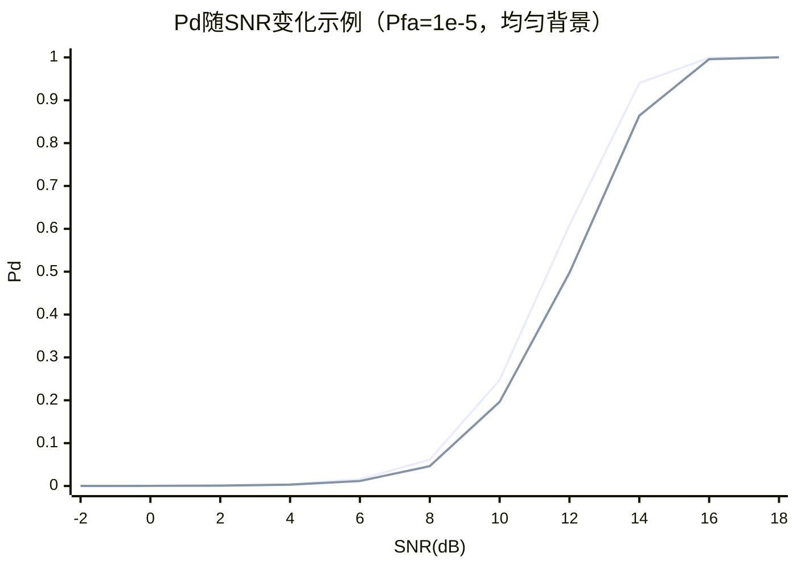

# 基于补充约束的雷达检测系统设计与评估研究报告

## 执行摘要

本报告面向“后端处理”边界下的雷达检测系统设计：后端以 **10GbE/UDP** 接收前端回波数据，完成 **脉冲压缩（LFM 匹配滤波）→ 脉冲多普勒处理（CPI 内慢时间处理）→ CFAR 检测 → 多通道/极化融合与量测输出**，不承担前端 **DDC/抽样/去直流** 等工作。系统与前端的控制/数据交互遵循《前端感知通信协议 V3.1》：SPS（后端）为控制发起方，按“秒周期波束安排表”下发控制，DACS（前端）按分片推送回波数据；数据平面明确“按分片补零”与重组超时等工程行为。

在算法路线方面，本报告建议以**传统 CFAR 基线**优先交付：在均匀背景下采用 **CA-CFAR**（对指数/瑞利背景在经典假设下检测损失最小），在多目标/干扰或杂波边缘场景下提供可切换增强：**OS-CFAR**（对参考窗内离群点/干扰目标鲁棒）与 **GO/SO-CFAR**（对杂波边缘/双目标分辨各有侧重）。这些经典结论与方法在“非均匀背景 CFAR 性能分析”与“多目标/杂波条件下 CFAR 门限”经典文献中系统讨论。

针对未来升级为学习型 CFAR，本报告推荐采用“**传统 CFAR 在线保障 + 学习型旁路评估 → 受控上线**”的迁移路径：优先考虑具备（或近似）CFAR 约束的学习框架（如 **CFARnet** 提出的“CFAR 约束贝叶斯最优检测器/渐近等价 GLRT + 深度网络拟合”），并以数据闭环、标签策略、以及推理加速（GPU/FPGA）作为工程关键点。

在实时性与资源折衷方面，由于未给出硬性端到端时延指标，本报告提出三类可量化目标档（低延迟/平衡/高吞吐），并强调：**最主要的不确定性与风险来自“前端未冻结/未显式提供”的关键参数与行为**（阵列几何、极化编码、PRI/CPI 一致性、SampleCount 与距离窗等）。因此建议在立项阶段首先冻结：①“4 通道通道掩码/顺序”、②“AccumulationCount=N=20、CPI=50 ms 与 PulsePeriod(PRI) 的一致性”、③“采样点数与最大探测距离窗口”，以避免后端在性能评估与实时估算上出现系统性偏差。

## 系统边界与接口假设

**系统边界（已知/固定）**：后端（SPS）从 DACS 接收 **原始 I/Q**，并完成检测处理；不负责 DDC、抽取/抽样、去直流等前端链路工作；波束形成不采用 DBF，也不包含 M2（阵元级）相关功能。该边界与协议中“DACS 为前端 FPGA 设备，仅响应控制并主动推送数据；SPS 为唯一控制发起方”的主从架构一致。

**与前端交互与数据组织（协议关键点）**：
1. **链路与平面**：10GbE/UDP/IPv4；控制平面（0x01/0x02）可靠闭环（CRC32C + 超时重传），数据平面（0x03）为回波上传，依赖以太网 FCS，并冻结“按分片补零”策略。
2. **控制粒度**：Control 以“秒周期”下发一个周期内全部波束项（BeamsPerSecond 1~512）；Control 表头包含 FrameCounter、BeamsPerSecond、CpiCountBase 等，用于与数据平面对齐。
3. **数据分片与重组**：Data(0x03) 由 Common Header + Specific Header(40B) + RAW 分片组成；尾包携带 Execution Snapshot；重组键包含 FrameCounter、BeamID、CpiCount、PulseIndex 等；接收端重组超时 T_reasm 默认冻结为 100 ms，超时后补零输出，并标记 IncompleteFrame。
4. **四通道顺序（与“和/差/差/辅助”一致）**：RAW 采用 Int16 复数 I/Q（4 bytes/complex）；示例 ChannelMask=0x000F（4 通道）时，每采样点顺序为 **[Σ, ΔAz, ΔEl, Aux]** 的 I/Q 交织。

**波形与采样（需求 + 协议映射）**：
- 体制：线性调频（LFM）脉冲。需求给定：接收带宽 = 25 MHz，采样率 = 25 MHz。协议侧支持通过波束项字段指定波形类型（LFM/NLFM/二相码等）、SignalBandwidth（0.5 MHz 量化）与 PulseWidth、PulsePeriod、AccumulationCount、采样点数（Short/LongCodeSampleCount）等，并在 Execution Snapshot 中回显实际生效值以支持闭环一致性验证。
- **缺项与假设（必须标注）**：协议未显式给出“采样率”字段，且 ChannelMask/DataType 在 RAW 解释中被引用但未作为 Data Specific Header 明确字段（协议文本表现为“解析依赖系统配置/约定”的风险点）。本报告假设：DataType 恒为 Int16，ChannelMask 固定为 0x000F（4 通道），采样率由系统集成冻结为 25 MHz。（假设）

**时序一致性风险提示（需求与协议可能冲突）**：
- 需求给定：CPI=50 ms、N=20（文本中“PRF=20 即 N=20”，更像“每 CPI 脉冲数”而非 Hz）。若按“CPI 内脉冲均匀”理解，则 PRI≈2.5 ms。
- 协议中 PulsePeriod 以 1 μs 量化且每字节有效范围 0~255 μs（短/长码分别占低/高字节），并明确“PRF = 1/脉冲周期”。这与 PRI≈2500 μs 存在潜在冲突，需要在系统联调中澄清“PulsePeriod 的真实语义/单位是否确为 1 μs”。本报告在后续评估中仍以 N=20、CPI=50 ms 作为后端处理窗口（慢时间长度），但将 PRI/PRF 频率视为未冻结参数。（假设 + 风险）

**建议的端到端时序（Mermaid 时序图）**：下图强调“Control 秒周期下发 + Data 分片上送 + SPS 重组与处理”的主链路，并将 T_reasm 超时作为后端最坏时延的上界。



## 信号模型与噪声干扰假设

**输入数据张量与索引**：后端在每个波束、每个 CPI 内，接收四通道复数 I/Q 数据（Int16），按脉冲序号 PulseIndex 组织慢时间，按采样点 SampleOffset/SampleCount 组织快时间。协议对 Data 的帧计数、CPI 计数、脉冲序号与采样偏移等字段定义，支持后端重组为规则数据块。

为描述“四通道 + 双极化（本期优先垂直极化）”，本报告采用如下索引：
- 极化 \(p \in \{V,H\}\)（双极化能力；本期默认只处理 \(V\)。（假设））
- 通道 \(c \in \{\Sigma,\Delta_{az},\Delta_{el},Aux\}\)（协议示例与“和/差/差/辅助”一致）。
- 慢时间脉冲 \(n=0,\dots,N-1\)，其中 \(N=20\)（需求给定，对应协议 AccumulationCount 的“相干积累点数”语义）。
- 快时间采样 \(m=0,\dots,L-1\)（L=单脉冲采样点数，来自 Short/LongCodeSampleCount；本报告将 L 视为未冻结并在评估中给出多情形。（假设））。

**基带回波信号模型（四通道/双极化）**：设单目标 \(k\) 的快时间延迟 \(\tau_k\)、多普勒频率 \(f_{d,k}\)、复幅度 \(\alpha_k\)，以及由天线/馈电网络决定的通道方向响应 \(g_{p,c}(\theta_k,\phi_k)\)（与阵列几何和单脉冲差分形成方式相关，后续作为未冻结项处理）。则后端输入可表为：

\[
x_{p,c}[n,m] = \sum_{k=1}^{K}\alpha_k\,g_{p,c}(\theta_k,\phi_k)\,s\!\left(mT_s-\tau_k\right)\,e^{j2\pi f_{d,k} nT_r} + u_{p,c}[n,m] + w_{p,c}[n,m]
\]

其中：
- \(s(\cdot)\) 为发射 LFM 脉冲的复包络（需求给定“线性调频脉冲”并可由协议波束项 Long/ShortCodeWaveform 选择）。
- \(T_s=1/F_s\)，\(F_s=25\) MHz（需求给定）。（假设：采样率与接收带宽一致且已满足抗混叠）
- \(T_r\) 为 PRI（协议以 PulsePeriod 表达，单位/范围存在潜在冲突，见上一节风险提示）。（假设）
- \(w_{p,c}\sim \mathcal{CN}(0,\sigma^2)\) 为热噪声/接收机噪声（复高斯）；在经平方律检测后功率服从指数分布是经典建模前提之一，也是 CA/OS-CFAR 推导常用假设。
- \(u_{p,c}\) 为干扰/杂波项，可按任务场景选模型：
  - 均匀地杂波/海杂波的瑞利包络（功率指数）是经典 CFAR 分析的基线，但在非高斯、重尾分布（Weibull/K/Pareto/Lévy 等）下 CFAR 门限与虚警稳定性会明显变化，需要通过稳健统计/非参数 CFAR/学习型方法增强。
  - 杂波边缘（clutter edge）与参考窗内干扰目标（multiple targets/interferers）会破坏“参考单元同分布”假设，是 CA-CFAR 的典型失效场景，推动 GO/SO/OS 等变体出现。

**后端主处理统计量（Range-Doppler，RD）**：
1. 匹配滤波/脉冲压缩（对 LFM，匹配滤波可最大化白噪声下输出 SNR；脉内调制带来的处理增益与 \(BT\)（带宽-时间积）相关）。
2. CPI 内慢时间相干处理（脉冲多普勒/FFT），在相干条件下，脉冲序列相干积累的 SNR 提升与脉冲数 \(N\) 成正比，且“相干/非相干积分增益差异”是检测链路设计的基础。

在实践中，后端通常对某一通道（优先 \(\Sigma\)）形成 RD 图：
\[
Y_{p,c}[r,d] = \sum_{n=0}^{N-1} y_{p,c}[n,r]\;e^{-j2\pi \frac{dn}{N}}
\quad,\quad
Z_{p,c}[r,d]=|Y_{p,c}[r,d]|^2
\]
其中 \(y_{p,c}[n,r]\) 是距离向脉冲压缩输出，\(d\) 为多普勒 bin。上述“雷达数据立方（通道×脉冲×采样）→ 距离向/慢时间处理”的组织方式在雷达信号处理中是通用范式。

**四通道在检测与测角中的职责划分（建议）**：
- 检测主统计量：优先采用 \(Z_{V,\Sigma}[r,d]\)（本期只处理垂直极化）以最小资源实现稳定检测。（建议 + 假设）
- 单脉冲测角：利用差分比值 \(\Delta/\Sigma\) 输出角度偏差或角度（比值输出与“角度偏差输出”在单脉冲估计器实现中是标准接口形式）。
- Aux：用于工程辅助（如旁瓣监视/一致性检验/抗干扰触发），其具体语义需结合前端实现与标定数据冻结。（未决）

**阵列几何未指定的影响与常见选项评估（面向“和/差/差”体系）**：虽然本系统不做 DBF，但“差分通道形成方式”本质上依赖阵列/馈电网络几何。常见选项与对后端影响如下（均为工程常见形态；需前端确认）：
- **均匀矩形面阵（URA，2D）**：易形成二维和/差通道（按阵面左右/上下分区形成方位/俯仰差），便于单脉冲二维测角与标定；代价是边缘扫描方向图畸变与通道幅相一致性要求高。（假设）
- **均匀线阵（ULA，1D）+ 俯仰分区**：方位测角更直接，但俯仰差的形成往往依赖多排/子阵结构；对“二维差分”输出的线性区域、斜率与交叉耦合需更严格标定。（假设）
- **稀疏/非规则阵（含圆阵/共形阵）**：可改善遮挡或平台约束，但差分通道的“判别曲线”更难保持理想单调与线性，后端需更依赖查表/标定面拟合。（假设）

结论：在“固定四通道单脉冲”框架下，**阵列几何与差分形成属于前端/天线级冻结项**；后端必须获得（至少）“Σ/ΔAz/ΔEl 的判别曲线标定参数（斜率、线性区间、交叉项）”，否则角度量测只能给出相对偏差而难以给出绝对角。

## 传统 CFAR 方案设计与实现

**设计目标**：在 RD（或距离像/多普勒像）上实现恒虚警门限自适应，优先交付传统 CFAR；并为未来学习型 CFAR 留出接口。经典文献对“非均匀背景下 CFAR 性能、杂波边缘、多目标干扰”等问题给出系统分析，是变体选择依据。

**候选 CFAR 族的机制对比（面向本配置）**：下表以“2D/1D 滑窗 CFAR”的通用实现为基线（本系统建议先在 **RD 图上做 2D CFAR**；若资源紧张可先沿距离维 1D CFAR 再做多普勒维二次筛选。（建议））。

| CFAR类型 | 噪声/杂波估计统计量 | 典型优势 | 典型短板 | 更适合的场景（与本系统约束关联） | 资源特征 |
|---|---|---|---|---|---|
| CA-CFAR | 参考窗功率算术平均 | 在均匀指数/瑞利背景下检测损失小、实现简单 | 杂波边缘虚警上升；参考窗内强目标会抬门限导致漏检 | 背景较均匀、目标密度低；作为基线交付 | 低：卷积/积分图可加速；带宽受限实现常见 |
| GO-CFAR | 左/右（或上/下）两侧均值取最大 | 杂波边缘更能维持虚警稳定 | 多目标分辨与近邻目标检测性能下降 | 雷达面向地/海杂波边缘明显、需要保护虚警 | 中：两侧均值 + max；门限系数需校准 |
| SO-CFAR | 两侧均值取最小 | 近邻双目标分辨更好 | 杂波边缘虚警可能更差 | 多目标稠密、但背景较均匀/边缘不显著 | 中：两侧均值 + min；门限系数需校准 |
| OS-CFAR | 参考窗排序取第 k 阶统计量 | 对参考窗离群点/干扰目标鲁棒，“免疫外来目标”特性突出 | 在纯均匀背景下较 CA 有额外检测损失；需要排序/选择 | 多目标/强干扰可能进入参考窗（本系统四通道单波束更易多目标叠加） | 中-高：排序/选择；可用选择算法/并行排序加速 |

**参数选择要点（建议默认 + 可配置）**：
- **参考窗大小**：以“距离向旁瓣扩展 + 多普勒主瓣宽度 + 目标扩展/走动”确定 Guard；以“需要稳定估计背景统计量”确定 Training（通常训练单元数越大，门限估计方差越小，但对非均匀越敏感）。此类权衡在经典 CFAR 分析与工程实现讨论中是核心。
- **目标虚警率指标**：建议先以“每 RD 图允许的平均虚警点数”倒推单元虚警率：若 RD 单元数为 \(N_{cell}\)，希望平均虚警 \(\le 1\) 点，则 \(P_{fa,cell}\approx 1/N_{cell}\)（小概率近似）。该工程定标方法与“恒虚警”设计目标一致。（方法性结论；假设）
- **OS 的 k 值**：工程上常取 \(k \approx 0.75N\)（\(N\)=训练单元数），在鲁棒性与门限偏差间折衷；RadarSimPy 等参考实现也采用类似经验并引用 Rohling 的经典工作。

**门限系数（CA-CFAR 的可闭式计算）**：在指数分布背景和 CA-CFAR 假设下，CA-CFAR 的门限系数 \(\alpha\) 可由目标虚警率 \(P_{fa}\) 与训练单元数 \(N\) 计算，常见形式为：
\[
\alpha = N\left(P_{fa}^{-1/N}-1\right)
\]
该关系在开源实现与工程资料中作为 CA-CFAR 关键公式给出，并被用于生成 CFAR 阈值。

**实现流程（Mermaid 流程图）**：推荐以 RD 图为输入，做 2D CFAR（可选 CA/OS/GO/SO），然后做峰值提取与聚类输出 DetList。协议的 FrameCounter/CpiCount/PulseIndex/BeamID 字段提供了按波束/按 CPI 的一致数据组织方式。



**伪代码（2D CFAR 核心框架，便于工程落地）**：以下给出“RD 图上滑窗 CFAR”的统一伪代码；CA/GO/SO/OS 仅差别在 `estimate_background()`。

```text
Inputs:
  Z[r, d]         # RD功率图, r=0..R-1, d=0..D-1
  guard_r, guard_d
  train_r, train_d
  P_fa
  mode ∈ {CA, OS, GO, SO}
  (for OS) k_rank

For each cell (r,d) excluding edges:
  ref_cells = collect cells in rectangle:
      r' ∈ [r-(guard_r+train_r), r+(guard_r+train_r)]
      d' ∈ [d-(guard_d+train_d), d+(guard_d+train_d)]
    excluding guard region:
      r' ∈ [r-guard_r, r+guard_r] and d' ∈ [d-guard_d, d+guard_d]

  bg = estimate_background(ref_cells, mode, k_rank)
  T  = threshold_factor(mode, P_fa, N_ref, k_rank) * bg
  det[r,d] = ( Z[r,d] > T )

Post-process:
  det = local_maximum(det, Z)     # 可选：抑制平台状超阈值
  clusters = cluster(det)         # 连通域/DBSCAN等
  outputs = estimate_params(clusters, Z, Σ/Δ通道)
Return outputs
```

**复杂度与并行化建议（面向实时实现）**：
- CA-CFAR 的核心瓶颈多为滑窗统计与内存带宽；推荐用 **前缀和/积分图** 或分块共享内存策略减少重复读写；这类工程经验在 GPU 雷达处理讨论中被反复强调。
- OS-CFAR 的主要成本来自选择/排序：建议使用 **选择算法（`nth_element` 类）** 代替全排序，或在 GPU 上用分组并行排序/选择；RadarSimPy 的 OS-CFAR 实现也给出了基于 Rohling 工作的数值求解门限方法。
- GO/SO-CFAR 与 CA 类似（两侧均值 + max/min），可与积分图结合并保持较低算术强度。

## 检测性能仿真与评估方案

**评估原则**：在未给出完整雷达方程/目标 RCS/杂波模型的情况下，推荐采用“**分层仿真**”：先用统计检测模型验证 CFAR 与融合策略（快速得到 ROC/Pd-Pfa 趋势），再逐步引入更真实的距离向脉冲压缩旁瓣、目标走动、多普勒扩展与非高斯杂波（用以评估算法稳健性）。该分层方法与“先跑通基线链路 + 可插拔高级算法”的工程策略一致。

**仿真输入参数表（本报告建议的可量化基线）**：其中“需求已知”来自用户约束；“协议可配置”来自波束项字段；“未指明假设”明确标注。

| 类别 | 参数 | 建议/取值 | 来源 |
|---|---|---|---|
| 波形 | 波形类型 | LFM（线性调频） | 需求已知；协议支持 LFM 编码 |
| 波形 | 接收带宽 B_rx | 25 MHz | 需求已知 |
| 采样 | 采样率 F_s | 25 MHz | 需求已知；协议未显式给出采样率字段（假设冻结于系统集成） |
| 分辨率 | 距离分辨率 ΔR | \(c/(2B)\approx 6\) m（B=25 MHz） | 脉冲压缩基本关系 |
| 时序 | CPI | 50 ms | 需求已知 |
| 时序 | 脉冲数 N | 20（与 AccumulationCount 对齐） | 需求已知；协议 AccumulationCount语义 |
| 时序 | PRI/PRF | 未冻结；若等间隔则 PRI≈2.5 ms（风险：与协议 PulsePeriod 字段范围潜在冲突） | 假设 + 风险 |
| 数据 | 数据类型 | Int16 I/Q（复数4B） | 协议 RAW 定义 |
| 通道 | ChannelMask | 0x000F（Σ/ΔAz/ΔEl/Aux） | 协议示例 + 本项目约束（假设固定） |
| 极化 | 处理极化 | 本期默认只用 V；预留 H（双极化扩展） | 需求已知（“垂直极化为选择”）；协议未给极化字段（假设） |
| 杂波 | 背景分布 | 基线：指数功率（瑞利包络）；扩展：Weibull/K/Pareto/重尾 | CFAR分析常见假设与扩展讨论 |
| 目标 | RCS/起伏模型 | 基线：非起伏（Swerling 0）；扩展：Swerling 1~4 | 目标起伏模型教学资料/工具文档 |
| 场景 | 目标密度 | 三档：稀疏(≤5点/帧)、中等(≤50点/帧)、拥挤(≥200点/帧) | 本报告建议（假设） |

**ROC 与 Pd/Pfa 输出（基于统计模型的示例结果）**：为满足“输出 ROC 曲线与 Pd/Pfa 表格”的要求，本报告给出一组**可复现的统计仿真示例**（用于算法对比与参数量级校验，不等同于最终系统性能；最终需换成真实杂波/旁瓣/走动模型与实测噪声估计）。仿真假设：
- 在“脉冲压缩 + 多普勒”后，RD 单元功率在 H0 下服从指数分布（均值归一化为 1），H1 为“确定幅度目标 + 复高斯噪声”的平方律统计量；训练单元同分布（均匀背景）。这是 CA/OS-CFAR 推导与验证的标准基线。
- 训练单元总数 \(N_{ref}=24\)（1D 等效；2D 时可将训练窗面积折算为等效训练单元数），OS 取 \(k=18\approx0.75N\)。经验取值与参考实现一致。
- 单元虚警率设为 \(P_{fa}=10^{-5}\)（工程上通常与“每帧允许虚警数”折算相关；此处用于示例）。（假设）

**示例曲线一（ROC：固定 SNR=12 dB，比较 CA 与 OS）**：横轴用 \(-\log_{10}(P_{fa})\) 表示（2→1e-2，…，6→1e-6）。



**示例曲线二（Pd–SNR：固定 Pfa=1e-5，均匀背景）**：CA 在均匀背景下通常优于 OS（这与“CA 在理想同分布背景下检测损失最小”的经典结论一致）。



**检测概率与虚警率表（示例：均匀背景）**：表中 Pd 来自上述统计仿真；Pfa 为配置目标值（CA/OS 在理想假设下可近似保持恒虚警）。

| SNR(dB) | 目标Pfa | CA-CFAR Pd | OS-CFAR Pd |
|---:|---:|---:|---:|
| 8 | 1e-5 | 0.0615 | 0.0464 |
| 10 | 1e-5 | 0.2475 | 0.1962 |
| 12 | 1e-5 | 0.6086 | 0.4976 |
| 14 | 1e-5 | 0.9402 | 0.8642 |
| 16 | 1e-5 | 0.9990 | 0.9958 |

**多目标/干扰鲁棒性示例（参考窗含 1 个强干扰单元，+20 dB）**：该情形对应“参考窗内存在强目标/干扰导致 CA 门限被抬高、检测显著劣化；OS 更鲁棒”的典型结论。

| 目标SNR(dB) | 干扰出现在参考窗 | CA-CFAR Pd | OS-CFAR Pd |
|---:|---:|---:|---:|
| 10 | 是（+20 dB 离群点） | ~0 | 0.130 |
| 12 | 是（+20 dB 离群点） | ~0 | 0.415 |
| 14 | 是（+20 dB 离群点） | ~0 | 0.825 |
| 16 | 是（+20 dB 离群点） | 0.003 | 0.990 |

**处理延迟估计图表（示例结构，供资源折衷使用）**：延迟由“重组等待 + 处理计算”两部分组成，其中重组超时上界由协议冻结的 T_reasm=100 ms 决定（缺片时最坏情况），而正常情况下处理计算常远小于 CPI（具体取决于采样点数、波束数与硬件）。

```mermaid
xychart-beta
    title "端到端延迟构成示意（按场景假设，单位ms）"
    x-axis "场景" [1,2,3]
    y-axis "ms" 0 --> 120
    bar "重组等待(典型)" [2,5,8]
    bar "处理计算(典型)" [5,10,18]
    bar "重组超时上界(缺片最坏)" [100,100,100]
```



> 注：上图中的“典型重组等待/处理计算”是为结构展示给出的量级假设；真正的典型值取决于网络丢包率、是否启用巨帧、降低分片数以及硬件实现。（假设）

**推荐的开源工具/库**：
- **RadarSimPy**：提供雷达基带仿真、距离/多普勒处理、以及 CA/OS-CFAR，且包含 ROC/检测特性示例，适合快速搭建“与本报告一致的统计 + 信号级混合仿真”。
- 数值与信号处理：NumPy/SciPy（FFT、卷积、统计），用于与后端 C++/CUDA 实现做一致性对拍。（常识性工程建议；不强制引用）

## 多通道与极化融合策略

**约束复述**：输入通道为 Σ/ΔAz/ΔEl/Aux 四通道；双极化能力存在但“垂直极化为选择”；后端不做 DBF。协议明确了四通道在 RAW 中的交织顺序示例，有利于后端统一接口。

在此约束下，推荐把融合拆成“**检测融合**”与“**量测/质量融合**”两层：检测阶段追求稳健与低虚警，量测阶段追求角度/置信度与抗干扰能力。

**融合候选方案对比（性能 vs 资源）**：

| 融合方案 | 核心思想 | 潜在性能收益 | 资源/复杂度影响 | 推荐度 |
|---|---|---|---|---|
| 单通道检测（Σ，V极化）+ 差分测角 | 检测只看 Σ 功率；Δ 通道用于单脉冲比值 | 最简、易验收；符合“检测主链路可靠”原则 | 最低；Δ/Σ 只在检测点计算 | **首推（基线交付）** |
| 多通道非相干合成检测（Σ+ΔAz+ΔEl…） | 合成功率 \(Z=\sum_c w_c Z_c\) 再 CFAR | 在角偏离导致 Σ 衰落、Δ 增强时可提升检出；兼具一定鲁棒性 | 计算/内存近似按通道数线性增加；门限标定更复杂 | 次推（需标定权重） |
| 级联检测（Σ先检，Δ/Aux 再验证） | Σ 上初检；利用 Δ/Aux 的一致性/单脉冲判别做二次门控 | 可显著降低虚警（如杂波尖峰、旁瓣假点） | 需要定义“验证规则/阈值/判别曲线”；但只对少量候选点算 | **强推（虚警控制优先时）** |
| 双极化融合（V/H） | 在同一 RD 单元对 V/H 统计量融合 | 若目标/杂波在不同极化下可分离，可提高 SCNR 或降低虚警 | 需要协议/数据格式明确极化编码；算力与带宽约翻倍 | 中（取决于前端极化输出冻结） |
| 极化判别/自适应极化权重 | 用少量先验/训练估计最优极化组合（类似分集） | 在复杂杂波下潜在收益更大 | 对数据与标定要求高；可能触及学习型方法范畴 | 后续（作为增强项） |

**关于“差分通道利用”的工程建议**：
- 差分通道用于测角时，常输出“角度偏差”或“sum-diff ratio”；后端应把差分比值作为质量指标的一部分（例如：线性区间内比值斜率稳定、Δ/Σ 绝对值过大提示离轴/旁瓣/多径风险）。这与单脉冲估计器接口对“角度偏差/比值输出”的通用设计相吻合。
- 若要把差分通道用于“检测增强”，必须明确差分通道的统计分布（在 H0 下是否与 Σ 同分布、是否存在通道相关），否则 CFAR “恒虚警”性质可能被破坏，需要额外标定或使用鲁棒/学习型门限策略。

## 学习型 CFAR 迁移路线与实时性资源折衷

**迁移动机与约束**：传统 CFAR 在非均匀、非高斯、强干扰、多目标密集等场景下会出现虚警不可控或漏检；同时，“严格/近似 CFAR 性质”在工程验收中往往比“平均准确率”更关键。CFARnet 的研究明确提出：在机器学习场景中引入 CFAR 约束，并给出“CFAR 约束贝叶斯最优检测器与 GLRT 的渐近等价”及可训练网络框架，为学习型 CFAR 提供理论与工程连接点。

**推荐迁移路线（分三阶段）**：
- **阶段一：数据闭环与旁路评估**：保持线上 CA/OS/GO/SO-CFAR 作为主检测器，同时落盘“RD patch + 元数据 + 传统 CFAR 门限/检测结果 + 后续跟踪确认标记”。这符合“先离线/旁路评估，再逐步进入在线”的工程经验，避免因训练数据与可解释性不足导致上线风险。
- **阶段二：学习型候选生成/环境识别**：让学习模型做“背景类型识别/参考窗修正/候选点打分”，再由传统 CFAR 作最终门限裁决（hybrid）。该思路与“用学习识别环境→切换/修正 CFAR”在工程综述中被视为稳健折衷路径。
- **阶段三：受控上线的学习型 CFAR**：采用具 CFAR 约束的网络（如 CFARnet 系列思想），并保留在线监控：以校验集与实时统计监控“经验虚警率是否漂移”；必要时可快速回退到传统 CFAR。

**数据需求与标签策略（建议）**：
- 标签来源建议“多源一致”：①仿真注入（已知真值）、②多帧/多 CPI 关联后的航迹确认（弱监督）、③人工复核少量困难样本（高价值）。这是在雷达检测中构建可用监督信号的常见工程路线。（假设）
- 双极化若启用，可把不同极化视为“分集样本”，并在训练中显式建模“极化相关/互信息”，但必须先冻结极化编码与标定，否则标签噪声会显著抬升。

**在线/离线部署架构与硬件加速建议**：
- 离线训练：优先 GPU；在线推理：若将学习模块限制为“RD patch 小窗口分类/回归”，推理开销可控；若直接在整幅 RD 上做密集预测，带宽与算力会显著增长，需要 GPU/FPGA/ASIC。CFAR 与转置常是带宽瓶颈，GPU 实现需高度关注数据布局与访存。

**三档典型实时目标与资源估算（给出量化假设）**：以下以“每秒波束数 BeamsPerSecond、采样点数 L、通道数 C、脉冲数 N=20”为核心尺度；其中 L 与 BeamsPerSecond 可由协议控制表与波束项决定。
- 计算量用“粗略 FLOPS”估算主要由 FFT/卷积与 CFAR 扫描构成；该估算用于相对量级与瓶颈判断，不替代硬件实测。（假设）

| 档位 | 目标（示例） | 假设场景（可量化） | 建议参数（示例） | 估算数据率（仅V极化、C=4、Int16） | 粗略算力需求（GFLOPS量级） | 关键风险点 |
|---|---|---|---|---:|---:|---|
| 低延迟 | 告警型：端到端≤30 ms（假设） | 目标稀疏≤5点/帧；SNR覆盖 6–16 dB | Beams/s≈64；L≈2048；优先 CA + 级联验证 | ~42 MB/s | ~1–2 GFLOPS | 若丢包触发 T_reasm=100ms，将直接破坏时延目标 |
| 平衡 | 搜索型：平均≤100 ms（假设） | 目标中等≤50点/帧 | Beams/s≈256；L≈4096；CA + OS 可切换 | ~336 MB/s | ~10–20 GFLOPS | 网络与内存带宽开始敏感；需要控制分片数/丢包率 |
| 高吞吐 | 记录/离线：允许≤300 ms（假设） | 目标拥挤≥200点/帧；强干扰可能进入参考窗 | Beams/s≈512；L≈4096(避免10GbE饱和)；OS/VI类策略预留 | ~671 MB/s | ~20–40 GFLOPS | 重组缓存与峰值/聚类不规则控制流成为瓶颈；建议GPU/多线程流水 |

> 注：数据率按 \(Beams/s \times L \times N \times C \times 4\) bytes 估算；若启用双极化（H+V），带宽与算力近似翻倍。（假设）

## 风险与未决问题清单

本节列出“当前信息缺失但对检测/实时性影响最大”的未决项，并给出默认假设与缓解建议。其中特别强调：协议中不少行为被标注为“冻结”，意味着后端可能需要通过系统集成手段（网络/配置/前端参数冻结）来规避最坏情况。

| 未决/风险项 | 影响 | 默认假设（若未指明） | 缓解建议 |
|---|---|---|---|
| PRI/PRF 与 CPI=50ms、N=20 的一致性 | 多普勒刻度、模糊、相干性、速度分辨与处理窗口全受影响 | 把 N=20 作为后端慢时间长度；PRI 需前端冻结（假设） | 联调阶段冻结 PulsePeriod 的真实单位/范围；必要时扩展协议字段或另行提供 PRF 配置；同时通过 Execution Snapshot 回读验证生效值 |
| ChannelMask/DataType 未作为明确字段出现（解析依赖配置） | 后端解包可能不一致；多设备兼容风险 | 固定 ChannelMask=0x000F，DataType=Int16（假设） | 在系统集成文档中冻结“通道掩码与顺序”；若未来扩展双极化/更多通道，建议在协议扩展字段中显式加入该信息 |
| 双极化编码方式未定义 | 无法区分 V/H 数据、无法做融合 | 本期只用 V（假设） | 明确极化在协议中的表达（可用扩展头/SourceID 分离/新增字段）；先落地“V-only + 预留接口”的后端结构 |
| 阵列几何/单脉冲判别曲线未提供 | Δ/Σ→角度映射无法定量；角度精度无法评估 | 以“线性区间小角度近似 + 查表标定”处理（假设） | 要求前端提供：判别曲线斜率、线性区间、交叉耦合项；并用标定目标/仿真目标验证；将 ratio 与质量指标一并输出 |
| 杂波/干扰统计模型未指定 | CFAR 参数无法定标；虚警可能失控 | 基线用指数功率，扩展用重尾模型（假设） | 先用 CA 基线跑通；同时用 OS/GO/SO 增强并在外场采集数据后做模型拟合与 VI/非参数 CFAR 评估 |
| 数据分片与 T_reasm=100ms 正常/异常比例 | 最坏 100ms 时延可能使低延迟目标不可达 | 假设网络丢包率低（假设） | 网络侧：巨帧/专用交换/拥塞控制；软件侧：重组缓存监控、缺片率统计、对关键波束可用“降采样/降L减少分片”策略 |

## 结论与可操作建议

在给定“后端处理、四通道单脉冲、LFM、Fs=Brx=25MHz、CPI=50ms、N=20、优先垂直极化”的约束下，最可落地且风险最低的交付路径是：**以 Σ(V) 通道 RD 图为主输入，采 CA-CFAR 作为基线检测器，并内置 OS/GO/SO 可切换增强；差分通道用于单脉冲比值测角与二次验证，Aux 用于质量/抗干扰触发**。这一策略能最大化利用现有协议对四通道数据交织、执行快照、重组补零等工程机制的定义，同时符合经典 CFAR 文献与工程实现中对“均匀背景最优基线 + 非均匀增强”的共识。

可操作建议按优先级如下：
1. **冻结关键前端参数与语义**：优先澄清并冻结 PRI/PRF 与 CPI/N 的一致性、极化编码方式、ChannelMask 与样点数 L 的配置规则；充分利用协议 Execution Snapshot 做闭环一致性验证。
2. **实现“CA 基线 + OS 兜底”双模式 CFAR**：默认 CA-CFAR；当检测点密集、参考窗存在离群点或 Aux/质量指标触发“疑似多目标/干扰”时切换 OS-CFAR 或采用级联验证，以降低最恶劣场景下的漏检/虚警风险。
3. **把实时性瓶颈从算法转向链路工程治理**：由于协议冻结 T_reasm=100ms 的缺片最坏时延，低延迟目标更依赖“降低分片数、降低丢包率、以及在缺片时的质量标记与上层策略”。
4. **为学习型 CFAR 提前铺设数据闭环**：从第一版起就落盘 RD patch 与传统 CFAR 的门限/判决、并记录后续航迹确认结果；以 CFARnet 类“受约束学习检测器”作为主要研究方向，先旁路评估后上线。
