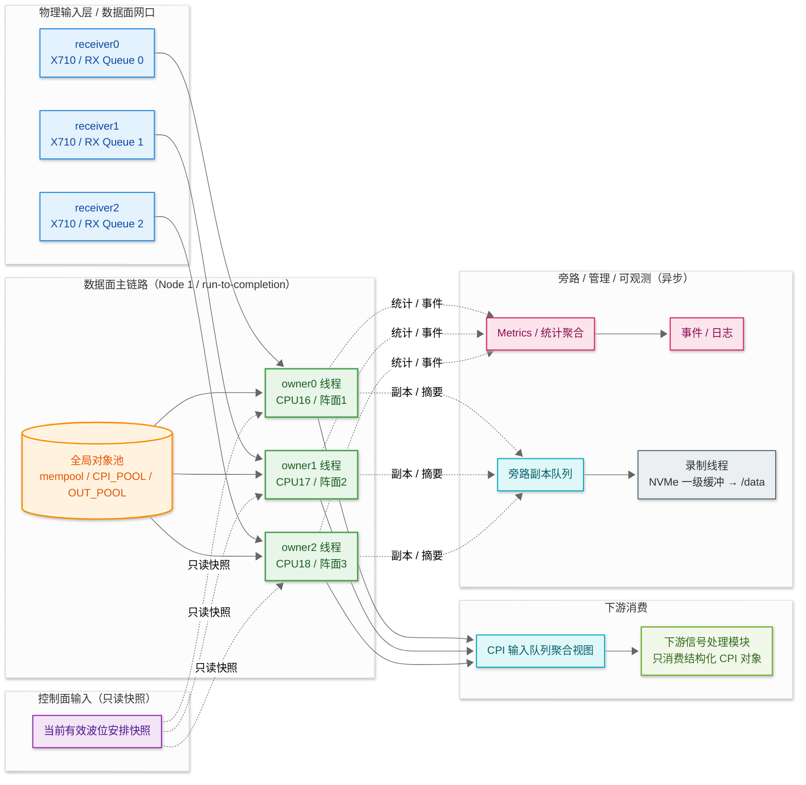
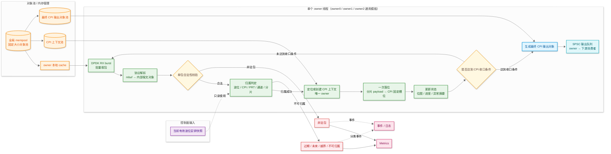
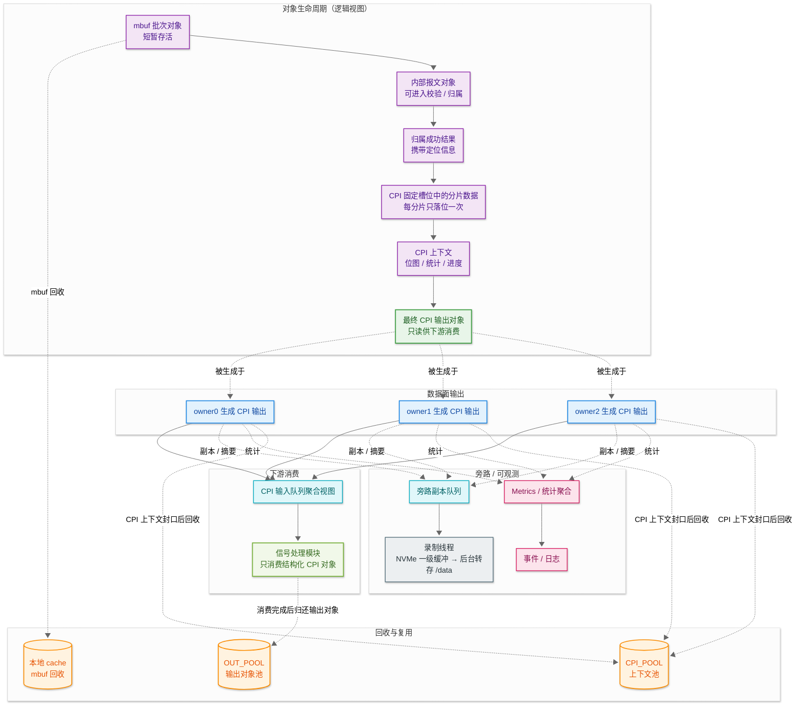

## 总体冻结结论

**按“当前环境下、只追求主链路性能与确定性、不优先考虑实现复杂度”的目标，建议冻结为：**

> **DPDK 原生 `i40e` PMD + `vfio-pci` 接管数据面网口 + 单 owner 线程 run-to-completion + 最少必要队列 + 每分片一次落位到 CPI owner 固定槽位 + CPI 上下文单线程独占写入 + 最终 CPI 对象再通过 SPSC 交给下游。**

这个结论基于四个事实：

1. 你的服务器是 **ARM64 / 麒麟 V10 / kernel 4.19.90**，数据面固定在 **NUMA Node 1 / CPU 16-31**，数据网口是 **Intel X710 / i40e**。
2. DPDK 官方推荐的高性能模型本来就是 **PMD 轮询 + run-to-completion**，即在同一核心上完成收包与后续处理。([DPDK Documentation][1])
3. DPDK 官方 `i40e` PMD 明确支持 **Intel 700 系列 X710/XL710/XXV710**。([DPDK Documentation][2])
4. AF_XDP 在 DPDK 官方文档里明确有内核版本门槛：`need_wakeup` 和 zero-copy 需要 **>= 5.4**，`shared_umem` 需要 **>= 5.10**；你当前是 **4.19.90**，因此不能把 AF_XDP 当成“完整版高性能形态”来冻结。([DPDK Documentation][3])

下面按技术点逐项冻结。

---

## 1. 收包技术栈

**冻结：主数据面使用 `DPDK 原生 i40e PMD`，不采用 AF_XDP 作为主方案。**

**解释：**

* DPDK PMD 的设计目标就是用户态直接轮询 RX/TX 描述符，减少中断与内核协议栈干扰，官方推荐的高性能模型是 run-to-completion 或 pipeline，其中低时延优先通常更贴近 run-to-completion。([DPDK Documentation][1])
* 你的数据网卡是 X710，官方 `i40e` PMD 对它有直接支持。([DPDK Documentation][2])
* AF_XDP 在你当前 4.19 内核上，关键能力不完整，尤其是 zero-copy / need_wakeup / shared_umem 的门槛都不满足。([DPDK Documentation][3])

**边界：**

* AF_XDP 可以保留为对照方案或兼容方案，但**不进入主链路冻结版本**。

---

## 2. 网口占有方式

**冻结：`receiver0/1/2` 这三路数据面网口由 DPDK 独占，绑定到 `vfio-pci`；不再走内核 socket。**

**解释：**

* DPDK 官方建议 DPDK 绑定端口统一使用 `vfio-pci`。([DPDK Documentation][4])
* 这意味着数据面 PF 被 DPDK 接管后，不再按当前 Linux 网络栈方式提供 UDP socket、firewalld 放行、NetworkManager 管理这一套语义。
* 你当前基线里 `receiver0/1/2` 仍然在 Linux 内核网络管理下，配置了 IP、9999/udp、防火墙和 IRQ 绑核；一旦切到 DPDK，这一层要改成 DPDK 自己管理，不应再假设 `9999/udp` 放行、socket 缓冲、内核 backlog 对主数据面仍然生效。   ([DPDK Documentation][4])

**边界：**

* `receiver3` 作为预留口可暂不接管。
* 管理口仍保持 Linux 网络栈。

---

## 3. 收包模型

**冻结：采用 `run-to-completion`，即 owner 线程在同一核上完成“收包→解析→校验→归属→重组落位→裁决前检查”。**

**解释：**

* 这是 DPDK 官方直接支持的高性能主模型。([DPDK Documentation][1])
* 你当前接收端目标强调“持续高速收包”“非法包不污染后续上下文”“与解析、重组、输出稳定衔接”，这更适合减少跨线程搬运。

**边界：**

* 只有当 CPI 最终完成、需要交给下游消费者时，才允许跨线程/跨阶段交接。
* 不冻结“收包线程只收包、后面再层层排队”的设计。

---

## 4. 队列模型

**冻结：主数据路径只保留“最少必要队列”；默认只在“最终 CPI 输出给下游”这一处使用 SPSC 队列。**

**解释：**

* DPDK ring 是固定大小、无锁、支持单生产者/单消费者或多生产者/多消费者的队列。([DPDK Documentation][5])
* 但“能用很多队列”不等于“应该用很多队列”。
  对你这种固定协议、强时序、要做归属和重组的链路，层层排队会增加：

  * cache miss
  * 指针搬运
  * 可见性同步
  * 回压复杂度

**冻结口径：**

* **接收、解析、归属、重组、裁决前检查**：不跨队列
* **最终 CPI 对象交给信号处理消费者**：`SPSC ring`

**边界：**

* 不使用全局 MPMC 大总线作为主数据路径。

---

## 5. 线程模型

**冻结：一阵面一 owner 线程；当前先冻结为 3 个 owner 线程。**

### 当前绑定建议

* `receiver0 -> owner0 -> CPU16`
* `receiver1 -> owner1 -> CPU17`
* `receiver2 -> owner2 -> CPU18`

这和你当前服务器基线里的数据面 CPU 规划、阵面接收线程规划是一致的。

**解释：**

* 一阵面一 owner，最容易保证：

  * CPI 上下文不被并发写
  * 位图更新不需要原子争用
  * 封口、迟到包、重复包逻辑简单
* 这是你当前最需要的“工程正确性 + 高确定性”平衡点。

**边界：**

* 以后若扩成多 RX queue，也必须遵守：

  > **同一个 CPI 上下文只能映射到一个 owner。**
  > 不能让多个 queue/线程同时写同一 CPI。

---

## 6. CPI 上下文 ownership

**冻结：`CPI 上下文` 从创建到封口，全程只允许一个 owner 线程写。**

**解释：**

* 你的接收端职责里，归属、重组、边界推进、异常识别本来就是一条闭环链；如果 CPI 上下文被多个线程共享写，重组位图、PRT 完整状态、封口状态、迟到包处理都会变复杂。
* 这不是“实现优化项”，而是流程语义的前提条件。

**冻结口径：**

* 允许多个线程读统计快照
* **不允许多个线程写同一 CPI 上下文**

**边界：**

* 所有跨线程交接都交接“对象”或“指针/句柄”，不交接“共享可写上下文”

---

## 7. 内存池模型

**冻结：采用“全局大 mempool + 每 owner 本地 cache”的 fixed-size 对象池模型；热路径禁止 `malloc/new/free`。**

**解释：**

* DPDK mempool 本身就是 fixed-size object allocator，默认基于 ring；并且官方明确提供 **per-core cache**，用于减少锁竞争与跨核分配开销。([DPDK Documentation][6])
* 这非常适合你现在的 owner 模型。

**冻结口径：**

* 分片对象、PRT 子上下文、CPI 上下文、最终输出对象，全部来自固定池
* owner 线程优先使用本地 cache
* 全局池仅作为补给和回收汇聚

**边界：**

* 不做热路径动态扩容
* 不做跨线程随意借还对象

---

## 8. 分片数据生命周期

**冻结：`每个分片只拷贝一次`，并且这次拷贝直接落到 `CPI owner` 的固定槽位。**

**解释：**

* 你当前协议非常规整：
  单包固定 **5120B**，每个 PRT 固定 **16 包**，4 通道，每通道固定 **4 分片**，`PacketIndex` 固定 `0~3`。这非常适合固定槽位落位。
* 如果不这样做，而是在：

  * 分片阶段拷一遍
  * 通道拼接再拷一遍
  * PRT 聚合再拷一遍
  * CPI 输出再拷一遍
    那就不是最优性能路线了。

**冻结口径：**

* RX mbuf/包缓冲只作为“源”
* 归属成功后，分片 payload **一次性 memcpy** 到 CPI 固定槽
* 后续只维护位图、长度、状态、引用关系
* 不再多次复制原始 IQ 数据

**边界：**

* 第一版不采用“直接引用 RX 缓冲做长期保存”的托管方案
  因为那会把生命周期管理复杂度大幅抬高

---

## 9. 内部聚合方式

**冻结：通道、PRT、CPI 三层都只维护“结构状态”和“引用/段表”，不重复持有大块原始数据副本。**

**解释：**

* 通道层负责：`4 个分片槽位 + 分片位图 + 长度`
* PRT 层负责：`4 个通道完整状态 + 通道结果引用表`
* CPI 层负责：`N_PRT 个 PRT 状态 + 完整性统计 + 输出汇总`
* 原始 IQ 数据只在 **CPI owner 固定槽位**里保留一份

这符合“最小必要重组”的原则，也符合你接收端“对下游隐藏 UDP 分片细节”的边界。

**边界：**

* 不再单独维护“PRT 原始数据聚合大块缓冲”
* 不在通道完整时再做整块重拷贝

---

## 10. 上下文数据结构

**冻结：内部结构优先使用“固定数组/位图/索引表”，不使用链表式热路径结构。**

**解释：**

* 你的协议结构固定：

  * `PacketIndex` 固定 `0~3`
  * 通道固定 `0~3`
  * 每 PRT 固定 16 包
* 这意味着最优实现不是动态容器，而是**定长槽位 + 位图**。

**冻结口径：**

* 通道分片：固定 4 槽
* PRT 通道：固定 4 槽
* CPI PRT：固定 `N_PRT` 槽
* 完整性状态：位图/计数器

**边界：**

* 热路径不使用 `std::map` / `unordered_map` 做每包级内部层级定位
* 只允许在“CPI 上下文总表”这一层做受控索引

---

## 11. 解析/校验/归属/重组的阶段边界

**冻结：这四步在 owner 线程内顺序完成，不拆成独立异步 stage。**

**解释：**

* 接收端核心目标本来就是“收进来→看懂→判断是否合法→判断属于谁→重组→输出”。
* 如果在性能优先路线下还把它们拆成多级异步阶段，收益通常不如成本。

**冻结口径：**

* 单包进入 owner 后，依次做：

  1. 解析
  2. 合法性校验
  3. 归属判定
  4. 分片落位 / CPI 更新
* 某一步失败，直接在本线程内统计并丢弃

**边界：**

* 不单独设置“归属线程池”“重组线程池”

---

## 12. 裁决与边界推进

**冻结：`CPI 的完成判定、截止判定、封口与回收` 由同一个 owner 线程负责；只有“最终完成的 CPI 输出对象”才跨线程。**

**解释：**

* 你当前已经将对外输出粒度冻结为 CPI 级，因此边界、缓存、延迟和统计口径都必须直接按 CPI 级输出契约收敛；内部仍可保留 PRT 粒度作为重组与裁决基础。
* 既然如此，最优性能路线下，**不要把 CPI 封口权交给另一个写线程**。否则又会引入共享上下文问题。

**冻结口径：**

* owner 线程负责：

  * 新包驱动的进度更新
  * CPI 达成条件判断
  * 边界触发时的截止/封口
* 封口后生成最终 CPI 输出对象
* 通过 SPSC 交给下游消费者

**边界：**

* 下游只读最终对象，不回写接收上下文

---

## 13. 统计、日志、旁路落盘

**冻结：统计和旁路必须旁路化，不能反压 owner 主链路。**

**解释：**

* 需求和职责边界都明确要求：旁路落盘必须异步、失败不改变主链路语义，统计/日志只是“产生信息”，不能反向支配主链路。
* 因为你走的是性能优先路线，这点更不能松。

**冻结口径：**

* owner 线程只做轻量计数和事件打点
* 大块日志、旁路写盘、指标导出走独立旁路线程
* 旁路只消费最终对象或必要副本，不接触 owner 可写上下文

**边界：**

* 不允许“为了录全数据”阻塞主链路

---

## 14. NUMA、CPU 与核心绑定

**冻结：所有 owner 线程、数据面 mempool、CPI 上下文都固定在 Node 1；管理、旁路、录制尽量不占用 16-31。**

**解释：**

* 当前服务器基线已经明确：
  数据面固定在 **NUMA Node 1 / CPU 16-31**，并且 `receiver_app` 必须 `numactl --cpunodebind=1 --membind=1` 运行。
* 这和“每 owner 一核、每上下文本地化、减少跨节点访存”的高性能模型是一致的。

**冻结口径：**

* 数据面线程：Node 1
* 数据面对象池：Node 1
* CPI 上下文：Node 1
* 管理面、旁路、录制：优先 Node 0 或非关键核

**边界：**

* 不允许主数据面上下文跨 NUMA 漫游

---

## 15. 时间戳策略

**冻结：主链路只采集“本机接收时间元数据”；不把时间戳采集设计成阻塞热点。**

**解释：**

* 接收端需求要求每个成功进入用户态处理流程的报文记录必要本机接收时间，用于追踪、旁路、分析。
* 但在性能优先路线下，时间戳只是元数据，不应把主链路拖成复杂硬件时间同步工程。

**冻结口径：**

* 每包记录一个轻量本机时间
* 用于归属辅助、输出元数据、旁路分析
* 不上升为主归属锚点

---

## 16. 兼容与停止恢复

**冻结：第一版只冻“纯数据面 DPDK 运行模式”，不同时兼容“同端口 Linux socket 模式”。**

**解释：**

* 接收端仍然要支持受控启动、停止、复位，但这是生命周期问题，不应在第一版里同时兼容“双栈接收”。
* 数据面既然要走 `vfio-pci + PMD`，就先把这条路径做好，不同时保留“同一个 PF 还能继续给 Linux 9999/udp 收包”的幻想。

----------

# 图 1：系统总览

# 图 2：单个 owner 主处理链模板

----------

# 图 3：下游 / 旁路 / 回收 / 生命周期闭环

