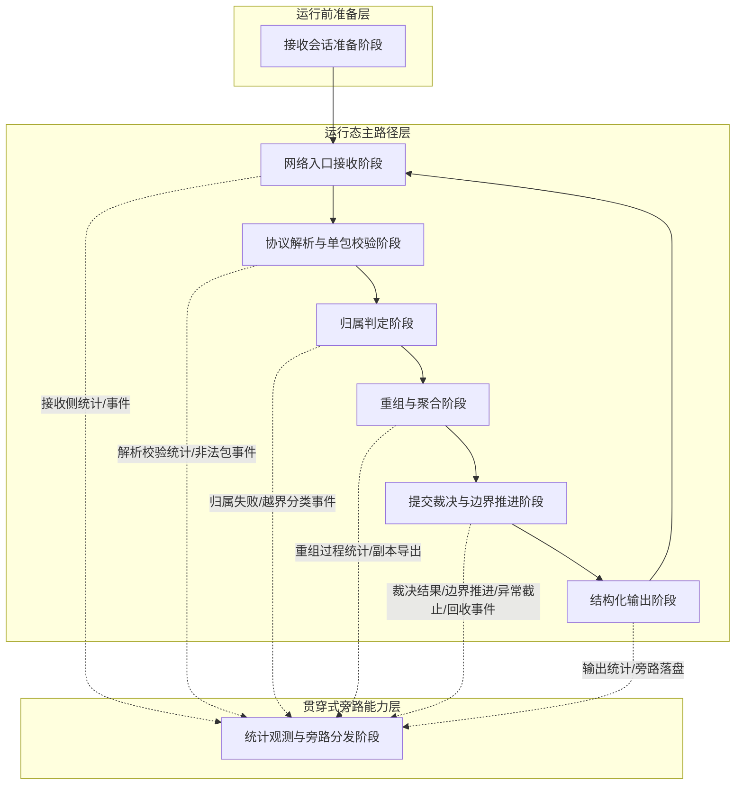
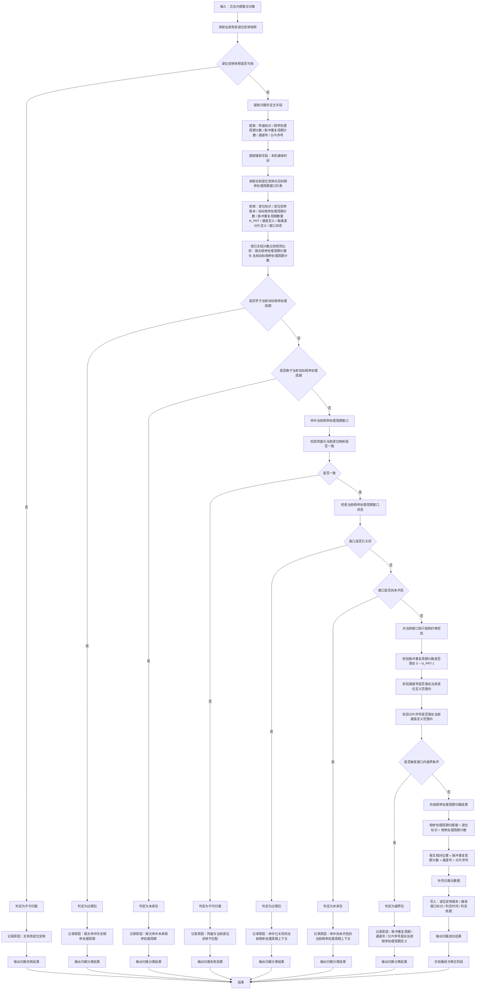
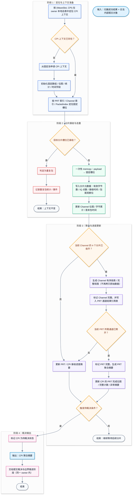

# 主流程图

# 归属判定阶段

---

* **一个波位安排表周期 = 一个 CPI**
* **接收端对外最小输出单元改为 CPI 级**
* **归属阶段仍然保留 PRT / 通道 / 分片 作为 CPI 内部相对位置**
* **三个长中短脉冲暂不显式标识**

---

## 表 1：归属分类判据表

这张表的目的，是把“归属阶段到底输出什么分类、后续怎么处理”一次写死，避免实现时各写各的。

| 归属分类     | 触发条件                                                                                     | 是否进入重组 | 是否记统计 | 是否发异常事件 | 是否污染当前 CPI 上下文 | 建议后续动作                 | 备注                                                                          |
| -------- | ---------------------------------------------------------------------------------------- | -----: | ----: | ------: | -------------: | ---------------------- | --------------------------------------------------------------------------- |
| 归属成功     | 报文通过单包合法性校验；存在当前有效波位安排；报文 `CPI` 命中当前波位安排对应的目标 `CPI`；阵面匹配；`PRT / 通道 / 分片` 均落在当前 CPI 窗口定义内 |      是 |     是 |       否 |              否 | 写入当前 CPI 重组上下文         | 归属结果应至少保留 `(波位, CPI, PRT, Channel, PacketIndex)` 逻辑关系，因为归属模型和重组键都要求保留这些维度。  |
| 不可归属     | 无当前有效波位安排；或当前快照缺少形成判定所需的必要约束；或阵面与当前波位映射不匹配；或配置/版本缺失导致无法确定窗口解释规则                          |      否 |     是 |     视情况 |              否 | 丢弃该报文，记录原因             | 这类不是“窗口内越界”，而是“连归属比较都无法成立”。归属失败应进入统计，且不得污染有效上下文。                            |
| 过期包      | 报文 `CPI` 早于当前目标 `CPI`；或虽命中当前 `CPI` 编号，但对应上下文已关闭/已收尾                                      |      否 |     是 |     建议是 |              否 | 丢弃；可用于历史窗口回收/异常分析      | 过期包属于归属阶段应识别的正式分类之一。报文被错误归属到已结束上下文，本身也是要识别的上下文污染风险。                         |
| 未来包      | 报文 `CPI` 晚于当前目标 `CPI`；或命中尚未开启的目标窗口                                                       |      否 |     是 |     建议是 |              否 | 丢弃或进入受控暂存策略；默认不直接入当前重组 | “未来包误进入当前窗口”已被需求明确列为要识别的上下文污染风险。若没有显式暂存机制，默认应丢弃而不是猜测性归属。                    |
| 越界包      | 报文 `CPI` 已命中当前窗口，但 `PRT` 超出 `0 ~ N_PRT-1`；或通道号不在当前波位定义允许集合；或分片序号不在当前通道定义范围内              |      否 |     是 |     建议是 |              否 | 丢弃；记录窗口内越界原因           | 这里的“越界”是**归属级越界**，不是协议级非法。协议级非法值应在前一阶段就被拦住，不得再进入归属阶段。                       |
| 归属阶段内部异常 | 例如快照版本切换异常、窗口状态机不一致、同一报文重复判定结果不一致、计数比较规则缺失                                               |      否 |     是 |       是 |            不允许 | 丢弃；触发状态机告警；保留现场        | 这一类不是业务分类，而是实现异常。必须单列，否则后续容易和“不可归属”混掉。它通常对应 FR-071/073 以及关键异常事件输出。          |

---

## 表 2：当前 CPI 窗口约束来源表

这张表的目的，是把“归属阶段到底依赖哪些约束、这些约束从哪里来”冻结下来。
不然流程图虽然有了，代码阶段还是会因为来源不清而漂。

| 约束项       | 作用                        | 当前建议来源                                  | 更新时机                 | 使用阶段            | 必需度 | 未冻结风险                                                |
| --------- | ------------------------- | --------------------------------------- | -------------------- | --------------- | --- | ---------------------------------------------------- |
| 波位标识      | 标识当前归属属于哪个波位上下文           | 当前有效波位安排快照                              | 波位安排切换时              | 归属、重组、输出、统计     | 必须  | 无法形成稳定的上层上下文标识                                       |
| 目标 CPI 计数 | 归属主锚点，判断报文是当前/过期/未来       | 波位安排表中的 `CPI` 字段                        | 每次新波位安排生效时           | 归属、边界推进         | 必须  | 无法判断当前窗口归属。当前控制表已显式带 `CPI` 计数。                       |
| `N_PRT`   | 确定一个 CPI 内允许的 PRT 计数范围    | **必须新增冻结来源**：优先建议由波位安排扩展字段或体制配置表给出      | 波位安排更新或体制切换时         | 归属、重组、完整性判定     | 必须  | 无法判定 `PRT` 是否窗口内越界；CPI 级输出也无法定义完整性边界                 |
| 通道集合      | 确定当前 CPI 允许的通道编号集合        | 当前协议默认固定为 4 通道；若后续波位体制可裁剪，则应由波位安排/配置表给出 | 协议版本或波位体制变化时         | 归属、重组、输出        | 必须  | 当前协议里 UDP 通道号字段取值是 `0~3`，但这只说明协议允许值，不等于每个波位都必须全通道有效。 |
| 每通道分片数    | 确定每通道允许的分片序号范围            | 当前协议默认固定为 4                             | 协议版本变化时              | 归属、重组、完整性判定     | 必须  | 你当前协议里包计数固定 `0~3`，每通道 4 包；这一点可先冻结为协议常量。              |
| 通道顺序定义    | 确定 CPI 内部通道布局解释           | 当前协议固定：和 / 俯仰差 / 方位差 / 匿隐               | 协议版本变化时              | 重组、输出、旁路        | 应有  | 不影响“能不能收”，但会影响通道数据解释正确性。                             |
| 窗口开启条件    | 判断“未来包”与“当前窗口”边界          | 当前有效波位安排快照 + 接收状态机本地状态                  | 会话启动、波位切换、CPI 上下文创建时 | 归属、边界推进         | 必须  | 若不冻结，未来包和当前包可能混判                                     |
| 窗口关闭条件    | 判断“过期包”与“已结束上下文”边界        | CPI 边界推进规则 + 波位结束判定规则 + 尾包辅助信息          | CPI 完成、波位收尾时         | 归属、边界推进、回收      | 必须  | 需求已明确：逻辑边界为主、尾包为辅，尾包不能作为唯一结束依据。                      |
| 计数比较规则    | 比较报文 `CPI/PRT` 与当前窗口的先后关系 | **必须新增冻结规则**：包括递增、回卷、跨窗口比较方法            | 协议冻结时                | 归属、边界推进、异常识别    | 必须  | 当前资料已明确这是待后续明确项；不冻结就无法稳定判断过期/未来。                     |
| 波位安排版本号   | 记录归属依据来源，支持追踪和复盘          | 当前波位安排快照元数据                             | 每次安排更新时              | 归属、输出、旁路、日志     | 应有  | 没有版本号，后续联调时难以解释“按哪版安排判的”                             |
| 接收窗口标识    | 绑定当前归属所处的本地会话/窗口实例        | 本地状态机生成                                 | CPI 上下文创建时           | 归属、回收、事件        | 应有  | 避免旧窗口和新窗口混淆                                          |
| 本机接收时间    | 追踪、旁路、时序解释，不作为主归属锚点       | 网络入口接收阶段采集                              | 每包进入用户态时             | 归属辅助、输出、旁路、日志   | 应有  | 需求已要求为每包生成本机接收时间，但它不应替代 `CPI/PRT` 计数做主归属。            |
| 输出单元粒度定义  | 决定重组上下文、完成判定和提交边界         | **本次设计重冻结为 CPI 级**                      | 详细设计冻结时              | 重组、边界推进、输出      | 必须  | 原文默认还是 PRT 级；你这里已经改成 CPI 级，必须同步改缓存键、完成判定、统计口径。       |
| 包尾辅助语义    | 用于波位收尾/异常识别，不作为唯一边界       | 协议固定包尾规则 + 状态机逻辑边界                      | 每包解析后                | 合法性校验、边界推进、异常识别 | 应有  | 当前协议规定仅“当前波位最后一个 PRT 的最后一个 UDP 包”带有效包尾。              |

---

# 重组与聚合阶段

