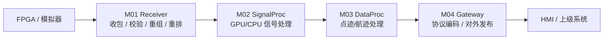
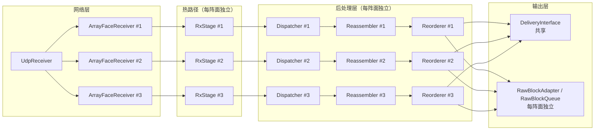
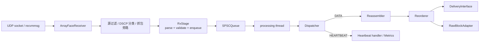
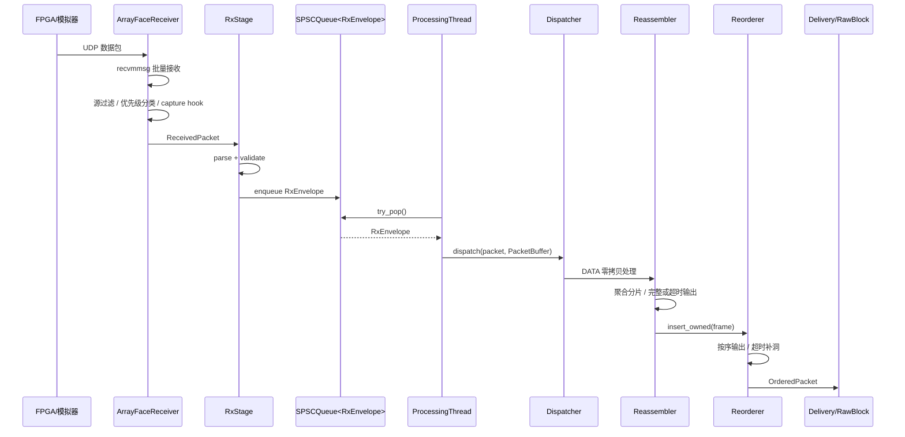

# M01 接收模块全景解读

> 文档目的：把当前项目中的 M01 接收模块整理成一份不依赖代码背景也能理解的说明文档。  
> 判定原则：以当前代码实现为准，设计文档和规划文档只作为辅助背景。  
> 代码范围：`src/m01_receiver/`、`include/qdgz300/m01_receiver/`，以及与其直接耦合的 `src/m02_signal_proc/`、`include/qdgz300/common/`。

## 1. 一句话说明 M01 是什么

M01 是整个后端数据面的入口模块。

它负责把来自 FPGA/模拟器的 UDP 报文，经过接收、初筛、协议校验、分片重组、乱序重排后，整理成下游可以消费的有序数据块；它本身不做 GPU 信号处理、不做航迹处理，也不做最终对外网关编码。

如果把整套系统比作一条工业流水线，M01 不是“算法引擎”，而是“把原始来料稳定、按规则、按顺序地喂给算法引擎的前置生产线”。

## 2. M01 在整个系统里的位置

系统层面，M01 的边界非常清楚：

- 它负责“把数据包变成可交付的有序输入”。
- 它不负责“把输入算成结果”。
- 它也不负责“系统状态机裁决、运维编排和控制平面决策”。

## 3. M01 的职责边界

### 3.1 M01 负责什么

1. 从单阵面或三阵面 UDP 入口收包。
2. 按阵面做网络绑定、CPU 亲和性和源过滤。
3. 解析协议头并做基础合法性校验。
4. 把热路径和后续处理用 SPSC 队列解耦。
5. 区分 `DATA` 与 `HEARTBEAT` 两类主路径。
6. 对 `DATA` 做分片重组。
7. 对重组后的帧做序列重排。
8. 把重排后的结果投递到下游接口。
9. 暴露运行指标、支持抓包、支持部分运行时热加载。

### 3.2 M01 不负责什么

1. M02 的 GPU/CPU 信号处理。
2. M03 的点迹/航迹计算。
3. M04 的对外协议编码。
4. Orchestrator 的系统状态迁移裁决。
5. 控制平面的完整恢复和全链路控制面闭环。

## 4. 先记住这 8 个核心结论

1. 当前 M01 不是单线程串行模块，而是“每阵面一个接收线程 + 每阵面一个处理线程 + 一个主控制线程”的结构。
2. 热路径被刻意压缩到 `RxStage`，只做 `parse -> validate -> enqueue`。
3. 真正较重的逻辑都在后处理线程里完成，不在收包线程里做。
4. 模块内部跨线程通信统一走 SPSC 队列，而且队列满时采用 `drop_oldest` 策略。
5. `DATA` 主路径优先走零拷贝传递，`PacketBuffer` 所有权会沿着流水线继续向后移动。
6. `HEARTBEAT` 不是普通业务包，它在网络层和分发层都享有优先处理语义。
7. M01 对下游同时保留了“通用交付接口”和“RawBlock 适配接口”两套出口。
8. M01 与 M02 的接口已经有明确方向，但当前代码里仍存在结构定义和队列类型未完全统一的问题。

## 5. 模块总览图

这张图体现了两个关键设计原则：

- 横向按阵面拆分，互不共享热路径状态。
- 纵向按处理阶段拆分，收包和重处理通过队列断开。

## 6. 当前真实线程模型

### 6.1 线程角色

当前实现里至少有三类线程：

1. 主线程  
负责应用生命周期、指标服务、信号处理、配置热加载、超时扫描和优雅关闭。

2. 阵面接收线程  
每个 `ArrayFaceReceiver` 一个线程，负责 socket 收包、源过滤、优先级分类、抓包旁路，并把报文送进对应阵面的 `RxStage`。

3. 阵面处理线程  
每个 `FacePipeline` 一个线程，负责从 `RxStage` 的 SPSC 队列取数据，然后执行 `Dispatcher -> Reassembler -> Reorderer`。

### 6.2 线程关系图

```mermaid
flowchart TD
    MT["主线程<br/>app_run()"] --> SCAN["100ms 周期扫描<br/>timeout / reload / metrics"]

    subgraph FACE1["阵面 1"]
        RT1["接收线程<br/>ArrayFaceReceiver#1"]
        HX1["RxStage#1"]
        PT1["处理线程#1"]
        DP1["Dispatcher#1"]
        RS1["Reassembler#1"]
        RO1["Reorderer#1"]
        RT1 --> HX1 --> PT1 --> DP1 --> RS1 --> RO1
    end

    subgraph FACE2["阵面 2"]
        RT2["接收线程<br/>ArrayFaceReceiver#2"]
        HX2["RxStage#2"]
        PT2["处理线程#2"]
        DP2["Dispatcher#2"]
        RS2["Reassembler#2"]
        RO2["Reorderer#2"]
        RT2 --> HX2 --> PT2 --> DP2 --> RS2 --> RO2
    end

    subgraph FACE3["阵面 3"]
        RT3["接收线程<br/>ArrayFaceReceiver#3"]
        HX3["RxStage#3"]
        PT3["处理线程#3"]
        DP3["Dispatcher#3"]
        RS3["Reassembler#3"]
        RO3["Reorderer#3"]
        RT3 --> HX3 --> PT3 --> DP3 --> RS3 --> RO3
    end
```

### 6.3 为什么要这样拆线程

本质原因只有一个：把“必须极快、必须稳定、不能阻塞的动作”和“逻辑更复杂、容忍更高延迟的动作”拆开。

接收线程必须尽快把数据从内核 socket 缓冲区拿出来，否则容易直接丢包；而重组、重排、超时补洞这些动作虽然重要，但不适合和 socket 收包竞争同一条线程。

所以当前设计把它拆成两层：

- 第一层只保证“尽快接住包并做最基础的判断”。
- 第二层再保证“尽可能完整、有序地整理出可交付结果”。

## 7. 启动时到底创建了什么

M01 初始化不是从网络层开始建，而是从下游往上游建。顺序如下：

1. 加载 YAML 配置。
2. 初始化日志和指标系统。
3. 创建共享的 `DeliveryInterface`。
4. 判断是单阵面还是三阵面拓扑。
5. 为每个阵面创建一条独立 `FacePipeline`：
   - `Reorderer`
   - `Reassembler`
   - `Dispatcher`
   - `RxStage`
6. 如果启用了 consumer，再为每个阵面创建：
   - `RawBlockQueue`
   - `RawBlockAdapter`
   - `StubConsumer`
7. 如果启用了抓包，创建 `PcapWriter` 并挂上 `capture_hook`。
8. 最后再创建 `UdpReceiver`，把网络入口接进已经建好的上层流水线。

这种“先建消费者，再建生产者”的方式有一个很现实的好处：

当网络收包线程真正启动时，后面的接收、重组、重排、交付链路已经全部就绪，不会出现“上游开始吐数据，但下游对象还没准备好”的窗口期。

## 8. 运行时主路径总图

这个图就是 M01 的主运行逻辑。理解这条线，就理解了 M01 的大部分行为。

## 9. 按层拆解运行逻辑

### 9.1 网络层：UdpReceiver 和 ArrayFaceReceiver

网络层是 M01 最靠近操作系统的一层。

#### 它做的事

1. 创建并管理每个阵面的 UDP socket。
2. 把每个阵面的接收线程绑到指定 CPU。
3. 可选绑定 NUMA 节点。
4. 使用 `recvmmsg` 批量收包，减少系统调用开销。
5. 使用 `PacketPool` 预分配缓冲区，避免频繁 `malloc/free`。
6. 在进入业务层前完成源过滤、优先级分类和抓包旁路。

#### 它为什么不是一个 socket

因为三阵面模式下，系统把三个阵面视为三个相互独立的网络输入面：

- 每个阵面各自绑定不同 IP。
- 每个阵面可有独立 `source_id` 过滤规则。
- 每个阵面可绑定独立 CPU。

这意味着“三阵面”不是简单的三路业务流，而是三套相互并行的接收面。

#### 它如何决定单阵面还是三阵面

当配置中的下面三组参数都恰好有 3 项时，系统进入三阵面模式：

- `bind_ips`
- `source_id_map`
- `cpu_affinity_map`

否则退化为单阵面模式。

#### 它如何给心跳提优先级

网络层有两种提优先级的方法：

1. IP 层 DSCP 为 `48`（CS6）时，直接认定为高优先级。
2. 即使没有 DSCP，也会回退检查包头里的 `packet_type`，若是 `HEARTBEAT` 也视为高优先级。

然后在一次批量收包中，先把心跳批次投递出去，再投递普通数据批次。

这意味着心跳的优先级不是“写在设计文档里的口号”，而是网络层已经真实实现的调度行为。

### 9.2 热路径：RxStage

`RxStage` 是整个设计里最关键的分层点。

它的职责被刻意收缩为四步：

1. 解析通用头。
2. 做最基础的协议合法性校验。
3. 填充一个轻量 `RxEnvelope`。
4. 推入 SPSC 队列。

#### 为什么它重要

如果没有 `RxStage`，接收线程就必须直接做重组、重排、业务分发，这会让收包线程一旦遇到复杂逻辑或瞬时抖动，就开始和内核 socket 缓冲区“抢时间”，最终增加丢包风险。

`RxStage` 的意义就是强行立规矩：

- 接收线程只做“足够小且稳定”的工作。
- 复杂动作全部移出热路径。

#### 它做了哪些校验

`RxStage` 内部会依次调用 `PacketParser` 和 `Validator`。

当前会确认的内容包括：

- `magic` 是否正确。
- 主版本号是否匹配协议版本。
- `dest_id` 是否是本机设备或广播地址。
- 报文类型是否在当前允许范围内。
- `payload_len` 与报文总长度是否匹配。
- 对心跳包进一步校验 CRC32C。

#### 它故意不做什么

以下事情都被明确禁止出现在 `RxStage` 里：

- 重对象构造。
- 复杂容器查找。
- 频繁动态分配。
- 大量日志输出。
- 下游业务判断。

这不是代码风格问题，而是性能边界问题。

### 9.3 跨线程信封：RxEnvelope

`RxEnvelope` 是热路径和后处理线程之间唯一的标准交接物。

它包含三类信息：

1. 已解析通用头 `CommonHeader`。
2. 接收元数据：
   - 阵面编号
   - 接收时间戳
   - 报文长度
3. 零拷贝缓冲 `PacketBuffer`。

这个设计的核心价值是：

- 消费线程不必重复解析通用头。
- 原始数据缓冲区仍然保留。
- 报文数据不需要在热路径被复制一份。

### 9.4 队列层：SPSCQueue

M01 里的跨线程队列采用 SPSC，即“单生产者、单消费者”。

这和当前结构非常匹配：

- 每个 `RxStage` 只有一个生产者线程，就是对应的接收线程。
- 每个 `RxStage` 只有一个消费者线程，就是对应的处理线程。

#### 队列最重要的行为

队列满时不是阻塞，不是报错退出，而是：

`drop_oldest`

即丢掉队列中最旧的元素，把新元素塞进去。

这代表当前系统在背压场景下的明确取舍：

- 优先让系统继续向前跑。
- 不保证在极端堵塞时保留所有历史数据。
- 更倾向保住“更新鲜”的数据。

这种策略同样出现在 `RawBlockQueue` 中，因此它是 M01 当前数据面的一种统一背压哲学。

### 9.5 分发层：Dispatcher

`Dispatcher` 的职责并不是把数据“分发给很多复杂模块”，而是做一个很窄但非常关键的类型路由：

- `DATA` 走数据主链路。
- `HEARTBEAT` 走心跳处理链路。
- 其他类型当前直接丢弃并计数。

#### 当前最重要的实现事实

`Dispatcher` 现在对 `DATA` 的主路径是同步直通的，不再经过复杂排队中间层。

也就是说，它更像一个“快速分岔口”，而不是一个“异步调度中心”。

#### 心跳处理上它做了什么

对于心跳包，当前除了调用回调外，还会：

- 检查最小载荷长度。
- 校验心跳 CRC。
- 根据心跳序号估算丢失量。
- 更新最后一次收到心跳的时间。

所以心跳并不是“只记个日志”，而是进入了可观测性和健康判断体系。

### 9.6 重组层：Reassembler

`Reassembler` 负责把多片 `DATA` 报文还原成一帧完整的 CPI 数据。

#### 它按什么做重组

它不是仅按序号重组，而是按一组完整的协议键聚合：

- `control_epoch`
- `source_id`
- `frame_counter`
- `beam_id`
- `cpi_count`
- `pulse_index`
- `channel_mask`
- `data_type`

这说明系统把“同一帧”的定义看得非常严格，不允许仅靠一个简单序号混在一起。

#### 它如何保存分片

当前生产路径优先使用零拷贝方式：

- 分片到达时，不立刻把 payload 拷贝进大缓冲区。
- 而是先把原始 `PacketBuffer` 所有权保留在 `FragmentRef` 中。
- 直到判定可以输出时，才按顺序一次性组装最终帧。

这有两个实际好处：

1. 避免每收到一个分片就做一次随机写。
2. 把内存复制集中到“输出前的单次顺序拼装”。

#### 它怎么处理不完整帧

`Reassembler` 并不是“必须等齐全才肯输出”。

当超时发生或关闭时强制冲刷时，它会：

- 推断缺失分片应有大小。
- 对缺失部分做零填充。
- 把结果标记为不完整帧。
- 记录缺失分片索引。

这意味着 M01 的设计目标不是“绝不输出不完整数据”，而是“在有界时间内输出一个语义可识别的结果”。

#### 它怎么处理超时后的迟到分片

一旦某个重组上下文因超时被输出，系统会把该 `ReassemblyKey` 放进一段“冻结窗口”。

在冻结期内到达的同键迟到分片会被直接识别为 late fragment 并丢弃。

这是为了避免一个已经超时结案的帧，又被迟到分片重新污染状态。

### 9.7 重排层：Reorderer

`Reorderer` 解决的是“即使重组完成了，输出顺序仍可能乱”的问题。

#### 它如何工作

当前实现是一个固定窗口 ring buffer：

- 维护 `next_expected_seq`。
- 如果来了期望序号，立即输出。
- 如果来了更新但偏后的序号，先缓存进窗口。
- 如果来了过旧或窗口外的序号，按重复/无效处理。

#### 它怎么处理迟迟等不到的洞

如果一段时间内始终等不到 `next_expected_seq`，它会触发 timeout。

当 `enable_zero_fill` 打开时，它会主动输出一个“零填充占位包”，并推进序列窗口。

也就是说，重排层的目标不是“永远等待完美顺序”，而是“在顺序完整性和实时性之间做有界折中”。

#### 它输出的是什么

输出对象是 `OrderedPacket`，里面包含：

- 已排序后的通用头。
- payload 所有权。
- 是否零填充。
- 是否不完整帧。
- 最终序列号。

这个对象就是 M01 对下游交付前的最后一种内部标准格式。

### 9.8 输出层：DeliveryInterface 和 RawBlockAdapter

重排后的结果当前有两条出口。

#### 出口 A：DeliveryInterface

这是一个更通用的交付抽象，当前支持：

- 回调式交付
- 共享内存交付
- Unix Socket 交付

它的特点是：

- 面向“有序包交付”
- 由所有阵面共享
- 因为共享，所以当前通过 `delivery_mutex` 做并发保护

#### 出口 B：RawBlockAdapter

这是更偏向 M02 的数据面桥接接口。

它把 `OrderedPacket` 转换成 `RawBlock`，然后压入每阵面独立的 `RawBlockQueue`。

这条链路说明当前设计思路非常明确：

- `DeliveryInterface` 更像通用出口。
- `RawBlockAdapter` 更像算法链路入口。

## 10. 当前主路径的逐包生命周期

下面这张图更适合解释“一个 DATA 包来到系统后到底经历了什么”。

## 11. 配置如何影响 M01 行为

M01 不是死逻辑，它很大程度上受配置驱动。

### 11.1 网络与拓扑配置

影响内容包括：

- 监听端口
- 单阵面还是三阵面
- 阵面绑定 IP
- 每阵面的 `source_id` 过滤
- 每阵面的 CPU 亲和性
- `recvmmsg` 批量大小
- socket 接收缓冲区大小
- 每阵面 `PacketPool` 预算

### 11.2 重组配置

影响内容包括：

- `timeout_ms`
- 最大活跃上下文数
- 最大分片数
- 单 key 最大重组字节数
- 推断分片大小使用的 `sample_count_fixed`

### 11.3 重排配置

影响内容包括：

- 重排窗口大小
- 超时阈值
- 是否允许零填充推进

### 11.4 运行时可热加载的内容

当前并不是所有配置都能热加载。

真正支持运行时热调整的只有：

- 日志级别
- 重组超时
- 重排超时
- 抓包开关与抓包参数

像阵面拓扑、socket 绑定、CPU 亲和性这类底层结构，不属于当前热加载范围。

## 12. 关键数据结构说明

### 12.1 ReceivedPacket

网络层给 `RxStage` 的输入。

包含：

- 原始报文缓冲
- 报文长度
- 接收时间戳
- 阵面编号
- 优先级

这是“网络层视角”的数据单元。

### 12.2 RxEnvelope

热路径给后处理线程的输入。

这是“跨线程交接视角”的数据单元。

### 12.3 ParsedPacket

解析后的轻量视图，不持有 payload 所有权，只持有指针。

这是“协议处理视角”的数据单元。

### 12.4 ReassembledFrame

重组完成后的整帧结果。

它已经不再是“一个网络包”，而是一整帧数据。

### 12.5 OrderedPacket

重排完成后准备交付的对象。

它代表的是“按序输出结果”，而不是“原始协议输入”。

### 12.6 RawBlock

这是面向 M02 的桥接数据结构，语义上代表“完整 CPI 原始块”。

但这里恰恰也是当前系统最值得特别说明的耦合点之一，见第 15 节。

## 13. 心跳包在 M01 里的真实地位

心跳并不是一条附属支线，它在当前设计里有三层意义：

1. 网络层优先级保障  
可通过 DSCP 或包型识别被优先处理。

2. 协议层健康校验  
会进行长度和 CRC 校验，并记录丢失量。

3. 运行态健康输入  
会更新 metrics 和最后一次观测时间，影响系统对健康状态的判断。

所以从架构角度看，心跳在 M01 里兼具“报文类型”和“系统健康证据”两种身份。

## 14. 观测、诊断与运维能力

M01 不只是“收包处理模块”，还是一个带观测能力的运行单元。

当前已经具备：

- Prometheus 指标输出
- 每阵面接收队列深度和高水位
- 队列丢弃计数
- 重组迟到片、重复片、上下文溢出、字节溢出统计
- 重排重复包、零填充推进统计
- PacketPool 使用情况
- 运行态系统指标采集
- 原始报文抓包能力

这意味着 M01 当前设计并不是“只关心功能正确”，而是把“可诊断”也当成了正式能力的一部分。

## 15. 前后耦合关系与当前接口现状

这一节最重要，因为它解释了“当前设计已经接到哪”“还差哪一层”。

### 15.1 前向耦合：M01 对上游的依赖

M01 对上游依赖的是协议和网络环境，而不是上游业务流程。

主要依赖项：

1. UDP 网络输入稳定可达。
2. 包头格式符合当前协议版本。
3. `source_id`、`dest_id`、`payload_len` 等字段满足当前校验规则。
4. 三阵面场景下，网口/IP/source_id/CPU 配置能和真实部署对应上。

换句话说，M01 对上游更像“接口契约依赖”，而不是“代码模块依赖”。

### 15.2 后向耦合：M01 对下游的依赖

M01 的后向耦合主要有两类。

#### 第一类：通用交付耦合

即 `DeliveryInterface`。

特点：

- 下游只需要接受有序包。
- M01 不关心下游是不是 M02。
- 更偏抽象、偏通用。

#### 第二类：算法链路耦合

即 `RawBlockAdapter -> RawBlockQueue`。

特点：

- 明显就是在向 M02 的“原始数据块”方向靠拢。
- 这条链路不是抽象语义，而是具体数据面接口。

### 15.3 当前最重要的接口缝隙

当前代码里至少有两个非常明确的未完全统一点。

#### 问题 1：`RawBlock` 有两套定义

M01 侧有一套：

- `include/qdgz300/m01_receiver/delivery/raw_block.h`
- 采用固定 2MB 内联 payload 数组
- 标志位定义较简化

公共类型侧还有一套：

- `include/qdgz300/common/types.h`
- `RawBlock` 包含 `ExecutionSnapshot`
- payload 是外部指针
- 标志位定义更完整，含 `GPU_TIMEOUT`

这说明“RawBlock 作为系统统一数据契约”这件事，目前并没有真正完全收口。

#### 问题 2：M01 和 M02 的队列元素类型未统一

M01 当前 `RawBlockAdapter` 产出的是：

- `SPSCQueue<std::shared_ptr<receiver::delivery::RawBlock>, ...>`

而 M02 `GpuDispatcher` 当前读取的是：

- `SPSCQueue<RawBlock *, ...>`

这不只是所有权模型不同，连类型命名空间和内存布局语义都不完全一致。

结论是：

当前 M01 到 M02 的方向已经明确，但“工程接线”还没有完全收敛成一套统一接口。

### 15.4 当前实际连接状态应该怎么理解

更准确的说法不是“已经完整接通 M01 -> M02”，而是：

- M01 已经具备面向 M02 的桥接设计意图。
- M01 也已经有实际的 `RawBlockAdapter` 和队列输出。
- 但 M02 当前主实现期望的 `RawBlock` 契约和队列类型，和 M01 这侧仍有收口工作要做。

这类问题最适合在接口冻结阶段解决，而不是靠适配层越堆越多。

## 16. 优雅关闭时为什么还要 flush

M01 的关闭并不是简单 `stop()` 后退出，而是有严格逆序的。

关闭顺序大意如下：

1. 先停 `StubConsumer`。
2. 再停 `UdpReceiver`，不让新包进入。
3. 再停处理线程，让它们先把队列里残留的数据尽量排空。
4. 然后停抓包。
5. 再强制 flush 所有 `Reassembler` 上下文。
6. 再 flush 所有 `Reorderer` 缓冲。
7. 再 flush `DeliveryInterface`。
8. 最后停 metrics。

这套顺序说明 M01 的关闭语义不是“马上停”，而是“尽量把已进入系统的数据处理到可交付状态后再停”。

这也是为什么它更像一条工业流水线，而不是一个无状态工具函数。

## 17. 当前设计的优点

### 17.1 热路径边界清楚

`RxStage` 把性能敏感区压得很窄，易于优化，也易于解释。

### 17.2 阵面天然隔离

每阵面独立 pipeline，单面异常不容易把所有阵面状态搅在一起。

### 17.3 零拷贝思路清晰

从网络缓冲到重组阶段，已经尽量避免无意义中间复制。

### 17.4 运行治理意识较强

监控、抓包、热加载、优雅关闭都不是后补，而是设计里明确存在的部分。

### 17.5 对“不完美输入”有明确退化策略

超时、不完整帧、缺片补零、队列丢老数据，这些都体现出系统选择的是“有界退化”，不是“无限等待完美输入”。

## 18. 当前设计的风险与设计债

### 18.1 M01 到 M02 契约未完全统一

这是最现实、也最影响后续链路稳定接线的问题。

### 18.2 队列溢出策略偏向保鲜，可能牺牲完整性

`drop_oldest` 能保系统继续跑，但在极端压测下会让历史连续性变差。

### 18.3 `DeliveryInterface` 共享且带锁

多阵面共享一个 delivery 出口，虽然逻辑清楚，但它天然是一个跨阵面汇聚点。

### 18.4 主线程的 timeout 扫描是周期轮询

当前依赖 100ms 周期主循环做 timeout/reload/metrics 协调，结构清晰，但粒度和时序精度是有限的。

### 18.5 非 Linux 路径能力明显降级

非 Linux 下回退为 `recvfrom` 逐包接收，失去 `recvmmsg` 和 DSCP 辅助信息等优势，所以真实强性能场景仍然是以 Linux 路径为主。

## 19. 如果你不看代码，应该怎样理解 M01

最容易理解 M01 的方式是把它分成四句话：

1. 它先把 FPGA 发来的 UDP 包尽快接住，不让包在入口就丢太多。
2. 它再把这些包做基础合法性筛选，避免脏数据直接污染后续链路。
3. 它把同一帧的数据重新拼好、重新排顺序，必要时在超时条件下做有界退化。
4. 它把整理好的结果交给后级处理模块，同时把运行过程尽量可监控、可抓包、可诊断。

如果要再压缩成一句话：

M01 的本质是“把高频、易抖、易乱序的网络输入，变成可持续、可解释、可交付的后级算法输入”。

## 20. 结论

当前 M01 接收模块已经不是一个“简单收包器”，而是一套相对完整的数据入口子系统。

它已经具备：

- 明确的阵面级并行结构
- 热路径与后处理的严格分层
- 心跳优先级和健康语义
- 分片重组与乱序重排
- 两类下游输出路径
- 指标、抓包、热加载和优雅关闭等运行治理能力

但同时也要看到，它与 M02 的数据契约仍未完全统一，这意味着 M01 当前已经具备成为稳定前置入口的架构形态，但要成为“全链路完全冻结的标准前端入口”，还需要把 `RawBlock` 结构和队列所有权模型做一次彻底收口。
