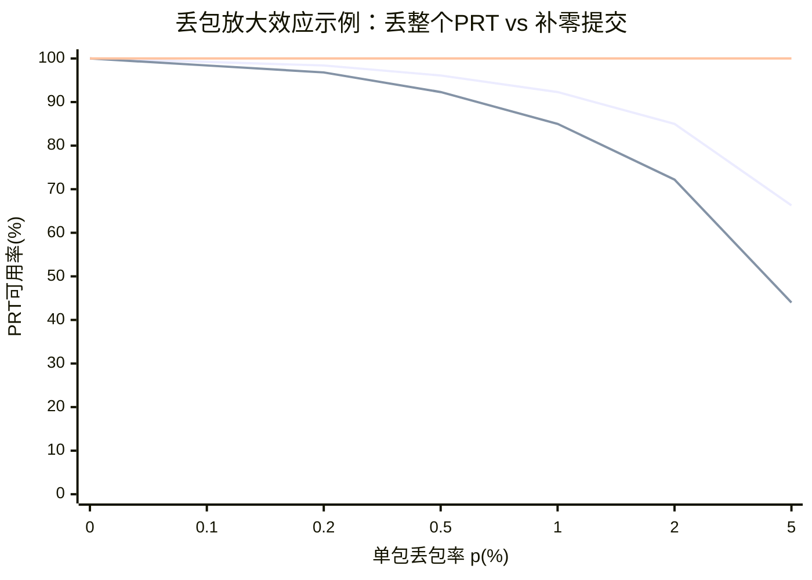

# 雷达后端信号处理软件接收端缺包策略深度调研报告

## 执行摘要

在“雷达后端信号处理系统软件接收端”中，一个PRT（通常等同于PRI/脉冲重复时间对应的一次脉冲回波采样）往往会被切分成多个网络包（常见为UDP承载的IQ样本流或VITA 49/VRT一类的流式封装）。当“缺一个包”发生时，工程上并不存在对所有体制与所有处理链都通用的单一“成熟最优解”；更常见的“业界成熟做法”是将问题拆成三层：**传输层可靠性（是否可FEC/ARQ）、接收端重组与时限控制（能否等、等多久）、信号处理链的缺失容忍与降级（以mask/质量标记驱动下游算法选择）**。这一分层与“接收端核心设计目标”中强调的稳定接收、归属建模、边界确定性、完整性判定、异常隔离与可追溯等方向高度一致。fileciteturn2file0

从性能角度看，“丢整个PRT”与“补零提交”差别并不只在于是否保留该PRT：由于一个PRT往往由多个包组成，**“丢整个PRT”会把单包丢包率放大为PRT级丢失率**，放大程度随“每PRT包数”呈指数式恶化（本报告给出可直接用于工程估算的曲线与公式）。更重要的是，不同雷达处理链对缺失的位置与形态（快时间缺口、慢时间缺脉冲、随机/周期性缺失、突发丢包）敏感性不同：  
- 在慢时间相干处理（MTI/脉冲多普勒、成像方位向处理）中，缺脉冲可视为**非均匀采样/PRI扰动**，会引入更高多普勒旁瓣、杂波泄漏与虚假响应，必须通过**非均匀采样谱估计、NUDFT/NUFFT、加权窗/自适应估计**等方法缓解；这类思路在近十年文献中非常活跃。citeturn7view3turn34view0turn29view0  
- 在快时间脉压/匹配滤波中，缺失样本会影响脉压输出并可能产生伪影，成像领域对“方位向周期性缺失数据”已有从插值、谱估计到RELAX/MIAA、稀疏重建的系统性研究，并报告在高缺失率下仍可恢复聚焦图像（例如50%周期缺失的可恢复示例）。citeturn11view0  
- 在特定结构信号（如OFDM被动雷达参考信号）中，针对“缺采样导致显著性能退化”的问题，有基于星座/带外能量约束的优化重建方法，并在仿真与实测数据上验证对解调与检测的改善。citeturn10view1

因此，面向“缺一个包时丢整PRT还是补零提交”的接收端逻辑设计，本报告给出的推荐是：**默认不把“网络包完整性”硬绑定为“PRT有效性”的单一判据**，而是输出固定边界的PRT/块，并携带“缺失mask + 时间戳/序列号一致性 + 质量标志（如PLL锁定、样本丢失指示）”；在此基础上按实时性与丢包率选择：低丢包且严格实时优先补零/标记；丢包较高且相干处理敏感时结合非均匀处理/自适应估计；若允许一定延迟则可引入小窗口选择性重传或低开销FEC。相关机制（时间戳、包计数、有效性/样本丢失指示）在VITA 49/VRT等标准与工程实现中已有成熟字段支撑。citeturn33view2turn12view2turn10view3

## 问题定义与关键约束

### PRT在后端软件语境中的定义与数据形态

在经典脉冲体制中，脉冲重复间隔（PRI）/脉冲重复时间（PRT）是相邻两次脉冲之间的时间间隔；一个相干处理间隔（CPI）通常由M个脉冲构成，满足 \(T_c=M T_r\)，其中 \(T_r\) 即PRI。citeturn12view0  
从后端软件角度，“一个PRT”往往对应：**某通道（或多通道）在一次发射后接收到的快时间IQ序列**（覆盖多个距离单元/采样点），并在网络传输时被切分为若干包（每包承载一段连续样本）。VITA 49/VRT对这类流式承载给出了典型抽象：IF Data Packet的payload由样本流中的“连续子序列”构成，且包内可携带与首个样本对应的时间戳。citeturn12view2turn33view2

因此，“缺一个包”至少有两种不同的缺失语义（工程上必须区分，否则策略会选错）：  
- **PRT内缺口（快时间缺样本段）**：该PRT仍有部分样本可用，但存在一段连续缺失。  
- **慢时间缺脉冲（相干序列缺PRT）**：若把“缺任一包”定义为“PRT无效并整体丢弃”，则等价于在慢时间上丢掉一个脉冲观测。

### 关键工程约束清单（未指定项按情景分析）

下述约束决定“丢整PRT vs 补零 vs 重建”的选择边界；用户未提供具体数值者在后文矩阵中以“低/中/高”情景覆盖，并显式标注“未指定”。

- **PRT定义**：与PRI等同（常见）或为软件自定义“处理块/子帧”。（未指定）citeturn12view0  
- **每PRT包数P、包大小**：决定丢整PRT的“丢包放大效应”（后文给出曲线）。（未指定）  
- **实时性/延迟预算**：是否允许为等包、FEC解码或重建算法预留缓冲（毫秒级到CPI级）。（未指定）  
- **丢包率范围与形态**：随机丢包 vs 突发丢包（burst）对FEC/插值的有效性差异极大。（未指定）  
- **是否可重传**：若承载在UDP上，协议本身不保证交付/去重/顺序；可靠性需在应用层或改用其他机制实现。citeturn32view0  
- **是否有时间戳/序列号/包计数**：决定能否检测缺失、乱序、重复并做重组。VITA 49定义了modulo-16的Packet Count并规定逐包递增；同时支持多种时间戳类型（如基于样本计数的高精度时间码）与Stream ID区分多流。citeturn33view2turn12view2  
- **后端处理对缺失数据的容忍度**：  
  - 相干处理（脉冲多普勒、MTI、方位向成像）往往需要相位一致性与时间基准稳定；相干积累增益与脉冲数直接相关。citeturn31view1turn31view0  
  - 检测门限/CFAR对噪声与异常值敏感，缺失导致的能量泄漏/旁瓣会改变统计特性。citeturn31view1  
- **是否需要质量标记**：VITA 49 Trailer/状态指示提供“有效数据”“参考锁定（PLL锁定）”“样本丢失”等指示位，可用于相干性判断与降级决策。citeturn10view3turn33view3  
- **接收端软件总体目标**：建议遵循“边界确定性、完整性判定、异常隔离与可追溯、对下游稳定接口”等设计原则，而非把网络层异常直接泄漏到信号处理层。fileciteturn2file0

## 常见策略与推荐算法体系

本节按“从传输到信号处理”的层次给出常见策略。需要强调：很多论文讨论的是“故意非均匀PRF/稀疏发射/中断成像”而非“网络丢包”，但从数学上均会落到**非均匀采样、缺失观测、或数据间断**，可直接借鉴到缺包处理。

### 丢弃整个PRT

**做法**：若某PRT缺任一包，则将该PRT视为无效，直接不输出或输出“空PRT”（效果等同在慢时间该脉冲全零）。  
**优点**：  
- 实现最简单；避免PRT内“半包数据”引入不可控伪影。  
- 对下游若强依赖“每PRT全量快时间样本”的算法，避免复杂分支。  
**主要代价与风险**：  
- **丢包放大效应**：若每PRT由P个包组成，单包丢包率为p，则“PRT可用率”约为 \((1-p)^P\)。P越大，PRT层面损失越严重（后文图表）。这是许多工程团队在高带宽UDP采集时遇到的“吞吐看似只丢一点包，但CPI里缺脉冲明显增多”的根源。  
- 慢时间缺脉冲意味着非均匀采样/缺采样，会带来更高多普勒旁瓣与杂波泄漏，需要额外处理；随机PRI扰动研究指出，PRI随机化虽然能扩展无歧义多普勒，但也会“以更高旁瓣为代价”，并需要自适应估计/杂波抵消抑制旁瓣。citeturn34view0turn7view3  
- 相干积累增益与脉冲数相关：相干积分增益等于相干积分脉冲数，减少有效脉冲会直接降低检测增益。citeturn31view1turn31view0  
**适用场景**：  
- 丢包率极低且P很小，或系统允许把“缺一个包”视为“整脉冲不可信”（例如包切分点与关键同步/校准段强绑定）。  
- 下游算法无法处理PRT内mask且无法接受固定长度但含缺口的数据结构（例如硬件加速核只接受满数据）。  
**对检测/跟踪/成像影响（典型）**：  
- **检测（脉冲多普勒/MTD）**：有效脉冲数下降导致处理增益下降；缺脉冲造成谱旁瓣/虚警上升风险，需要窗/自适应谱估计。citeturn31view1turn34view0  
- **成像（SAR方位向）**：方位向缺失会产生伪影目标并劣化图像质量；成像领域往往倾向“重建缺失”而非直接丢弃。citeturn11view0

### 补零/填充后提交（PRT边界固定）

**做法**：PRT输出边界固定；缺失包对应的样本区间用0（或常数/噪声）填充，同时携带缺失mask与质量标志。  
**优点**：  
- **保持下游接口稳定**：PRT尺寸、节拍与处理流水线固定，利于严格实时与并行化；也符合“边界确定性/对下游稳定接口”的工程目标。fileciteturn2file0  
- 对PRT内缺口，可保留未受影响的其他样本区间（相比“丢整PRT”更不浪费数据）。  
- 可以把“缺失知识”显式交给下游（mask驱动），实现分层降级：检测可用全量数据做CFAR，但跟踪/成像可对缺失段降权或剔除。  
**主要代价与风险**：  
- 0填充在频域等效于对原信号加窗/打孔，可能引入旁瓣或伪影；若下游未经mask-aware处理，可能把“填零造成的结构性泄漏”误判为目标或干扰。  
- 若缺失发生在对相位/幅度至关重要的段（例如用于校准、脉压关键区间），补零可能比丢弃更“隐蔽且危险”（错误更难被发现）。  
**适用场景**：  
- 严格实时（不允许等待/重传），且需要固定节拍输出。  
- 下游指标准备以mask/质量标记做鲁棒处理（推荐）。  
**实现要点（成熟做法）**：  
- 必须携带：PRT ID（或时间戳）、包计数/序列号范围、缺失bitmap、质量旗标（PLL锁定、有效数据、样本丢失等）。VITA 49 Trailer中“Valid Data”“Reference Lock”“Sample Loss”等指示为此类目标准备了字段语义。citeturn10view3turn33view3  
- 对突发丢包要区分“PRT内连续缺口长度”与“跨PRT缺脉冲”，分别统计给下游。  

### 基于插值/预测的重建（信号级缺失恢复）

这一类方法其实对应两种不同问题：

- **慢时间缺脉冲/非均匀慢时间采样**：目标是估计多普勒谱或做相干积累。  
- **快时间缺样本段**：目标是恢复脉压输入或直接在脉压输出域补偿。

#### 非均匀采样谱估计、NUDFT/NUFFT、Lomb–Scargle与加权插值

在脉冲多普勒处理中，经典FFT假设慢时间均匀采样。Sandia的分析指出，传统处理往往“为了使用FFT而假设/重采样为均匀间隔”，但均匀采样会产生栅瓣（grating lobes）导致多普勒歧义；同时为控制旁瓣常需幅度加窗，而加窗会带来SNR损失。citeturn7view3turn30search11  
当出现缺脉冲或不规则到达时，可视为非均匀采样问题：  
- 采用NUDFT/NUFFT、Lomb–Scargle等框架直接在不等间隔样本上做谱估计/目标检测，可以避免“硬补齐后FFT”带来的失真。近十年在“非均匀PRI雷达”中已有系统性框架：例如IEEE Access论文摘要明确提到利用非均匀PRI关系进行相干处理，并在多普勒域设计优化加权窗以抑制由非均匀序列引入的旁瓣，同时关键词包含NUDFT与迭代优化。citeturn29view0  
- 对强杂波情形，IET相关研究提出“加权带限插值（WBI）”的多普勒处理思想：用sinc为核并根据可变采样间隔加权，目标是生成接近均匀PRF处理的谱并压制非均匀PRF引入的杂波旁瓣。citeturn30search1turn9search2  
- 更一般的信号处理理论也指出：带限信号在满足一定采样条件时可以从非均匀样本恢复，但实现通常比均匀采样复杂；并给出从非均匀样本进行近似重建的sinc插值框架。citeturn35view0  

#### AR模型、RELAX/MIAA/GAPES一类谱估计与成像缺失恢复

成像（尤其SAR方位向）对缺失数据的系统性研究更成熟。MDPI的SAR缺失数据工作指出：方位向周期性缺失会造成伪影目标并显著劣化成像质量；其方法基于RELAX进行缺失恢复，并报告在周期缺失率达到50%时仍能恢复SAR回波并获得较好聚焦图像，且用图像熵与SSIM等指标对比证明优势。citeturn11view0turn11view2  
这类结果对“雷达后端缺包”有两点工程启示：  
1) 当缺失呈结构性（周期/规律性、或由模式切换导致的“固定位置缺口”）时，**模型化重建往往优于简单丢弃**；  
2) 但这类算法计算量高、对参数与数值稳定性敏感，实时化需要严谨的工程取舍（后文给出矩阵建议）。

### 基于模型的恢复与缺失感知处理（CS、EM、结构化估计）

#### 稀疏/压缩感知与“混合重建”

在多功能雷达“稀疏发射/交织脉冲”的背景下，IEEE RadarConf 2017相关工作提出：在一个CPI内以稀疏方式交织发射/接收脉冲，然后用稀疏重建恢复全分辨率距离-多普勒图，并把“观测到的数据”与“稀疏恢复结果”混合，以提升噪声环境下鲁棒性；论文还使用真实实验数据验证有效性。citeturn23view1  
这与“丢脉冲/缺包”情形高度同构：当缺失比例中高、但场景（目标在距离-速度域）具有稀疏性时，CS类方法可作为“高价值目标保底策略”，尤其适用于离线或半实时成像/检测。

#### 缺失数据下的协方差/统计量估计（EM与结构化约束）

对阵列处理与STAP一类算法而言，缺失数据会破坏协方差估计与自适应滤波。针对这一点，IEEE TSP 2021论文（arXiv条目）专门研究“缺失数据下结构化协方差矩阵的最大似然估计”，用EM方法优化观测数据似然，并将其用于波束形成与源数检测等雷达问题。citeturn24view0  
这类方法的工程意义在于：即使接收端采取补零/丢弃策略，只要把缺失mask传到统计估计模块，仍有机会用“缺失感知的统计估计”减小自适应处理性能损失。

#### 特定结构信号（OFDM）下的缺样本优化恢复

在被动雷达中，参考通道OFDM信号缺采样会导致显著性能退化，因此出现了利用OFDM结构（带外能量与星座点约束）的优化恢复方法，并在仿真与真实数据中验证：该方法可在少量迭代内显著改善信号质量与解调性能（例如条件数改进数量级、BER门限相关分析等）。citeturn10view1  
工程上可推广为：若雷达体制/波形有强结构约束（相位编码、已知导频、重复码、校准序列），**缺包恢复应优先利用结构先验**，而不是通用插值。

### 重传/ARQ、冗余发送、FEC（传输层/应用层可靠性）

若缺包主要来自网络传输而非前端采样，优先级通常应为“先把丢包降到最低”，再谈后端补救。但在不可避免的丢包/拥塞下，仍可引入可靠性机制：

- **UDP本身不保证交付与去重**：RFC 768明确指出UDP是“事务式”，交付与重复保护都不保证；需要可靠有序则应由上层机制提供。citeturn32view0  
- **修复技术谱系**：IETF对实时媒体的总结型文档将“冗余发送、重传、交织、FEC”作为典型修复手段并讨论适用性。citeturn37view0 这为雷达“实时流式数据”提供了成熟的设计语言：  
  - **FEC**：如RTP的通用FEC载荷格式（基于异或/分组保护）以及可按丢包情况实现完全或部分恢复；citeturn32view3 或使用RaptorQ这类喷泉码（rateless erasure code），可按需生成修复符号并在收到略多于源符号时恢复对象。citeturn32view4  
  - **ARQ/重传**：IETF关于RTP重传指出“重传对具有较宽松时延约束的实时应用是有效的丢包恢复技术”，其关键前提是存在反馈通道且可容忍额外延迟。citeturn37view1  
- **雷达后端的现实约束**：严格实时（例如固定波束驻留/固定CPI出图时限）通常不允许等待重传；因此“重传/ARQ”更常用于**记录回放、离线处理、或有回传链路且端到端时延预算宽松**的系统。

### 软决策融合、相位/多普勒一致性校验与质量门控

**软决策/融合**在这里的关键不是“用更复杂的统计检测替代简单门限”，而是：把“缺失/不确定性”显式纳入权重与状态估计。  
- 在检测层面，可用缺失mask调整相干积累加权、或在多普勒谱估计中引入缺失感知的估计器（如自适应估计抑制旁瓣）。相关随机PRI研究强调：随机化带来更高旁瓣，需要自适应估计与抵消配合以揭示被杂波/旁瓣掩蔽的小目标。citeturn34view0  
- 在跟踪层面，track-before-detect类方法通过“同时估计轨迹与反射系数并长时间相干积累”提升低SNR机动目标检测能力，且将积分结果用于Neyman–Pearson检测与CFAR阈值。该类框架天然能处理“跨CPI的证据累积”，也更容易兼容“部分缺失观测”（以缺失为未观测时刻、或以权重降低其贡献）。citeturn38view0turn31view1  
- **相位一致性/质量门控**：若数据携带“参考锁定（PLL locked）”“有效数据”“样本丢失”等指示位，可在接收端或下游做硬门控：例如PLL未锁定时禁止相干积累，只允许非相干处理；样本丢失指示置位时触发降级策略。VITA 49 Trailer语义与Matlab对VITA49字段的解释为此提供了直接字段依据。citeturn10view3turn33view3  

## 性能影响与评估方法

### 缺失对相干积累、检测与旁瓣的典型影响机制

- **相干积累增益与脉冲数**：雷达课程材料指出相干积分增益等于相干积分脉冲数；并给出2、10、20脉冲时的典型dB增益量级。citeturn31view1 另一份脉冲多普勒设计材料用公式表达SNR增益约为 \(10\log_{10}(N)\)。citeturn31view0  
  因此，“丢整PRT”会通过减少有效脉冲数直接降低期望增益；而“补零”若不改变有效脉冲数，但引入非均匀权重/缺口，则更多体现为**旁瓣升高、杂波泄漏、虚警上升**。citeturn7view3turn34view0  
- **非均匀采样导致的谱结构变化**：Doerry指出均匀采样导致栅瓣并带来多普勒歧义；非均匀采样可用于消歧，但需要正确的谱估计与样本密度缩放等处理细节。citeturn7view3  
- **成像伪影**：SAR方位向周期性缺失会产生“人工伪影目标”并劣化成像质量，必须先恢复缺失数据再完成后续压缩处理；相关工作用图像熵与SSIM做量化比较。citeturn11view0turn11view2  
- **结构化信号解调与检测退化**：OFDM缺采样会造成显著性能退化，促使研究者引入利用星座点与带外约束的优化重建以改善解调与检测性能。citeturn10view1  

### 评估方法与关键指标体系（建议最小闭环）

为避免“只看链路丢包率、忽略处理链放大与旁瓣效应”，建议建立可重复的仿真/回放评估闭环：

- **输入激励**：  
  - 随机丢包（Bernoulli）与突发丢包（Gilbert–Elliott或固定burst长度）两类都要覆盖。  
  - 缺失形态要区分：PRT内缺口、整PRT缺失、周期缺失、随机缺失（成像论文明确将随机缺失与周期缺失作为不同模式讨论）。citeturn11view0  
- **输出指标**：  
  - 检测：Pd、Pfa、CFAR门限稳定性、虚警空间分布。citeturn31view1  
  - 估计：距离/速度估计偏差与方差、多普勒旁瓣峰值与旁瓣底（sidelobe pedestal）、相位误差。citeturn34view0turn29view0  
  - 跟踪：航迹RMSE、丢失率、门关联稳定性（soft gating/权重策略对比）。citeturn38view0  
  - 成像：聚焦质量（图像熵、SSIM等）、伪影强度、目标可分辨性。citeturn11view2  
  - 工程：端到端延迟、抖动、CPU/内存占用、带宽开销（FEC冗余或重传开销）。citeturn37view0turn32view3  

### 图表示例：丢整PRT的“丢包放大效应”（工程估算用）

下图用简单独立丢包模型展示：若每PRT由P个包组成，单包丢包率p看似很小，PRT可用率却会显著下降；而“补零提交”在“PRT可用率（是否输出）”意义下恒为100%，但需要下游mask-aware处理来控制伪影与旁瓣。



> 注：该曲线仅用于解释“放大效应”，未计入突发丢包与链路拥塞相关性；实际突发丢包会使“丢整PRT”更糟，且会触发更复杂的旁瓣/伪影问题（需要下节的非均匀处理/自适应估计）。citeturn34view0turn7view3  

## 近十年重要论文、标准与工程实现案例

### 非均匀PRI/非均匀采样处理与旁瓣控制

- Sandia的非均匀PRF多普勒处理报告指出：传统处理往往假设均匀采样以便FFT，但均匀采样导致栅瓣与歧义；非均匀采样可带来消歧与旁瓣/窗函数相关的SNR权衡，并强调样本密度缩放等细节。citeturn7view3turn30search11  
- 随机PRI扰动的近期工作明确指出：随机PRI可显著扩展无歧义多普勒范围，但代价是更高旁瓣；通过“杂波抵消 + 自适应多普勒估计”可抑制旁瓣并揭示被掩蔽目标，并用仿真与外场测量验证。citeturn34view0  
- IEEE Access对非均匀PRI提出相干检测框架，强调利用PRI关系实现无歧义距离/速度测量，并在多普勒域设计加权窗抑制非均匀序列引入的旁瓣，关键词包含NUDFT与迭代优化。citeturn29view0  
- 强杂波情形下的WBI思想：用sinc核并依据可变采样间隔加权，以获得类似均匀PRF处理的谱并压制不需要的旁瓣（该思路在IET相关研究摘要与公开片段中可见）。citeturn30search1turn9search2  

### 成像缺失数据恢复（SAR）

- SAR方位向周期性缺失数据的研究对缺失模式做了明确分类，并指出周期缺失会造成伪影与成像劣化；基于RELAX的恢复方法在缺失率达到50%时仍可获得较好聚焦图像，并用图像熵与SSIM量化比较。citeturn11view0turn11view2  

### 缺失样本恢复（被动雷达/OFDM）

- IET Radar, Sonar & Navigation 2024工作给出：针对OFDM信号中存在数据缺口（缺样本）的情况，提出利用带外能量与星座点位置构造目标函数并迭代优化来恢复缺失样本，面向被动雷达参考信号质量与目标检测改进，并在仿真和真实数据上评估。citeturn10view1  

### 缺失数据下的统计估计（阵列/自适应处理）

- IEEE TSP 2021（arXiv条目）研究“缺失数据下结构化协方差矩阵估计”，以EM优化观测似然，并用于波束形成与源数检测等雷达应用。citeturn24view0  

### 传输封装、时间戳与质量标志（标准与工具链）

- VITA 49/VRT：定义了Stream ID、Packet Count（modulo-16并逐包递增）、多种时间戳（时间关联首样本）、payload为样本流连续子序列，并规定数据包含Trailer用于状态/事件指示。citeturn33view2turn12view2turn33view3  
- 工具链侧（MathWorks对VITA49字段的解释）明确给出“ValidDataIndicator、ReferenceLockIndicator、SampleLossIndicator”等语义，可直接映射为工程质量门控信号。citeturn10view3  
- 时钟同步：IEEE 1588被NIST教程概述为用于网络分布式系统时钟同步的协议，为跨设备时间戳一致性提供基础。citeturn12view3  

### 实际系统/厂商实现案例（与“缺包策略”直接相关的三类证据）

- **原始ADC/IQ通过UDP分包传输**：entity["company","Texas Instruments","semiconductor vendor, us"] 的毫米波开发套件配套板卡DCA1000将多接收天线原始ADC数据以UDP包发送；文献给出了payload包含“sequence number”和“bytes count”，并指出单个chirp数据会被拆成多个UDP包；其Python实时处理建议包含“清空缓冲以保持实时响应”（本质上是一种低延迟优先的丢弃策略）。citeturn14view0  
- **高码率前端通过100GbE以UDP/VITA49流式输出**：某高码率EW/采集架构示例描述了RFSoC FPGA将ADC样本封装成Raw IQ UDP包或VITA-49标准流，通过100GbE实时流出并由记录服务器接收写盘，体现“UDP流式传输 + 后端重组/落盘”的典型工程形态。citeturn14view1  
- **雷达视频/极坐标存储的多播UDP分发**：entity["company","Curtiss-Wright","aerospace and defense, us"] 的RVP雷达视频分发方案将编码后的雷达视频以以太网多播UDP包发送，并明确指出网络负载取决于可接受的图像损失程度（这类系统往往默认“可丢包但需可用”）。citeturn14view2  

这些案例共同指向：**在高码率雷达数据链路中，“UDP + 序列号/计数 + 接收端重组 + 可控丢弃/降级”是非常常见的工程现实**。citeturn32view0turn14view0turn12view2  

## 场景化推荐矩阵与工程实现建议

### 推荐策略矩阵（未指定参数按情景覆盖）

下表以三维情景（丢包率：低/中/高；重传：允许/不允许；实时性：严格/宽松）给出建议。表中“PRT输出策略”回答用户核心问题；“下游处理建议”强调mask-aware与非均匀处理是把性能损失“关在可控范围内”的关键。

| 丢包率（单包） | 是否允许重传 | 实时性 | PRT输出策略（接收端） | 下游处理建议（检测/跟踪/成像） | 代价与注意点 |
|---|---|---|---|---|---|
| 低 | 不允许 | 严格 | **补零提交 + 缺失mask/质量旗标**（默认推荐） | 脉冲多普勒：缺失感知加权/NUDFT或窗口优化；跟踪：软门控/降权；成像：必要时局部重建 | 避免“丢整PRT放大效应”；必须防止mask被忽略导致虚警 |
| 低 | 不允许 | 宽松 | 补零提交（可选：小窗口等待乱序） | 可离线重排/轻量插值；相干处理可做缺失感知谱估计 | 缓冲会增加延迟与存储 |
| 低 | 允许 | 严格 | **不建议依赖重传**（除非RTT显著小于PRT预算）；仍以补零为主 | 同上 | 重传会引入不可控抖动，破坏固定节拍 |
| 低 | 允许 | 宽松 | **选择性重传（限时）+ 超时补零**；必要时配合轻量FEC | 相干处理优先使用完整数据；缺失段仍需mask | 需反馈通道；增加协议复杂度与带宽/延迟 |
| 中 | 不允许 | 严格 | 补零提交 + **统计到CPI层的缺失率门控**（缺失过高则降级/跳过相干积累） | 脉冲多普勒：采用非均匀采样/自适应估计抑制旁瓣；成像：若任务关键则转离线重建 | 优先控制旁瓣/杂波泄漏，否则Pfa上升 |
| 中 | 不允许 | 宽松 | 补零提交 + 可选“PRT内插值/预测”或“CPI后处理重建” | 成像/高分辨目标：可用RELAX/MIAA/稀疏重建等更强方法 | 计算量显著增加 |
| 中 | 允许 | 严格 | 小窗口“最多补齐1–2包”否则补零；可考虑低冗余FEC（如异或校验） | 相干处理mask-aware；跟踪融合利用软权重 | 需要严格控制等待时间，避免系统性延迟漂移 |
| 中 | 允许 | 宽松 | **优先FEC或选择性重传**，保证PRT/CPI完整；缺失仍以mask传递 | 相干积累接近理想；成像质量更稳定 | 带宽开销上升；实现复杂度上升（编码/解码/反馈） |
| 高 | 不允许 | 严格 | **两段式策略**：先补零提交，但当缺失超过阈值（例如PRT内缺口>某比例或CPI缺失>某比例）时，标记该CPI不可相干处理（仅做非相干/低分辨模式） | 脉冲多普勒：采用自适应估计/缺失感知处理，否则旁瓣极高；跟踪：靠模型预测维持 | 高丢包下“丢整PRT”会雪崩式恶化 |
| 高 | 不允许 | 宽松 | 进入“离线/延迟允许”模式：重建优先（稀疏/模型/分块重建） | SAR/高分辨：参考成像缺失恢复文献体系；检测：可用CS/TBD等 | 计算/内存开销最大 |
| 高 | 允许 | 严格 | 若仍要求严格实时，**更推荐FEC而非重传**（重传难以在时限内收敛）+ 补零兜底 | 相干处理仍需mask-aware；必要时降级分辨率/更新率 | FEC带宽被动增加，需链路余量 |
| 高 | 允许 | 宽松 | 以“可靠交付”为目标：重传+FEC组合；并保持mask与质量旗标 | 可接近完整数据性能；适合记录回放/任务关键成像 | 协议/系统复杂度最高 |

> 阈值如何定：建议以“对任务性能最敏感的指标”反推（Pd/Pfa、旁瓣底、图像SSIM/熵、航迹RMSE），并在回放数据上做蒙特卡洛注入缺失评估。citeturn31view1turn11view2  

### 接收端决策流程图（Mermaid）

```mermaid
flowchart TD
    A[收到网络包] --> B[解析与校验: 头/长度/CRC(若有)]
    B --> C[归属: Stream/Channel/PRT_ID/PacketIndex]
    C --> D[写入PRT重组缓冲 + 更新bitmap]
    D --> E{PRT已齐?}
    E -->|是| F[提交PRT: samples + mask(全1) + 质量旗标]
    E -->|否| G{达到截止时间?}
    G -->|否| D
    G -->|是| H{允许修复?}
    H -->|FEC可解| I[FEC解码补齐缺包]
    I --> F
    H -->|可重传且仍在预算| J[发送NACK/请求缺包]
    J --> K{重传到达?}
    K -->|是| D
    K -->|否| L[按策略降级: 补零 或 丢整PRT]
    H -->|不允许| L
    L --> M[提交PRT: samples + mask(缺失) + 错误码/计数]
```

该流程的关键是：**“提交”不等于“认为数据完好”**，而是把缺失显式传递，并保持边界确定性与可追溯；这与接收端设计目标中的“完整性判定、异常识别、异常隔离与对下游稳定接口”等诉求一致。fileciteturn2file0  

### 工程实现的具体建议

#### 协议字段与元数据设计（强烈建议“先把可观测性做对”）

1) **必须有序列号/计数**：  
   - 若用VITA 49：利用Packet Count（modulo-16递增）与Timestamp（对应首样本）以及Stream ID区分流。citeturn33view2turn12view2  
   - 若为自定义UDP封装：至少携带32-bit递增序列号（TI DCA1000示例即如此），并在接收端实现乱序重排与缺包检测。citeturn14view0  

2) **必须有时间基准**：跨节点相干处理需要时间戳一致性；可采用VITA49时间戳字段并用IEEE 1588做时钟同步基础设施。citeturn12view2turn12view3  

3) **质量旗标必须贯通**：把“PLL锁定/参考锁定”“样本丢失”“有效数据”这类信息从接收端送达相干处理模块，用于门控和降级。citeturn10view3turn33view3  

#### 包切分与P值选择：避免“丢整PRT”放大效应

- 若系统倾向“缺包即丢整PRT”，则应尽量降低每PRT包数P（更大MTU、更合理的样本打包），否则PRT丢失率会按 \((1-p)^P\) 指数恶化（见前图）。  
- 若系统采用“补零+mask”，P可以按吞吐/缓存友好而定，但仍应避免过小包导致包头开销与中断开销飙升（这是吞吐丢包的常见诱因之一，尤其在高pps场景）。

#### 下游算法的“缺失感知”最低配

- **脉冲多普勒/MTD**：至少要做到两件事：  
  1) 用mask对慢时间序列做加权（缺失为0权重），再选择NUDFT/NUFFT或等效的非均匀谱估计，而不是盲目把缺失当真实零回波；citeturn29view0turn7view3  
  2) 对旁瓣敏感场景（强杂波/强目标旁瓣掩蔽弱目标），考虑引入自适应估计/抵消框架（随机PRI研究表明，自适应估计对抑制“随机化带来的旁瓣上升”尤为关键）。citeturn34view0  

- **成像（SAR/方位向处理）**：  
  - 缺失率低：可先用简单插值/带限插值；  
  - 缺失率中高或呈周期缺失：优先考虑RELAX/MIAA或稀疏重建（文献表明在周期缺失率50%时仍可恢复聚焦图像）。citeturn11view2turn35view0  

- **跟踪/融合**：  
  - 缺失PRT应作为“未观测时刻”进入滤波器，保持预测；  
  - 若能在检测前进行沿轨迹积累（TBD），对低SNR与不连续观测更稳健但计算代价高。citeturn38view0  

### 伪代码示例（接收端PRT重组与降级提交）

```pseudo
# 假设：每个PRT由 P 个包组成；每包带 (stream_id, prt_id, pkt_idx, seq, timestamp, payload)
# 输出：固定结构 PRTFrame{prt_id, timestamp0, samples[], missing_mask[], quality_flags, error_code}

struct PRTBuffer:
    prt_id
    timestamp0           # 首样本时间戳（或PRI计数）
    samples[PRT_LEN]      # 预分配，缺失处可先置0
    received_bitmap[P]   # bitset
    quality_flags_accum  # OR 合并（PLL锁定、valid、sample_loss等）
    deadline_time

on_packet(pkt):
    if not crc_ok(pkt): stats.crc_err++; return
    key = (pkt.stream_id, pkt.prt_id)
    buf = get_or_create_prt_buffer(key)
    if buf.timestamp0 is unset: buf.timestamp0 = pkt.timestamp
    if pkt.pkt_idx in [0..P-1] and not buf.received_bitmap[pkt.pkt_idx]:
        copy payload -> samples[ offset(pkt.pkt_idx) : offset+len ]
        buf.received_bitmap.set(pkt.pkt_idx)
    else:
        stats.dup_or_oos++
    buf.quality_flags_accum |= pkt.trailer_flags
    try_commit(buf)

try_commit(buf):
    if buf.received_bitmap.all_set():
        emit_frame(buf, error_code=OK)
        release(buf)
    else if now() >= buf.deadline_time:
        missing = inverse(buf.received_bitmap)
        if policy == "DROP_WHOLE_PRT":
            emit_frame_empty(prt_id=buf.prt_id, timestamp0=buf.timestamp0,
                             missing_mask=ALL_MISSING, error_code=INCOMPLETE_DROPPED)
        else if policy == "ZERO_FILL_AND_FLAG":
            # 未收到的分段保持为0，同时输出missing_mask
            emit_frame(buf, missing_mask=missing, error_code=INCOMPLETE_ZEROFILL)
        else if policy == "FEC_THEN_ZEROFILL" and fec_can_recover(buf):
            recover_missing_segments(buf)
            emit_frame(buf, error_code=RECOVERED_BY_FEC)
        else:
            emit_frame(buf, missing_mask=missing, error_code=INCOMPLETE_ZEROFILL)
        release(buf)

# 注：若允许重传，可在 deadline 前按缺失bitmap触发NACK，但必须受限于端到端时限预算；
# IETF对重传的结论同样适用：重传更适合“时延约束宽松”的实时数据流。citeturn37view1turn32view0
```

## 未解决问题与未来研究方向

1) **缺失模式识别与自适应策略切换**：随机缺失与突发缺失对旁瓣与统计量影响不同，但很多系统只统计平均丢包率。未来更实用的方向是在线估计burstiness并动态调整FEC组大小、窗口长度与降级阈值（参考IETF对不同修复策略适用性的讨论框架）。citeturn37view0turn32view3  

2) **缺失感知CFAR与统计稳定性**：缺失/补零改变噪声统计与邻域参考单元分布，易导致门限漂移与局部虚警。如何将mask直接纳入CFAR估计（例如加权/剔除缺失单元）是工程上常见但缺乏统一标准答案的问题。citeturn31view1  

3) **实时可部署的缺失重建算法**：成像领域RELAX/MIAA/稀疏重建显示出强恢复能力，但实时化受限于计算与数值稳定性；如何做“分块/低秩/近似推断”的工程化加速仍是难点。citeturn11view2turn24view0  

4) **相干性质量度量的标准化与闭环控制**：虽然VITA49/工具链提供了PLL锁定、样本丢失、有效数据等指示语义，但“如何把这些质量指标映射到相干积累权重/门控策略”仍多为系统私有实现。citeturn10view3turn33view3  

5) **从“网络包层缺失”到“物理量不确定性”的端到端建模**：例如把缺失传播到多普勒谱估计误差、再传播到跟踪RMSE的解析模型，有助于阈值自动寻优（类似随机PRI研究对旁瓣-分辨率-灵敏度权衡的分析思路）。citeturn34view0turn29view0  

## 参考文献清单

1) entity["organization","MIT Lincoln Laboratory","radar course materials, us"] 雷达课程资料：PRI/PRF/CPI定义与脉冲多普勒数据采集示意。citeturn12view0  
2) 同课程资料：相干/非相干积分、相干积分增益与CFAR门限示意。citeturn31view1  
3) entity["organization","Sandia National Laboratories","nonuniform PRF doppler report, us"] Doerry, “Radar Doppler processing with nonuniform PRF” (SPIE 2018)。citeturn7view3turn30search11  
4) Random PRI扰动下自适应多普勒估计与杂波抵消（2026，公开PDF，摘要含关键结论）。citeturn34view0  
5) IEEE Access: Coherent Radar Detection Framework with Non-Uniform PRI（DOAJ摘要与关键词：NUDFT、加权窗、旁瓣抑制）。citeturn29view0  
6) WBI相关公开摘要/片段：非均匀PRF下加权带限插值抑制杂波旁瓣。citeturn30search1turn9search2  
7) entity["organization","MDPI","open-access publisher"] SAR方位向周期缺失数据成像：RELAX恢复、50%缺失仍可聚焦、SSIM/熵评价。citeturn11view0turn11view2  
8) entity["organization","Chalmers University of Technology","gothenburg, sweden"] OFDM缺样本优化恢复用于被动雷达（IET RSN 2024，开放PDF）。citeturn10view1  
9) 缺失数据下结构化协方差估计（EM方法，IEEE TSP 2021条目）。citeturn24view0  
10) entity["organization","VITA Standards Organization","vita 49/vrt standard, us"] VITA 49/VRT规范：Packet Count、Timestamp、payload连续子序列、Trailer等。citeturn12view2turn33view2turn33view3  
11) Red Rapids白皮书（VITA49 IF Data Packet字段解释：包大小、时间戳等）。citeturn12view1  
12) entity["company","MathWorks","matlab and simulink, us"] VITA49字段说明：Valid/ReferenceLock/SampleLoss等指示语义。citeturn10view3  
13) entity["organization","National Institute of Standards and Technology","ieee 1588 tutorial, us"] IEEE 1588教程：网络分布式系统时钟同步。citeturn12view3  
14) RFC 768（UDP不保证交付与重复保护）。citeturn32view0  
15) entity["organization","Internet Engineering Task Force","rfc series standards"] RFC 2354（实时流丢包修复技术谱系：冗余、重传、交织、FEC）。citeturn37view0  
16) RFC 5109（RTP通用FEC载荷格式，按丢包情况可完全/部分恢复）。citeturn32view3  
17) RFC 6330（RaptorQ喷泉码FEC方案）。citeturn32view4  
18) RFC 4588（重传适用于“时延约束宽松”的实时应用）。citeturn37view1  
19) entity["company","Texas Instruments","semiconductor vendor, us"] DCA1000/毫米波雷达UDP分包与序列号字段示例（IEEE VNC 2019论文）。citeturn14view0  
20) entity["company","Curtiss-Wright","aerospace and defense, us"] RVP雷达视频多播UDP分发与“可接受损失”表述（datasheet）。citeturn14view2  
21) 100GbE高码率采集架构示例：FPGA将ADC样本封装为Raw IQ UDP或VITA49并实时流出。citeturn14view1  
22) Maymon & Oppenheim, “Sinc Interpolation of Nonuniform Samples”（非均匀采样带限重建理论与近似实现框架）。citeturn35view0